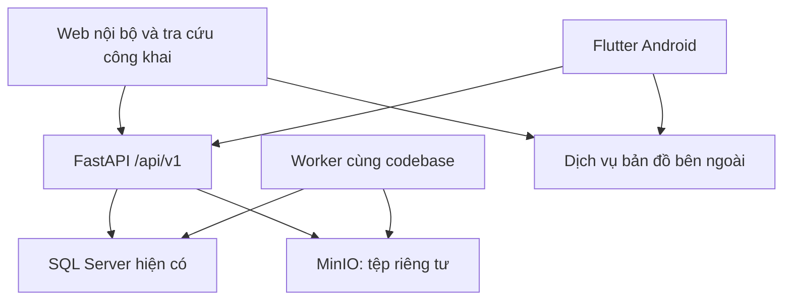

# Execution / Implementation Plan — Hệ thống quản lý nghĩa trang tư nhân

**Phiên bản kế hoạch:** 1.0 · **Ngày lập:** 03/10/2026 · **Ngôn ngữ sản phẩm:** Tiếng Việt  
**Đối tượng thực thi:** Antigravity IDE coding agent và người phát triển.  
**Đích triển khai đầu tiên:** Windows, SQL Server đã có trên `DESKTOP-HKIPI1M`, FastAPI, web React, app Flutter Android, MinIO lưu dữ liệu dưới thư mục backend trên ổ D hoặc ổ dữ liệu do chủ dự án chọn.

> Đây là kế hoạch triển khai dựa trên tài liệu và SQL được cung cấp. Chưa kết nối DB trên máy người dùng, chưa chạy migration, chưa kiểm thử kết nối SSMS hoặc cài công cụ trên máy đó. Tên DB `QL_NghiaTrang` lấy từ script; agent phải xác minh với DB thực tế trước khi ghi dữ liệu. Các lệnh và đường dẫn Windows bên dưới là cấu hình đề xuất, không phải môi trường đã được thiết lập.

## 1. Mục tiêu và cách sử dụng

Xây dựng một hệ thống hoàn chỉnh cho 8 phân hệ: mộ và bản đồ; khách hàng và người mất; hợp đồng; thi công; chăm sóc; tài chính; báo cáo; quản trị. Web và Flutter dùng cùng API, cùng quy tắc nghiệp vụ, cùng SQL Server và kho tệp MinIO. Không tái dựng DB đã có bằng script gốc.

Đặt tài liệu này tại `docs/EXECUTION_PLAN.md`, đặt 5 tệp nguồn tại `docs/source/`. Agent đọc toàn bộ kế hoạch trước, sau đó thực hiện từng milestone M00–M14 theo thứ tự phụ thuộc. Mỗi milestone phải có code chạy được, kiểm thử phù hợp, bằng chứng giao diện nếu có UI, cập nhật tiến độ và commit/tag Git. Không đánh dấu hoàn tất dựa riêng vào việc tạo đủ file hoặc build thành công.

**Phạm vi bản 1.0:** đầy đủ 39 use case chi tiết của Lab2; web đủ nghiệp vụ theo quyền; Flutter ưu tiên Quản trang và tra cứu công khai, có màn hình tổng quan phù hợp cho vai trò khác. Các nghiệp vụ quản trị/tài chính phức tạp sử dụng web responsive. Flutter không cần sao chép toàn bộ màn hình desktop để đáp ứng yêu cầu dùng chung backend.

**Phần mở rộng tách riêng:** cổng tài khoản khách hàng, chữ ký số, tự động nhận tiền qua ngân hàng, hóa đơn điện tử có tích hợp nhà cung cấp, đường đi nội bộ chính xác theo mạng lối đi, đồng bộ tài chính offline, triển khai iOS/App Store. Không âm thầm thêm vào MVP. iOS cần môi trường macOS/Xcode để build và ký; Windows phục vụ Android trước.

## 2. Nguồn đã đọc và thứ tự áp dụng

| Mã | Tệp nguồn | Nội dung đã đối chiếu | Vai trò trong kế hoạch |
|---|---|---|---|
| D1 | `lab1.docx` | Bài toán, tác nhân, chức năng dự kiến và 1 ảnh use case tổng quan | Bối cảnh và mục tiêu ban đầu |
| D2 | `Lab2-TruongXuanHuy-2324802010044(5).docx` | 8 nhóm use case, 39 use case chi tiết; 8 sơ đồ use case và 11 sơ đồ hoạt động | Quy trình, business rule, ngoại lệ, phân quyền, NFR |
| D3 | `Lab3-TruongXuanHuy-2324802010044(2).docx` | 10 sơ đồ tuần tự, 7 sơ đồ lớp | Luồng xử lý, service/repository, liên kết và chuyển trạng thái |
| D4 | `lab4-TruongXuanHuy-2324802010044.docx` | Bảng dữ liệu, mô tả quan hệ; 7 hình ERD nhúng dạng EMF | Thiết kế dữ liệu dự kiến |
| D5 | `lab4-sql.sql` | 37 bảng, CHECK/UNIQUE/FK/default/index và 2 trigger | Baseline vật lý do người dùng cung cấp |

Đã kiểm tra cả phần chữ/bảng lẫn 44 hình nhúng trong 4 file Word; EMF của Lab4 được chuyển để xem. Không dùng một schema khác từ trao đổi cũ để thay cho 37 bảng hiện tại.

Thứ tự xử lý: **yêu cầu mới của chủ dự án → DB thực tế cho hiện trạng vật lý → D5 để đối chiếu drift → D2 cho nghiệp vụ chi tiết → D3/D4 cho thiết kế → D1 cho bối cảnh**. DB hiện có không tự động chứng minh nghiệp vụ đã được ràng buộc đầy đủ. Nếu khác nhau, ghi `docs/decisions/` và `docs/db-gap-register.md`, không sửa âm thầm.

### 2.1. Những điểm cần chốt bằng quyết định thiết kế

| Điểm khác biệt / thiếu | Quyết định mặc định của kế hoạch | Cách nghiệm thu |
|---|---|---|
| D1 có 3 loại HĐ; D2–D5 có 4 loại | Dùng `LAND_PURCHASE`, `EXHUMATION`, `CREMATION`, `TRANSFER`; an táng là phụ lục `BURIAL` | Không có HĐ an táng chính tự phát |
| D1 có duyệt/xác nhận trực tuyến; D2 yêu cầu ký ngoài hệ thống | In → ký giấy ngoài đời → Marketing xác nhận bản scan → kích hoạt. Không tự thêm trạng thái phê duyệt vào CHECK | Scan lỗi thì không ACTIVE; không giả lập chữ ký |
| D1 có ghi nhận GPS tại thực địa; D2 yêu cầu Sếp nhập tay | Sếp nhập/duyệt tọa độ. Chụp GPS trên mobile chỉ là đề xuất mở rộng, không tự cập nhật tọa độ chuẩn | GPS chưa có thì thông báo, không tự ước đoán |
| D3 dùng Float cho tiền và gợi ý token trong local storage | Python `Decimal`, SQL `DECIMAL`; refresh token web trong cookie HttpOnly, không lưu token dài hạn ở localStorage | Kiểm thử làm tròn; kiểm tra nơi lưu token |
| D3 thiếu RESERVED trong một enum; D5 có RESERVED | Enum API bám D5; nghiệp vụ giữ chỗ bổ sung bản ghi nguồn giữ chỗ | Hai người chọn cùng ô chỉ một người thành công |
| Lab4 mô tả người mất–slot là 0..1–0..1 nhưng SQL chưa UNIQUE người mất đang nằm | Bổ sung filtered unique index sau khi kiểm tra dữ liệu trùng | Không an táng đồng thời cùng người ở hai slot |
| Lab4 nói users có quan hệ trực tiếp receivables, D5 không có FK đó | Không giả định có `created_by` trên receivables; thêm riêng nếu cần truy vết người lập | ORM khớp DB, audit đúng actor |
| Sau chuyển nhượng, HĐ mua đất cũ TRANSFERRED nhưng UC3.4 chỉ nói phụ lục dưới HĐ mua đất ACTIVE | **Đề xuất mở rộng cần ghi ADR:** dùng hợp đồng căn cứ quyền sở hữu hiện tại, là HĐ mua đất hoặc HĐ chuyển nhượng ACTIVE; phụ lục mới gắn vào căn cứ đó | Chủ mới chôn/chăm sóc được; chủ cũ không còn quyền; giữ toàn bộ lịch sử |
| Kim Tĩnh là thuộc tính cấp ô, trong khi ô có thể nhiều slot | Giữ khóa cấp **toàn ô** như D2/D5: sau lần an táng Kim Tĩnh, chặn mọi can thiệp cấu trúc/cải táng/chuyển nhượng và an táng thêm. UI cảnh báo rõ tác động lên các slot còn trống trước ký | Không lách qua API slot hoặc sửa cờ; yêu cầu khác về Kim Tĩnh nhiều slot phải có ADR riêng |
| UC5.2 có ngày/tuần/tháng/quý; SQL chỉ tháng/quý/năm | Bổ sung DAILY/WEEKLY qua migration CHECK nếu cần phục vụ đủ mô tả; tách chu kỳ thực hiện khỏi thời hạn đăng ký `cycle_months` | Không nhầm 12 tháng đăng ký với chăm sóc mỗi 12 tháng |
| Gói mẫu “Rằm/Mùng một” nhưng chưa có lịch âm | Cho tạo các ngày chăm sóc cụ thể có kiểm tra trùng; không tự dùng lịch dương thay lịch âm. Tự động lịch âm là backlog riêng | Ngày thực tế hiển thị để Quản trang xác nhận |
| UC6 cho nguồn khoản thu theo HĐ/khách hàng; D5 yêu cầu contract hoặc annex | Bản 1.0 thu từ HĐ hoặc phụ lục. Khoản thu chỉ theo khách hàng chưa có căn cứ là phần mở rộng phải thiết kế trước | Không bỏ CHECK để lách nguồn khoản thu |
| Sơ đồ có CCCD trong tra cứu với actor công khai | Chỉ nội bộ đủ quyền được tìm CCCD/thân nhân; public chỉ mã ô/tên người mất và bộ lọc công khai | Test response allowlist, không trả PII thân nhân |
| Hoàn thành thi công trong sơ đồ dẫn sang “Đã chôn” | Chỉ đánh dấu đã chôn khi nghiệm thu **an táng** hợp lệ; hoàn thành xây dựng thuần túy không tự gán người mất | Xây xong mộ chưa chôn vẫn là đất có chủ, không OCCUPIED |

## 3. Kiến trúc và bộ công nghệ đề xuất

Chọn **modular monolith**: một FastAPI, nhiều module nghiệp vụ, một SQL Server; worker riêng dùng cùng codebase. Cách này phù hợp các transaction chặt giữa mộ, hợp đồng và tiền; dễ vận hành trên máy hiện tại. Chưa cần microservice, Kubernetes hoặc message broker riêng.



| Lớp | Lựa chọn | Quy tắc triển khai |
|---|---|---|
| Backend | FastAPI, Pydantic 2, Python 3.12 làm baseline tương thích | Kiểm tra support/dependency ở M00, pin phiên bản đã smoke test; thay minor Python chỉ bằng ADR |
| Data access | SQLAlchemy 2.x + pyodbc + Microsoft ODBC Driver 18 | Sync session theo request; route đồng bộ cho DB blocking, không gọi pyodbc chặn event loop trong `async def` |
| Migration | Alembic | Baseline DB hiện có, migration tăng dần; không `create_all()` lúc startup |
| Dependency Python | uv, `pyproject.toml`, `uv.lock` | Dev/test dùng lock; CI `uv sync --frozen` |
| Web | React + TypeScript + Vite | SPA cho nghiệp vụ; chưa cần Next.js vì API nằm ở FastAPI, không có yêu cầu SSR |
| UI web | Tailwind CSS, shadcn/ui, Lucide | Design tokens riêng; component được kiểm tra accessibility; không mặc định template dashboard đại trà |
| Data/form web | TanStack Query/Table; React Hook Form + Zod | Server state tách form state; mọi rule cuối cùng nằm ở API |
| Mobile | Flutter stable hiện đã cài, Riverpod, go_router, Dio | Cấu trúc theo feature, View/ViewModel hoặc controller → repository → API; không logic nghiệp vụ độc quyền trên mobile |
| Hợp đồng API | OpenAPI của FastAPI; client TS và Dart sinh tự động | Pin generator; thử `typescript-fetch` và `dart-dio`; commit schema và client sinh, kiểm tra regeneration không drift |
| Storage | MinIO qua S3 adapter Python | Tệp ở `backend/runtime/minio/data`; DB lưu metadata/object key; bucket private |
| PDF/Excel | Jinja2 HTML + Playwright Chromium để render PDF; openpyxl tạo XLSX | Worker xử lý; font tiếng Việt cục bộ; template phiên bản; cấm fetch URL tùy ý từ template |
| Bản đồ | Leaflet trên web; flutter_map hoặc mở URL bản đồ trên mobile | Bản đồ nền từ provider cho phép sử dụng; attribution; vị trí thật, không tọa độ demo trong dữ liệu vận hành |
| Nền tảng job | Bảng job/outbox SQL + worker polling có lease/retry | Chưa dùng Redis/Celery; không dùng FastAPI BackgroundTasks cho công việc cần tồn tại sau restart |
| Chất lượng | Ruff, pytest, ESLint, TypeScript, Vitest, Playwright; flutter analyze/test/integration_test | SQL test dùng SQL Server; không dùng SQLite để chứng minh transaction/trigger SQL Server |
| Git | Monorepo, nhánh theo milestone, Conventional Commits, annotated tags | Commit nhỏ theo vertical slice; tag chỉ sau gate |

Lựa chọn thư viện là đề xuất kiến trúc cho dự án, không phải bảng xếp hạng thị phần. Agent kiểm tra compatibility và pin bản cụ thể ở M00 vào `docs/toolchain-lock.md`; không dùng một loạt `latest` trong cấu hình đã bàn giao. Nguồn chính thức để xác minh ở mục 15.

### 3.1. Cấu trúc repo và trách nhiệm

| Đường dẫn | Nội dung |
|---|---|
| `backend/app/main.py`, `core/`, `db/` | App factory, config, auth dependency, errors, DB session, transaction |
| `backend/app/modules/{auth,catalog,plots,profiles,contracts,construction,care,finance,reports,audit}/` | `router.py`, `schemas.py`, `service.py`, `repository.py`, `models.py` theo nhu cầu thực tế |
| `backend/app/storage/`, `documents/`, `jobs/` | S3 adapter, metadata, PDF/export, queue/outbox/worker |
| `backend/alembic/`, `tests/`, `scripts/` | Migration, unit/integration tests, introspection/seed/backup verification |
| `backend/compose.yaml`, `.env.example` | MinIO local; cấu hình có biến môi trường |
| `backend/runtime/` | Toàn bộ dữ liệu vận hành tệp, temp, logs, export staging, backup local của ứng dụng |
| `web/src/{app,features,components,lib}/` | Shell, route, feature, UI reusable, auth/API adapter |
| `mobile/lib/{app,core,features}/` | App, theme/routing/network, các feature theo vai trò |
| `packages/api-client-ts/`, `packages/api-client-dart/` | Client sinh từ OpenAPI; wrapper auth viết riêng |
| `docs/{source,decisions,execution,evidence,runbooks}/` | Nguồn, ADR, trạng thái, bằng chứng test/UI, vận hành |
| `.agents/rules/`, `.agents/skills/` | Quy tắc ngắn và skill của dự án; cấu hình thực theo phiên bản Antigravity |
| `scripts/` | `doctor.ps1`, `dev.ps1`, `quality-gate.ps1`, `generate-clients.ps1` |

Router chỉ nhận request, xác thực quyền, gọi service và trả DTO. Service nắm invariant/transaction; repository truy vấn có tham số. Không để repository tự commit từng bước, không dùng một generic CRUD service để thay các lệnh nghiệp vụ.

## 4. Setup Windows, SQL Server và MinIO

### 4.1. Preflight trên máy người dùng

Đề xuất repo `D:\work\QL-NghiaTrang`; agent được điều chỉnh theo vị trí repo thực tế. Nếu repo nằm ổ C, phải chuyển/chọn workspace trên ổ dữ liệu trước khi sinh MinIO data; chỉ đặt thư mục trong backend trên ổ C không đạt mục tiêu giảm dữ liệu ổ C.

Chạy trong PowerShell, từng lệnh và ghi kết quả không chứa secret:

```powershell
git --version
py -0p
uv --version
node --version
npm --version
pnpm --version
flutter --version
dart --version
flutter doctor -v
flutter devices
docker version
docker compose version
Get-OdbcDriver | Where-Object Name -Like '*ODBC Driver 18 for SQL Server*'
Get-Command sqlcmd -ErrorAction SilentlyContinue
```

Thiếu gì mới cài thứ đó từ nhà cung cấp chính thức: Git for Windows, uv, Node LTS tương thích Vite, pnpm bản pin, ODBC Driver 18 x64, Docker Desktop và Android SDK nếu `flutter doctor` báo thiếu. Giữ Flutter đã cài nếu tương thích. Không cài lại SSMS hoặc SQL Server chỉ để kết nối API. SSMS là công cụ quản trị, không phải driver Python. Ghi phiên bản Antigravity thực tế để chọn đúng vị trí rules/MCP.

Nếu dùng uv mới scaffold, agent tạo `pyproject.toml` với baseline rồi thêm dependency có khóa: FastAPI, uvicorn, SQLAlchemy, pyodbc, alembic, pydantic-settings, PyJWT, pwdlib/Argon2, boto3, python-multipart, Jinja2, Playwright, openpyxl; dev: pytest, httpx, Ruff. Không chạy scaffold lên thư mục đã có code mà chưa xem diff.

### 4.2. Kết nối DB hiện có

Ưu tiên **backend và worker chạy native Windows** trong dev, dùng cùng Windows identity đã đăng nhập được vào SQL Server nếu có quyền. Cách này tránh thêm cấu hình Kerberos/Windows integrated authentication trong Linux container. Docker trước mắt chỉ chạy MinIO.

```dotenv
# backend/.env.example — không chứa mật khẩu thật
DB_SERVER=DESKTOP-HKIPI1M
DB_NAME=QL_NghiaTrang
DB_DRIVER=ODBC Driver 18 for SQL Server
DB_AUTH=windows
DB_ENCRYPT=yes
DB_TRUST_SERVER_CERTIFICATE=yes
APP_TIMEZONE=Asia/Ho_Chi_Minh
API_HOST=127.0.0.1
API_PORT=8000
STORAGE_ENDPOINT=http://127.0.0.1:9000
STORAGE_BUCKET=nghiatrang-private
RUNTIME_DIR=./runtime
```

`TrustServerCertificate=yes` chỉ cho môi trường dev với chứng thư tự ký; production dùng certificate hợp lệ và `no`. Khi chạy service Windows dưới identity khác, quyền truy cập DB cũng thay đổi; kiểm tra lại identity, không dùng tài khoản sysadmin cho runtime production.

Ví dụ khởi tạo URL, chỉ đọc giá trị cấu hình đã kiểm tra:

```python
from sqlalchemy import create_engine
from sqlalchemy.engine import URL

odbc = (
    'DRIVER={ODBC Driver 18 for SQL Server};'
    'SERVER=DESKTOP-HKIPI1M;DATABASE=QL_NghiaTrang;'
    'Trusted_Connection=yes;Encrypt=yes;TrustServerCertificate=yes;'
)
url = URL.create('mssql+pyodbc', query={'odbc_connect': odbc})
engine = create_engine(url, pool_pre_ping=True, hide_parameters=True)
```

Không tự thêm `\SQLEXPRESS`, không đoán password `sa`, không mặc định cổng 1433 nếu chưa kiểm tra. Nếu SSMS thực tế dùng SQL Authentication, chuyển `DB_AUTH=sql`, lấy username/password qua `.env` hoặc secret store không commit; dựng URL bằng API thay vì nối password vào URL. Khi kết nối từ container sau này, khám phá instance/TCP port và route host riêng, không tái dùng nguyên connection string native.

Kiểm tra đọc nếu có sqlcmd:

```powershell
sqlcmd -S DESKTOP-HKIPI1M -E -d QL_NghiaTrang -C -Q "SELECT @@SERVERNAME AS server_name, DB_NAME() AS db_name, SERVERPROPERTY('ProductVersion') AS version;"
```

Introspection phải lấy `sys.tables`, `sys.columns`, default/check/key constraints, FK, index, trigger definitions, collation, compatibility level, row counts và đường dẫn `sys.database_files`. Chỉ xuất metadata và số đếm, không dump CCCD hay tệp riêng tư vào context agent.

**Không chạy lại D5:** phần đầu script chứa `ALTER DATABASE ... SINGLE_USER WITH ROLLBACK IMMEDIATE` và `DROP DATABASE`. Giữ nó làm tài liệu baseline, thêm ghi chú cấm dùng làm startup script. Không chuyển/attach/detach MDF/LDF chỉ để đồng bộ cấu trúc thư mục MinIO; D5 đang định nghĩa SQL files ở `D:\work\TH-PTTK\data\`.

### 4.3. MinIO: dữ liệu chắc chắn nằm dưới backend

Tại ngày tra cứu, repo MinIO Community đã được archive và README ghi không còn được duy trì, phân phối theo source. Vì vậy vẫn giữ yêu cầu MinIO cho dev, nhưng **không coi `minio/minio:latest` là một cấu hình production được bảo trì**. M00 chọn một image có nguồn/digest xác minh được đang sử dụng, hoặc build từ commit nguồn đã pin; ghi build provenance và kết quả smoke test. Trước production phải quyết định rõ bản MinIO được hỗ trợ hoặc phương án S3 tương thích qua adapter; không tự đổi sản phẩm khi chưa thống nhất. [S05]

Trường hợp build: clone nguồn chính thức ở thư mục tooling riêng, checkout commit đã ghi nhận, dùng Go toolchain phù hợp `go.mod`, build binary **Linux đúng kiến trúc container**, rồi build Dockerfile theo README. Không đưa binary Windows vào image Linux. Ghi commit nguồn, compiler, base image digest, image ID và kết quả `minio --version`. Không commit source vendor/build cache vào repo ứng dụng. Nếu chưa có image chạy được, M01 storage chưa được đánh dấu đạt.

Cấu trúc dữ liệu runtime:

| Thư mục bên trong `backend/runtime/` | Dữ liệu |
|---|---|
| `minio/data/` | Object, version và metadata nội bộ MinIO, bao gồm `.minio.sys` |
| `tmp/`, `exports/` | Upload staging, ảnh nén, PDF/XLSX đang tạo; dọn theo TTL |
| `logs/` | Application/worker logs có rotation |
| `backups/sql/`, `backups/objects/`, `backups/manifests/` | Backup local, manifest phục hồi; không phải bản sao độc lập ngoài máy |
| `tool-cache/` | Có thể đặt browser cache phục vụ PDF, cache tải công cụ dự án để giảm dung lượng ổ C |

Mẫu `backend/compose.yaml` — agent thay `MINIO_IMAGE` bằng image đã kiểm chứng trong `.env`; Compose cố ý báo lỗi nếu thiếu cấu hình:

```yaml
services:
  minio:
    image: ${MINIO_IMAGE:?Set a verified pinned MinIO image}
    command: ["server", "/data", "--console-address", ":9001"]
    ports:
      - "127.0.0.1:9000:9000"
      - "127.0.0.1:9001:9001"
    environment:
      MINIO_ROOT_USER: ${MINIO_ROOT_USER:?Set a local admin user}
      MINIO_ROOT_PASSWORD: ${MINIO_ROOT_PASSWORD:?Set a strong local secret}
    volumes:
      - type: bind
        source: ./runtime/minio/data
        target: /data
        bind:
          create_host_path: false
    restart: unless-stopped
    logging:
      driver: local
      options:
        max-size: "10m"
        max-file: "3"
```

```powershell
# Chạy tại backend
New-Item -ItemType Directory -Force runtime/minio/data,runtime/tmp,runtime/exports,runtime/logs,runtime/backups/sql,runtime/backups/objects,runtime/backups/manifests | Out-Null
docker compose up -d minio
$minioContainerId = docker compose ps -q minio
docker inspect $minioContainerId --format '{{json .Mounts}}'
Invoke-WebRequest http://127.0.0.1:9000/minio/health/live
```

**Gate storage:** Mounts có `Type=bind`, destination `/data`, source trỏ đúng thư mục backend trên ổ dữ liệu; upload một object → stop/start container → tải lại đúng SHA-256; xóa/recreate **container dev** vẫn đọc được object. Không xóa thư mục data. Agent ghi bằng chứng đường dẫn đã chuẩn hóa trên Windows/WSL, không chỉ nhìn tên volume.

Bind mount chuyển **dữ liệu MinIO** ra thư mục mong muốn; image layers, build cache và container logs vẫn có thể nằm trong virtual disk Docker Desktop. Để tránh C tăng thêm ở phần này, kiểm tra `docker system df`, log rotation và cấu hình disk image location của Docker Desktop nếu máy hỗ trợ. Không hứa toàn bộ Docker không dùng C. Không dùng `docker system prune --volumes` như thao tác dọn mặc định. [S04]

Bootstrap bằng script idempotent: tạo bucket private nếu chưa có, bật versioning theo chính sách đã chọn, tạo application credential giới hạn bucket/prefix. Root credential chỉ dùng bootstrap/admin; FastAPI dùng application credential. Mọi tệp mẫu seed cũng đi qua cùng S3 adapter vào bind mount từ lần đầu; không tạo volume ẩn cho dữ liệu seed. Không sửa trực tiếp file trong `minio/data/`.

### 4.4. Địa chỉ API cho từng client

| Client | API URL dev | Lưu ý |
|---|---|---|
| Web trên máy Windows | `http://localhost:8000/api/v1`, web `http://localhost:5173` | CORS allowlist chính xác; ưu tiên Vite proxy `/api` |
| Android emulator chuẩn | `http://10.0.2.2:8000/api/v1` | Kiểm tra kết nối thực tế; đây không phải địa chỉ cho điện thoại thật |
| Android thật cùng LAN | `http://<IPv4-máy-Windows>:8000/api/v1` | Chạy API `0.0.0.0`, firewall giới hạn private LAN; không mở SQL/MinIO ra LAN |
| Production | `https://<domain>/api/v1` | TLS; cấu hình từng environment; không hardcode IP |

Trong MVP, upload/download đi **qua API có xác thực** tới MinIO private để không phát sinh presigned URL `localhost` không dùng được trên mobile. Nếu tối ưu sang presigned URL về sau phải có public endpoint hợp lệ cho cả web/mobile, expiration ngắn, kiểm tra object thuộc đúng hồ sơ và giới hạn quyền. Không lưu presigned URL có hạn trong SQL.

HTTP cleartext chỉ cấu hình trong Android debug; release yêu cầu HTTPS. Quyền camera/location chỉ xin tại lúc dùng. Web geolocation cần secure context ngoài localhost. Dùng `--dart-define=API_BASE_URL=...` cho Flutter; không chứa secret trong biến build client.

## 5. DB hiện có: ánh xạ, thiếu hụt và migration

### 5.1. Đủ 37 bảng phải có chủ sở hữu module

| Module | Bảng baseline | Cách sử dụng / ràng buộc cần giữ |
|---|---|---|
| Identity — 5 bảng | `users`, `roles`, `permissions`, `user_roles`, `role_permissions` | Người dùng nhiều vai trò; role nhiều permission; không hardcode quyền chỉ ở menu |
| Giá — 2 bảng | `price_lists`, `price_items` | Hiệu lực theo thời gian, giá chốt tại giao dịch; chỉnh bảng giá không sửa hợp đồng cũ |
| Hồ sơ — 4 bảng | `customers`, `deceased_profiles`, `death_certificates`, `customer_deceased_relations` | CCCD duy nhất; giấy báo tử 0..1/người mất; quan hệ thân nhân N–N |
| Không gian — 6 bảng | `zones`, `rows`, `plot_types`, `plots`, `plot_slots`, `burial_histories` | Khu → hàng → ô → slot; chủ hiện tại ở plots; lịch sử an táng/cải táng không ghi đè |
| Hợp đồng — 5 bảng | `contracts`, `land_purchase_contracts`, `exhumation_contracts`, `cremation_contracts`, `transfer_contracts` | TPT: mỗi hợp đồng hoàn chỉnh có đúng một subtype đúng `contract_type` |
| Phụ lục — 4 bảng | `contract_annexes`, `burial_annexes`, `care_annexes`, `construction_annexes` | Đúng một subtype/annex; không xóa dây chuyền hồ sơ đã có hiệu lực |
| Thi công — 2 bảng | `construction_orders`, `construction_tasks` | Order có phụ lục nguồn; checklist/đầu mối phụ trách/ảnh/tiến độ |
| Chăm sóc — 4 bảng | `care_packages`, `care_schedules`, `care_checklist_items`, `care_media_evidences` | Package template phải snapshot; một kỳ không sinh trùng; ảnh gắn đúng ca |
| Tài chính — 4 bảng | `receivables`, `discount_records`, `payments`, `invoices` | Một khoản thu nhiều payment, tối đa một discount baseline; một payment tối đa một chứng từ |
| Audit — 1 bảng | `audit_logs` | Actor + before/after đã redact; chỉ đọc đối với UI; ứng dụng không sửa/xóa log |

### 5.2. Quy trình baseline bắt buộc

1. Chạy script introspection chỉ đọc, xuất `docs/db-baseline.json` và báo cáo drift so với D5. Kiểm tra 37 bảng không đồng nghĩa chắc chắn schema đúng; so sánh cả trigger, FK, CHECK và nullable.
2. Ghi fingerprint baseline và phiên bản SQL Server. Kiểm tra các dòng không nhất quán: nhiều người cùng slot, người mất nhiều slot, slot khác plot, hợp đồng nhiều subtype, scan thiếu nhưng ACTIVE, số dư lệch tổng payment, duplicate lịch.
3. Tạo backup DB bằng cơ chế SQL Server; đường dẫn backup phải được **service SQL Server** truy cập được. Nếu đặt dưới `backend/runtime/backups/sql`, cấp quyền đúng thư mục, không cấp toàn ổ. Test restore vào DB riêng. Không dùng bản sao MDF đang mở thay cho backup.
4. Tạo Alembic baseline revision có tài liệu fingerprint. Chỉ `stamp` baseline khi kiểm tra hiện trạng đạt; `stamp` không tự tạo hoặc kiểm chứng schema. Không stamp tùy tiện `head` để bỏ qua migration.
5. Viết migration kế tiếp theo nhóm ở 5.3; thêm nullable trước → backfill có đối soát → thêm constraint/index. Dữ liệu mâu thuẫn phải đưa vào báo cáo xử lý, không xóa tự động để migration chạy qua.
6. Chạy migration trên bản restore/test trước, kiểm tra row counts, FK, số dư, file references và trigger. Runtime account không có quyền DDL; migration account tách riêng.
7. DB test mới phải được tạo từ baseline schema **đã loại phần DROP/CREATE database và đường dẫn máy cụ thể**, rồi apply đầy đủ migrations. Script provisioning chỉ được phép target DB test được allowlist.

### 5.3. Register bổ sung schema — đề xuất, không phải bảng đã tồn tại

Agent phải chốt DDL cụ thể, FK/index/check/backfill trong migration tương ứng. Không tạo tất cả bảng mở rộng ngay khi chưa có feature dùng.

| ID / thời điểm | Hiện trạng hoặc lỗ hổng | Thiết kế bổ sung tối thiểu và cách kiểm tra |
|---|---|---|
| G01 / M02 | JWT đơn lẻ không thu hồi ngay khi khóa user/đổi quyền | `auth_sessions`: user FK, refresh hash duy nhất, family/session id, expiry/revoked/last_seen; `users.auth_version`. Request kiểm tra user active + session/version + quyền hiện hành; invalidate ngay khi quyền đổi |
| G02 / M03 | Các cột `*_url` chỉ chứa một đường dẫn, không metadata/version | `file_objects`: UUID PK, bucket, object_key UNIQUE, version_id, SHA-256, MIME, size, state, actor FK, created_at. `document_versions` gắn **một** contract hoặc annex hoặc certificate bằng FK nullable + CHECK đúng một nguồn, version_no UNIQUE theo nguồn, file FK, xác nhận người tải; thêm current file FK khi cần. Giữ cột cũ trong giai đoạn chuyển tiếp |
| G03 / M04 | Giá không FK đến loại mộ/khu/gói; loại HĐ chỉ CHECK | `contract_templates` với 4 mã nghiệp vụ cố định và phiên bản điều khoản; cấu hình active/required-documents. Bổ sung scope zone/type/package/service cho price_items hoặc bảng mapping FK; kiểm tra overlap hiệu lực. Snapshot template/version/giá vào contract/annex khi xuất bản ký |
| G04 / M05 | Không có nguồn giữ chỗ và kiểm soát trùng giao dịch | `plot_reservations`: plot FK, contract FK, state, created/released; filtered UNIQUE một reservation ACTIVE/plot. Không tự hết hạn nếu chưa có chính sách; hủy nháp giải phóng chính reservation đó |
| G05 / M05–M08 | Chỉ có owner hiện tại; chưa truy vết quyền sau chuyển nhượng | `plot_ownerships`: plot/customer/basis_contract FK, valid_from/valid_to; filtered UNIQUE một ownership đang hiệu lực/plot; backfill chủ cũ từ căn cứ có bằng chứng, đánh dấu legacy chưa đối soát nếu thiếu. Thêm reservation theo slot cho phụ lục an táng chờ thực hiện nếu cần |
| G06 / M05 | Quan hệ slot chưa enforce đúng người/ô | Filtered UNIQUE `plot_slots(current_deceased_id) WHERE current_deceased_id IS NOT NULL`; CHECK EMPTY↔NULL, OCCUPIED↔NOT NULL; kiểm tra slot thuộc plot trong service/constraint composite phù hợp; unique primary contact mỗi deceased khi `is_primary_contact=1` |
| G07 / M06 | Thiếu ngày sinh khách hàng; năm sinh người mất không đủ ngày | Thêm customers.date_of_birth nullable; thêm deceased.birth_year và birth_date_precision nếu chỉ biết năm, không bịa ngày 01/01. Kiểm tra ngày sinh≤ngày mất; thông tin cũ giữ nguyên khi unknown |
| G08 / M06 | death_certificates mặc định `is_verified=1`, `verified_at` luôn có | Chuyển default về 0; verified_at nullable; thêm verified_by FK. Dữ liệu cũ không tự coi đã được người kiểm tra; báo cáo legacy verification và yêu cầu xác nhận trước nghiệp vụ chôn |
| G09 / M07 | HĐ thiếu signed/activated timestamp, lịch sử in và phiên bản | Thêm signed_at (nhập từ bản giấy nếu biết), activated_at, template version/snapshot, revision; phụ lục thêm created_by, previous_annex_id nếu gia hạn. Số HĐ/phụ lục dùng sequence hoặc bộ cấp số transaction-safe, không MAX+1 |
| G10 / M08 | Cải táng không chỉ rõ slot, lịch sử thiếu căn cứ/actor | Thêm exhumation_contracts.slot_id; backfill chỉ khi xác định duy nhất. burial_histories thêm actor FK, source contract/annex FK + CHECK phù hợp, timestamp thực hiện; một thao tác hoàn tất chỉ ghi một event bằng idempotency |
| G11 / M09 | Một URL ảnh/thi công, thiếu required/order/assignee/date từng task | construction_tasks thêm is_required, sort_order, assignee_user_id nullable, start/due, completed_by; giữ tên nhà thầu ngoài; `construction_task_evidences` FK task/file. Không cần tài khoản riêng cho mọi nhà thầu |
| G12 / M10 | care_annex thiếu plot, template biến đổi, lịch thiếu kỳ/ca | Thêm care_annexes.plot_id và snapshot checklist/chu kỳ/giá; care_schedules thêm period_key và thời gian bắt đầu/kết thúc; unique annex+plot+period, kiểm tra trùng gói active cùng plot trong service transaction; care_checklist thêm is_required, order, completed_at/by |
| G13 / M09–M10 | Cảnh báo xung đột/nghỉ phép chưa có dữ liệu | `staff_unavailability` có user FK, khoảng thời gian, lý do; nhiệm vụ thi công và ca care có time window. Lịch nghỉ chung cấu hình. Nếu chỉ biết ngày thì dùng capacity/ngày công khai, không giả vờ kiểm tra trùng giờ |
| G14 / M11 | Receivable CHECK chỉ OR, có thể vừa contract vừa annex; chưa ràng buộc công thức | Sau đối soát chọn đúng một nguồn (XOR); nếu có annex suy ra parent contract khi query. Customer phải khớp bên trả tiền đã chốt. CHECK final=original−discount, 0≤discount≤original; thêm creator/notes/source installment_no để sinh khoản thu idempotent |
| G15 / M11 | Trigger payment chỉ chạy INSERT; không có idempotency | `idempotency_requests`: actor+operation+key UNIQUE, request hash, resource/response và trạng thái; giữ payment append-only. Khóa receivable khi insert, trigger tính tổng, API refresh. Không tự thêm UPDATE/DELETE payment; sửa sai bằng luồng điều chỉnh được thiết kế riêng |
| G16 / M11 | discount_value DECIMAL(10,2) nhỏ hơn amount; chỉ một discount | Mở rộng giá trị tiền cố định phù hợp DECIMAL(15,2), phần trăm check 0..100; một discount chính thức/khoản thu, không âm thầm đổi thành nhiều discount. Lưu actor áp dụng và căn cứ phê duyệt, không giả người duyệt là ADMIN bất kỳ |
| G17 / M03–M12 | Thiếu thông báo/job/export state bền vững | `background_jobs`, `outbox_events`, `notifications` với owner/recipient FK, unique dedupe key, attempts, next_run, lease_until, error redacted; `report_exports` gắn requester, filter snapshot, file FK, status/expiry |
| G18 / M05, M08, M11 | Trigger Kim Tĩnh chưa chặn đủ; audit chỉ được đặt tên bất biến | Bổ sung kiểm soát DB đối với thay owner/cờ/slot và xóa khóa vĩnh viễn; app không có quyền UPDATE/DELETE audit; test bypass route bằng câu SQL test. Không tuyên bố chống được sysadmin; giữ audit backup riêng |
| G19 / theo module | Thiếu chống ghi đè concurrent và published/public scope | `rowversion` cho aggregate nhạy cảm; expose ETag/version. Thêm public_visibility hoặc public record riêng cho người mất/plot để có bước duyệt công khai; default private đối với import |
| G20 / M08 | HĐ hỏa táng ACTIVE chưa biểu diễn ca đã thực hiện | Thêm service execution record (contract FK UNIQUE cho hỏa táng/cải táng) với planned/started/completed_at và evidence; không tự thêm COMPLETED vào contracts CHECK khi chưa migration |

**Điểm SQL Server agent dễ bỏ sót:** bảng `plots` và `payments` đang có trigger. SQLAlchemy dùng `OUTPUT INSERTED` mặc định có thể lỗi với bảng có trigger; cấu hình `implicit_returning=False` trên các mapping liên quan và kiểm tra lấy ID/refresh server defaults trên SQL Server thật. Trigger phải có `SET NOCOUNT ON` và xử lý nhiều hàng. Đối chiếu mọi bảng có trigger sau migration, không chỉ hai bảng ban đầu. [S03]

`updated_at` có DEFAULT không đồng nghĩa tự cập nhật mỗi lần UPDATE: service phải cập nhật trong cùng transaction hoặc bổ sung cơ chế đã thống nhất. Tiếng Việt dùng NVARCHAR; collation hiện có phân biệt dấu, do đó tìm không dấu cần strategy được test riêng (cột normalized/index hoặc collation truy vấn phù hợp), không hứa `LIKE` mặc định tự xử lý tốt. Không đổi toàn DB collation tùy tiện.

## 6. Quy tắc nghiệp vụ phải được thực thi ở backend

### 6.1. Trạng thái ô mộ và quyền sử dụng

| Lệnh nghiệp vụ | Điều kiện | Kết quả nguyên tử |
|---|---|---|
| Giữ đất cho HĐ mua | EMPTY_UNSOLD, không owner, không reservation khác | Tạo DRAFT/subtype + reservation, chuyển RESERVED |
| Hủy HĐ chưa hiệu lực | DRAFT/PENDING_SIGN, giữ chỗ thuộc HĐ này | CANCELLED; giải phóng reservation; ô về EMPTY_UNSOLD nếu không có ràng buộc khác |
| Kích hoạt mua đất | Scan READY đã xác nhận, loại/giá đầy đủ, reservation còn thuộc HĐ | HĐ ACTIVE; owner đúng khách; ownership history; OWNED_EMPTY; phát outbox lập nghĩa vụ thu |
| Kích hoạt phụ lục an táng | Căn cứ sở hữu hiện hành ACTIVE; chủ hợp lệ; certificate đã xác minh + file READY; slot trống đã giữ | Phụ lục ACTIVE; tạo đầu vào thi công/đợt an táng; không đánh OCCUPIED chỉ vì ký |
| Nghiệm thu an táng | Phụ lục còn hiệu lực, người mất/slot đúng, chứng cứ READY | Slot OCCUPIED, gán deceased, append burial_history; plot OCCUPIED; Kim Tĩnh khóa vĩnh viễn nếu áp dụng |
| Kích hoạt cải táng | Chính chủ, người mất thực sự đang trong slot, không Kim Tĩnh/locked | HĐ ACTIVE; service execution bắt đầu, plot UNDER_EXHUMATION; không xóa người mất ngay |
| Hoàn tất cải táng | Công việc hợp lệ, chứng cứ và người xác nhận | Slot EMPTY/current_deceased=NULL; append EXHUMED; giữ owner. Nếu còn slot OCCUPIED thì ô vẫn OCCUPIED, chỉ OWNED_EMPTY khi hết người an táng |
| Chuyển nhượng | Người bán là chủ hiện tại; mọi slot trống, không Kim Tĩnh, không tác vụ xung đột; buyer≠seller | Khi scan được xác nhận: đóng ownership cũ, mở ownership mới, đổi owner; căn cứ cũ TRANSFERRED; HĐ chuyển nhượng ACTIVE; ô OWNED_EMPTY |

Ô nhiều slot cần hiển thị đồng thời occupancy và tiến độ công việc. Enum `plots.status` không đủ diễn đạt mọi chiều; API trả thêm `occupied_slots`, `total_slots`, `active_operations`, `construction_progress`. Không biến một ô có người an táng thành “Trống” chỉ vì một slot khác vừa cải táng xong. Khi status tạm UNDER_CONSTRUCTION/UNDER_EXHUMATION, dữ liệu slot vẫn là nguồn sự thật về số người đang an táng.

**Khóa Kim Tĩnh:** cấm cải táng, chuyển nhượng, hạ cờ Kim Tĩnh/locked, thay đổi chủ/slot/an táng mới và thi công can thiệp kết cấu sau khóa. Chăm sóc vệ sinh không tác động kết cấu vẫn thực hiện theo phụ lục. Sửa thông tin liên hệ thuộc hồ sơ khách hàng là nghiệp vụ độc lập; sửa định vị/mô tả ô đã khóa phải có luồng hiệu chỉnh được audit và policy rõ, không dùng generic PATCH để mở khóa. Luôn kiểm tra lại điều kiện khi ACTIVE/hoàn tất, không chỉ lúc tạo nháp.

Lựa chọn Kim Tĩnh trong bản nháp được giữ ở phụ lục; đề xuất chỉ xác lập cờ chính thức trên ô khi phụ lục có hiệu lực, rồi khóa vĩnh viễn khi an táng hoàn tất. Cách này tránh bản nháp bị hủy làm đóng băng một ô chưa sử dụng; ghi ADR vì D2 chưa mô tả rõ việc hủy lựa chọn trước ký. Sau khi đã xác lập chính thức không cung cấp nút gỡ cờ tùy ý. Chuyển nhượng cũng phải xử lý rõ các phụ lục/lịch thực hiện còn mở: mặc định yêu cầu hoàn tất hoặc có phụ lục xử lý trước khi chuyển, không tự chuyển công nợ hay hợp đồng chăm sóc của người bán sang người mua.

Transaction khóa theo thứ tự nhất quán, ví dụ plot → slot → contract/annex → receivable khi cùng tác động; câu lệnh cập nhật có predicate trạng thái/version. Dùng cơ chế khóa SQL Server (`UPDLOCK`, `HOLDLOCK` hoặc isolation phù hợp) trong repository có test cạnh tranh, không giả định `.with_for_update()` tự sinh đúng khóa MSSQL. Retry deadlock giới hạn chỉ cho request có idempotency. Trả 409 kèm trạng thái mới khi tranh chấp, không ghi đè dữ liệu của người khác.

### 6.2. Hợp đồng, phụ lục, giá và chứng từ

- Hợp đồng DRAFT có thể chưa chọn ô; chỉ tạo subtype bắt buộc plot khi đã có dữ liệu. Khi PENDING_SIGN/ACTIVE phải đúng một subtype; hỏa táng không có plot.
- Một giao dịch có một hợp đồng chính; phụ lục phát sinh nối vào hợp đồng phù hợp, gia hạn bằng phụ lục mới có liên kết trước/sau. Hủy phụ lục không hủy hợp đồng chính.
- Mẫu in snapshot gồm parties, mã ô/slot, đơn giá, điều khoản phiên bản và lịch dự kiến. Thay danh mục/gói/bảng giá không đổi snapshot cũ. Khi nội dung PENDING_SIGN bị sửa, đánh bản in cũ superseded và yêu cầu in lại trước xác nhận scan.
- Scan PDF/JPG/PNG được kiểm tra magic bytes/MIME, dung lượng, checksum; Marketing xem trước, xác nhận đúng mã và ký đầy đủ. Việc kiểm tra định dạng tệp **không chứng minh chữ ký hợp lệ**; đây là bước xác nhận nghiệp vụ của người có quyền.
- ACTIVE chỉ sau object upload thành công và metadata READY; thay scan tạo version mới, giữ bản cũ và lý do. Nếu storage lỗi, không ACTIVE và không đổi owner.
- `Sắp hết hạn`, `Hết hạn`, `Trễ hạn` ưu tiên là giá trị dẫn xuất khi đọc, không tự nhét vào CHECK status chưa hỗ trợ. Khoảng ngày inclusive/exclusive thống nhất trong API; lịch ngoài thời hạn bị chặn.
- Không tự áp điều kiện “phải thanh toán đủ mới ACTIVE” vì D2 quy định scan là căn cứ kích hoạt. Nếu chủ dự án thêm chính sách công nợ thì ADR và test riêng.

### 6.3. Thi công, chăm sóc và offline

- Chỉ triển khai từ phụ lục ACTIVE và còn hiệu lực phù hợp ngày thực hiện; construction order có nguồn BURIAL hoặc CONSTRUCTION đúng chức năng và đúng plot.
- Task có thứ tự, required flag, người/nhóm chịu trách nhiệm, thời gian dự kiến; ảnh/video gắn task hoặc ca, người tải và timestamp server. Không dùng URL bất kỳ khách gửi để liên kết hồ sơ.
- Tiến độ gợi ý từ checklist; cho điều chỉnh thủ công có lý do nhưng không 100% nếu required task chưa được nghiệm thu. Hoàn thành thi công và nghiệm thu an táng là hai command riêng.
- Chăm sóc: snapshot gói khi đăng ký; sinh lịch theo kỳ trong khoảng hiệu lực, chạy job nhiều lần không sinh trùng. Đổi ngày thực hiện không đổi period_key để lách chống trùng.
- Phân công care phải giải quyết xung đột ca/nghỉ phép trước lưu; thi công cảnh báo quá tải để quản trang điều chỉnh. Một task có một đầu mối chính; nhóm ngoài có tên rõ ràng.
- Đóng ca care chỉ khi required items hoàn tất và ít nhất một ảnh minh chứng READY; không coi upload đang chờ là bằng chứng hợp lệ. Hạng mục optional không chặn đóng.
- Flutter lưu nháp checklist và media chờ tải trong vùng app riêng; queue có UUID, retry/backoff, trạng thái và nút thử lại. Offline chỉ lưu thao tác hiện trường dự kiến; server vẫn xác thực quyền/trạng thái khi sync. Thông báo rõ “Đã lưu trên thiết bị” khác “Đã đồng bộ”.
- Khi job trên server đã đóng/được giao người khác, sync cũ phải trả conflict để người dùng xử lý; không ghi đè. Không ghi nhận thanh toán, chuyển chủ hay khóa Kim Tĩnh offline.
- Web responsive có thể lưu draft form; bản 1.0 không cần full offline web. Mobile có nút đồng bộ foreground; background sync best-effort, không hứa hệ điều hành luôn chạy nền.

### 6.4. Tiền, chiết khấu và báo cáo

Tiền VND lưu DECIMAL(15,2), tính Python Decimal, API serialize chuỗi số tiền, frontend hiển thị theo locale. Quy tắc làm tròn đề xuất VND đến đơn vị đồng (`ROUND_HALF_UP`) tại bước chốt; không dùng JS float để quyết định số phải thu. Giá trị gốc, giảm trừ, số cuối cùng và chứng từ phải dùng cùng quy tắc.

- `final_payable = original − discount`; `total_paid = SUM(payments)`; `debt = max(final_payable − total_paid, 0)`; `overpayment = max(total_paid − final_payable, 0)`.
- API tạo payment có `Idempotency-Key`, khóa receivable, kiểm tra quyền/số tiền, insert payment, để trigger tính tổng rồi refresh và audit trong cùng transaction. Không vừa trigger cộng tiền vừa service cộng lại.
- Replay cùng key/cùng payload trả cùng kết quả; key cũ/payload khác trả 409. Mã ngân hàng trùng phải cảnh báo/kiểm tra; không dùng riêng transaction_reference làm idempotency cho mọi phương thức.
- Thu vượt nợ: bước đầu trả cảnh báo có số dư; chỉ nhận khi kế toán xác nhận rõ `confirm_overpayment=true` và lý do, cùng version số dư. Lưu đủ số thực nhận, báo cáo riêng tiền thừa. Hoàn tiền/bù trừ cần luồng kế toán riêng trước production nếu sử dụng nghiệp vụ đó, không âm thầm trừ một payment cũ.
- Chiết khấu chỉ khi còn dư nợ, không quá số còn phải thu/trần thẩm quyền; phần trăm 0..100; lý do và người phê duyệt thật. Sau discount phải tính lại trạng thái khoản thu vì trigger hiện chỉ chạy khi thêm payment. Không làm final nhỏ hơn tổng đã trả trong luồng discount thông thường.
- Sinh khoản thu từ sự kiện kích hoạt phải dedupe theo nguồn + kỳ/đợt; UI kế toán kiểm tra và lập khoản thu thủ công cho phần chưa có. Không cho tự động lẫn thủ công tạo hai nghĩa vụ cùng nguồn/đợt.
- VietQR là hỗ trợ nội dung chuyển khoản khi có cấu hình ngân hàng thực; **không tự đánh PAID** khi người dùng mở QR hoặc gửi ảnh chuyển tiền. Kế toán xác nhận thực nhận theo D2; webhook ngân hàng là tích hợp riêng.
- PDF biên lai nội bộ không được quảng bá là hóa đơn điện tử hợp lệ đã phát hành qua cơ quan thuế. Bản 1.0 tạo biên lai/chứng từ thu; tích hợp hóa đơn điện tử phải có phạm vi và nhà cung cấp riêng.
- Doanh thu theo D2 là tiền đã thực thu theo `paid_at`; giá trị hợp đồng và dư nợ là chỉ số riêng. Hỏa táng không có khu mộ được nhóm “Không gắn khu”, không loại mất khỏi tổng.
- Báo cáo hợp đồng và phụ lục aggregate riêng trước join để tránh nhân bản tiền. Occupancy công bố mẫu số rõ: ô có người/ô tổng; slot có người/slot tổng; ô đã bán/ô tổng là chỉ số khác. Khi mẫu số 0 hiển thị 0 hoặc “Chưa có dữ liệu”, không NaN.
- Export giữ filter/timezone và thời điểm chốt dữ liệu, query cùng semantics với màn hình. Nếu dữ liệu đổi giữa hai lần xem, hiển thị thời điểm snapshot; không hứa hai truy vấn khác thời điểm tuyệt đối giống nhau.

## 7. API contract, bảo mật và kho tệp

### 7.1. Quy ước API

Prefix `/api/v1`; public ở `/api/v1/public`. DTO tách create/update/detail/list/public. Có pagination (mặc định 25, tối đa 100), filter allowlist, sort allowlist, response lỗi thống nhất: `code`, `message` tiếng Việt, `field_errors`, `request_id`, `details` đã lọc. Dùng 401 chưa xác thực, 403 thiếu quyền, 404 không thấy trong phạm vi, 409 xung đột, 422 input sai. Không trả traceback/SQL/secret.

| Nhóm | Endpoint tiêu biểu cần triển khai | Màn hình tiêu thụ |
|---|---|---|
| Auth | `POST /auth/login`, `/auth/refresh`, `/auth/logout`; `GET /auth/me` | Đăng nhập và session cả web/mobile |
| Admin | `/users`, `/roles`, `/permissions`, `/role-permissions`, `/audit-logs` | Nhân sự, ma trận quyền, audit |
| Danh mục | `/zones`, `/rows`, `/plot-types`, `/price-lists`, `/care-packages`, `/contract-templates` | Cấu hình nền |
| Mộ | `/plots`, `/plots/{id}`, `/plots/{id}/slots`, `/plots/{id}/history` | Bản đồ/danh sách/hồ sơ ô |
| Hồ sơ | `/customers`, `/deceased-profiles`, `/customer-deceased-relations`; `POST /death-certificates/{id}/verify` | Khách hàng, người mất, chứng tử |
| Hợp đồng | `/contracts`, `POST /contracts/{id}/submit-for-signing`, `/print`, `/activate`, `/cancel`; `/annexes` tương tự | Wizard, chi tiết, in/scan |
| Thực địa | `POST /burial-annexes/{id}/complete`, `/exhumation-contracts/{id}/complete`; service execution hỏa táng | Nghiệm thu có chứng cứ |
| Thi công | `/construction-orders`, `/construction-tasks`; commands `/assign`, `/complete`, `/progress` | Kế hoạch và checklist |
| Chăm sóc | `/care-schedules`; commands `/generate`, `/assign`, `/checklist`, `/close` | Lịch, công việc hôm nay |
| Tài chính | `/receivables`; `POST /receivables/{id}/payments`, `/discount`; `POST /payments/{id}/receipt` | Công nợ, thu, chiết khấu, biên lai |
| Tệp | `POST /files`, `GET /files/{id}/content`, `POST /document-versions` | Upload, preview, version |
| Báo cáo | `/reports/revenue`, `/plots`, `/contracts`, `/operations`; `/report-exports` | Dashboard, báo cáo, tải tệp |
| Thông báo | `/notifications`, `POST /notifications/{id}/read` | In-app notification/polling |
| Public | `/public/graves`, `/public/graves/{public_id}` | Tra cứu và dẫn đường |

Tên endpoint cụ thể được agent chốt ở M02 rồi freeze trong OpenAPI. Không có `PATCH /plots/{id}` cho phép tùy ý đổi owner/status/locked; dùng command có điều kiện. Mọi command nhạy cảm nhận version/idempotency phù hợp. Public schema là allowlist riêng: mã ô, khu/hàng, tên người mất đã được cho công khai, ngày/năm công khai được duyệt, vị trí hợp lệ; không serialize ORM nguyên bản.

### 7.2. RBAC mặc định

| Phạm vi | ADMIN/Sếp | MARKETING | ACCOUNTANT | CARETAKER | Public |
|---|---|---|---|---|---|
| Khu/hàng/loại mộ/GPS | Quản lý | Đọc phục vụ HĐ | Theo nhu cầu đối soát | Đọc thực địa | Chỉ dữ liệu công khai |
| Khách hàng/người mất/chứng tử | Giám sát theo permission | Quản lý/xác minh theo quyền | Thông tin cần thu tiền | Thông tin cần nhiệm vụ | Không CCCD/thân nhân |
| Hợp đồng/phụ lục | Theo dõi, cấu hình template | Tạo/in/scan/kích hoạt/hủy trước hiệu lực | Đọc phần liên quan thu | Đọc căn cứ công việc | Không |
| Thi công/chăm sóc | Theo dõi | Đăng ký, theo dõi | Không thao tác thực địa | Điều phối và thực hiện theo assignment/supervision | Không |
| Thu/discount/chứng từ | Giám sát và quyền duyệt cụ thể | Đọc trạng thái theo quyền | Thực hiện trong thẩm quyền | Không | Không |
| Báo cáo | Toàn bộ | Chỉ màn hình vận hành được cấp | Tài chính/doanh thu | Công việc của mình/nhóm được giao | Không |
| Users/RBAC/audit | Quản trị | Không | Không | Không | Không |

Seed permission theo command, ví dụ `CONTRACT:ACTIVATE`, `PAYMENT:RECORD`, `CARE:ASSIGN`, `CARE:CLOSE`, `DISCOUNT:APPROVE`. Quyền chức năng chưa đủ: kiểm tra scope đối tượng/assignment/ownership. Không để “ADMIN” vượt invariant Kim Tĩnh. Không tự vô hiệu hóa admin đang thao tác hoặc làm mất admin cuối cùng.

Argon2 hash password; JWT access ngắn hạn (đề xuất 15 phút), refresh rotation có hash trong DB và phát hiện reuse; idle timeout cấu hình. Web giữ access trong memory, refresh cookie HttpOnly/Secure/SameSite và CSRF protection cho endpoint dùng cookie; mobile refresh trong secure storage. Logout/khóa user/thu hồi quyền có hiệu lực trên request kế tiếp bằng session/auth_version kiểm tra server, không chờ JWT hết hạn. Rate limit login/public search, audit thất bại không chứa password/token. Mốc thời gian lưu UTC, UI chuyển Asia/Ho_Chi_Minh; DATE nghiệp vụ không tự chuyển lệch ngày.

### 7.3. Vòng đời tệp và job

Object key do server tạo, dạng `env/entity/id/purpose/uuid.ext`, không lấy đường dẫn do client nhập. Tránh dùng CCCD/tên người làm tên object. Hạn mức đề xuất cấu hình: ảnh 10 MB, scan PDF 25 MB, video 100 MB; kiểm tra stream giới hạn thật, không tin Content-Length. Ảnh hiện trường có bản nén, bản gốc giữ theo chính sách; signed scan không nén phá hủy nội dung. Metadata server ghi checksum, uploader, timestamp; thumbnail bỏ EXIF nhạy cảm nếu có.

Upload là quy trình nhiều bước vì SQL và S3 không có transaction chung: tạo metadata STAGING → upload key mới → kiểm tra → READY → transaction gắn hồ sơ/activate + audit/outbox. Nếu DB thất bại, object chưa gắn là orphan để job đối soát dọn sau TTL; nếu S3 thất bại không chuyển nghiệp vụ. Với tệp đã ký được giữ lịch sử, cleanup không được xóa nhầm bản superseded. Quét mã độc tích hợp scanner adapter; production phải có kiểm soát quarantine phù hợp, dev chưa có scanner phải ghi rõ chế độ và không giả trạng thái “đã quét”.

Worker lấy job bằng claim transaction có lease, retry/backoff giới hạn, dead-letter có nút retry theo quyền. Outbox được ghi cùng transaction nghiệp vụ; handler idempotent. Thông báo in-app qua polling 15–30 giây là baseline đủ vận hành; push FCM là adapter bổ sung nếu yêu cầu nhận khi app đóng, không tự gọi polling là push. PDF/export lỗi không rollback khoản thu đã ghi nhận; UI thấy chứng từ đang tạo và retry cùng invoice/payment, không sinh duplicate.

## 8. UX/UI: thiết kế trước khi mở rộng màn hình

### 8.1. Định hướng hình ảnh và trải nghiệm

Sản phẩm cần trang nghiêm, rõ ràng, tạo cảm giác tin cậy; ưu tiên công việc thực tế hơn trang trí. Nền trắng ngà `#F7F8F5`, chữ than `#1F2933`, xanh trầm chủ đạo `#24594D`, viền xám nhẹ; màu cảnh báo dùng hổ phách, lỗi dùng đỏ sẫm. Đây là bảng màu đề xuất cần kiểm tra contrast trước dùng. Font Noto Sans/Be Vietnam Pro hoặc font hỗ trợ tiếng Việt đã kiểm tra license; font PDF được đóng gói cùng template. Không dùng ảnh tang lễ gây nặng nề, hiệu ứng kính mờ, gradient quá mức hoặc icon khó hiểu.

Khoảng cách 4/8px, body web 14–16px, mobile tối thiểu 16px ở tác vụ chính; vùng chạm mobile ít nhất 48px; focus ring, keyboard navigation, label thật cho form, text/icon kèm màu trạng thái. Bảng tiền canh phải, mã/giá dùng số dễ đối chiếu. Hạn chế toast cho lỗi cần sửa: hiển thị lỗi ngay tại trường và tóm tắt đầu form. Loading không làm người dùng bấm thu tiền lần hai.

Tạo `docs/design-system.md`, `docs/screen-map.md`, bộ token dùng chung về màu/spacing/typography giữa React và Flutter. Không cố chia sẻ component code giữa hai framework. Bắt đầu 5 màn hình mẫu: dashboard Sếp, bản đồ/danh sách ô, wizard hợp đồng, công nợ/thu tiền, mobile checklist có upload thất bại. Dùng dữ liệu giả có nhãn demo, không dùng CCCD hay ảnh thật để làm screenshot mẫu.

### 8.2. Kiến trúc thông tin và đặc tả màn hình

| Vai trò / màn hình | Bố cục và tương tác bắt buộc |
|---|---|
| Web nội bộ | Sidebar theo permission, topbar tìm kiếm/người dùng/thông báo, breadcrumb; dashboard riêng vai trò; filter giữ trong URL |
| Tổng quan Sếp | Tiền thực thu, dư nợ, ô có chủ/đã an táng, việc quá hạn; mỗi số có kỳ lọc và drill-down, không dùng số giả khi API chưa xong |
| Mộ & bản đồ | Toggle danh sách/bản đồ; cây khu–hàng, legend trạng thái, filter owner/occupancy; chọn ô mở panel gồm slot, lịch sử, quyền sở hữu và tác vụ được phép |
| Hồ sơ ô | Hiển thị mã lớn, khu/hàng/GPS, trạng thái khai thác và tiến độ tách biệt; badge Kim Tĩnh + cảnh báo khóa, danh sách slot, giấy tờ theo quyền |
| Khách hàng/người mất | Tìm trùng CCCD, tên trùng có bộ lọc; timeline liên kết khách–người mất–ô; thiếu chứng tử có trạng thái chờ, không nút an táng khả dụng |
| Wizard hợp đồng | Chọn loại → parties → ô/slot hoặc dịch vụ → giá/điều khoản → kiểm tra → lưu/in. Hỏa táng ẩn trường mộ; chuyển nhượng có người bán/mua và xác nhận điều kiện |
| Chi tiết hợp đồng | Timeline DRAFT/PENDING_SIGN/ACTIVE, bản in, scan versions, phụ lục, công nợ; panel xác nhận scan ghi rõ hậu quả kích hoạt |
| Tài chính | Danh sách dư nợ/hạn, lịch sử nhiều lần thu, số tiền trước/sau, preview biên lai; thu vượt nợ và discount có bước xác nhận có lý do |
| Thi công web | Danh sách công trình, checklist có thứ tự/required, phân công và lịch; ảnh trước/sau, tiến độ có căn cứ, cảnh báo trễ |
| Chăm sóc web | Calendar/list theo ngày/khu/nhân viên; chọn nhóm ô sinh lịch có preview số kỳ/trùng; xung đột không bị ẩn sau toast |
| Flutter Quản trang | Bottom navigation: Hôm nay, Bản đồ, Đồng bộ, Tài khoản; task card mã ô/hạn/loại việc; màn checklist thao tác một tay, camera/retry rõ |
| Tra cứu công khai | Search tên/mã ô, bộ lọc ngày mất/khu, kết quả phân biệt tên trùng; detail tối giản, mã vị trí và nút Dẫn đường; không có menu nội bộ |
| Quản trị | Ma trận quyền dễ đọc, preview tác động; template và bảng giá có hiệu lực/phiên bản; audit before/after đã ẩn dữ liệu nhạy cảm |

Mỗi màn hình phải có đủ: loading, empty, data, validation error, server/network error, permission denied; những màn sync có queued/uploading/failed/synced/conflict. Form dài lưu nháp có thông báo, cảnh báo trước rời khi chưa lưu. Keyboard trên mobile không che nút chính; lỗi API không làm mất ảnh đang chờ tải.

### 8.3. Bản đồ và điều hướng thực tế

Không có sơ đồ nền/tọa độ nghĩa trang thực trong nguồn để suy ra vị trí chính xác. M05 phải cho nhập khu/hàng/ô và GPS đúng dữ liệu người dùng; nếu thiếu, hiển thị danh sách phân cấp và trạng thái chưa định vị. Không suy tọa độ từ thứ tự hàng. Ranh giới nghĩa trang là cấu hình polygon/bounds do người có quyền nhập; thiếu boundary thì chỉ kiểm tra khoảng latitude −90..90, longitude −180..180 và đánh dấu chưa kiểm tra ranh giới.

MVP hiển thị pin GPS, chọn ô và mở Google Maps/dịch vụ tương đương bằng tọa độ thật. Điều hướng ngoài chỉ đến tọa độ theo dữ liệu dịch vụ hỗ trợ; không bảo đảm dẫn theo từng lối đi trong nghĩa trang. Khi map lỗi vẫn xem mã khu/hàng/ô và sao chép tọa độ. Muốn dẫn từng đoạn nội bộ phải khảo sát lối đi, nút giao và cổng, thêm graph/pathfinding ở phase sau. Không dùng tile public cho tải bản đồ hàng loạt/offline khi provider không cho phép; pin tên provider/quota/attribution ở ADR bản đồ.

### 8.4. Gate giao diện

Playwright chụp web ở 1440×900, 768×1024 và 390×844; Flutter kiểm tra Android thật/emulator, bàn phím mở, text scale lớn và mạng yếu. Reviewer xem ảnh thực sau render: tiếng Việt không lỗi, bảng không bị cắt, CTA không trùng nhau, contrast đạt mục tiêu WCAG AA, tab order đúng. Bằng chứng nằm `docs/evidence/Mxx/` với dữ liệu synthetic và commit hash. Playwright web không thay thế kiểm thử UI Flutter native.

## 9. Thiết lập Antigravity, MCP và skills

### 9.1. Đối chiếu repo Manga do chủ dự án cung cấp

Repo tham khảo: <https://github.com/huyxuantruong1411/Manga-Reviews-Management>.

Trong phiên lập kế hoạch, truy cập GitHub/raw và kiểm tra Git từ môi trường hiện tại không lấy được nội dung repo. Vì vậy **không khẳng định repo đang dùng MCP/skill nào**. Đây là hạng mục M00 agent phải hoàn tất bằng bản clone cục bộ hoặc truy cập GitHub trên máy người dùng. Không suy đoán từ tên repo và không copy toàn bộ stack của dự án manga vào nghiệp vụ nghĩa trang.

```powershell
# Clone vào thư mục tham khảo riêng nếu chưa có; không chạy script cài đặt trong repo này.
git clone https://github.com/huyxuantruong1411/Manga-Reviews-Management.git D:\work\references\Manga-Reviews-Management
git -C D:\work\references\Manga-Reviews-Management rev-parse HEAD
rg --files --hidden -g '!node_modules' -g '!.git' D:\work\references\Manga-Reviews-Management
```

Đọc README, AGENTS/GEMINI/CLAUDE nếu có, `.agent/`, `.agents/`, `.mcp.json`, `mcp_config.json`, scripts, hooks và cấu hình test. Tạo `docs/reference-tooling-review.md`: file/commit nguồn, mục đích, quyền công cụ, giữ/đổi/bỏ, lý do. Nếu repo private, dùng quyền truy cập sẵn có của chủ dự án; không yêu cầu token được dán vào chat. Nếu vẫn không truy cập được, ghi blocked phần đối chiếu, tiếp tục dự án với bộ công cụ độc lập bên dưới.

### 9.2. Bộ công cụ khuyến nghị gọn

| Công cụ | Mức dùng | Mục đích / kiểm tra sau setup |
|---|---|---|
| Terminal, Git, ripgrep, SQL introspection script | Bắt buộc | Xem code/diff/metadata, chạy test/commit; không cần thêm filesystem/Git MCP chỉ để làm lại các thao tác này |
| Context7 MCP chính thức của Upstash | Khuyến nghị | Tìm tài liệu đúng phiên bản FastAPI/SQLAlchemy/React; thử resolve thư viện rồi hỏi một API; không gửi dữ liệu khách hàng vào truy vấn |
| Dart & Flutter integration chính thức | Bắt buộc cho Flutter | Analyzer, test, runtime/hot reload và skill Flutter; thử analyze/test widget thật |
| Playwright MCP của Microsoft + Playwright test runner | Bắt buộc cho web QA | MCP khám phá giao diện/console; test runner lưu regression test; thử mở app, đi qua form và chụp screenshot |
| shadcn MCP | Theo giai đoạn UI | Tra cứu component registry chính thức, thêm component vào web, xem diff; chỉ bật khi làm UI |
| UI UX Pro Max skill | Khuyến nghị cho design | Tham khảo token/layout/a11y cho React/Flutter; kết quả phải qua review theo miền nghĩa trang |
| GitHub MCP chính thức hoặc `gh` | Khi đã có remote repo | Issue/PR/CI; Git local không phụ thuộc kết nối GitHub. Dùng quyền theo repo; tránh cấp write toàn tài khoản |
| MCP truy vấn SQL Server | Không bắt buộc | Chỉ thêm nếu có provider đáng tin, credential read-only và allowlist DB. Baseline dùng script pyodbc/sqlcmd rõ ràng, không cài MCP SQL không rõ nguồn có quyền DDL |

Không bật đồng thời nhiều công cụ cùng mục đích hoặc cài hàng trăm skill vào context. Không cần một MCP “memory” riêng vì repo có `docs/execution/STATE.md` bền vững. Không dùng browser MCP đăng nhập vào MinIO/SSMS để thay thao tác API/CLI đã có.

### 9.3. Setup và pin phiên bản

1. Mở repo đúng ổ đĩa trong Antigravity. Xem version IDE và màn hình Settings/Customizations. Theo tài liệu hiện hành: MCP ở `.agents/mcp_config.json` hoặc global `~/.gemini/config/mcp_config.json`; IDE có Agent panel → `…` → MCP Servers → Manage MCP Servers → View raw config. Bản IDE cũ có thể khác: ưu tiên file IDE thực tế mở, không tạo nhiều bản config đoán vị trí. [S01]
2. Cài integration Dart/Flutter chính thức qua Settings → Customizations → Build with Google Plugins → Customize → Dart and Flutter. Yêu cầu agent liệt kê tool/skill vừa nhận. Nếu chưa có integration, dùng `dart mcp-server` sau khi `dart mcp-server --help` hoạt động. Không đăng ký server Dart lần hai khi plugin đã cung cấp. [S07]
3. Kiểm tra version npm, repo chủ sở hữu và release note của từng tool. Lưu phiên bản exact và nguồn vào `docs/toolchain-lock.md`; dùng `npm view <package> version` để khám phá rồi pin bản đã kiểm tra, không tải ngầm phiên bản mới mỗi lần chạy.
4. Tạo config mẫu không secret có thể commit. Config local chứa API key/tokens phải gitignore. Context7 dùng API key theo tài khoản nếu cần; không bắt buộc mua gói khi chưa cần. Có thể kế thừa `CONTEXT7_API_KEY` từ process environment nếu IDE hỗ trợ, sau đó khởi động lại IDE để nhận biến.
5. Refresh servers, chạy smoke test từng tool, ghi tool name/version/status/log lỗi đã redact. Tool “Connected” nhưng không gọi được tác vụ thực chưa đạt gate.

Mẫu Windows stdio dưới đây cần thay `PIN_*` bằng phiên bản exact đã xác minh; đây là template, không phải JSON để chạy nguyên trạng. Cấu hình `cwd` theo đường dẫn repo thật. Nếu executable `cmd` không được tìm thấy, dùng đường dẫn `C:\\Windows\\System32\\cmd.exe`.

```json
{
  "mcpServers": {
    "context7": {
      "command": "cmd",
      "args": ["/d", "/c", "npx", "-y", "@upstash/context7-mcp@PIN_CONTEXT7"]
    },
    "playwright": {
      "command": "cmd",
      "args": ["/d", "/c", "npx", "-y", "@playwright/mcp@PIN_PLAYWRIGHT_MCP", "--isolated"]
    },
    "dart": {
      "command": "cmd",
      "args": ["/d", "/c", "dart", "mcp-server"]
    },
    "shadcn": {
      "command": "cmd",
      "args": ["/d", "/c", "npx", "-y", "shadcn@PIN_SHADCN", "mcp"],
      "cwd": "D:/work/QL-NghiaTrang/web"
    }
  }
}
```

Context7 config local có thể thêm `env: {"CONTEXT7_API_KEY": "giá trị local"}` nếu không kế thừa environment; không commit bản đó. `--isolated` của Playwright dùng profile test riêng; xác minh flag bằng `--help` tại phiên bản pin. Tạo tài khoản demo riêng; không tự tái dùng browser đang đăng nhập tài khoản thật.

Nếu chọn remote MCP, schema Antigravity hiện hành dùng `serverUrl`, không sao chép `httpUrl`/`url` của client khác. GitHub MCP chỉ thêm qua hướng dẫn chính thức [S10] và login được cung cấp bởi IDE/nhà cung cấp; kiểm tra list repo/issue trước khi dùng ghi. Khi mạng không truy cập được MCP, dùng tài liệu chính thức và test local, ghi rõ giới hạn; không để một tool tùy chọn chặn toàn bộ code.

### 9.4. Skills và rules dự án

UI UX Pro Max: xác minh package hiện hành **`ui-ux-pro-max-cli`** từ repo tác giả, pin version; cài theo project bằng:

```powershell
# Thay PIN_UIUX sau bước xác minh; chạy dry-run trước nếu bản CLI hỗ trợ.
npx --yes ui-ux-pro-max-cli@PIN_UIUX init --ai antigravity --dry-run
npx --yes ui-ux-pro-max-cli@PIN_UIUX init --ai antigravity
git diff --stat
```

Đọc SKILL.md và scripts được sinh, ghi nguồn/version vào toolchain lock. Chỉ áp dụng hướng dẫn UI liên quan; không chấp nhận một skill bên ngoài thay yêu cầu DB hoặc nghiệp vụ. Không chạy installer từ blog/URL không xác minh. Skill là hướng dẫn cho agent, không là dependency runtime sản phẩm. [S11]

Tạo 4 skill nội bộ ngắn, mỗi skill có `SKILL.md` frontmatter `name`, `description`, phần input/checklist/output:

| Skill | Khi dùng | Nội dung phải có |
|---|---|---|
| `cemetery-domain` | Hợp đồng/mộ/thực địa/tài chính | Đọc mục 2, 5, 6; kiểm invariant; tạo test cho nhánh cấm và concurrent; không lách Kim Tĩnh |
| `sqlserver-migration` | Chỉnh DB/ORM | Introspect/baseline/backfill; test MSSQL/trigger; không drop dữ liệu; cập nhật migration và fingerprint |
| `professional-ui-review` | Tạo/sửa UI | Đọc design tokens; tất cả state; screenshot các breakpoint; Flutter keyboard/text scale; ghi kết quả |
| `milestone-delivery` | Kết thúc milestone | Chạy gate, review diff/secret, lưu evidence/STATE/CHANGELOG, commit và tag sau đạt |

Mẫu `.agents/skills/cemetery-domain/SKILL.md`:

```markdown
---
name: cemetery-domain
description: Use when implementing or reviewing cemetery contracts, plots, burial, exhumation, transfer, care, or finance.
---
Read docs/EXECUTION_PLAN.md sections 2, 5, 6 and relevant ADRs.
List affected invariants before editing services or migrations.
Implement state changes as transaction-safe commands; enforce RBAC and object scope.
Verify rejection, replay and concurrent execution cases for sensitive commands.
Record tests and unresolved domain conflicts in docs/execution/STATE.md.
```

Mẫu rule luôn bật `.agents/rules/project.md` theo schema tài liệu Antigravity hiện hành [S02]:

```markdown
---
trigger: always_on
description: Project boundaries and execution discipline for QL Nghia Trang.
---
Read AGENTS.md and docs/execution/STATE.md before coding.
Follow docs/EXECUTION_PLAN.md and the current milestone acceptance criteria.
Use FastAPI, SQL Server, MinIO, React web and Flutter mobile with one API.
Preserve the existing database; never run the destructive bootstrap SQL.
Keep runtime object data under backend/runtime on the configured data drive.
Enforce domain invariants on the server; do not claim success without evidence.
Never commit secrets, customer data, media or database backups.
```

Đặt `AGENTS.md` làm chỉ dẫn portable trong repo nhưng không giả định mọi IDE tự nạp nó; rule luôn bật trỏ tới file này. `.agent/` là cấu trúc legacy có thể được hỗ trợ, không trộn hai cây rule trùng nhau. Skills tải theo nhu cầu; không nhét toàn kế hoạch dài vào rule always-on. Với IDE có workflow slash, `/verify-milestone` có thể chỉ gọi checklist skill delivery; không phụ thuộc workflow nếu phiên bản IDE đã chuyển sang skills.

`docs/execution/STATE.md` tối thiểu: milestone hiện tại; commit đã đạt; schema revision; feature thật/mock; test đã chạy; tool blockers; quyết định còn mở; bước tiếp theo. Agent đọc trước mỗi phiên, cập nhật sau mỗi phần việc để tiếp tục mà không đoán.

## 10. Lộ trình thực thi theo milestone

**Thứ tự phụ thuộc:** M00 → M01 → M02 → M03 → M04 → M05 → M06 → M07 → M08 → M09 → M10 → M11 → M12 → M13 → M14. Trong mỗi milestone tích hợp backend + web + mobile liên quan, không viết toàn backend rồi mới phát hiện mobile không dùng được API. M00–M04 là nền; M05–M08 là luồng nghiệp vụ lõi; M09–M12 hoàn thiện 8 phân hệ; M13–M14 kiểm chứng và bàn giao.

Không gán thời hạn chắc chắn khi chưa có repo code và DB live. Mỗi milestone có thể chia nhiều phiên coding; tiến độ đo bằng acceptance criteria, không theo số file sinh.

### M00 — Khảo sát, công cụ và quyết định kiến trúc

**Input:** 5 nguồn, kế hoạch, repo thực tế, Windows/Flutter/SQL đã cài.

- [ ] Kiểm tra Git status/branch/remote; giữ mọi thay đổi người dùng đang có; tạo repo mới chỉ nếu chưa tồn tại.
- [ ] Đọc đủ nguồn kể cả sơ đồ, lập inventory; introspect DB chỉ đọc; ghi drift và các quyết định ở mục 2.1.
- [ ] Hoàn tất preflight công cụ, MCP smoke test; đối chiếu repo Manga nếu truy cập được; chốt tool versions.
- [ ] Tạo AGENTS/rules/skills/STATE/ADR-001 kiến trúc; lựa chọn thư mục dữ liệu thực trên ổ ngoài C.
- [ ] Chốt image MinIO chạy được, chiến lược production của storage; ghi rõ phần chưa quyết định.

**Output:** `docs/source-inventory.md`, `db-gap-register.md`, `toolchain-lock.md`, `reference-tooling-review.md`, ADR và agent config mẫu.  
**Gate:** biết server/DB/auth thực tế, không thực thi D5, có danh sách gaps có thứ tự; công cụ bắt buộc gọi được. Thiếu secret chỉ chặn tích hợp cần secret, không chặn thiết kế/code khác.  
**Git:** `chore: establish project baseline and agent tooling` → `v0.1.0-baseline`.

### M01 — Scaffold, runtime và storage

- [ ] Scaffold monorepo theo mục 3.1, lock dependencies, `.env.example`, `.gitignore`, `.dockerignore`.
- [ ] Backend `/health/live`, `/health/ready`: liveness độc lập dependency; readiness kiểm SQL + MinIO timeout ngắn, không trả secret.
- [ ] SQLAlchemy session/transaction, config validation; kết nối native Windows tới đúng DB.
- [ ] MinIO bind mount, private bucket và application credentials; adapter put/get/stat/delete-staging; startup không cần quyền root storage.
- [ ] Web shell và Flutter shell cùng gọi readiness/version endpoint; scripts khởi động và dừng riêng API/worker/storage/web.

**Gate:** web + Android gọi cùng API; upload → restart container → download hash đúng; `docker inspect` chứng minh bind mount; repo không có runtime data.  
**Git:** `feat: bootstrap shared API and local storage` → `v0.2.0-foundation`.

### M02 — Baseline migration, auth và phân quyền

- [ ] Backup/test restore; baseline Alembic theo mục 5.2; tạo test DB bảo vệ tên và connection target.
- [ ] Mapping 37 bảng, cấu hình trigger/OUTPUT INSERTED; test insert/refresh plots và payments bằng fixture phù hợp.
- [ ] G01 session/refresh rotation/auth_version, permission seed idempotent; tạo admin ban đầu bằng command nhập secret, không seed password cố định.
- [ ] Login/logout/me cho React và Flutter; route guard/menu theo quyền; RBAC server và scope dependency.
- [ ] User/role administration, immediate revoke; audit transaction và lỗi chuẩn; OpenAPI/client generation pipeline.

**Gate:** bốn vai trò login đúng; user khóa/thu hồi quyền bị chặn request kế tiếp; IDOR/403 tests; không lộ token trong log; chạy migration lại không phá dữ liệu.  
**Git:** `feat: add secure sessions and role permissions` → `v0.3.0-auth`.

### M03 — Tệp, job/outbox và chứng từ nền

- [ ] G02/G17 nền file_objects/document_versions/job/outbox; upload stream, validation, READY/staging recovery.
- [ ] Download kiểm quyền hồ sơ mỗi lần; preview PDF/JPG/PNG, version lịch sử, media retry Flutter.
- [ ] Worker claim/lease/retry/dedupe; tạo PDF mẫu có tiếng Việt, lưu MinIO, trả job state; XLSX smoke test.
- [ ] Cấu hình limits/TTL/quarantine adapter; không để staging cleanup đụng signed scan/evidence chính thức.

**Gate:** storage lỗi không làm ACTIVE; DB lỗi sau upload được đối soát; retry không duplicate; user khác không lấy file chỉ bằng ID; PDF nhiều trang không mất dấu/ngắt bảng sai.  
**Git:** `feat: add private documents and durable jobs` → `v0.4.0-documents`.

### M04 — Design system và cấu hình nền

- [ ] Tạo design tokens, screen map, 5 màn mẫu tương tác, responsive/a11y review; implement component chung.
- [ ] CRUD/version care_packages, contract_templates và price_lists/items theo G03; field validation/date overlap/không hồi tố.
- [ ] Web quản trị danh mục; permission theo command; form dirty-state/loading/error.
- [ ] Flutter theme, navigation theo role, empty/error components; không tạo màn mobile tài chính dư thừa.

**Gate:** có screenshot thật web/mobile; bảng giá mới không đổi snapshot fixture cũ; 4 mã loại HĐ không tùy ý mở rộng thành code không có handler; template/gói inactive không chọn mới.  
**Git:** `feat: add design system and versioned catalogs` → `v0.5.0-design-catalog`.

### M05 — Không gian, ô mộ, slot và bản đồ

- [ ] G04/G06/G19 phần plot; CRUD zone/row/type, tạo số slot đúng quy cách trong một transaction.
- [ ] Plot detail trả owner/slot/history/operation riêng; không cho generic status update; chống xóa ô đang dùng và giảm slot có dữ liệu.
- [ ] GPS nhập tay, range/boundary warning có xác nhận; backend lưu Decimal đúng độ chính xác.
- [ ] Web tree/list/map/panel và Flutter map/detail; fallback khi thiếu GPS/map provider lỗi.
- [ ] Tạo dữ liệu synthetic mộ đơn/đôi/đa slot, đủ trạng thái và trường hợp trùng tên chuẩn bị test.

**Gate:** số slot và capacity đúng; đổi loại không làm hỏng lịch sử; không sinh tọa độ giả; map markers khớp dữ liệu; public chưa trả dữ liệu chưa duyệt.  
**Git:** `feat: implement cemetery plots and mapping` → `v0.6.0-plots`.

### M06 — Khách hàng, người mất và giấy báo tử

- [ ] G07/G08, tìm kiếm và duplicate CCCD; API/public DTO tách riêng; tìm không dấu có kiểm thử.
- [ ] Hồ sơ chờ bổ sung, upload/verify certificate, người xác minh thật; quan hệ thân nhân/primary contact.
- [ ] Hồ sơ tổng hợp và liên kết đến ô qua căn cứ phân bổ/an táng; chưa gán thật thì không tạo occupancy giả.
- [ ] Web form/profile; Flutter read-only dữ liệu phục vụ task đúng scope.

**Gate:** thiếu/sai/chưa verify certificate không lập phụ lục an táng hợp lệ; trùng tên vẫn phân biệt được; không lộ CCCD ra public/audit screenshot.  
**Git:** `feat: manage customer and deceased profiles` → `v0.7.0-profiles`.

### M07 — Vertical slice mua đất → ký ngoài → kích hoạt

- [ ] G09, TPT integrity; HĐ draft chưa chọn ô; chọn ô giữ chỗ transaction-safe, submit PENDING_SIGN.
- [ ] Wizard giá snapshot, PDF in, xác nhận scan và ACTIVE; ownership history G05; audit/outbox nghĩa vụ thu chưa duplicate.
- [ ] Hủy trước ACTIVE giải phóng đúng reservation; scan replacement versioned, cập nhật nháp làm vô hiệu bản in cũ.
- [ ] Web hoàn thiện luồng; Flutter có tra cứu hồ sơ ô/owner theo quyền và nhận công việc liên quan.

**Gate:** hai request mua cùng ô chỉ một thành công; activate replay không đổi owner/thu hai lần; file lỗi giữ PENDING_SIGN; chưa có người mất vẫn mua đất được; thu tiền không phải điều kiện tự thêm.  
**Git:** `feat: complete land purchase contract workflow` → `v0.8.0-land-contracts`.

### M08 — An táng, Kim Tĩnh, cải táng, chuyển nhượng, hỏa táng

- [ ] Phụ lục BURIAL/CARE/CONSTRUCTION, lịch sử/gia hạn và đúng subtype; bổ sung G10/G18/G20.
- [ ] An táng: verify certificate, chủ/slot, signed scan, nghiệm thu có ảnh; cập nhật slot/history/lock nguyên tử.
- [ ] Cải táng: chính chủ, không Kim Tĩnh; slot cụ thể; hoàn tất trả slot trống, owner giữ nguyên; nhiều slot còn người vẫn OCCUPIED.
- [ ] Chuyển nhượng: tái kiểm trước ACTIVE, lịch sử căn cứ cũ/mới; cho chủ mới lập phụ lục theo ADR, ngăn chủ cũ.
- [ ] Hỏa táng: không plot, lịch dịch vụ/hoàn tất riêng; chứng từ và thu phí đúng nguồn.
- [ ] UI cảnh báo hậu quả Kim Tĩnh, điều kiện bị chặn bằng lý do; mobile nghiệm thu command, không gọi PATCH status tùy ý.

**Gate:** toàn bộ invariant mục 6.1 có happy/rejection/concurrency tests trên MSSQL; không thể unlock bằng update slot/owner/flag; không tự coi hoàn thành xây dựng là đã chôn.  
**Git:** `feat: enforce burial exhumation and ownership workflows` → `v0.9.0-domain-lifecycle`.

### M09 — Thi công

- [ ] G11/G13: order/task/evidence/assignment/time window, checklist reorder và required flag.
- [ ] Tạo order từ phụ lục hợp lệ, snapshot cam kết; phân công nội bộ/nhà thầu ngoài, cảnh báo xung đột.
- [ ] Web kế hoạch/tiến độ; Flutter task detail, ảnh/video retry, nghiệm thu; ảnh phải READY trước chốt.
- [ ] Quá hạn dẫn xuất, tiến độ gợi ý/thủ công có lý do; không tự gia hạn.

**Gate:** thiếu required task chặn 100%; ảnh sai task bị từ chối; hủy/chưa ACTIVE phụ lục không triển khai; order hoàn thành không tự đổi trạng thái an táng.  
**Git:** `feat: deliver construction planning and field evidence` → `v0.10.0-construction`.

### M10 — Chăm sóc định kỳ và offline hiện trường

- [ ] G12/G13: snapshot gói, thời hạn, period key, calendar/ngày nghỉ, assignment conflict.
- [ ] Sinh lịch idempotent theo tháng/quý/năm và ngày/tuần nếu bật qua migration; quy tắc cuối tháng: ngày neo vượt tháng thì chọn ngày cuối tháng, giữ anchor gốc cho kỳ sau.
- [ ] Web đăng ký/lập lịch/phân công; Marketing không điều phối; Quản trang xử lý trùng/overlap trước lưu.
- [ ] Flutter checklist/ảnh/offline queue; sync retry, đổi assignment/revoke xử lý đúng; đóng ca command.
- [ ] In-app notification từ outbox; renewal không sửa kỳ/giá cũ; worker không sinh lịch quá valid_to.

**Gate:** chạy generator 3 lần vẫn một ca/kỳ; case 31/1→cuối tháng 2→31/3 đúng; thiếu ảnh/required item không CLOSED; restart app giữ queue; sync không tạo evidence/task event trùng.  
**Git:** `feat: deliver recurring care and mobile sync` → `v0.11.0-care`.

### M11 — Công nợ, thu tiền, chiết khấu, biên lai

- [ ] G14–G16, khoản thu từ HĐ/phụ lục; tự động outbox và thủ công dùng cùng service/dedupe.
- [ ] Payment transaction/idempotency, trigger-aware balance, partial/overpayment; discount và recompute status.
- [ ] Web công nợ/thu/discount/biên lai; VietQR chỉ khi có bank config, đối soát thủ công; bảng audit theo actor.
- [ ] PDF job retry giữ unique payment invoice; chữ tiền tiếng Việt và định dạng VND kiểm thử.
- [ ] Dashboard tài chính tính từ payment, không contracts.total_amount.

**Gate:** hai payment đồng thời tổng đúng; replay không thu lần hai; discount sau partial không làm âm dư nợ; PDF lỗi không mất payment; không sửa/xóa payment qua CRUD.  
**Git:** `feat: deliver receivables payments and receipts` → `v0.12.0-finance`.

### M12 — Báo cáo, public search và hoàn thiện quản trị

- [ ] Đủ 4 báo cáo D2, filter/aggregation/drill-down; khu không có ô, hỏa táng không có khu và nhiều phụ lục không nhân tiền.
- [ ] Export PDF/XLSX bền vững, cùng filter/snapshot, ACL khi tải; Excel loại nguy cơ formula injection từ text input.
- [ ] Public search người mất/mã ô, tên trùng, hiển thị đã duyệt, dẫn đường có fallback, rate limit.
- [ ] Hoàn thiện audit viewer, user/role, template/price history; không có endpoint sửa audit.
- [ ] Đối chiếu từng hàng trong ma trận 39 UC ở mục 11, cập nhật trạng thái có bằng chứng.

**Gate:** báo cáo đối soát payment fixture; tất cả query không lộ trường nội bộ; export quyền khác bị 403/404; tra cứu công khai hoạt động không cần tài khoản.  
**Git:** `feat: complete reports public lookup and administration` → `v0.13.0-feature-complete`.

### M13 — Kiểm thử hệ thống, UX và khôi phục

- [ ] Regression API/MSSQL, web E2E, Flutter integration; test toàn bộ nhánh khó mục 12.
- [ ] Chạy tải synthetic và query-plan review; sửa bottleneck có bằng chứng, không thêm Redis theo cảm tính.
- [ ] UX review tất cả vai trò/breakpoint, keyboard/text scale, camera permissions, timeout/map/GPS/offline.
- [ ] Secret/dependency review, scopes/download ACL, audit redaction; production config không dev credential/cleartext.
- [ ] Backup SQL + objects theo cùng manifest; restore vào môi trường riêng, kiểm checksum/file references/số dư.

**Gate:** không còn lỗi chặn tiền/quyền sở hữu/Kim Tĩnh/rò dữ liệu; toàn bộ required tests pass có log; bài restore chạy thành công; lỗi thấp còn lại được ghi rõ.  
**Git:** `test: verify end-to-end workflows and recovery` → `v1.0.0-rc.1`.

### M14 — Bàn giao và phát hành

- [ ] README setup từ máy mới, scripts doctor/dev/check/migrate/backup/restore, hướng dẫn bốn vai trò.
- [ ] Ghi release manifest gồm Git SHA, DB revision, toolchain lock, MinIO image digest/ID, config keys và checksum build.
- [ ] Build web + Android APK thử nghiệm; release signing keys lưu ngoài Git. iOS ghi rõ chưa build nếu không có macOS.
- [ ] Chạy demo chấp nhận: mua đất → scan → sở hữu → chứng tử → an táng → thi công/chăm sóc → payment → biên lai → báo cáo/public; thêm demo cải táng/chuyển nhượng thường và bị chặn Kim Tĩnh.
- [ ] Chốt production storage/HTTPS/domain/backup ngoài máy/account runtime; không dùng cấu hình local như một deployment production hoàn tất.

**Gate:** người phát triển khác dựng lại được từ tài liệu, chạy demo theo bằng chứng, dữ liệu mẫu phân biệt dữ liệu vận hành; user chấp nhận release.  
**Git:** `docs: finalize operations and release handoff` → `v1.0.0` sau nghiệm thu; không tự push/deploy nếu chưa có đích và quyền tương ứng.

## 11. Ma trận truy vết đủ 39 use case chi tiết

Các endpoint ghi theo nhóm ở mục 7; agent thêm link tới test case và screenshot thật trong bản ma trận theo dõi của repo. “Web” bao gồm giao diện responsive; “Mobile” chỉ nơi cần chức năng native/thực địa/public theo phạm vi đã chọn.

| UC | Chức năng | API / dữ liệu chính | UI | Milestone | Bằng chứng bắt buộc |
|---|---|---|---|---|---|
| UC-1.1 | Khu/hàng/ô, GPS | zones/rows/plots | Web cấu hình, map | M05 | GPS sai bị chặn; ô đang dùng không xóa |
| UC-1.2 | Loại mộ, số slot | plot-types/plot_slots | Web danh mục | M05 | Số slot dương, không mất slot đang dùng |
| UC-1.3 | Trạng thái mộ | Command burial/exhumation; history | Web detail, Mobile nghiệm thu | M08 | Kim Tĩnh bất biến; sau cải táng giữ chủ |
| UC-1.4 | Tra cứu tình trạng | plots/public graves | Web/Mobile search | M05, M12 | Tên trùng, no-result, public không PII |
| UC-1.5 | Dẫn đường | GPS đã duyệt, URL maps | Web/Mobile | M05, M12 | Thiếu GPS/map timeout có fallback |
| UC-2.1 | Khách hàng/thân nhân | customers | Web hồ sơ | M06 | Trùng CCCD; validation ngày sinh |
| UC-2.2 | Người mất/giấy báo tử | deceased/certificate/files | Web hồ sơ | M06 | Chờ giấy báo tử không đủ điều kiện chôn |
| UC-2.3 | Liên kết 3 đối tượng | relations/ownership/burial | Web profile | M06, M08 | Người–khách–ô đúng căn cứ, không occupancy giả |
| UC-2.4 | Tra cứu hồ sơ | profiles query có quyền | Web search | M06 | Nhiều tiêu chí, không dấu được test |
| UC-3.1 | Lập 4 loại HĐ | contracts + 4 subtype | Web wizard | M07, M08 | Chủ hợp lệ, giữ chỗ cạnh tranh, hỏa táng không ô |
| UC-3.2 | In HĐ/phụ lục | template snapshot/PDF job | Web preview | M03, M07, M08 | PDF tiếng Việt/nhiều trang, đúng snapshot |
| UC-3.3 | Scan đã ký/hiệu lực | document_versions/activate | Web scan viewer | M07, M08 | File lỗi không ACTIVE; version cũ còn |
| UC-3.4 | Lập phụ lục/gia hạn | annexes + subtype | Web wizard | M08, M10 | Chứng tử/owner, căn cứ mới sau chuyển nhượng |
| UC-3.5 | Trạng thái/thời hạn | annex date/status query | Web danh sách | M08, M12 | Sắp hết hạn dẫn xuất; phụ lục hủy không triển khai |
| UC-4.1 | Checklist thi công | orders/tasks | Web/Mobile task | M09 | Nguồn phụ lục ACTIVE, thứ tự/required |
| UC-4.2 | Phân công thi công | task assignment/windows | Web điều phối | M09 | Một đầu mối, quá tải/nghỉ phép |
| UC-4.3 | Cập nhật checklist | task complete/evidence | Mobile hiện trường | M09 | Ảnh đúng task, retry không trùng |
| UC-4.4 | Tiến độ | order progress command | Web/Mobile | M09 | 0..100; còn required task không 100 |
| UC-4.5 | Hạn thi công | due/overdue query | Web/Mobile việc | M09 | Không tự gia hạn phụ lục |
| UC-5.1 | Đăng ký gói | care_annex snapshot | Web Marketing | M10 | Giá/gói cũ không bị hồi tố |
| UC-5.2 | Lập lịch | schedules generate/period | Web calendar | M10 | Không trùng kỳ; cuối tháng/ngày nghỉ |
| UC-5.3 | Phân công care | assign/availability/notification | Web + Mobile nhận việc | M10 | Xung đột chưa giải quyết không lưu |
| UC-5.4 | Checklist/đóng ca | checklist/evidence/close | Mobile | M10 | Thiếu việc/ảnh không đóng; sync conflict |
| UC-6.1 | Tạo khoản phải thu | receivables/source installment | Web kế toán | M11 | Đúng giá đã chốt; nguồn/đợt không trùng |
| UC-6.2 | Ghi nhận thanh toán | payments/idempotency/trigger | Web kế toán | M11 | Nhiều lần, đồng thời, replay, tiền thừa |
| UC-6.3 | Biên lai/chứng từ | invoices/files/PDF | Web preview/download | M11 | Một payment tối đa một chứng từ, retry ổn |
| UC-6.4 | Chiết khấu | discount_records/receivables | Web kế toán | M11 | Trần/quyền/lý do, số tiền chính xác |
| UC-7.1 | Doanh thu | aggregate payments | Web Sếp/Kế toán | M12 | Bằng tổng thực thu theo kỳ |
| UC-7.2 | Mộ/khu/trạng thái | plots/slots aggregate | Web Sếp | M12 | Mẫu số occupancy rõ, khu rỗng |
| UC-7.3 | Hợp đồng | contracts/annex aggregates | Web Sếp | M12 | Không double count khi join phụ lục |
| UC-7.4 | Thi công/chăm sóc | orders/schedules aggregate | Web Sếp | M12 | Tách loại việc, hoàn thành/quá hạn đúng |
| UC-7.5 | Xuất file | report_exports/jobs/files | Web download | M12 | Filter/snapshot/quyền/font đúng |
| UC-8.1 | Đăng nhập | auth/session/users | Web/Mobile | M02 | Sai/khóa/expire/revoke/brute-force |
| UC-8.2 | Tài khoản | users/auth_version | Web admin | M02 | Không vô hiệu hóa admin cuối/tự khóa |
| UC-8.3 | Phân quyền | roles/permissions/session | Web matrix | M02 | Quyền thu hồi có hiệu lực ngay |
| UC-8.4 | Loại HĐ/điều khoản | contract_templates/version | Web admin | M04 | 4 handler hợp lệ, không hồi tố |
| UC-8.5 | Gói dịch vụ | care_packages/snapshot | Web admin | M04, M10 | Chỉnh template không đổi ca cũ |
| UC-8.6 | Bảng giá | price_lists/items/scope | Web admin | M04, M07 | Ngày hiệu lực/overlap và snapshot |
| UC-8.7 | Audit | audit_logs query | Web admin | M02, M12 | Before/after, chỉ đọc, không secret |

## 12. Chiến lược kiểm thử và tiêu chí hoàn tất

### 12.1. Các lớp kiểm thử

| Lớp | Nội dung | Chạy ở đâu |
|---|---|---|
| Unit service | Tính tiền, ngày/kỳ, transition policy, quyền/validation thuần | pytest/Vitest/Dart test |
| DB integration | FK/CHECK/trigger, transaction rollback, lock/concurrency, migration/backfill | SQL Server test riêng, cùng major/compatibility gần môi trường thực |
| API | Schema/permission/object scope/idempotency/upload/error | pytest + httpx với dependency test |
| Web component | Form, lỗi và loading/empty, keyboard, trạng thái tiền | Vitest + Testing Library |
| Web E2E | Bốn vai trò và public, luồng chính/nhánh từ chối | Playwright runner lưu trace/screenshot |
| Flutter | Controller/repository, widget, camera flow, offline queue/sync | flutter test + integration_test trên Android |
| Vận hành | Restart storage/worker, recovery, backup restore, target DB guard | Script có log và manifest |

Không dùng mock làm bằng chứng cho SQL trigger, S3 persistence hoặc camera/network thật. CI không được trỏ `QL_NghiaTrang` vận hành. Test harness phải yêu cầu `APP_ENV=test`, DB allowlist như `QL_NghiaTrang_Test`, bucket riêng và xác nhận kết nối trước khi cleanup. Test chỉ xóa namespace/DB do nó quản lý. Nếu CI không có SQL Server thì đánh job integration là chưa chạy, không ghi tất cả test đạt.

### 12.2. Danh sách test rủi ro bắt buộc

| ID | Kịch bản | Kết quả cần có |
|---|---|---|
| T01 | Hai Marketing giữ cùng ô đồng thời | Một thành công, một 409, không hai reservation |
| T02 | Hủy hợp đồng cũ sau khi một giao dịch khác đã thay đổi ô | Không giải phóng nhầm reservation/owner |
| T03 | Scan sai định dạng hoặc MinIO lỗi lúc kích hoạt | HĐ không ACTIVE, owner giữ nguyên |
| T04 | Replay activate hoặc finalize upload | Một hiệu lực/ownership/event, không trùng khoản thu |
| T05 | Một người mất được chọn cho hai slot đồng thời | Unique/transaction chặn một request |
| T06 | Dữ liệu `slot_id` thuộc plot khác | 422/409, không history lệch plot |
| T07 | Certificate chưa verify hoặc file không READY | Không lập/kích hoạt an táng hợp lệ |
| T08 | Cải táng/chuyển nhượng/sửa owner/slot của Kim Tĩnh | Chặn qua API và kiểm tra DB bảo vệ tương ứng |
| T09 | Cải táng một slot của mộ đôi | Giữ owner, slot kia nguyên vẹn, plot chưa OWNED_EMPTY |
| T10 | Chuyển nhượng xong rồi chủ mới lập phụ lục | Chủ mới hợp lệ theo ownership chain; chủ cũ bị chặn |
| T11 | HĐ hỏa táng không gán plot | Hoạt động/in/thu được, không giữ chỗ đất |
| T12 | Hoàn tất thi công thuần túy trước an táng | Không tự OCCUPIED, không tạo burial history |
| T13 | Gói/giá/template được sửa sau khi hợp đồng ký | Nội dung đã ký và kỳ cũ không đổi |
| T14 | Worker chết sau xử lý job nhưng trước ack | Retry không duplicate lịch/PDF/chứng từ/thông báo |
| T15 | Đóng ca khi ảnh upload chưa xong/required chưa xong | Từ chối, dữ liệu draft còn |
| T16 | Offline rồi bị thu hồi quyền/đổi assignment | Sync bị từ chối có lý do, không bỏ qua quyền |
| T17 | Hai payment đồng thời + retry key | Tổng bằng payment thực tế, không thu hai lần |
| T18 | Discount sau partial, vượt trần hoặc đã PAID | Tính đúng trạng thái; chặn trái quy tắc |
| T19 | Thu vượt nợ không/có xác nhận | Yêu cầu xác nhận; khi nhận thể hiện riêng tiền thừa |
| T20 | PDF receipt lỗi rồi tạo lại | Payment còn; invoice không duplicate |
| T21 | Public tìm tên/CCCD, tải file nội bộ bằng ID đoán | Không rò CCCD/thân nhân/hợp đồng/file |
| T22 | Khóa user, đổi role lúc access JWT còn hạn | Request kế tiếp bị chặn/quyền cập nhật |
| T23 | Restore DB + object versions vào môi trường khác | Số dư, hồ sơ, checksum và file refs khớp manifest |
| T24 | Ngày cuối tháng, năm nhuận, UTC gần 00:00 giờ VN | Lịch/kỳ/báo cáo đúng ngày Việt Nam |
| T25 | ORM INSERT bảng có trigger và server defaults | Không lỗi OUTPUT INSERTED, ID/số dư refresh đúng |
| T26 | Dữ liệu có 2 phụ lục × 3 payments | Báo cáo không nhân giá trị do join |

### 12.3. Mục tiêu hiệu năng và độ tin cậy

Đây là **mục tiêu để đo**, không phải kết quả đã đạt. Bộ dữ liệu synthetic đề xuất: 10.000 ô, 30.000 người mất, 20.000 hợp đồng, 100.000 payment, 100.000 lịch care; 20 phiên nội bộ đồng thời trên máy test được ghi cấu hình. Nếu nghiệp vụ thực nhỏ hơn/lớn hơn, điều chỉnh dataset trong ADR và giữ kết quả so sánh.

- API CRUD/search thông thường p95 dưới 500 ms trên LAN sau warm-up, không tính upload/PDF; trang tra cứu end-to-end mục tiêu dưới 2 giây.
- Thống kê mộ theo khu/trạng thái dưới 2 giây theo NFR D2; export lớn trả job 202 trong 1 giây và có trạng thái/progress, không giữ request dài.
- Upload stream không nạp cả video vào RAM; giới hạn tổng request/body, timeout và retry hữu hạn.
- Index theo query thực; đo execution plan, tránh N+1/list không phân trang, cache danh mục khi có invalidation. Không tối ưu bằng cách bỏ transaction/ACL.
- Liveness/readiness có timeout, log correlation ID; metrics tối thiểu request latency/error, DB pool, job backlog/failure, dung lượng ổ dữ liệu, object orphan count.

### 12.4. Definition of Done cho mọi milestone

Code đúng phạm vi; migration/backfill có kiểm tra nếu chạm DB; API/OpenAPI/client đồng bộ; server enforce quyền/invariant; test phù hợp rủi ro chạy và có log; UI state/screenshot review nếu thay UI; không secret/PII trong diff/evidence; docs/STATE/CHANGELOG cập nhật; lỗi còn lại ghi rõ; commit/tag sau gate. Không gọi một màn hình mock là feature hoàn thành. Không yêu cầu test hình thức chỉ lặp lại implementation cho thay đổi hiển thị nhỏ.

Ví dụ lệnh gate sau khi agent đã tạo scripts/package scripts tương ứng:

```powershell
# backend
uv run ruff check .
uv run ruff format --check .
uv run pytest

# web
pnpm lint
pnpm typecheck
pnpm test --run
pnpm build
pnpm exec playwright test

# mobile
dart format --output=none --set-exit-if-changed lib test integration_test
flutter analyze
flutter test
flutter test integration_test -d <ANDROID_DEVICE_ID>
flutter build apk --debug --dart-define=API_BASE_URL=<DEV_API_URL>
```

Chạy đúng thư mục từng project; placeholder device/URL phải thay bằng giá trị `flutter devices` và môi trường thật. `quality-gate.ps1` kiểm tra exit code của mọi tiến trình, fail-fast, không chỉ in chữ PASS. Trước M10 chưa có `integration_test` thì script chỉ chạy phần hiện hữu và ghi rõ coverage theo milestone.

## 13. Git, version và vận hành

### 13.1. Chiến lược Git

`main` giữ code đạt gate; nhánh `feat/m07-land-contracts`, `fix/m11-payment-replay` cho từng phần việc. Có thể dùng local branch/merge khi chưa có remote. Không tạo repo bên trong backend/web/mobile. Commit lockfiles, migrations, codegen output, design tokens và cấu hình agent không secret.

`.gitignore` tối thiểu gồm `backend/runtime/`, `.env`, `.env.*` trừ `.env.example`, `.venv/`, `node_modules/`, `build/`, `dist/`, `.dart_tool/`, local MCP config chứa secret, APK/keystore/backup/media. Nếu codegen/build dùng thư mục đặc biệt, kiểm tra ignore không nuốt source. Scan `git diff --cached` trước commit; không dùng `git add .` khi runtime chưa được ignore.

```powershell
git status --short
git switch -c feat/m07-land-contracts
# Sau khi implement, chạy quality gate và review diff.
git diff --check
git add backend/app/modules/contracts backend/alembic web/src/features/contracts docs/execution docs/decisions
git diff --cached --stat
git commit -m "feat(contracts): activate signed land purchase contracts"
# Tag chỉ khi toàn milestone đã đạt, trên commit tích hợp đã kiểm thử:
git tag -a v0.8.0-land-contracts -m "M07 accepted: land purchase workflow"
```

Danh sách đường dẫn trong `git add` chỉ là ví dụ; stage các file thực sự thuộc thay đổi. Không commit file người dùng sửa chưa liên quan. Trước tag kiểm `git status`, migration revision và test evidence gắn đúng SHA; không tag trạng thái còn thay đổi chưa commit.

Mỗi `docs/execution/Mxx.md` ghi mục tiêu, thay đổi, migration, test command + kết quả thật, ảnh UI, rủi ro và cách rollback/tiếp tục. CHANGELOG phân biệt Added/Changed/Fixed/DB. Sửa lỗi sau tag dùng commit/tag mới; không force-push hoặc di chuyển tag đã chia sẻ. Khi remote đã được cấu hình và người dùng muốn đồng bộ, push nhánh/tag theo quyền repo; không tự phát hành public dữ liệu nguồn.

Rollback code dùng revert/redeploy bản tương thích; rollback DB không mặc định `alembic downgrade` nếu sẽ làm mất dữ liệu. Ưu tiên migration sửa tiến và schema tương thích một phiên bản trước; phục hồi backup là thao tác có kế hoạch bảo toàn dữ liệu phát sinh.

### 13.2. Scripts và runbook cần bàn giao

| Script/tài liệu | Yêu cầu |
|---|---|
| `scripts/doctor.ps1` | Toolchain, path, ổ dữ liệu/free space, SQL read-only, MinIO readiness; output redact |
| `scripts/dev.ps1` | Kiểm tra env, start storage/API/worker/web; in URL đúng, giữ process IDs để stop; không tự chạy bootstrap DB |
| `backend/scripts/introspect_db.py` | Metadata/fingerprint/drift; không dump PII |
| `backend/scripts/migrate.ps1` | In target server/DB/revision, preflight backup và allowlist; Alembic; kiểm sau migration |
| `backend/scripts/seed.py` | Idempotent RBAC/catalog; dữ liệu giả chỉ trong env test/demo; không tạo user password công khai |
| `scripts/generate-clients.ps1` | Export OpenAPI, regenerate TS/Dart pin generator, compile và kiểm drift |
| `scripts/quality-gate.ps1` | Gate theo milestone, exit code thật, paths/evidence rõ |
| `docs/runbooks/backup-restore.md` | SQL backup, object/version export, manifest, restore vào môi trường cách ly và đối soát |
| `docs/runbooks/incidents.md` | SQL down, MinIO down/full disk, worker lease stuck, upload orphan, file mất, payment mismatch |
| `docs/runbooks/deployment.md` | Env/TLS/service identities/storage edition/migration/release manifest/rollback |

### 13.3. Sao lưu, dung lượng và vận hành

Lần đầu chọn RPO/RTO thực tế với chủ dự án; đề xuất dev/demo backup trước migration và cuối ngày. Production cần lịch backup phù hợp tần suất thu tiền, log backup nếu recovery model áp dụng, retention và bản sao độc lập ngoài máy; không tự tuyên bố RPO=0. Backup cùng ổ D chỉ bảo vệ một số thao tác nhầm, không bảo vệ hỏng ổ.

Bản backup nhất quán phải gắn SQL backup ID/time với object manifest/version IDs. Phương án đơn giản cho quy mô ban đầu: tạm dừng ghi nghiệp vụ có kiểm soát, đợi upload đang xử lý hoàn tất, backup SQL và object inventory/content, ghi manifest, mở lại ghi. Dùng API/S3 tool để sao lưu object và phiên bản cần giữ; `mirror` chỉ latest không đủ khi cần signed scan cũ. Nếu snapshot trực tiếp MinIO data phải dừng dịch vụ hoặc dùng snapshot nhất quán được tài liệu hỗ trợ; không copy tùy tiện thư mục đang ghi rồi coi đã backup đúng.

Khôi phục vào DB và bucket khác; đối soát checksum, document versions, tổng payment/receivable, số ownership đang active và lịch sử slot trước khi đưa về sử dụng. Người chạy restore phải nhìn rõ target, không ghi đè DB vận hành trong bài test.

Signed scan, certificate, evidence và tài chính không tự xóa theo TTL ngắn. Staging/export tạm có retention cấu hình; log có rotation. Chạy cảnh báo dung lượng ổ dữ liệu, kiểm orphan và version growth. Không đặt minio/data vào Git/OneDrive đang đồng bộ trực tiếp và không sửa byte của object bằng file explorer.

Yêu cầu gom dữ liệu dưới backend áp dụng cho dữ liệu tệp phía server, gồm cả tệp seed và tệp phát sinh. SQL Server giữ MDF/LDF ở vị trí DB đã dựng; Flutter cần cache offline tạm trên chính thiết bị để hoạt động khi mất mạng, sau đồng bộ sẽ có bản chính trong MinIO và cache được dọn theo chính sách. Không thể dùng thư mục backend trên máy Windows làm nơi ghi trực tiếp khi điện thoại đang offline.

## 14. Prompt bàn giao cho Antigravity

Sao chép đoạn dưới vào phiên đầu, đính kèm kế hoạch và đặt 5 nguồn vào repo:

```text
Bạn triển khai dự án quản lý nghĩa trang tư nhân theo docs/EXECUTION_PLAN.md.
Đọc AGENTS.md nếu có, kế hoạch, 5 tài liệu docs/source và docs/execution/STATE.md.
DB đã được dựng; server DESKTOP-HKIPI1M, tên trong script QL_NghiaTrang cần xác minh.
Không chạy lại bootstrap lab4-sql.sql vì chứa DROP DATABASE.

Thực hiện M00 trước: kiểm tra repo/môi trường, đọc cả sơ đồ trong Word, introspect DB
chỉ đọc, đối chiếu schema và bộ công cụ repo Manga tham khảo nếu truy cập được.
Tạo source inventory, gap register, toolchain lock, ADR, agent rules/skills và STATE.
Sau đó thực hiện tuần tự milestone còn lại, mỗi milestone có code chạy được,
test và evidence đúng acceptance criteria trước khi commit/tag.

Giữ FastAPI + SQL Server + MinIO, web React và Flutter dùng chung API.
Dữ liệu MinIO phải bind mount vào backend/runtime/minio/data trên ổ dữ liệu ngoài C.
Mọi quyền, quy tắc Kim Tĩnh, sở hữu, hợp đồng, công nợ phải kiểm tra ở server.
Không tự mở rộng enum/schema, không bịa dữ liệu GPS/giá/credential và không thay DB.
Thiết kế UI theo mục 8, kiểm tra cả desktop/mobile và các trạng thái lỗi/mạng yếu.

Khi thiếu thông tin, khám phá môi trường trước; dùng quyết định mặc định đã ghi trong plan.
Chỉ chặn phần việc thực sự cần credential/quyết định chưa có, tiếp tục phần độc lập.
Không báo đã test nếu chưa chạy; báo command, kết quả và hạn chế cụ thể.
Không commit secret, dữ liệu thật, media, runtime hay backup.
Kết thúc mỗi milestone: cập nhật STATE, walkthrough, test evidence, CHANGELOG, commit/tag.
Không push/deploy public hoặc thực hiện thao tác phá dữ liệu khi chưa có đích/quyền rõ.
```

Prompt tiếp tục một phiên đang dở:

```text
Đọc docs/execution/STATE.md, Git status và milestone hiện tại trong EXECUTION_PLAN.
Đối chiếu commit/evidence trước đó; tiếp tục task chưa đạt tiếp theo.
Giữ thay đổi người dùng đang có. Không lặp lại scaffold hoặc reset database.
Thực hiện trọn phần việc có thể kiểm thử, ghi bằng chứng và cập nhật STATE.
```

### 14.1. Thông tin agent phải khám phá hoặc lấy đúng lúc

| Thông tin chưa có trong nguồn | Xử lý mặc định / lúc cần |
|---|---|
| Authentication SQL, instance/TCP, schema live | M00 thử cấu hình server người dùng cho bằng quyền hiện có; nếu lỗi lấy đúng thông tin đăng nhập SSMS, không đoán password |
| Repo hiện tại và ổ đĩa còn trống | M00 kiểm workspace; chọn backend/runtime trên ổ dữ liệu phù hợp trước MinIO |
| Vị trí nghĩa trang, boundary, GPS thật | M05 để null/chưa định vị; quản trị nhập dữ liệu, không lấy tọa độ tùy ý |
| Logo/tên thương mại/mẫu hợp đồng đã phê duyệt | M04/M07 dùng layout mẫu có nhãn draft; template engine sẵn sàng thay; bản in thật phải dùng mẫu chủ dự án cung cấp |
| Bảng giá, số tài khoản nhận tiền, trần discount | Tạo cấu hình và seed demo riêng; không hardcode số liệu mẫu vào vận hành |
| Chính sách công khai người mất và lưu giữ tệp | Default private, chỉ publish trường cho phép; chưa có policy thì không bulk publish/xóa |
| Quy tắc Kim Tĩnh nhiều slot và phụ lục sau chuyển nhượng | Theo quyết định mục 2.1; yêu cầu thay đổi được ghi ADR trước chỉnh invariants |
| Domain/hosting/backup ngoài máy/production MinIO | Không cản demo local; phải chốt tại M14 trước gọi là production-ready |
| Quyền repo Manga/remote GitHub | Dùng quyền sẵn có; thiếu thì ghi giới hạn đối chiếu, Git local vẫn thực hiện |

## 15. Nguồn công nghệ đã kiểm chứng

Tra cứu ngày **03/10/2026**. URL là nguồn chính thức hoặc repo của tác giả. Các lựa chọn kiến trúc, tổ chức module và milestone là đề xuất riêng cho tài liệu D1–D5; không sao chép thành mô hình nghiệp vụ từ tài liệu công cụ. Khi triển khai sau ngày này, M00 xác minh lại version/config thực tế.

| Mã | Nguồn | Nội dung dùng trong plan |
|---|---|---|
| S01 | <https://antigravity.google/docs/mcp> | Vị trí MCP config, cách mở raw config, stdio/serverUrl |
| S02 | <https://antigravity.google/docs/rules/> và <https://antigravity.google/docs/skills> | `.agents/rules`, trigger frontmatter, skill SKILL.md; legacy compatibility |
| S03 | <https://docs.sqlalchemy.org/en/20/dialects/mssql.html> | pyodbc, SQL Server, lưu ý trigger/implicit_returning |
| S04 | <https://docs.docker.com/engine/storage/bind-mounts/> | Bind mount và kiểm chứng bằng inspect |
| S05 | <https://github.com/minio/minio> | Hiện trạng Community archive/no maintenance/source distribution và build |
| S06 | <https://fastapi.tiangolo.com/tutorial/security/oauth2-jwt/> | Pattern JWT và password hashing; session/revoke trong plan là thiết kế bổ sung |
| S07 | <https://docs.flutter.dev/ai/get-started> | Integration Dart/Flutter cho Antigravity và dart mcp-server |
| S08 | <https://github.com/microsoft/playwright-mcp> | MCP browser automation; cấu hình và kiểm tra UI |
| S09 | <https://github.com/upstash/context7/blob/master/docs/resources/developer.mdx> | Context7 stdio/env API key |
| S10 | <https://github.com/github/github-mcp-server> | MCP GitHub chính thức, chọn khi cần remote workflow |
| S11 | <https://github.com/nextlevelbuilder/ui-ux-pro-max-skill> | CLI hiện hành `ui-ux-pro-max-cli`, Antigravity support và hướng dẫn UI |
| S12 | <https://ui.shadcn.com/docs/mcp> | Registry/component MCP và CLI `shadcn ... mcp` |
| S13 | <https://docs.flutter.dev/app-architecture/guide> | Tách view/viewmodel/repository/service ở Flutter |
| S14 | <https://vite.dev/guide/> | React/TypeScript scaffold, yêu cầu runtime cần kiểm lại lúc cài |
| S15 | <https://learn.microsoft.com/en-us/sql/connect/odbc/windows/microsoft-odbc-driver-for-sql-server-on-windows?view=sql-server-ver17> | Driver ODBC SQL Server cho Windows |
| S16 | <https://docs.astral.sh/uv/getting-started/installation/> | Cài uv qua nguồn chính thức |
| R01 | <https://github.com/huyxuantruong1411/Manga-Reviews-Management> | Repo do chủ dự án yêu cầu tham khảo; chưa truy xuất được nội dung trong phiên này, phải đối chiếu ở M00 |

## 16. Checklist chấp nhận bản triển khai cuối

- [ ] 39/39 UC có API/UI và test/evidence theo phạm vi client đã chốt.
- [ ] 37 bảng baseline được giữ/ánh xạ đúng; mọi thay đổi schema có migration và ADR khi đổi nghiệp vụ.
- [ ] Không chạy script phá DB; backup/restore đã được chứng minh trên môi trường riêng.
- [ ] Web và Flutter dùng cùng FastAPI, cùng rule và quyền; Android thật/emulator kết nối được.
- [ ] MinIO object data từ bootstrap đến phát sinh nằm đúng backend/runtime trên ổ dữ liệu; restart không mất file.
- [ ] Mua đất/an táng/cải táng/chuyển nhượng/hỏa táng đúng điều kiện, đặc biệt Kim Tĩnh và nhiều slot.
- [ ] Bản scan/chứng từ có version, không mất lịch sử; file private đúng scope.
- [ ] Thi công/care checklist, ảnh, lịch kỳ và offline retry hoàn chỉnh, không đóng nhầm khi chưa sync.
- [ ] Tài chính Decimal, nhiều lần thu/idempotency/concurrency và discount đúng; báo cáo thực thu đối soát được.
- [ ] UI chuyên nghiệp, tiếng Việt, responsive/a11y và đủ state; không còn dữ liệu giả được trình bày là thật.
- [ ] Tool/MCP/skill có hướng dẫn setup + version + smoke test; repo Manga được ghi rõ đã/chưa đối chiếu.
- [ ] Git milestones, changelog, release manifest và runbook đủ để người khác tiếp tục.
- [ ] Phạm vi chưa làm, giới hạn production và quyết định còn mở được bàn giao rõ, không gọi mock/test chưa chạy là hoàn tất.
