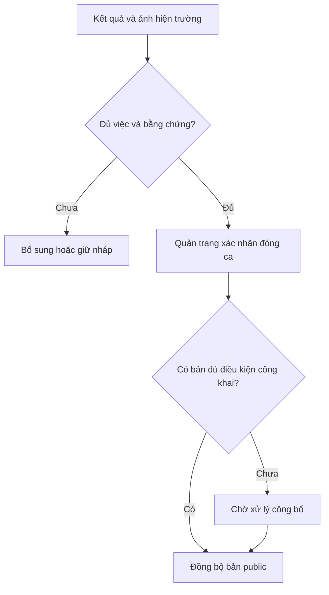

# Execution plan: chỉnh giao diện theo actor và Lab1–Lab4

**Dự án:** Cemetery Management System  
**Ngày:** 07/10/2026  
**Baseline đã rà soát:** `9abf52098d91e767e9a1032567de6f5066429f90`  
**Repository:** https://github.com/huyxuantruong1411/cemetery-management-system  
**Tài liệu bắt buộc đọc cùng:** `01_REPORT_GIAO_DIEN_VA_PHAN_QUYEN.md`

## 1 Mục tiêu và hợp đồng thực thi

Sửa trải nghiệm sử dụng để mỗi actor có đúng thông tin, thao tác và luồng nghiệp vụ đã quy định. Giao diện phải khớp với chính sách API, dữ liệu thật và trạng thái thật. Không nghiệm thu bằng việc chỉ đổi màu, ẩn menu hoặc thêm màn chỉ đọc.

Hai file này là đầu vào cho agent thực thi; **chưa phải bằng chứng phần mềm đã được sửa hoặc đã vượt qua kiểm thử**. Báo cáo đi kèm có 26 phát hiện UI01–UI26, thiết kế P01–P04, S01–S09, M01–M09, K01–K06, Q01–Q10, A01–A03 và ma trận đủ 39 UC. Dùng các mã đó xuyên suốt issue, commit và test.

### 1.1 Kết quả bắt buộc

1. Khách chưa đăng nhập vào trang doanh nghiệp, tìm mộ và xem thông tin/kết quả chăm sóc đã công bố. Không gặp bảng health, quyền hay menu nội bộ.
2. Bốn actor nội bộ có trang đầu và menu phù hợp. Quản trang không xem hợp đồng đầy đủ, bản in hợp đồng, doanh thu hay báo cáo doanh nghiệp; vẫn có căn cứ kỹ thuật đủ để làm việc.
3. Quản trang có thể lập checklist, chọn quản trang phụ trách, phân công từng mục/ca cho người, tổ hoặc bên ngoài, kiểm tra và xác nhận kết quả. Người thực hiện không bắt buộc có tài khoản.
4. Marketing hoàn tất hồ sơ → hợp đồng/phụ lục → ký ngoài hệ thống → scan → hiệu lực → bàn giao. Kế toán có luồng công nợ/thu/biên lai đúng thẩm quyền. Sếp có màn quản trị thực sự.
5. Web và Flutter dùng cùng backend, cùng quy tắc quyền và chuyển trạng thái. Mọi chức năng thuộc phạm vi phải có test đúng actor và test actor bị từ chối.

### 1.2 Giữ nguyên các quyết định nền tảng

| Thành phần | Hướng thực hiện |
|---|---|
| Backend | Giữ FastAPI, SQLAlchemy, Alembic, SQL Server; dùng `uv` và lockfile hiện có. Không viết lại sang framework/DB khác. |
| Web | Giữ React + TypeScript + Vite, `pnpm`, Leaflet và bộ icon hiện có. Refactor theo feature/route; không chuyển sang Next.js chỉ để sửa UI. |
| Mobile | Giữ Flutter, Riverpod, Dio, go_router. Dùng API thật và detail DTO; không dựng backend riêng cho Flutter. |
| DB đã có | Không chạy lại `lab4-sql.sql` hoặc bootstrap làm mất dữ liệu. Chỉ migration tăng dần sau kiểm tra schema thực tế và backup. `DESKTOP-HKIPI1M` là server người dùng, không phải DB test mặc định. |
| MinIO và dữ liệu phát sinh | Giữ mọi dữ liệu runtime do dự án quản lý dưới `backend/runtime/` của checkout đặt trên ổ dữ liệu người dùng chọn; bind mount đúng đường dẫn tuyệt đối. Gồm object, upload tạm, export, log, backup và derivative. Không chuyển thành named volume mặc định làm dữ liệu lớn quay về ổ C. |
| Giới hạn về ổ C | Bind mount giải quyết payload MinIO của dự án; không đồng nghĩa image/cache/VM của Docker Desktop ngừng dùng C. Nếu cần giảm cả phần Docker đó, hướng dẫn đổi vị trí disk image riêng; không tuyên bố plan UI đã xử lý việc này. |
| Dữ liệu nghiệp vụ | Giữ Kim Tĩnh bất biến, tách nghiệm thu thi công khỏi an táng, tiền Decimal, snapshot giá/nội dung đã ký, năm sinh không bịa ngày, kiểm tra chứng tử. |
| Phạm vi đợt sửa | UI, API/DTO/permission và migration tối thiểu cần cho UI đúng nghiệp vụ. Không thêm portal khách đăng nhập, thương mại điện tử, microservices hoặc dashboard hạ tầng. |

## 2 Việc agent phải làm trước khi code — M00

**Đầu vào:** hai file này, toàn bộ `docs/source/`, `AGENTS.md`, `docs/execution/STATE.md`, rule/skill trong repo.  
**Đầu ra:** nhánh làm việc, inventory hiện trạng, traceability, quyết định có ghi nguồn và fixture kiểm thử.

### M00.1 Ghi nhận baseline và bảo toàn công việc hiện có

- Chạy `git status --short`, ghi HEAD hiện tại và khác biệt với baseline của báo cáo. Nếu upstream mới hơn, đọc diff các file liên quan rồi cập nhật phát hiện; không reset về commit cũ.
- Tạo nhánh `ui/lab-actor-alignment` hoặc tên chưa trùng. Không ghi đè thay đổi chưa commit của người dùng; dùng checkout/worktree riêng nếu cần.
- Sao chép hai tài liệu vào `docs/ui-alignment/` của repo. Lập `baseline.md` ghi commit, tool versions, tình trạng chạy app/DB, migration hiện tại và những kiểm tra chưa thực hiện.
- Đọc đầy đủ văn bản lẫn hình nhúng của bốn Lab. Không dùng riêng `docs/EXECUTION_PLAN.md`, bản tóm tắt, ERD hoặc mã đang có để suy ra actor. 39 UC và 12 quyết định D01–D12 ở báo cáo là checklist đối chiếu, không thay nguồn gốc.

### M00.2 Tạo bộ tài liệu có thể kiểm chứng

| File đề xuất trong `docs/ui-alignment/` | Nội dung bắt buộc |
|---|---|
| `traceability.csv` | 39 hàng: UC, actor, source/diagram, screen ID, route, API, rule, implementation, test IDs, evidence, status. Chỉ dùng DONE khi có đủ bằng chứng. |
| `actor-policy.md` | Xem, hành động, scope, trường được trả, loại file được đọc; ghi cả deny. Phân biệt quyền và việc được giao. |
| `route-inventory.md` | Route web, route Flutter tương ứng, trang mặc định từng actor, capability và API phụ thuộc. |
| `api-ui-contracts.md` | Endpoint tồn tại/mở rộng/mới; DTO theo ngữ cảnh; lỗi nghiệp vụ; pagination; assignment; file ACL; publication. |
| `decisions.md` | D01–D12, căn cứ, phương án chọn, phần chưa rõ, ảnh hưởng migration/test; không ghi quyết định đề xuất thành nguyên văn của Lab. |
| `acceptance.md` | Các kịch bản mục 11, ảnh chụp và kết quả request đã lọc thông tin nhạy cảm. |

### M00.3 Sửa những chỉ dẫn cũ có thể tái sinh lỗi

Kiểm tra `AGENTS.md`, `.agents/rules/project.md`, `.agents/skills/cemetery-domain/`, `.agents/skills/professional-ui-review/`, kế hoạch cũ và test cũ. Bổ sung rule: **actor → use case → dữ liệu được xem → thao tác → route → API → test**. Loại hướng dẫn mặc định public landing là diagnostics, Quản trang phải đọc hợp đồng đầy đủ, hoặc ADMIN tự do vượt mọi điều kiện nghiệp vụ. Giữ nguyên các ràng buộc DB/storage còn đúng. Không sửa chỉ dẫn để né gate hoặc che thất bại.

### M00.4 Chốt cách xử lý các điểm chưa rõ

- D01/D02/D06/D07/D08: thực hiện theo báo cáo; đã có căn cứ rõ cho luồng ký ngoại tuyến, bốn loại hợp đồng, tách an táng, điều chỉnh tiến độ và hai chính sách xung đột.
- D03: mặc định public chỉ tra người mất/mã mộ và dữ liệu đã công bố; CCCD/thân nhân sống chỉ cho tìm nội bộ đúng quyền.
- D04: triển khai mô hình tách giám sát/người thực hiện; yêu cầu người dùng mới đã làm rõ việc thuê ngoài.
- D05: phân biệt chế độ xem lịch với chu kỳ dịch vụ. Đề xuất hỗ trợ recurrence DAY/WEEK/MONTH/QUARTER/YEAR để bao phủ cả UC-5.2 và 8.5, có migration và test ranh giới kỳ. Dữ liệu cũ theo tháng không tự chuyển sang ngày/tuần. Nếu chưa triển khai đủ thì ghi PARTIAL, không coi lịch tháng là hỗ trợ mọi chu kỳ.
- D09: giữ ADMIN làm mã tương thích nhưng áp dụng capability cụ thể; quyền tác nghiệp bổ sung khi kiêm nhiệm. Ghi rõ đây là ma trận mặc định đề xuất theo actor từng UC.
- D10: đề xuất quản trang chọn bản kết quả/ảnh đủ điều kiện công khai ở bước xác nhận, hệ thống tự đồng bộ sau đóng; ảnh gốc nội bộ không được công bố tự động. Nếu chính sách ảnh chưa chốt, vẫn làm UI/kỹ thuật publication, giữ bản chưa đủ điều kiện ở PRIVATE/REVIEW_REQUIRED.
- D11: xác minh căn cứ pháp lý của chủ mới sau chuyển nhượng; sửa liên kết tối thiểu để không buộc mua đất lần hai.
- D12: giữ chặn thu vượt và chiết khấu chưa đủ căn cứ; hiển thị lý do nghiệp vụ. Chỉ mở nhánh vượt nợ khi đã có quy tắc tiền thừa/đối soát; chỉ cho giảm khi chính sách hạn mức và bằng chứng phê duyệt xác định. Đánh dấu nhánh UC chưa hoàn tất nếu còn thiếu.

Agent tiếp tục các phần không phụ thuộc vào quyết định chưa rõ, tổng hợp một danh sách câu hỏi có ảnh hưởng thực sự tới nghiệp vụ. Không dừng toàn dự án vì một chi tiết nhãn, màu, bố cục hoặc lựa chọn thư viện thông thường.

**Gate M00:** có đầy đủ 39 hàng UC, fixture bốn role + khách + ít nhất hai quản trang + nhân sự ngoài; xác định DB test độc lập; chưa chạy migration/fixture phá dữ liệu trên DB thật.

## 3 Công cụ, MCP và skill cho Antigravity

Mục tiêu là giúp agent đọc tài liệu, chạy ứng dụng và kiểm tra đúng vai trò. Không cài nhiều MCP trùng chức năng hoặc coi MCP là bằng chứng kiểm thử.

### 3.1 Bộ công cụ tối thiểu

| Công cụ | Cách sử dụng trong đợt sửa | Tiêu chí kiểm tra đã sẵn sàng |
|---|---|---|
| Git CLI | Diff, nhánh, commit mỗi milestone, tag đã nghiệm thu | Đọc được HEAD, working tree và diff; không cần GitHub MCP để sửa local. |
| `uv`, Python, `pnpm`, Node | Đồng bộ theo lockfile và chạy backend/web | Ghi phiên bản vào baseline; build/lint hiện trạng có kết quả, không tự nâng major dependencies. |
| Flutter/Dart | Analyze, test, chạy app trên emulator và thiết bị | `flutter doctor -v`, `flutter --version`, `dart --version`; ghi rõ thiết bị đã kiểm tra. |
| Dart MCP | Tái sử dụng `.agents/mcp_config.json` đang cấu hình `cmd /d /c dart mcp-server` | Chạy `dart mcp-server --help`; đăng ký qua cấu hình MCP thực sự của IDE; xác nhận IDE thấy tool và project. Không giả định file trong repo tự được IDE nạp. |
| Playwright Test | Bộ E2E có thể chạy lại, role fixtures, request assertions, screenshots | Có script mới `test:e2e` trong web và cấu hình baseURL; một smoke test chạy thật. |
| Playwright MCP hoặc browser tích hợp IDE | Agent tự kiểm tra luồng, accessibility tree, chụp ảnh theo actor | Chọn một phương án đủ dùng. Nếu dùng MCP, lấy package chính thức `@playwright/mcp`, khóa phiên bản đã kiểm tra. |
| Trình đọc DOCX có ảnh | Extract text và xem image/media sơ đồ | Agent chỉ ra được luồng phân công trong Lab2 và kết quả public trong sơ đồ chăm sóc Lab2/Lab3. Chỉ đọc text extraction là chưa đủ. |
| SQL tools trên máy người dùng | Xem migration/schema và DB test với quyền phù hợp | Kết nối đúng instance; không đưa mật khẩu/connection string đầy đủ vào chat hoặc file evidence. |

**Cấu hình Playwright MCP minh họa cho Windows**, điền phiên bản đã kiểm tra trước khi dùng; đây không phải file cấu hình đã cài sẵn:

```json
{
  "mcpServers": {
    "playwright": {
      "command": "cmd",
      "args": ["/d", "/c", "npx", "-y", "@playwright/mcp@VERSION_DA_KIEM_TRA"]
    }
  }
}
```

Dùng mục MCP trong Settings/manager của phiên bản Antigravity đang cài để nhập cấu hình, kiểm tra lỗi khởi động và chạy một lần mở web local. Không tự khẳng định tên/path cấu hình IDE khi chưa kiểm tra. Không đặt token hoặc tài khoản mẫu có dữ liệu thật trong JSON commit. Không cần thêm MCP đọc SQL quyền ghi, hệ thống file toàn máy hoặc quyền quản trị GitHub chỉ để cải thiện UI.

### 3.2 Các skill nên dùng/cập nhật

- `cemetery-domain`: bắt buộc mở UC trước khi sửa feature; bổ sung tách coordinator/executor, public care result, DTO theo actor, các quyết định D01–D12.
- `professional-ui-review`: giữ palette và tiêu chuẩn hiện có; thêm “mỗi khối UI phải có actor + câu hỏi nghiệp vụ + thao tác tiếp theo”, màn không quyền không mount/fetch, không lộ diagnostics.
- `sqlserver-migration`: chỉ dùng cho schema thực sự thiếu; kế hoạch backfill, kiểm tra ràng buộc và rollback/forward fix.
- `milestone-delivery`: mỗi milestone phải có traceability, test, ảnh đúng actor, commit và nội dung còn thiếu. Không tự đánh dấu DONE bằng ảnh một màn desktop.
- Nếu cần skill mới `actor-journey-review`, nội dung phải là checklist dùng lại: mở persona → hoàn thành journey → thử URL/API cấm → kiểm tra trường dữ liệu → logout/back → chụp evidence. Đăng ký theo cơ chế Skills hiện hành của IDE; không phụ thuộc vào lệnh slash/workflow cũ chưa xác minh.

Tài liệu công cụ tham khảo là nguồn chính thức, xem mục 14. Playwright MCP phục vụ tương tác của agent; Playwright Test mới là regression suite. Khả năng Dart MCP tùy Dart SDK, nên xác minh trên máy thay vì giả định có mọi tool.

## 4 Ma trận capability và hợp đồng dữ liệu — M01

**Ưu tiên P0.** Làm trước khi mở rộng màn hình. Xử lý UI04–UI08, UI20 và nền tảng UI10/UI22. Những tên capability dưới đây là **đề xuất**, phải lập mapping với permission đang có; không được coi chúng đã tồn tại trong seed.

### 4.1 Quyền theo hành động và ngữ cảnh

| Nhóm capability đề xuất | Actor mặc định | Giới hạn bắt buộc |
|---|---|---|
| `profiles:manage` | Marketing | CRUD nội bộ; Sếp có read cần thiết cho giám sát qua policy riêng, không tự có write. |
| `contracts:read_full`, `contracts:read_signed` | Marketing, Sếp | Bản đầy đủ/bản ký; danh sách theo scope role, không dựa creator đơn thuần. |
| `contracts:compose`, `contracts:print`, `contracts:activate` | Marketing | Mỗi trạng thái có điều kiện; quyền đọc không tự cấp in/tạo. Sếp đọc bản ký để giám sát không đồng nghĩa nút lập/in mẫu pháp lý. |
| `work_basis:read` | Quản trang | DTO tác nghiệp theo phụ lục, không CCCD/giá/tệp hợp đồng. |
| `finance_basis:read` | Kế toán | Nguồn nghĩa vụ, khách nộp và giá trị liên quan; không toàn bộ hồ sơ hoặc chứng tử. |
| `space:manage` | Sếp | Quy hoạch/GPS/loại mộ; không bỏ qua quy tắc an táng. |
| `plots:commercial_lookup`, `plots:reserve` | Marketing; Sếp đọc nếu cần | Bản đồ khả dụng phục vụ tư vấn; giữ chỗ là hành động riêng. |
| `plots:operational_lookup`, `plots:confirm_burial`, `plots:confirm_exhumation` | Quản trang | Xác nhận căn cứ, bằng chứng, owner, slot, Kim Tĩnh. |
| `construction:plan`, `construction:assign`, `construction:verify`, `construction:progress` | Quản trang | Không yêu cầu user thực hiện bằng user xác nhận; scope công việc hợp lệ. |
| `care:register` | Marketing | Chốt gói/phụ lục; không giao ca. |
| `care:schedule`, `care:assign`, `care:verify`, `workforce:manage` | Quản trang | Lập lịch, điều phối, xác nhận; nhân sự ngoài không tự có quyền đăng nhập. |
| `finance:receivable_create`, `finance:payment_record`, `finance:receipt_read`, `finance:discount_apply` | Kế toán | Điều kiện nguồn nghĩa vụ, idempotency, hạn mức/phê duyệt; không cấu hình giá. |
| `reports:revenue_read/export` | Sếp, Kế toán | Cùng scope/bộ lọc giữa xem và xuất. Tách read và export thành permission thực tế riêng. |
| `reports:occupancy_read/export`, `reports:contracts_read/export`, `reports:operations_read/export` | Sếp | Không dùng permission reports:read cũ để cấp tất cả loại. |
| `accounts:manage`, `permissions:manage`, `catalog:manage`, `audit:read` | Sếp | Catalog gồm mẫu/gói/giá; audit chỉ đọc. Không dùng finance:write để sửa bảng giá. |

Các capability là quyền chức năng; resource policy kiểm tra hồ sơ/địa điểm/trạng thái cụ thể. Lab chưa quy định “quản trang chỉ nhìn thấy việc do mình làm”, nên mặc định quản trang được điều phối trong phạm vi nghĩa trang được giao; “Việc tôi phụ trách” chỉ là bộ lọc. Nếu thêm scope khu vực phải có policy rõ và kiểm thử riêng, không lén dùng assignee equality làm phân quyền.

### 4.2 Công việc backend

1. Kiểm kê tất cả route liên quan `auth`, `profiles`, `contracts`, `documents`, `plots`, `catalog`, `construction`, `care`, `finance`, `reports`, `jobs`, `audit`; ghi guard + response schema hiện tại. Đặc biệt list/detail/PDF/download/export và lookup.
2. Tạo policy tập trung: capability, resource access và transition conditions. Không lặp `role == ...` khác nhau ở từng component/router. Không giữ ADMIN bypass ở các thao tác trái điều kiện nghiệp vụ.
3. Siết router/service và DTO trước. Không đưa full model ra JSON rồi ẩn trường bằng CSS. Chặn field không cho phép trong request để tránh tự sửa trạng thái/assignee qua mass assignment.
4. Tạo endpoint/DTO căn cứ tác nghiệp và nguồn tài chính ở mục 4.3. Guard cả lookup; không giải quyết picker bằng tải toàn bộ users/customers/contracts.
5. Migration quyền có mapping, audit và cập nhật role đã tồn tại trong DB. Seed mới không đủ để sửa DB người dùng đã chạy. Không xóa custom role không liên quan; liệt kê thay đổi cụ thể trước áp dụng.
6. Thu hồi/làm mới quyền phiên cho tài khoản bị ảnh hưởng; kiểm tra `auth_version` và cách `/me`/permission cache hoạt động. Giao diện đã mở phải mất quyền ngay sau lần xác thực tiếp theo, không giữ capability cũ vô hạn.
7. Viết regression API theo ma trận: 401 chưa đăng nhập, 403 sai chức năng; tài nguyên ngoài scope dùng 403/404 theo policy nhất quán. Một actor đổi ID không được nhận payload cấm trước khi lỗi.

### 4.3 DTO tối thiểu và API cần bổ sung

Tên route mới bên dưới chỉ là hợp đồng đề xuất, agent đối chiếu route hiện hữu rồi thống nhất trong `api-ui-contracts.md`.

| Ngữ cảnh | Dữ liệu cho phép | Dữ liệu không đưa vào DTO |
|---|---|---|
| Public memorial summary/detail | Mã public, tên người mất được công bố, năm/ngày sinh theo độ chính xác được duyệt, ngày mất, mã/vị trí mộ, tọa độ xác minh, mô tả đường đi, kết quả chăm sóc public | Customer ID/CCCD, liên hệ thân nhân, chứng tử, hợp đồng, công nợ, tên/điện thoại nhân sự, internal notes, file IDs nội bộ |
| Work basis cho Quản trang | Mã căn cứ, loại công việc, hiệu lực, plot/slot, người mất khi cần đúng hạng mục, phạm vi/checklist, thông số, ngày dự kiến/hạn, trạng thái hồ sơ đủ điều kiện, ghi chú tác nghiệp đã lọc | Giá trị HĐ/chiết khấu/thu tiền, CCCD/địa chỉ khách, scan pháp lý, toàn bộ khách liên quan, phiếu thu |
| Finance basis cho Kế toán | Mã nghĩa vụ, khách trả và định danh tối thiểu phục vụ chứng từ, HĐ/PL tham chiếu, tiền/đợt/hạn, khoản đã ghi nhận | Chứng tử, ảnh hiện trường chưa công bố, toàn bộ điều khoản/scan HĐ, lịch nhân sự |
| Progress summary cho Marketing | Mã hồ sơ, trạng thái công việc, mốc dự kiến/thực tế, % tiến độ có nhãn, vướng mắc cần trao đổi | Nghỉ phép, xung đột lịch của người khác, điện thoại thợ, toàn bộ điều phối nghĩa trang |
| Workforce lookup | ID nghiệp vụ nội bộ, tên, loại người/tổ/ngoài, kỹ năng, đầu mối, trạng thái, lịch khả dụng đủ dùng | Password/token, quyền tài khoản, lương hoặc thông tin không phục vụ phân công |

Danh mục API:

- **Có, mở rộng:** `GET /api/v1/profiles/public/memorials` thêm tiêu chí mã mộ, phân trang và phân biệt trùng tên; giữ allowlist response công khai.
- **Mới nếu chưa có:** public detail và kết quả chăm sóc public theo ID public; không gọi detail hồ sơ nội bộ rồi bỏ bớt trường ở frontend.
- **Mới nếu chưa có:** lookup căn cứ có hiệu lực, `work-basis` detail, lookup workforce/availability và nguồn nghĩa vụ tài chính; các path do agent chốt.
- **Có, sửa contract:** care assign dùng PATCH theo backend hiện tại; mở rộng payload để hỗ trợ workforce, không chỉ `caretaker_id`.
- **Có, nối UI:** construction task CRUD/reorder/evidence/complete; giữ route phù hợp và mở rộng policy/fields khi thiếu.
- **Mới hoặc mở rộng có migration:** điều chỉnh tiến độ có lý do; assignment history; public publication; slot transition theo nghiệp vụ khi API cũ chưa đủ.
- **Có, siết quyền:** contracts list/detail/pdf, profiles CRUD, documents preview/download, reports từng loại và export/job result; catalog pricing.

Không thay đồng loạt đường dẫn public API đang dùng mà không có lớp tương thích. Dùng schema Pydantic/OpenAPI làm nguồn type; nếu sinh client, kiểm tra diff và commit cấu hình sinh, không copy type lệch cho React và Flutter.

### 4.4 File phải kế thừa quyền hồ sơ gốc

- Bản hợp đồng/phụ lục ký chỉ cho role có quyền đọc bản đó; không suy ra từ `documents:read` chung.
- Chứng tử theo quyền hồ sơ người mất; quản trang chỉ cần trạng thái đủ điều kiện, không bản scan mặc định.
- Phiếu thu theo quyền giao dịch tài chính; export theo report type và bộ lọc đã được phép.
- Evidence chăm sóc/thi công theo công việc; người upload không phải người duy nhất được xem, người biết file ID không mặc nhiên được xem.
- File chưa gắn hồ sơ chỉ thuộc phiên/người upload đủ quyền trong thời gian chờ; khi attach phải kiểm tra quyền parent và trạng thái file. Không cho gắn file người khác bằng ID tùy ý.
- Public chỉ đọc derivative/ảnh được công bố; không dùng raw MinIO object URL hoặc URL ký dài hạn của evidence gốc. Thu hồi công bố phải ngừng phát URL mới và xử lý cache/TTL đã định nghĩa.
- Job tạo file và endpoint lấy kết quả phải kiểm tra quyền; người dùng không có nút `process-next`. Worker chạy qua cơ chế vận hành đã có.

**File trọng tâm:** `backend/app/modules/*/{router,service,schemas}.py`, `backend/app/modules/auth/dependencies.py`, `backend/scripts/seed_rbac.py` hoặc đường dẫn seed thực tế trong checkout, migration; web auth/capability adapter; Flutter auth providers. Dùng `rg --files` xác định path thật trước sửa.

**Gate M01:** Quản trang gọi thẳng contract detail/PDF, báo cáo và file hợp đồng đều bị từ chối; vẫn đọc được work basis đủ dùng. Kế toán không sửa bảng giá hoặc xuất báo cáo vận hành. Marketing không đóng ca. Public không nhận dữ liệu thân nhân từ bất kỳ response tra cứu nào. Test chạy trên DB test; lưu cả deny evidence.

## 5 Design system, shell và cổng công khai — M02

**Phụ thuộc:** M00; policy M01 phải xong trước nghiệm thu. Xử lý UI01–UI04, UI09, UI23, UI25.  
**Màn hình:** P01–P04, A01–A03 và shell của bốn actor.

### 5.1 Kiến trúc giao diện

- Tách `PublicLayout`, `StaffLayout`, route definitions, `RequireCapability`, navigation và shared components. Tên/path file là đề xuất; chọn cấu trúc phù hợp repo, không rewrite module nghiệp vụ cùng lúc.
- Thay state `activeTab` làm router bằng routing có URL, reload/back/deep link. React Router là lựa chọn phù hợp nếu thêm; xác minh phiên bản tương thích React/Vite hiện có và cập nhật lockfile. Flutter tiếp tục go_router.
- Public routes đề xuất: `/`, `/tra-cuu`, `/phan-mo/:publicId`, `/huong-dan`, `/nhan-vien/dang-nhap`.
- Staff routes đề xuất: `/noi-bo/quan-ly`, `/noi-bo/marketing`, `/noi-bo/ke-toan`, `/noi-bo/quan-trang` và các detail routes. Route names nội bộ có thể tiếng Anh nếu code nhất quán; nhãn UI tiếng Việt.
- Auth bootstrap có trạng thái loading rõ, không lóe dữ liệu actor trước. Chỉ mount/fetch feature khi route được phép. `403` có đường về công việc của actor, không bắn người dùng vào vòng lặp login.
- Logout/đổi tài khoản: hủy request đang chạy, xóa cache có danh tính cũ, local draft nhạy cảm theo chính sách, reset navigation và state Flutter; Back không khôi phục nội dung cấm. Public cache và staff cache tách nhau.
- Tài khoản nhiều role dùng menu được phép hoặc bộ chọn không gian công việc. Bộ chọn không phải nâng quyền; backend xác thực capability/resource mọi request.

### 5.2 Quy chuẩn hình thức và thành phần

| Hạng mục | Quy chuẩn cần triển khai |
|---|---|
| Màu/typography | Dùng tokens: nền `#F7F8F5`, chữ `#1F2933`, hành động `#24594D`; font có đủ dấu tiếng Việt. Cảnh báo/hủy khác nhau; màu không là tín hiệu duy nhất. |
| Cấu trúc | Header ngắn: tiêu đề, bối cảnh, một CTA chính; filter phù hợp; nội dung làm việc; lịch sử ở khu thứ cấp. Không dùng grid KPI ở mọi trang. |
| Table/list | Cột ít và theo nghiệp vụ; mã có link, ngày nhất quán, tiền căn phải; dropdown thao tác chỉ có quyền hợp lệ; mobile dùng card có nhãn. |
| Form | Label thật, required rõ, lỗi sát trường; giữ dữ liệu đã nhập khi validation/upload thất bại; xác nhận cho thay đổi pháp lý/tiền/trạng thái quan trọng. |
| Picker | Tìm theo tên/mã, thông tin phân biệt trùng, chỉ trả đối tượng đủ điều kiện; không yêu cầu nhập khóa số của DB. |
| Detail | Trang riêng cho hồ sơ dài, tabs có URL khi cần; drawer cho xem nhanh; không chồng nhiều modal dài. |
| Trạng thái | Loading, empty, error, success; thêm forbidden, stale/concurrent update, offline/upload-pending ở nơi cần. Không biến lỗi API thành list rỗng/số 0. |
| Accessibility | Keyboard, focus nhìn thấy/không bị che, label/screen reader, contrast WCAG AA. Mục tiêu touch trên mobile ≥48 logical px; test thực tế, không chỉ khai CSS. |
| Ngày/tiền | Hiển thị ngày và giờ theo múi giờ vận hành đã cấu hình, tránh lệch ngày khi đổi UTC; lưu đúng loại date/datetime. Tiền nguồn server Decimal, định dạng VNĐ phù hợp. |
| Public copy | Chỉ thông tin doanh nghiệp đã được người dùng cung cấp; thiếu địa chỉ/hotline thì cấu hình/chưa xuất bản mục đó. Không bịa thành tích, lời chứng thực, ảnh gia đình hay số liệu. |

### 5.3 Public flow phải hoàn tất

P01 có CTA “Tìm phần mộ”, thông tin thăm viếng/liên hệ, link đăng nhập nhân viên thứ cấp. P02 tìm tên hoặc mã mộ, có kết quả phân biệt trùng tên và empty/error rõ. P03 hiển thị phần mộ, vị trí, chỉ đường và tab kết quả chăm sóc đã công bố. Không cần đăng nhập.

Chỉ đường chỉ dùng tọa độ đã xác minh. Thiếu GPS → hiện mã khu/hàng/ô và hướng dẫn liên hệ; người dùng từ chối vị trí → vẫn xem được điểm đến, không bịa vị trí hiện tại. Chọn link nhà cung cấp bản đồ hợp lệ; không xuất tọa độ nhạy cảm chưa được công bố.

Ở M02 có thể hoàn thành public profile và khung lịch sử; kết quả chăm sóc thật nối ở M06. Chưa có bản công bố thì hiển thị “Chưa có kết quả chăm sóc được công bố”, không dùng ảnh mẫu giả thành dữ liệu thật.

### 5.4 Xóa UI không có giá trị nghiệp vụ

Bỏ “RBAC Active Permissions”, auth version, health SQL/MinIO, dev gate labels khỏi trang công khai và workspace thông thường. Gỡ DocumentManager tổng hợp khỏi menu nghiệp vụ; giữ các component upload/preview cần dùng để nhúng theo hồ sơ. Gỡ nút sinh PDF demo, nhập entity ID, điều khiển worker. Giữ health probes cho vận hành, giới hạn phần chi tiết ở cơ chế nội bộ phù hợp, không xóa monitoring vì bỏ màn public.

**File trọng tâm:** `web/src/App.tsx`, auth context, modules Profile/Document/PlotMap, shared styles/components, web route mới; `mobile/lib/screens/` home/dashboard/auth, router/providers. Agent xác định đúng tên file bằng inventory.

**Gate M02:** khách mở tab ẩn danh → tìm mộ → mở detail → dẫn đường, không nhận request health chi tiết hoặc API nội bộ. Bốn role đăng nhập vào đúng home, không có menu cấm; refresh/back/deep link/logout đạt. Chụp 1440×900, 768×1024, 390×844, kiểm tra keyboard/focus.

## 6 Hồ sơ, căn cứ pháp lý và bàn giao — M03

**Phụ thuộc:** M01–M02. Xử lý UI06/UI13/UI18 và phần UI09.  
**UC/màn:** UC-2.1–2.4, 3.1–3.5, 5.1; M01–M09, phần S04/S08 cần cho căn cứ.

### M03.1 Hồ sơ khách và người mất

Refactor màn đã có thành list/detail/forms đúng quyền Marketing; tìm hồ sơ trước tạo; kiểm tra trùng; thể hiện năm sinh/độ chính xác; chứng tử có upload, preview, trạng thái chưa đủ. Quan hệ thân nhân/mộ là form có căn cứ, không đổi ownership hoặc thực hiện an táng bằng chỉnh hồ sơ.

### M03.2 Hợp đồng bốn loại

Tái sử dụng logic hiện có, tách wizard theo loại ở bảng 6.1 của báo cáo. Có bước rà soát, trạng thái nháp/chờ ký/hiệu lực, snapshot, điều kiện chủ quyền. Chọn mộ bằng picker khả dụng; hỏa táng không cần mộ; mua đất không cần có người mất; cải táng/nhượng có điều kiện riêng. Mỗi submit xử lý xung đột dữ liệu bằng lỗi cụ thể và giữ phần còn hợp lệ.

### M03.3 In ký, scan và phụ lục

- Preview/in đúng loại và phiên bản → ký ngoài hệ thống → upload file → preview kiểm tra → kích hoạt khi đủ điều kiện. Upload đang chạy/lỗi không được coi là đã có bản ký.
- Hoàn thiện ba form phụ lục: an táng, thi công, chăm sóc; thêm gia hạn bằng hồ sơ hợp lệ. Không mở rộng thành textarea chung hoặc tạo ID giả để test giao việc.
- M08 đăng ký care: gói/chu kỳ còn hiệu lực, phạm vi mộ, giá snapshot, ngày bắt đầu/kết thúc, cảnh báo đăng ký trùng; không cho Marketing gán người làm.
- Bàn giao tạo nguồn “Cần tiếp nhận” cho Q02/Q06 sau hiệu lực. UI phải giải thích chưa đủ điều kiện bàn giao, không tự tạo lệnh từ hợp đồng nháp.
- Sau chuyển nhượng, lookup căn cứ lấy quyền hiện hành; thiết kế/backfill liên kết theo D11. Lịch sử cũ vẫn đọc được theo quyền nhưng không bị coi là chủ hiện tại.
- M09 chỉ đọc tiến độ theo hồ sơ; không tải toàn bộ board của quản trang. S04 chỉ theo dõi hợp đồng/hạn theo quyền Sếp.

### M03.4 Danh mục cần cho luồng

Trước khi nghiệm thu M03 phải có dữ liệu template/gói/giá hợp lệ cho fixture. Nối component chọn catalog dạng read-only cho Marketing; màn quản trị đầy đủ của Sếp làm M08. API cấu hình giá đã được siết từ M01, không chờ đến khi có màn Sếp.

**Gate M03:** bốn loại hợp đồng đi hết nhánh hợp lệ và ít nhất một nhánh sai; ba phụ lục tạo/in/scan/kích hoạt được; công việc quản trang nhận đúng phạm vi không lộ giá/CCCD; hợp đồng thiếu chứng tử không khiến an táng thực tế thành công. Không làm mất lịch sử bản ký hoặc snapshot đã có.

## 7 Nhiều quản trang, nhân sự và phân công — M04

**Phụ thuộc:** M01 và contract data M03; shell M02. Xử lý UI13–UI15.  
**Màn:** Q10; cấu phần chọn người ở Q02–Q08.

### 7.1 Mô hình trách nhiệm cần đạt

| Khái niệm | Ý nghĩa | Nguồn dữ liệu |
|---|---|---|
| `assigned_by` | Người lưu quyết định phân công | Server lấy từ phiên đăng nhập, không tin client gửi tùy ý. |
| Quản trang phụ trách | Người điều phối/giám sát việc hoặc ca | Account nội bộ còn hiệu lực, chọn rõ, có thể khác người tạo. |
| Đầu mối thực hiện | Người hoặc tổ/bên ngoài nhận công việc | Danh bạ tác nghiệp; liên kết account là tùy chọn. |
| `confirmed_by` | Quản trang xác nhận/đóng kết quả | Server lấy từ thao tác xác nhận và lưu audit; không ép bằng người thực hiện. |

Một đầu mối chính cho mỗi hạng mục/ca, có thể có danh sách thành viên. Một lệnh thi công có nhiều hạng mục được giao cho các đầu mối khác nhau. Không mặc định tất cả task nhận `supervisor_id` làm assignee.

### 7.2 Migration tối thiểu, không tạo ERP nhân sự

1. Khảo sát `construction_tasks.assignee_user_id`, `assigned_team_or_contractor`, supervisor của order, `care_schedules.caretaker_id` và `StaffUnavailability` trước thiết kế.
2. Đề xuất danh bạ `work_parties` hoặc tương đương: loại PERSON/TEAM/EXTERNAL, tên, đầu mối/liên hệ công việc, kỹ năng nếu cần lọc, trạng thái, `linked_user_id` nullable; membership nếu dùng tổ và cần kiểm tra trùng người. Không thêm CCCD/lương/địa chỉ nhà khi không cần.
3. Assignment phải lưu khoảng giờ làm, party, supervisor, người gán, thời điểm, lý do đổi và snapshot tên đầu mối. Có lịch sử; không sửa tên cũ theo tên danh bạ mới làm biến dạng hồ sơ.
4. Ưu tiên tái sử dụng bảng/trường đúng nghĩa; chỉ thêm bảng lịch sử/membership khi cần cho nhiều người và kiểm tra xung đột. Agent viết migration cụ thể sau kiểm tra schema thật, không chạy SQL nháp trong plan này.
5. Backfill trường legacy có thể xác định chắc; dữ liệu chuỗi bên ngoài giữ nguyên snapshot, có trạng thái “Cần chuẩn hóa”. `caretaker_id` cũ có thể mang hai nghĩa: đánh dấu cần rà soát, không âm thầm coi cùng người vừa giám sát vừa thực hiện ở mọi bản ghi.
6. Thêm version/concurrency token cho assignment và transition. Hai quản trang cùng đổi lịch không được ghi đè không báo; trả lỗi xung đột và dữ liệu mới nhất.
7. Dùng chiến lược expand → backfill → chuyển client → siết constraint. Không drop trường cũ ngay trong cùng lần deploy; forward fix nếu rollback có nguy cơ mất assignment mới.

### 7.3 UI danh bạ và picker

Q10 có tìm người/tổ, trạng thái khả dụng, tạo nhanh bên ngoài, chọn đầu mối. Form tạo ngoài không yêu cầu username/password. Chỉ hiển thị liên hệ công việc cho người điều phối có quyền. Picker ở phân công có tên, loại, lịch bận, kỹ năng liên quan; không chọn ID trần.

Lịch khả dụng phải tính công việc chăm sóc + thi công + nghỉ/bận, không chỉ ngày nghỉ. Lưu khoảng thời gian, múi giờ, quy tắc chồng lấn; ngày không có giờ cần chính sách all-day rõ. Với tổ, xử lý xung đột cả thành viên đã biết; nhân sự ngoài chưa có lịch khả dụng phải có nhãn “Chưa có dữ liệu”, không ghi “Rảnh”.

**Gate M04:** quản trang A phân công người B, tổ T và bên ngoài X được; X không có account vẫn lưu và hiện lịch sử. Quản trang C được quyền giám sát theo phạm vi có thể tiếp nhận/xác nhận; đổi ID ngoài scope bị chặn. Hai client sửa cùng assignment nhận conflict phù hợp. Danh bạ không xuất hiện trong public response.

## 8 Thi công đầy đủ quy trình — M05

**Phụ thuộc:** M03–M04. Xử lý UI12–UI15, UI17, phần UI24.  
**UC/màn:** UC-4.1–4.5; Q01–Q05, đọc tiến độ S04/M09.

### M05.1 Tiếp nhận và lập checklist

Q02 chọn căn cứ đã có hiệu lực từ danh sách “Cần tiếp nhận”; server suy ra mộ/phạm vi và ngày hạn. Chọn quản trang phụ trách. Q03 có editor thêm/sửa/xóa/reorder, nội dung từ phụ lục và cờ bắt buộc; đã có bằng chứng thì sửa/xóa phải giữ lịch sử và điều kiện hợp lệ. Không chỉ cung cấp nút reorder.

### M05.2 Phân công từng hạng mục

Q04 chọn đầu mối từ M04 hoặc tạo nhanh bên ngoài; nhập thời gian bắt đầu/kết thúc và ghi chú giao việc. Hiển thị mộ, hạng mục, đầu mối, quản trang phụ trách riêng. Kiểm tra xung đột trước lưu và kiểm tra lại trong transaction khi lưu.

UC-4.2 cho cảnh báo để xử lý: UI đưa lựa chọn đổi thời gian/đầu mối; nếu chính sách cho tiếp tục khi chồng lịch thi công phải có quyền/điều kiện và lý do lưu audit. Mặc định không tự override. Không áp dụng cách này cho chăm sóc, nơi BR yêu cầu giải quyết xung đột.

### M05.3 Kiểm tra, bằng chứng, tiến độ và hạn

Q05 fetch detail thật; quản trang chọn hạng mục, xem người thực hiện, tick/ghi nhận kết quả, thời gian thực tế, ghi chú, ảnh/video. File phải upload/attach thành công trước dùng làm bằng chứng. Nén/retry không tạo bản ghi hoàn thành trùng.

Hiển thị “Theo checklist” và “Tiến độ thực tế xác nhận” nếu có điều chỉnh; nhập lý do thay đổi, lưu người/giờ/giá trị cũ mới. Không cho 100%/nghiệm thu khi task bắt buộc hoặc bằng chứng chưa đủ. Quá hạn thi công/hạn phụ lục hiện rõ; nút gửi yêu cầu gia hạn cho Marketing không tự chỉnh thời hạn pháp lý.

Nghiệm thu thi công chỉ kết thúc công việc xây dựng. Không tự an táng, chuyển owner, gán người mất vào slot hoặc khóa Kim Tĩnh. Nếu có lịch an táng tiếp theo thì là link sang Q09 với quyền và căn cứ riêng.

**Gate M05:** E2E quản trang A tiếp nhận → sửa checklist → giao ba loại đầu mối → quản trang có thẩm quyền kiểm tra → upload retry → điều chỉnh tiến độ → nghiệm thu; hệ thống chặn thiếu task/bằng chứng. Marketing chỉ đọc kết quả theo hồ sơ. Không có hợp đồng PDF/giá/CCCD trong network của quản trang.

## 9 Chăm sóc, xung đột và kết quả công khai — M06

**Phụ thuộc:** M03–M04, khung public M02. Xử lý UI10/UI11/UI15/UI16/UI23, phần UI24.  
**UC/màn:** UC-5.1–5.4; M08 → Q06–Q08 → P03.

### M06.1 Lập lịch theo gói và phạm vi mộ

- Q06 chọn gói/phụ lục hợp lệ, mộ hoặc nhóm, khoảng thời gian. Có preview các lịch sẽ tạo, bị bỏ qua do trùng và lý do.
- Template nội dung được snapshot; chỉnh ngày theo quyền, kiểm tra ngoài thời hạn gói/ngày nghỉ. Không để thay template toàn cục làm đổi checklist lịch đã lập.
- Giải quyết D05 bằng recurrence rõ; test ngày cuối tháng, tháng thiếu ngày, năm nhuận, quý/năm, timezone và thời hạn gói. Tính kỳ nghiệp vụ bằng server, không suy từ nhãn calendar view.
- Khóa chống sinh trùng theo mộ/phụ lục/kỳ nghiệp vụ phù hợp; validate trường hợp hai gói cùng phạm vi thay vì chỉ bỏ lỗi uniqueness. Sinh lại trả kết quả idempotent.

### M06.2 Phân công có ràng buộc

- Sửa `care:manage` không tồn tại thành capability đúng; sửa POST thành PATCH để khớp route, sau đó mở rộng payload theo mô hình M04.
- Q07 hiển thị nhân sự, quản trang phụ trách, ca, phạm vi mộ, xung đột thật. Ca còn xung đột **không được lưu**; lỗi trả về chỉ rõ slot và gợi ý đổi người/thời gian.
- Lưu assignment thành công mới chuyển trạng thái ASSIGNED theo state machine đã thống nhất. Không chỉ thay `caretaker_id` rồi giữ nhãn “Chưa phân công”.
- Thông báo nội bộ/device chỉ gửi nếu đầu mối có account/kênh đã cấu hình, sau transaction thành công. Nhân sự ngoài dùng trạng thái bàn giao và kênh thực tế; không hiện “Đã gửi” khi chỉ lưu DB. Không tự nhắn SMS/email ngoài phạm vi triển khai được giao.

### M06.3 Xác nhận và đóng ca

Q08 cho quản trang xem checklist, người thực hiện, tick kết quả, thời gian, ghi chú, ảnh. Server kiểm tra việc bắt buộc và bằng chứng; nút đóng giải thích điều còn thiếu. Khi mất mạng/upload lỗi, lưu nháp có trạng thái “Chưa đồng bộ”; không hiển thị CLOSED trước khi server chấp nhận.

Quản trang xác nhận có thể khác người thực hiện và người đã gán, theo phạm vi trách nhiệm. Lưu `confirmed_by` thật từ phiên. Đóng lặp do retry không tạo hai kết quả hoặc hai thông báo.

### M06.4 Công bố kết quả cho thân nhân



Hoàn thành công việc và publication là hai trạng thái khác nhau. Triển khai `PRIVATE/REVIEW_REQUIRED/PUBLISHED/WITHDRAWN` hoặc tập tương đương, liên kết với ca và mộ. Chọn nội dung tóm tắt/ảnh phục vụ thân nhân; loại giấy tờ, mặt người/biển số/thông tin sống không được phép công bố; giữ original private, tạo derivative khi cần. Không dùng chú thích nội bộ nguyên văn làm caption public.

Sau ca CLOSED và bản public đủ điều kiện, hệ thống tự cập nhật P03 và thông báo nội bộ tương ứng, có retry không trùng. Public chỉ thấy thời gian, công việc đã thực hiện, kết quả và ảnh được công bố; không thấy tên/điện thoại thợ, hợp đồng, gói giá hoặc thông tin người xác nhận nội bộ. Có quyền thu hồi công bố và audit; file/link public phải tuân theo trạng thái hiện hành.

Nếu chưa có người/chính sách xét ảnh, triển khai trạng thái chờ và ghi rõ nhánh còn chờ nghiệp vụ; không công khai hết evidence hoặc bỏ hẳn luồng thân nhân xem kết quả vốn có trong sơ đồ Lab2/Lab3.

**Gate M06:** Marketing đăng ký → Quản trang tạo lịch nhóm → xử lý xung đột → giao bên ngoài → kiểm tra đủ việc/ảnh → đóng → khách không đăng nhập xem kết quả đã công bố. Ảnh riêng vẫn 403/404 từ public; thu hồi làm public ngừng trả bản đó. Hai thao tác tạo lịch/đóng lặp không tạo dữ liệu trùng.

## 10 Các luồng còn lại và Flutter — M07 đến M09

### M07 Không gian mộ và thao tác ngoài hiện trường

**Phụ thuộc:** M01–M06 tùy feature. **UC/màn:** 1.1–1.5; S02/S03, Q09 và Flutter.

1. S02/S03: cây khu/hàng/ô, form GPS/ranh giới và loại mộ/số huyệt. Tạo/sửa có validation mã/quan hệ; xóa có kiểm tra tham chiếu; không thay lịch sử slot đang có người mất. Thiếu GPS hiển thị thiếu, không generate điểm ngẫu nhiên để bản đồ đẹp.
2. Q09: xác nhận an táng từ phụ lục hợp lệ, chứng tử và slot; xem tóm tắt người mất, chọn slot, thời gian thực tế, bằng chứng, Kim Tĩnh/cảnh báo không đảo ngược. Ghi người xác nhận và điều kiện server.
3. Cải táng từ căn cứ hợp lệ, chặn Kim Tĩnh theo quy tắc, xác nhận thực địa; slot trống không tự chuyển ô về chưa bán. Khi đủ điều kiện ô trở về trống có chủ, quyền chủ cũ được bảo toàn.
4. Flutter bỏ 8 tab cố định cho mọi người. Public chỉ tra cứu/hướng dẫn; Quản trang dùng Công việc, Lịch, Tra cứu, Cá nhân hoặc bố cục tương đương. Actor khác chỉ thấy tính năng được cấp.
5. Flutter care/construction detail phải GET detail theo ID; model danh sách không giả có checklist. Bổ sung repository/provider mutations: assignment, checklist, upload, confirm/close, refresh/error/concurrency. Dùng hợp đồng API đã thống nhất, không tự nhân bản logic state machine trong Dart.
6. Tích hợp camera/gallery theo nhu cầu bằng package được kiểm tra từ nguồn chính thức; cấu hình quyền platform, người dùng từ chối vẫn xem việc được. Thêm preview, nén phù hợp, tiến độ, retry/cancel; gắn evidence sau upload thành công.
7. Chỉ lưu nháp tối thiểu trên thiết bị, phân theo account; không hứa offline toàn hệ thống. Khi mất mạng cho xem dữ liệu đã tải và hàng đợi nháp rõ trạng thái; hành động pháp lý/tiền/xác nhận hoàn thành cần server quyết định. Không tự replay mutation nhạy cảm với quyền đã hết hạn.
8. Web responsive là phương án dùng đầy đủ chức năng cho Sếp/Marketing/Kế toán trên thiết bị nhỏ; Flutter ưu tiên public và hiện trường. Nếu chưa xây đủ luồng office trong Flutter, ghi phạm vi rõ, có link web đúng quyền; không trình bày tab placeholder như đã hoàn thiện.

**Gate M07:** kiểm thử emulator và ít nhất một thiết bị vật lý nếu môi trường có; ghi thực tế đã test. Tình huống từ chối GPS/camera, mạng yếu, upload lại, logout đổi role, font lớn/ngoài trời. Không dùng test widget giả danh sách có checklist để thay integration test detail.

### M08 Sếp, quản trị và danh mục

**Phụ thuộc:** M01–M03. **UC/màn:** 3.5, 7.1–7.5, 8.1–8.7; S01–S09, A01–A03.

- S06/S07 thay placeholder bằng CRUD tài khoản, khóa/mở theo điều kiện, role matrix và preview tác động. Không xóa người có lịch sử, khóa quản trị cuối, hiện hash/token hoặc coi “số quyền” là màn quản trị.
- S08 làm form mẫu HĐ/gói/checklist/giá theo version và hiệu lực, preview trước kích hoạt, kiểm tra chồng kỳ; không dùng raw JSON textarea làm UI chính. Snapshot nghiệp vụ cũ không bị đổi.
- S05 tách bốn nhóm báo cáo, filter đúng loại, định nghĩa KPI/nguồn, drill-down và xuất đúng bộ lọc. Phân biệt ô mộ với slot; thực thu với tổng giá trị pháp lý. Export lớn có trạng thái queued/running/done/failed dễ hiểu, không nút điều khiển worker.
- S09 audit chỉ đọc, nhãn nghiệp vụ, trước/sau đã lọc thông tin nhạy cảm. S01 chỉ vài chỉ số có quyết định hoặc danh sách việc đi kèm; mọi card mở được nguồn số liệu.
- A01 đăng nhập/phiên đúng role, A02 thông tin cá nhân phù hợp và đổi mật khẩu nếu API/chính sách hỗ trợ, A03 thông báo cần thao tác. Link notification được kiểm tra quyền và trạng thái hiện tại, không làm lối vào vượt quyền.

**Gate M08:** Sếp tạo/khóa account, đổi role, thấy hiệu lực thu hồi, quản lý mẫu/gói/giá không sửa lịch sử; xem/xuất cả bốn nhóm báo cáo; audit chỉ đọc. Sếp không tự có nút tick việc/thu tiền nếu không kiêm role.

### M09 Kế toán và báo cáo theo phạm vi

**Phụ thuộc:** M01–M03; component export từ M08 có thể dùng chung. **UC/màn:** 6.1–6.4, 7.1/7.5; K01–K06.

- K02 có form nguồn nghĩa vụ và hạn/số tiền, phát hiện khoản tự sinh hoặc khoản cùng nguồn đã tồn tại; phân biệt thêm đợt hợp lệ với ghi nợ trùng.
- K03 nhập ngày thực thu, tiền, phương thức, tham chiếu; preview dư nợ; submit idempotent và xử lý retry. Không đổi Decimal sang float để tính tiền chuẩn. Nếu QR được dùng, cấu hình tài khoản ngân hàng xác minh và vẫn chờ đối soát tiền thật.
- K04 thay permission `finance:discount` không tồn tại bằng policy thống nhất; thực hiện D12. Không hardcode số trần hoặc tự đặt người duyệt. Nếu chưa đủ policy thì trạng thái “Chưa đủ điều kiện áp dụng”, giữ kịch bản pending có lý do.
- K05 preview/in/tải biên lai có số duy nhất, số/chữ khớp, phát lại bản cũ khi retry; không cấp hợp đồng PDF thông qua quyền tài liệu chung.
- K06 chỉ tài chính/doanh thu, đúng filter và nguồn số. Đổi report_type hoặc job ID trên request không mở được báo cáo khác.

**Gate M09:** tạo nghĩa vụ hợp lệ → hai lần thu → biên lai tương ứng → báo cáo thực thu đối chiếu; chặn ghi nợ/thu trùng, khoản đã đủ không giảm trái UC; ngày giao dịch đúng múi giờ. Kế toán không vào hồ sơ pháp lý, danh mục giá hoặc báo cáo mộ/thi công.

## 11 Kiểm thử chấp nhận và đối chiếu đủ 39 UC — M10

### 11.1 Môi trường và dữ liệu

Xác minh DB `QL_NghiaTrang_Test` được ghi trong `docs/execution/STATE.md`; tái sử dụng nếu đó thực sự là môi trường test độc lập còn hoạt động. Nếu chưa có, tạo DB test riêng trên SQL Server hoặc instance dành cho test; tên ví dụ `QL_NghiaTrang_UI_TEST`. Không coi nội dung STATE là bằng chứng kết nối hiện tại. Fixture phải từ chối chạy nếu connection không trỏ DB test được allowlist. Đọc kỹ test hiện có vì có thể dùng `SessionLocal` và cleanup trực tiếp; không chạy toàn bộ pytest trên DB thật chỉ để lấy kết quả xanh. SQLite không thay được test integration ràng buộc/trigger SQL Server.

Dữ liệu giả lập tối thiểu: hai người mất trùng tên; một hồ sơ chỉ có năm sinh; một hồ sơ thiếu chứng tử; ô trống chưa bán, trống có chủ, nhiều slot, có người an táng, Kim Tĩnh; bốn loại HĐ, ba phụ lục, scan lỗi/chờ/hoàn tất; gói tháng/quý/năm và chu kỳ bổ sung; hai quản trang, một nhân viên liên kết account, một tổ, một bên ngoài không account; lịch nghỉ và lịch care/construction chồng nhau; khoản chưa thu, thu một phần, đã đủ; ảnh public và ảnh private.

Account test riêng cho từng role. Nếu Playwright dùng storage state, giữ dưới thư mục auth được ignore; không commit cookie/token. Test thay đổi state dùng dữ liệu tách theo test/worker, không dùng chung một account và hồ sơ đang bị test khác sửa.

### 11.2 Bộ kịch bản bắt buộc

| ID | Kịch bản | Kết quả và bằng chứng cần có |
|---|---|---|
| AT01 | Khách vào lần đầu | Trang P01; không health/SQL/MinIO/RBAC; không fetch dữ liệu nội bộ. |
| AT02 | Public tìm tên trùng/mã mộ, mở detail | Phân biệt đúng kết quả, không yêu cầu login; response không có thông tin thân nhân/pháp lý/thu tiền. |
| AT03 | GPS có/không có, từ chối vị trí | Dẫn đường điểm xác minh; fallback rõ, không tạo tọa độ giả. |
| AT04 | Mỗi role đăng nhập, refresh, deep link | Đúng home/menu/actions; route cấm không mount feature hoặc fetch payload cấm. |
| AT05 | Quản trang thử HĐ/PDF/báo cáo/file gốc trực tiếp | Server từ chối; work-basis vẫn đọc được và đủ lập checklist. |
| AT06 | Kế toán thử giá danh mục và ba báo cáo ngoài tài chính | Bị từ chối cả UI/API/export/job result. |
| AT07 | Marketing thử phân công/đóng care, thu tiền, quản lý account | Bị từ chối; đăng ký gói và xem tiến độ hồ sơ vẫn dùng được. |
| AT08 | Logout/đổi role/thu hồi quyền khi đang xem detail | Request/caches/state cũ bị xử lý; Back hoặc route cũ không hiện dữ liệu nhạy cảm. |
| AT09 | Hồ sơ khách/người mất/quan hệ | Kiểm tra trùng; chỉ năm sinh không bị bịa ngày; thiếu chứng tử lưu chờ nhưng không an táng. |
| AT10 | Bốn loại hợp đồng | Form chỉ hỏi đúng trường từng loại; owner/plot và điều kiện được validate trên server. |
| AT11 | In → ký ngoài → scan → active | File chưa xong không active; retry không nhân bản; version cũ bất biến; actor sai không in. |
| AT12 | Ba phụ lục, gia hạn và sau chuyển nhượng | Căn cứ hợp lệ, chủ mới không mua đất lần hai; gia hạn không đổi text lách điều kiện. |
| AT13 | Checklist thi công | Thêm/sửa/xóa/reorder theo điều kiện; không mất lịch sử mục đã thực hiện. |
| AT14 | A điều phối, B giám sát, tổ/bên ngoài làm | Lưu bốn trách nhiệm đúng; người ngoài không cần account; không ép assignee==confirmed_by. |
| AT15 | Xung đột thi công/care/nghỉ | Kiểm tra chồng thật; care không lưu khi chưa giải quyết; construction theo policy đã ghi. |
| AT16 | Upload và nghiệm thu thi công | Preview/retry, không trùng; thiếu bắt buộc chặn 100%; điều chỉnh có lý do; không tự an táng. |
| AT17 | Sinh lịch nhóm và chạy lại | Đúng recurrence, hiệu lực, ngày biên; không trùng; preview giải thích skip/conflict. |
| AT18 | Giao chăm sóc và trạng thái | PATCH đúng contract; ASSIGNED sau commit; không báo gửi thành công giả cho bên ngoài. |
| AT19 | Đóng ca và public result | Chặn thiếu việc/ảnh; người xác nhận đúng; public nhận bản cho phép, raw evidence vẫn kín. |
| AT20 | Thu hồi ảnh public | API không trả ảnh đã thu hồi; link/cache xử lý theo TTL công bố, có audit. |
| AT21 | Hai quản trang thao tác cùng bản ghi | Một thao tác không âm thầm ghi đè thao tác kia; conflict có cách tải lại/so sánh. |
| AT22 | An táng/cải táng/Kim Tĩnh | Căn cứ/slot/chứng tử/bằng chứng đúng; chặn Kim Tĩnh; quyền chủ cũ sau cải táng được giữ. |
| AT23 | Tài khoản, phân quyền, cấu hình mẫu/gói/giá | Sếp có UI thật; bảo vệ quản trị cuối; snapshot/version không bị sửa hồi tố. |
| AT24 | Nợ, thu nhiều lần, ngày thu, biên lai | Không trùng nghĩa vụ/giao dịch; tiền chính xác; receipt unique; dư nợ khớp. |
| AT25 | Chiết khấu/thu vượt | Áp dụng policy đã chốt hoặc chặn có lý do; nhánh chưa quyết định ghi pending, không giả DONE. |
| AT26 | Báo cáo và export | Đúng actor, loại, bộ lọc, tổng số; job retry/download không vượt quyền. |
| AT27 | List có hơn giới hạn fetch cũ | Pagination server tìm được bản ghi ngoài 100/500 đầu; tổng/bộ lọc chính xác, sort ổn định. |
| AT28 | Flutter detail thật và mutations | Không lấy list DTO giả làm detail; giao/tick/upload/đóng cập nhật server và web. |
| AT29 | Mạng yếu/camera bị từ chối/font lớn | Không mất nháp âm thầm; không giả hoàn thành; thao tác được trên màn nhỏ. |
| AT30 | Accessibility và trạng thái | Keyboard/focus/label/contrast/touch đạt; loading/empty/error/forbidden rõ và không lộ dữ liệu. |

### 11.3 Các lớp kiểm thử

- **API integration:** capability, resource ACL, response allowlist, file/export access, assignment/transition, concurrency và migration SQL Server. Có cả test cho actor bị từ chối và thuộc tính nhạy cảm không xuất hiện.
- **Component/unit có giá trị:** mapper form/DTO, state form/validation, recurrence cần thiết, cache logout và route guard. Không viết hàng trăm snapshot chỉ phản chiếu code.
- **Web E2E:** hành trình đầy đủ AT01–AT27 và AT30; request thật với DB test. Screenshot phục vụ layout, assertion nghiệp vụ phục vụ correctness.
- **Flutter:** analyze/unit/widget theo scope, integration journeys AT14/18/19/28/29. Widget test cũ bảo vệ public finance tab/hạ tầng phải được thay theo yêu cầu, không chỉ đổi text expected.
- **UAT đối chiếu:** từng hàng UC có source → route → API → test/evidence. Các điểm PARTIAL/BLOCKED có lý do và phạm vi, không che bằng một dòng “All tests passed”.

### 11.4 Lệnh kiểm tra gợi ý

Chạy theo đúng thư mục, sau khi kiểm tra môi trường DB test. Script E2E là đầu ra mới cần thêm, chưa có ở baseline.

```powershell
# Trong backend, với môi trường test đã cấu hình đúng và guard DB test hoạt động
uv sync --frozen
uv run ruff check .
uv run pytest
```

```powershell
# Trong web
pnpm install --frozen-lockfile
pnpm lint
pnpm build
pnpm exec playwright install chromium
pnpm test:e2e
```

```powershell
# Trong mobile
flutter pub get
flutter analyze
flutter test
flutter test integration_test
```

Chỉ dùng lệnh cuối khi thư mục integration_test đã được tạo và có thiết bị phù hợp. Nếu dependency thay đổi có chủ đích, cập nhật lockfile trước gate frozen. Không báo test đã chạy khi chỉ thêm file hoặc xem code.

## 12 Thứ tự bàn giao, Git và quản lý thay đổi

| Milestone | Đầu ra chính | Phụ thuộc | Gợi ý commit |
|---|---|---|---|
| M00 | Baseline, 39 UC, policy, quyết định, fixture an toàn | Không | `docs(ui): establish lab actor traceability` |
| M01 | API capability/resource/file ACL, mapping quyền DB | M00 | `fix(auth): enforce actor and resource access` |
| M02 | Design system, routes, public entry, role shell | M00/M01 | `feat(ui): add public portal and role workspaces` |
| M03 | Hồ sơ, bốn HĐ, ba PL, ký/scan/bàn giao | M01/M02 | `feat(contracts): complete actor based legal journeys` |
| M04 | Workforce, trách nhiệm, lịch khả dụng, concurrency | M01/M03 | `feat(operations): separate supervisors and executors` |
| M05 | Thi công đủ checklist/assignment/verification/progress | M03/M04 | `feat(construction): complete coordination workflow` |
| M06 | Care schedule/assign/close/public results | M02/M03/M04 | `feat(care): complete scheduling and public results` |
| M07 | Quy hoạch/trạng thái mộ, Flutter hiện trường | M01–M06 theo luồng | `feat(field): align plot and mobile workflows` |
| M08 | Sếp, account/permission/catalog/report/audit | M01–M03 | `feat(admin): complete management workspace` |
| M09 | Finance/receipt/discount/financial reports | M01–M03, shared export M08 | `feat(finance): complete accountant journeys` |
| M10 | Regression, visual/UAT, 39 UC evidence, handoff | Tất cả | `test(ui): verify lab actor journeys` |

Milestone có thể chia thành commit nhỏ, nhưng giữ một điểm bàn giao rõ sau mỗi execution quan trọng. Không bắt dồn toàn bộ vào một commit. Khi gate đạt, tạo annotated tag duy nhất như `ui-lab-m05-20261007` (đổi ngày thực tế, không ghi đè tag đã có). Ghi commit/tag, test, migration, screenshot và phần chưa xong trong `docs/execution/STATE.md`. Các mã M00–M10 ở plan này thuộc đợt UI; ghi tiền tố `UI-Mxx` trong STATE để không ghi đè hoặc nhầm với M00–M14 của kế hoạch cũ.

**Mỗi handoff gồm:** đã sửa UIxx nào; UC/màn tương ứng; file/API/migration thay đổi; ảnh trước/sau theo actor; test đã chạy/kết quả; việc còn lại/rủi ro; cách rollback/forward fix. Không commit secret, dữ liệu thật, auth state, media, export hoặc DB backup. Evidence dùng fixture giả lập đã lọc.

Không deploy hoặc chạy migration dữ liệu thật chỉ vì test local đã xanh. Chuẩn bị migration/backfill, backup/restore checklist và bản review trước; thực hiện lên môi trường thật theo quyền triển khai người dùng đã cấp. Không tự push/merge nếu nhiệm vụ hiện tại chỉ yêu cầu sửa local. Không yêu cầu xác nhận cho thao tác đọc, refactor hoặc kiểm thử an toàn đã thuộc phạm vi.

## 13 Definition of Done và prompt giao cho agent

### 13.1 Điều kiện hoàn tất toàn đợt

- UI01–UI26 được xử lý hoặc có bằng chứng không còn đúng ở commit mới, không đóng chỉ bằng ẩn menu.
- Cổng public thực sự dùng được không đăng nhập; dữ liệu public đã allowlist và ảnh có publication policy.
- Bốn actor chỉ xem/làm đúng ma trận; forbidden được kiểm chứng bằng route/API/file/export trực tiếp và logout/role change.
- Quản trang điều phối nhiều người/tổ/ngoài, xác nhận độc lập với người thực hiện, có lịch/xung đột/checklist/evidence thật trên web và Flutter theo phạm vi đã ghi.
- Có đủ luồng hồ sơ/hợp đồng/phụ lục, quản trị và tài chính ở báo cáo; không placeholder giả hoàn thiện.
- 39 UC có trạng thái minh bạch; chỉ tuyên bố khớp đầy đủ khi mọi nhánh bắt buộc đạt và D03/D05/D09/D10/D11/D12 đã được xử lý có căn cứ. Nhánh chặn tạm vì chưa có policy phải ghi là chưa hoàn tất.
- Build/lint/test liên quan đạt, visual QA nhiều viewport hoàn tất; DB/runtime cũ an toàn; commit/tag và tài liệu handoff đầy đủ.

### 13.2 Prompt khởi động có thể đưa trực tiếp cho Antigravity

> Hãy thực thi lần lượt `02_PLAN_ANTIGRAVITY_CAI_THIEN_GIAO_DIEN.md`, dùng `01_REPORT_GIAO_DIEN_VA_PHAN_QUYEN.md` làm thiết kế actor/screen và đối chiếu trực tiếp toàn bộ Lab1–Lab4 trong `docs/source`, gồm hình nhúng. Bắt đầu M00, ghi HEAD hiện tại và lập 39 hàng traceability; không reset về baseline nếu code đã mới hơn. Ưu tiên M01 quyền API/file và M02 public portal/role shell trước khi thêm màn. Giữ FastAPI, SQL Server, MinIO dưới backend/runtime, React và Flutter chung API. Không coi Quản trang là người phải tự làm tất cả việc; phải tách người phân công, quản trang phụ trách, người/tổ/bên ngoài thực hiện và người xác nhận. Không cho Quản trang hợp đồng đầy đủ/PDF hoặc báo cáo doanh nghiệp; cung cấp work-basis DTO tối thiểu. Không làm placeholder, mock success hoặc chỉ ẩn nút. Sau mỗi milestone, chạy kiểm thử trên DB test, cập nhật evidence theo actor và commit Git. Tự xử lý lựa chọn UI/kỹ thuật thông thường; với quyết định nghiệp vụ còn thiếu, làm phần độc lập và ghi rõ nhánh pending. Đừng tuyên bố hoàn thành khi chỉ build thành công hoặc test mock xanh.

## 14 Nguồn và cách cập nhật plan

**Nguồn nghiệp vụ:** các DOCX/SQL trong `docs/source/`; định danh từng UC, sơ đồ và các mâu thuẫn được ghi ở báo cáo đi kèm. Mỗi đề xuất mới ở plan phải trở thành quyết định triển khai, không được sửa lịch sử để nói rằng Lab đã yêu cầu đúng schema/tên route đó.

**Nguồn code:** repository và commit baseline ở đầu file. Báo cáo là static review; chưa xác nhận môi trường chạy thật hoặc quyền đã lưu trong DB. M00/M10 là nơi xác minh phần này.

**Tài liệu công cụ chính thức đã tham khảo, ngày 07/10/2026:**

- Playwright Test, authentication và role contexts: https://playwright.dev/docs/auth
- Playwright MCP của Microsoft: https://github.com/microsoft/playwright-mcp
- Flutter integration tests: https://docs.flutter.dev/testing/integration-tests
- Antigravity MCP: https://antigravity.google/docs/mcp
- Antigravity workflows/khả năng chuyển sang Skills: https://www.antigravity.google/docs/ide/workflows/
- WCAG 2.2, target size minimum: https://www.w3.org/WAI/WCAG22/Understanding/target-size-minimum
- WCAG 2.2, focus not obscured: https://www.w3.org/WAI/WCAG22/Understanding/focus-not-obscured-minimum

Phiên bản package/cách đăng ký MCP có thể thay đổi. Agent phải xác minh hướng dẫn chính thức trên máy tại lúc thực thi, khóa phiên bản phù hợp và ghi lại; không copy cấu hình ví dụ còn placeholder rồi báo đã setup.
