# Đặc tả nghiệp vụ hệ thống quản lý nghĩa trang tư nhân

**Phiên bản:** 1.0 — 12/10/2026  
**Mục đích:** tài liệu nghiệp vụ độc lập để AI agent đọc, thiết kế, lập trình và kiểm thử mà không cần mở DOCX.  
**Phạm vi:** Lab1–Lab4, nội dung sơ đồ nhúng, SQL thiết kế ban đầu, các bản lịch sử liên quan và những làm rõ trực tiếp của chủ dự án.  
**Tính chất:** đặc tả yêu cầu và tổng hợp thiết kế; không chứng nhận phần mềm hiện tại đã triển khai đủ các yêu cầu.

## 0 Cách sử dụng tài liệu

Agent cần đọc mục 1–8 để hiểu bối cảnh, trách nhiệm, chuỗi nghiệp vụ, trạng thái và mâu thuẫn nguồn. Khi triển khai một chức năng, đọc tiếp đặc tả UC tương ứng ở mục 9 và dữ liệu liên quan ở mục 10. Mục 11 chuyển toàn bộ sơ đồ thành nội dung đọc được; mục 12 chỉ rõ SQL đã và chưa ràng buộc điều gì. Không cần tra DOCX để tìm lại các luồng chính, ngoại lệ, BR, NFR hay bảng dữ liệu.

**Quy ước căn cứ:**

- **[GỐC]**: yêu cầu thể hiện trực tiếp trong Lab hoặc SQL; dẫn định danh UC/sơ đồ/bảng.
- **[LÀM RÕ]**: chủ dự án đã làm rõ trong trao đổi, đặc biệt public không có account và quản trang điều phối nhiều người/tổ/ngoài.
- **[HỢP NHẤT]**: cách đọc nhất quán từ nhiều phần nguồn; không đồng nghĩa nguyên văn của một tài liệu.
- **[ĐỀ XUẤT]**: cách triển khai bổ sung để đáp ứng nghiệp vụ; chưa tự trở thành chính sách được phê duyệt.
- **[CẦN CHỐT]**: nguồn thiếu hoặc mâu thuẫn; không tự đặt chính sách về tiền, pháp lý, công bố hoặc quyền truy cập. Xem mục 8.

**Thứ tự giải quyết xung đột:** yêu cầu làm rõ trực tiếp của chủ dự án → đặc tả UC chi tiết phù hợp nghiệp vụ → đối chiếu hoạt động/tuần tự → mô hình dữ liệu. Lab1 nêu ý tưởng ban đầu; sơ đồ lớp/SQL mô tả cách lưu, không tự quyết định actor được xem tất cả dữ liệu. Plan cũ là đề xuất kỹ thuật, không có quyền tự sửa nghiệp vụ trong Lab. Mục 9–12 giữ dấu vết nguồn và có chú thích khi không được áp dụng máy móc.

**Không suy diễn:** tên endpoint, class/method hoặc bảng minh họa trong sơ đồ không chứng minh endpoint/bảng đó đang có trong code hay DB thật. Không dùng tài liệu này để chạy lại SQL bootstrap, xóa DB hoặc tự đổi schema sản xuất. Mã nguồn có thể mới hơn baseline tài liệu; sự hiện diện của code không chứng minh nó đúng yêu cầu.

### Mục lục

1. [Nguồn và phiên bản](#nguon)
2. [Bối cảnh và thuật ngữ](#boi-canh)
3. [Actor và phạm vi nghiệp vụ](#actor)
4. [Các quy trình xuyên phân hệ](#quy-trinh)
5. [Vòng đời trạng thái](#trang-thai)
6. [Quy tắc bất biến và tính toán](#quy-tac)
7. [Dữ liệu, chứng từ và yêu cầu chất lượng](#du-lieu-nghiep-vu)
8. [Mâu thuẫn, khoảng thiếu và quyết định cần chốt](#can-chot)
9. [Đầy đủ 8 UC cha và 39 UC con](#dac-ta-uc)
10. [Từ điển 37 bảng và quan hệ](#tu-dien-du-lieu)
11. [Bản chữ các sơ đồ](#so-do-bang-chu)
12. [Ràng buộc SQL và khác biệt với yêu cầu](#sql-rang-buoc)
13. [Tình huống kiểm chứng và hướng dẫn cho agent](#kiem-chung)

<a id="nguon"></a>
## 1 Nguồn và phiên bản

### 1.1 Bộ nguồn chính

| Mã | Tài liệu | Nội dung được đưa vào bản tổng hợp |
|---|---|---|
| L1 | `lab1(1).docx` | Bối cảnh nghĩa trang tư nhân, khó khăn quản lý, actor, nhóm chức năng, sơ đồ tổng quan. |
| L2 | `Lab2-TruongXuanHuy-2324802010044(6).docx` | 47 đặc tả: 8 UC cha + 39 UC con; 8 sơ đồ use case và 11 sơ đồ hoạt động. |
| L3 | `Lab3-TruongXuanHuy-2324802010044(3).docx` | 10 sơ đồ tuần tự; 1 sơ đồ lớp tổng quan + 6 sơ đồ lớp phân hệ. |
| L4 | `lab4-TruongXuanHuy-2324802010044(1).docx` | 37 bảng, thuộc tính, kiểu dữ liệu, null/key, diễn giải và quan hệ; 7 hình ERD. |
| SQL | `lab4-sql(1).sql` | 37 bảng T-SQL, FK, UNIQUE, CHECK, default, index và 2 trigger ban đầu. Chỉ phân tích, không thực thi. |
| U | Làm rõ của chủ dự án trong trao đổi | Khách/thân nhân không có phân quyền nội bộ; quản trang không đọc/in HĐ đầy đủ hay báo cáo doanh nghiệp; có nhiều quản trang, có thể nhập người ngoài thực hiện, quản trang điều phối/xác nhận. |

Bốn DOCX và SQL được gửi lại ngày 10/10/2026 trùng SHA-256 với các bản tương ứng gửi trước: `lab1.docx`, Lab2 `(3)/(4)/(5)`, Lab3 không hậu tố và `(1)/(2)`, Lab4 không hậu tố, `lab4-sql.sql`. Vì vậy không cộng lặp các bản gửi lại thành nhiều yêu cầu khác nhau.

| Nguồn | SHA-256 |
|---|---|
| L1 | `6fd0ae69a39dc3a3b4b4d8d321d8f2f0e85db6989fcaa5e6017dac8c6fff1040` |
| L2 | `f7d57d6a9878d1ff516322452cd1768c737b36d8f8f460bd26a02e711a9a13a7` |
| L3 | `ff3c36ec1f688885e0a2a3290a74d580dfc6c51f5c8a444e29f7f5fd86645d11` |
| L4 | `e9bb50a81d61f210cfda94b426b4fe6754def3ddea6f96507b00e8f32cb1fa1a` |
| SQL | `3adea7da84f7dab8adc097f9c52565109adc3f53194125c9124073434da722cd` |

### 1.2 Tài liệu bổ trợ và lịch sử

Đã đối chiếu các bản Lab1 mang tiền tố `TruongXuanHuy-2324802010044-Lab1`, các hình `Lab1-Page-2` đến `Lab1-Page-10`, Lab2 bản đầu và `(1)/(2)`. Bản Lab2 cũ có 42 UC con; một số mã đã đổi nghĩa. Không lấy mã cũ áp lên bảng hiện tại:

| Bản cũ | Vị trí nghiệp vụ trong bộ hiện tại |
|---|---|
| UC-1.3 Gán/đặt mộ | Tích hợp quy trình hợp đồng mua đất UC-3.1 và hoạt động mua đất; vẫn phải chống giữ chỗ trùng. |
| UC-1.4 Cập nhật trạng thái mộ | UC-1.3 hiện tại. |
| UC-1.5 Tra cứu tình trạng mộ | UC-1.4 hiện tại. |
| UC-1.6 Quản lý tọa độ GPS | Tích hợp UC-1.1. |
| UC-1.7 Dẫn đường | UC-1.5 hiện tại. |
| UC-6.3 Khách thực hiện thanh toán | Hành động ngoài hệ thống trong UC-6 cha và sơ đồ hoạt động tài chính; không bị xóa khỏi quy trình chỉ vì không còn UC con riêng. |
| UC-6.4 Xuất chứng từ | UC-6.3 hiện tại. |
| UC-6.5 Chiết khấu | UC-6.4 hiện tại. |

Các file `EXECUTION_PLAN_QL_NGHIA_TRANG_ANTIGRAVITY(1).md`, `REMEDIATION_PLAN_CEMETERY_MANAGEMENT_SYSTEM(1).md`, báo cáo/plan giao diện và `Pasted text(3).txt` được dùng đối chiếu các làm rõ, rủi ro và đề xuất. Chúng không thay thế đặc tả gốc, không chứng minh một quyết định còn “cần chốt” đã được chủ dự án phê duyệt, và không được dùng để đưa nội dung giao diện/kỹ thuật thừa vào nghiệp vụ.

**Cách bảo toàn nội dung hình:** các sơ đồ hoạt động/tuần tự/lớp có chữ nguồn nhúng được đọc cùng hình; các ERD đối chiếu với từ điển và SQL. Một số metadata ảnh chứa cả trang hoặc phiên bản vẽ cũ; chỉ nội dung sơ đồ được đặt trong Lab hiện tại được coi là nguồn tương ứng. Không đưa các trang cũ ẩn trong metadata thành use case mới.

<a id="boi-canh"></a>
## 2 Bối cảnh và thuật ngữ

### 2.1 Bài toán

Nghĩa trang tư nhân quản lý quyền sử dụng các ô đất, người đã mất, thân nhân, hợp đồng và dịch vụ an táng/cải táng/hỏa táng/chuyển nhượng, công việc thi công, chăm sóc định kỳ, khoản thu và báo cáo. Dữ liệu trước đây nằm trong sổ sách/Excel rời rạc, gây trùng hồ sơ, khó tìm đúng mộ, khó theo dõi quyền sử dụng, hạn hợp đồng và công nợ. Hệ thống phải nối các nghiệp vụ này, đồng thời hỗ trợ tra cứu và dẫn tới đúng phần mộ, kể cả có nhiều người trùng tên. [L1]

Tám phân hệ: (1) mộ/bản đồ; (2) khách/người mất; (3) hợp đồng/phụ lục; (4) thi công; (5) chăm sóc; (6) tài chính; (7) báo cáo; (8) quản trị. Khách ký giấy và chuyển tiền ngoài hệ thống; nhân viên ghi nhận, đối soát và lưu bằng chứng trong hệ thống. [L2]

### 2.2 Từ điển nghiệp vụ

| Thuật ngữ | Ý nghĩa và điều không được nhầm |
|---|---|
| Khu / hàng / ô | Cấu trúc địa lý phân cấp. Ô mộ có mã duy nhất, loại, chủ hiện tại và tọa độ. |
| Slot / huyệt | Vị trí an táng bên trong một ô. Một ô có thể nhiều slot; trạng thái một slot không luôn bằng trạng thái toàn ô. |
| Quyền sử dụng / chủ ô đất | Người được ghi nhận là chủ theo giao dịch hợp lệ. Tài liệu dùng cả “sở hữu” và “quyền sử dụng”; đây là thuật ngữ mô hình dự án, không kết luận pháp lý về quyền đất đai ngoài đời. |
| Khách hàng | Người ký/đại diện, người trả tiền hoặc chủ đất theo từng giao dịch. Không đồng nghĩa tài khoản đăng nhập. |
| Thân nhân | Quan hệ của khách/người liên hệ với người mất. Có thể nhiều thân nhân cho một người mất và ngược lại. Quan hệ thân nhân không tự cấp quyền cải táng/chuyển nhượng. |
| Người mất / người thụ hưởng | Hồ sơ người được an táng/hỏa táng/cải táng. Không phải actor đăng nhập. |
| Giấy báo tử / chứng tử | Thông tin chứng từ và tệp kèm theo đúng người mất, đủ điều kiện kiểm tra; một cờ boolean không thay cho giấy và tệp hợp lệ. |
| Hợp đồng chính | Một hợp đồng cho một giao dịch: mua đất, cải táng, hỏa táng hoặc chuyển nhượng. Cùng một ô có thể xuất hiện trong nhiều giao dịch ở các thời điểm khác nhau. |
| Phụ lục | Hồ sơ con của hợp đồng, phục vụ an táng, thi công, chăm sóc hoặc điều chỉnh/gia hạn dịch vụ hợp lệ. Một hợp đồng có 0..n phụ lục. |
| Phụ lục an táng / chôn cất | Bắt buộc khi chôn trên đất đã mua; chỉ rõ người mất, ô/huyệt, thời gian và chôn thường/Kim Tĩnh. Không được thay bằng hợp đồng mua đất hoặc checklist thi công. |
| Bản in / bản đã ký | Bản in để ký ngoài đời; bản scan đã đủ chữ ký được kiểm tra, xác nhận và lưu là căn cứ kích hoạt. Tạo PDF hoặc upload dở không làm phát sinh hiệu lực. |
| Căn cứ công việc | Phần nội dung hợp đồng/phụ lục cần để thực hiện: mã, hiệu lực, ô/huyệt, phạm vi, thời hạn, yêu cầu kỹ thuật. Không phải toàn bộ tài liệu pháp lý/tài chính. |
| Lệnh thi công / hạng mục | Lệnh gom các nhiệm vụ; từng hạng mục có đầu mối, lịch, kết quả và bằng chứng. |
| Quản trang | Vai trò nội bộ điều phối, giám sát, ghi nhận/xác nhận hiện trường; có nhiều tài khoản. Có thể trực tiếp làm nhưng không bị đồng nhất với mọi người thực hiện. |
| Người/tổ thực hiện | Đối tượng được giao việc; có thể nội bộ hoặc thuê ngoài, không bắt buộc là account. |
| Gói chăm sóc / lịch / ca / đợt | Gói là cam kết dịch vụ; lịch/ca/đợt là lần thực hiện cụ thể theo kỳ. Phải giữ nội dung đã đăng ký khi gói mẫu đổi. |
| Kim Tĩnh | Thuộc tính kết cấu kiên cố, không phải trạng thái thương mại. Sau an táng là khóa vĩnh viễn các tác động bị cấm. |
| Khoản phải thu | Nghĩa vụ tài chính, có số gốc, giảm, phải trả, đã trả, hạn. Không phải tiền đã nhận. |
| Thanh toán | Lần thu tiền thực tế do kế toán xác nhận. Có thể nhiều lần cho một khoản phải thu. |
| Biên lai/hóa đơn trong mô hình | Chứng từ PDF gắn một payment. Không tự suy ra đã tích hợp hệ thống hóa đơn điện tử pháp lý. |
| Doanh thu trong báo cáo dự án | Tổng tiền đã thực nhận được ghi nhận thành công theo kỳ; không dùng tổng giá trị hợp đồng để thay thế. |
| Sắp hết hạn / quá hạn | Nhãn theo thời gian và điều kiện; không phải mọi nhãn đều là enum DB. |
| Snapshot | Nội dung/giá/mẫu đã chốt theo hồ sơ; thay catalog không được làm đổi lịch sử đã ký. |
| Audit | Dấu vết ai làm, khi nào, đối tượng nào, trước/sau; actor không được sửa/xóa trong UC tra cứu audit. |

<a id="actor"></a>
## 3 Actor và phạm vi nghiệp vụ

### 3.1 Danh mục actor

| Actor | Trách nhiệm | Phạm vi không mặc định được cấp |
|---|---|---|
| Sếp / Ban quản lý | Cấu hình khu/hàng/ô, loại mộ, GPS, mẫu/gói/giá; tài khoản/quyền; theo dõi hợp đồng; mọi nhóm báo cáo; kiểm tra audit; ký giấy ngoài hệ thống. | Không vượt bất biến Kim Tĩnh hoặc tính hợp lệ hồ sơ/tiền. Việc thực hiện thay nhân viên cần quyền kiêm nhiệm rõ; “ADMIN” không là lý do bỏ quy tắc. |
| Marketing | Hồ sơ khách/người mất/chứng tử/quan hệ; tư vấn chọn mộ và giữ chỗ thương mại; lập/in/scan/kích hoạt HĐ và phụ lục; đăng ký gói; theo dõi hạn/tiến độ hồ sơ. | Không thu tiền, phân công/đóng ca, xác nhận thực địa hoặc xem toàn bộ báo cáo quản trị chỉ vì làm hợp đồng. |
| Kế toán | Tạo khoản phải thu, đối soát và ghi nhận tiền, chiết khấu trong thẩm quyền, xuất chứng từ, xem/xuất báo cáo tài chính/doanh thu. | Không sửa bảng giá/gói, hồ sơ người mất, tác nghiệp hiện trường, báo cáo mộ/hợp đồng/hiệu suất toàn hệ thống. |
| Quản trang | Tra cứu/dẫn đường; tiếp nhận căn cứ; checklist/lịch; phân công người/tổ/ngoài; giám sát, bằng chứng, tiến độ, an táng/cải táng, đóng ca. | Không xem/in HĐ đầy đủ, CCCD/giá/thu tiền ngoài nhiệm vụ; không báo cáo doanh nghiệp; không lập dịch vụ thay Marketing hoặc tự gia hạn pháp lý. |
| Khách/thân nhân | Cung cấp hồ sơ, chọn/thỏa thuận dịch vụ, ký giấy, thanh toán ngoài hệ thống; public tra mộ/dẫn đường/xem kết quả đã công bố. | Không account nội bộ, không CRUD nghiệp vụ, không public HĐ/CCCD/công nợ/nhân sự. |
| Nhân viên/tổ/nhà thầu ngoài | Nhận phân công, thực hiện và báo quản trang nghiệm thu. | Không tự được đăng nhập/đọc dữ liệu vì có tên trong assignment. |
| Bản đồ/GPS | Hiển thị/điều hướng tới tọa độ hợp lệ. | Không quyết định quyền chủ đất, không phát sinh tọa độ giả. |
| Bộ phận lò thiêu | Nhận lịch/căn cứ hỏa táng theo hoạt động L2. | Chưa có đặc tả role/portal nội bộ riêng; không tự tạo thêm quyền hệ thống. |

### 3.2 Ma trận trách nhiệm cấp chức năng

| Nghiệp vụ | Chủ thể thao tác | Chủ thể đọc liên quan | Căn cứ |
|---|---|---|---|
| Quy hoạch, loại mộ, GPS | Sếp | Marketing/Quản trang đọc theo công việc; public vị trí được công bố | UC-1.1/1.2 |
| Giữ/hủy giữ chỗ thương mại | Marketing qua giao dịch, hệ thống kiểm tra | Sếp theo dõi | Hoạt động mua đất; UC-3 |
| Xác nhận trạng thái hiện trường | Quản trang | Actor nội bộ theo phạm vi, public phần được công bố | UC-1.3 |
| Khách/người mất/chứng tử/quan hệ | Marketing | Actor khác chỉ phần cần cho nhiệm vụ | UC-2.1–2.4 |
| Lập/in/đính kèm HĐ/PL | Marketing | Sếp giám sát; ký giấy có khách và Sếp | UC-3.1–3.4 |
| Theo dõi hiệu lực/hạn HĐ/PL | Marketing, Sếp | Quản trang chỉ căn cứ/hạn tác nghiệp | UC-3.5/4.5 |
| Đăng ký gói chăm sóc | Marketing | Quản trang nhận nội dung công việc | UC-5.1 |
| Checklist, lịch, phân công, nghiệm thu | Quản trang | Sếp giám sát; Marketing đọc tiến độ theo hồ sơ | UC-4/5 |
| Công nợ, thu, chiết khấu, chứng từ | Kế toán | Sếp giám sát; actor khác chỉ dữ liệu trạng thái cần thiết nếu đã cấp | UC-6 |
| Doanh thu và xuất tương ứng | Sếp, Kế toán | Không mặc định actor khác | UC-7.1/7.5 |
| Thống kê mộ/HĐ/vận hành | Sếp | Không Quản trang/Marketing/Kế toán mặc định | UC-7.2–7.4 |
| Tài khoản/quyền/catalog/audit | Sếp | Danh mục đọc theo công việc; audit nội bộ đúng quyền | UC-8.2–8.7 |

Quyền chức năng phải đi cùng phạm vi dữ liệu và trạng thái hồ sơ. Không giới hạn vô căn cứ “chỉ được xem hồ sơ tự tạo” vì Lab chưa quy định; cũng không hiểu “đọc căn cứ” thành đọc toàn bộ hợp đồng. Sếp có thể cấu hình kiêm nhiệm trong phạm vi thiết kế, phải ghi audit. Ma trận tối thiểu dữ liệu của U vẫn được giữ.

### 3.3 Bốn danh tính trong phân công

Phải phân biệt **người ra quyết định phân công**, **quản trang chịu trách nhiệm giám sát**, **người/tổ thực hiện**, **người xác nhận kết quả**. Bốn danh tính có thể trùng nếu thực tế như vậy nhưng không bắt buộc trùng. Một người/tổ bên ngoài không có account vẫn nhận việc; quản trang có thẩm quyền xác nhận thay vì bắt người đó đăng nhập. Lab4 chưa biểu diễn đủ bốn trách nhiệm trong mọi bảng; đó là thiếu hụt thiết kế dữ liệu, không phải lý do xóa luồng nghiệp vụ. [UC-4.2, UC-5.3, U; HỢP NHẤT]

<a id="quy-trinh"></a>
## 4 Các quy trình xuyên phân hệ

### QT01 Khởi tạo dữ liệu nền

1. Sếp có tài khoản hợp lệ, cấu hình role và quyền.
2. Lập khu → hàng → ô; cấu hình loại mộ/số huyệt; gắn tọa độ thực địa với đúng mã ô.
3. Nhập hồ sơ/dữ liệu sẵn có theo thực tế, tránh coi mọi ô nhập mới là chưa bán nếu đã có chủ/người an táng. Lịch sử có căn cứ, không bịa dữ liệu còn thiếu. [HỢP NHẤT]
4. Thiết lập bốn loại hợp đồng, mẫu/điều khoản, gói chăm sóc và bảng giá theo hiệu lực.
5. Danh mục đã dùng chỉ sửa theo cách giữ lịch sử; không xóa cấu trúc đang ràng buộc hợp đồng hoạt động.

**Đầu ra:** cấu trúc mộ, catalog, account/quyền sẵn sàng cho nghiệp vụ. [UC-1.1/1.2, UC-8]

### QT02 Mua quyền sử dụng đất chưa an táng

1. Marketing tìm hoặc lập khách hàng, xác định bên mua.
2. Chọn ô `EMPTY_UNSOLD`, không chủ hiện tại, không bị giao dịch khác giữ hợp lệ. Kiểm tra lại ngay lúc ghi; hai người không cùng giữ/mua một ô.
3. Lập HĐ loại `LAND_PURCHASE`, giữ chỗ `RESERVED`, lấy giá áp dụng và lưu nội dung. Bản nháp có thể chưa đủ thông tin; trước chuyển chờ ký phải đủ dữ liệu loại tương ứng.
4. In hợp đồng → khách và Sếp ký/đóng dấu ngoài hệ thống → Marketing scan/upload → kiểm tra định dạng, lưu tệp, xem trước và xác nhận đúng bản đã ký.
5. Hợp đồng chuyển `ACTIVE`; ghi quyền của bên mua, ô về `OWNED_EMPTY`; tạo/ghi nhận nghĩa vụ tiền đất theo quy trình tài chính; audit.
6. Kế toán xử lý thu tiền độc lập với việc ghi nhận hiệu lực. **Nguồn không quy định phải thu đủ mới ACTIVE**, không tự thêm điều kiện này.

**Ngoại lệ:** ô không khả dụng → chọn lại; scan lỗi → vẫn chờ ký; khách hủy trước hiệu lực → hủy giao dịch, chỉ giải phóng giữ chỗ thuộc giao dịch đó nếu không còn ràng buộc. Thời hạn giữ chỗ tự hết chưa được quy định số cụ thể.

**Kết thúc:** đất có chủ nhưng chưa có người mất bắt buộc, chưa ghi hạ huyệt. Mua đất không tạo việc đã an táng. [UC-3/3.1–3.3; AD02 hoạt động; TT02–TT03]

### QT03 Lập phụ lục chôn cất và xác nhận an táng

1. Chủ quyền hiện hành có căn cứ hợp lệ. Marketing mở hợp đồng phù hợp; trường hợp sau chuyển nhượng phải giải quyết mục C06, không bắt khách mua lại đất.
2. Tạo/chọn người mất. Nhập thông tin giấy báo tử: số, cơ quan cấp, ngày cấp, tệp chứng từ; kiểm tra hợp lệ. Có thể lưu hồ sơ người mất chờ bổ sung, **nhưng thiếu giấy thì không được lưu phụ lục an táng theo UC-3.4**, không chỉ chặn ở phút hạ huyệt.
3. Chọn ô/huyệt còn khả dụng, đúng quyền, đúng người; xác định chôn thường hay Kim Tĩnh. Giải thích và ghi nhận xác nhận tính bất biến nếu chọn Kim Tĩnh.
4. Ghi thời gian an táng dự kiến, yêu cầu xây/thi công huyệt, khoản bổ sung theo thỏa thuận; lưu phụ lục `BURIAL` chờ ký.
5. In → ký giấy → đính kèm bản đã ký → xác nhận/kích hoạt phụ lục. Hồ sơ có hiệu lực trở thành căn cứ triển khai; hệ thống bàn giao cho quản trang. Chưa đánh slot đang có người chỉ vì bản scan đã lưu.
6. Quản trang lập công việc cần thiết, phân công người/tổ/ngoài; người thực hiện thi công theo hạng mục, quản trang nghiệm thu bằng chứng. Xây xong huyệt chưa tự chứng minh đã hạ huyệt.
7. Khi **an táng thực tế đã hoàn tất**, quản trang có quyền xác nhận đúng người/ô/slot/ngày/bằng chứng. Hệ thống ghi `BURIED`, cập nhật người ở slot và ô `OCCUPIED` theo thực tế.
8. Nếu Kim Tĩnh, khóa vĩnh viễn theo quy tắc; không cho cải táng, chuyển nhượng, bóc dỡ hoặc can thiệp bị cấm. Phạm vi ô nhiều slot xem C05.

**Đầu ra:** hồ sơ pháp lý + lịch sử an táng + người ở huyệt + người xác nhận/bằng chứng nhất quán. Thu tiền an táng/dịch vụ phát sinh theo khoản riêng hợp lệ. [UC-2.2, 3.4, 1.3, 4; AD01/AD06; TT04]

### QT04 Cải táng và tái sử dụng ô thông thường

1. Marketing tiếp nhận yêu cầu của **chính chủ ô đất**, chọn người mất đang ở ô/huyệt. Không suy ra quyền từ việc là thân nhân bất kỳ.
2. Chặn mộ Kim Tĩnh/khóa; xác định đúng người, vị trí, ngày dự kiến, lý do và phí cải táng.
3. Lập **hợp đồng chính loại `EXHUMATION`** cho giao dịch mới; in/ký ngoài/scan/kích hoạt. Không gọi mọi cải táng là phụ lục chỉ vì UC-1.3 có câu mô tả chung.
4. Hệ thống tạo căn cứ công tác, ghi đang cải táng khi bắt đầu hợp lệ; người mất vẫn được giữ trong dữ liệu hiện tại tới lúc xác nhận đã di dời thực tế.
5. Người được giao thực hiện; quản trang kiểm tra ảnh/biên bản và xác nhận hoàn tất. Ghi lịch sử `EXHUMED`; giải phóng đúng slot, không xóa hồ sơ người mất/lịch sử.
6. Chủ cũ vẫn giữ quyền sử dụng đất. Nếu toàn ô đã trống → `OWNED_EMPTY`; nếu còn slot khác có người → không coi cả ô trống.
7. Chủ cũ có thể chôn người khác bằng phụ lục an táng và giấy báo tử mới, hoặc chuyển nhượng đất trống qua nghĩa trang.

**Không làm:** kích hoạt scan là hoàn tất bóc mộ; ô sau cải táng thành đất nghĩa trang chưa bán; đặt owner null; cho Marketing xác nhận hiện trường qua sửa HĐ. [UC-1.3/3.1; AD01/AD03; TT05–TT06]

### QT05 Chuyển nhượng quyền sử dụng đất

1. Marketing xác định bên bán đúng chủ hiện tại, bên mua khác bên bán, ô trống hoàn toàn, không Kim Tĩnh/khóa.
2. Kiểm tra các căn cứ/dịch vụ/nghĩa vụ còn mở; tài liệu chưa quy định tự chuyển chúng sang người mua. Xem C07.
3. Lập HĐ `TRANSFER`, ghi ô, hai bên và phí trung gian; in bản ba bên → chủ cũ, chủ mới và Sếp ký → scan hợp lệ → ACTIVE.
4. Chuyển quyền sang bên mua, bảo toàn lịch sử chủ cũ, đánh dấu căn cứ mua đất cũ đã chuyển nhượng theo sơ đồ. Ô vẫn trống có chủ mới.
5. Nhu cầu chôn/dịch vụ về sau phải dùng căn cứ của chủ mới; không sửa tên khách trong hợp đồng cũ để giả đổi chủ.

**Chặn:** sai chủ, người mua trùng người bán, ô còn người an táng, Kim Tĩnh, trạng thái không hợp lệ khi kiểm tra lại lúc kích hoạt. [UC-3.1; AD05; TT07; SQL transfer_contracts]

### QT06 Hỏa táng độc lập

Marketing chọn thân nhân đại diện và người mất/chứng tử → chọn ngày/ca, hình thức/gói và tùy chọn hũ tro → tính phí → lập `CREMATION` → in/ký ngoài/scan → kích hoạt → bàn giao lịch cho bộ phận lò thiêu → tạo nghĩa vụ tài chính.

Không chọn hoặc gán ô đất nghĩa trang trong giao dịch hỏa táng thuần túy. Nếu sau đó khách cần vị trí lưu giữ khác, đó là nghiệp vụ có căn cứ riêng chưa được mô tả thành luồng đặt ô trong hợp đồng hỏa táng. ACTIVE là hiệu lực dịch vụ, không khẳng định lò thiêu đã thực hiện xong. Chi tiết xác nhận hoàn tất hỏa táng là C20. [UC-3.1; AD04; L3 lớp CremationContract]

### QT07 Thi công và gia hạn cam kết

1. Tiếp nhận phụ lục thi công/an táng đã hiệu lực, đúng ô và phạm vi. Quản trang đọc đủ nội dung kỹ thuật/cam kết, không cần full HĐ/giá/CCCD.
2. Tạo checklist đủ các hạng mục, thêm/sửa/xóa/sắp xếp theo điều kiện bảo toàn dấu vết. Phải biết việc nào bắt buộc.
3. Giao từng hạng mục cho một đầu mối chính là người, tổ hoặc nhà thầu ngoài; đặt ngày bắt đầu/kết thúc dự kiến; kiểm tra lịch trùng/quá tải. Quản trang có thể khác người làm.
4. Người thực hiện làm ngoài hiện trường, báo quản trang. Quản trang kiểm tra chất lượng, ghi kết quả, ghi chú và ảnh/video đúng hạng mục/ô/thời gian.
5. Hệ thống tính/gợi ý tiến độ; quản trang có thể điều chỉnh có lý do theo UC-4.4. Không 100% khi còn hạng mục bắt buộc chưa được nghiệm thu.
6. Đúng/sắp/trễ hạn phản ánh hạn phụ lục. Cần gia hạn thì chuyển Marketing lập văn bản/phụ lục hợp lệ; quản trang không tự đổi cam kết pháp lý hoặc hệ thống tự cộng ngày.
7. Nghiệm thu thi công kết thúc công trình; xác nhận an táng là sự kiện riêng nếu có. Sếp/Marketing đọc tiến độ thuộc phạm vi; Quản trang xem bảng công việc không đồng nghĩa được xem Module7 báo cáo quản trị.

Xung đột thi công có nhánh cảnh báo để điều chỉnh; nguồn chưa cấp mặc định quyền bỏ qua. Không dùng quy tắc “warning rồi vẫn lưu” của một luồng để áp cho chăm sóc. [UC-4.1–4.5; AD07; TT08]

### QT08 Chăm sóc định kỳ và kết quả cho thân nhân

1. Sếp cấu hình gói: chu kỳ, việc mẫu, giá, hiệu lực. Marketing chọn gói đúng thỏa thuận, lưu giá/nội dung tại thời điểm đăng ký trong HĐ/PL.
2. Gói đã có đang hiệu lực thì kiểm tra chính sách nâng cấp/thay thế; không tự tạo hai gói chồng nhau hoặc làm mất quyền lợi cũ.
3. Khi căn cứ có hiệu lực, Quản trang lập lịch cho ô/nhóm cùng khu từ template; có thể hệ thống tự sinh đề xuất lịch. Chỉnh ngày hợp lý, cảnh báo lễ/nghỉ, trong thời hạn. Không tạo trùng cùng ô cùng kỳ.
4. Quản trang phân ca cho nhân viên/tổ; hỗ trợ người ngoài theo U. Nếu bận ca khác/nghỉ/trùng chưa xử lý thì **không lưu phân công**. Gửi thông báo đến kênh của người nhận nếu tồn tại; bên ngoài không account cần cách bàn giao thật.
5. Tới lịch, người được giao thực hiện dọn/lau/thắp hương/tỉa cây hoặc các việc thực tế của gói. Quản trang kiểm tra/xác nhận; không ép mọi ca phải do chính quản trang đăng nhập tự làm.
6. Checklist, ngày thực hiện, ghi chú và ảnh toàn cảnh/chi tiết được lưu đúng mộ/ca. Mạng yếu cho giữ tạm và tải lại, không đóng giả khi upload chưa thành công.
7. Chỉ đóng đợt khi đủ các việc bắt buộc và bằng chứng hợp lệ. Lưu thời gian, người xác nhận và kết quả; chống đóng lặp.
8. Sơ đồ hoạt động yêu cầu **tự cập nhật kết quả nghiệm thu và ảnh lên trang public cho thân nhân xem**; sơ đồ tuần tự còn có thông báo. Đồng bộ phải áp dụng quy tắc dữ liệu public: ảnh/nội dung đủ điều kiện công bố, không toàn bộ evidence chứa người sống/giấy tờ. Chính sách chọn/thu hồi ảnh là C09, không được bỏ tính năng public vì chưa có bảng publication.

**Phân biệt:** chu kỳ làm việc, chế độ xem lịch, thời hạn đăng ký và kỳ tính phí là các khái niệm khác nhau; không coi `cycle_months=12` là chắc chắn “mỗi 12 tháng mới chăm sóc một lần”. [UC-5, AD08, TT09, C08/C10]

### QT09 Nghĩa vụ, thu tiền, giảm trừ và chứng từ

1. Có HĐ/PL/dịch vụ phát sinh nghĩa vụ hợp lệ. Kế toán chọn nguồn, kiểm tra khoản tự sinh từ kích hoạt, tạo khoản/đợt chưa được ghi nhận; số tiền và hạn hợp lệ.
2. Nếu áp chiết khấu: còn dư nợ, có thẩm quyền/căn cứ phê duyệt, nhập % hoặc tiền cùng lý do; không vượt số còn phải thu/trần hoặc làm âm nghĩa vụ. Một khoản tối đa một bản chiết khấu trong mô hình L4 gốc.
3. Khách trả tiền mặt hoặc chuyển khoản; VietQR chỉ hỗ trợ điền tài khoản, tiền, cú pháp. Ảnh giao dịch/việc quét QR chưa đủ để hệ thống coi đã thu.
4. Kế toán kiểm đếm/đối soát số thực nhận, nhập tiền, ngày giao dịch, phương thức, tham chiếu; kiểm tra và xác nhận.
5. Ghi payment và số dư/trạng thái nhất quán. Trả một phần → `PARTIALLY_PAID`; đủ → `PAID`; giữ tất cả lần thu trước. Thu vượt có cảnh báo/xác nhận trong UC nhưng cách xử lý tiền thừa chưa đủ, xem C11.
6. Từ payment thành công, tạo biên lai/hóa đơn PDF có số duy nhất, số/chữ khớp dữ liệu, preview và in/tải/gửi theo quy trình. Retry tạo file không được tạo thêm lần thu.
7. Hợp đồng có hiệu lực không đồng nghĩa đã thu đủ; ngược lại số tiền đã thu không tự xác nhận an táng/cải táng.

[UC-6.1–6.4; AD09; TT10]

### QT10 Tra cứu công khai và dẫn đường

Khách không cần account. Tìm người mất/mã ô → nếu nhiều tên trùng dùng ngày mất/quê quán hoặc trường được công bố để phân biệt → chọn đúng phần mộ → xem vị trí, trạng thái và kết quả chăm sóc được công bố → chuyển tọa độ thực sang bản đồ để đi tới nơi. Không có tọa độ thì thông báo và hỗ trợ qua mã khu/hàng/ô; không đoán GPS. Mạng/GPS/dịch vụ bản đồ lỗi phải có kết quả xử lý rõ. Truy vấn nội bộ theo CCCD/thân nhân không tự trở thành tiêu chí hoặc dữ liệu trả về public. [UC-1.4/1.5; AD10]

### QT11 Quản trị, báo cáo và audit

Sếp quản lý tài khoản/quyền và danh mục có version/hiệu lực; khóa account/thu hồi quyền làm mất khả năng truy cập theo chính sách phiên. Báo cáo lấy dữ liệu đã ghi nhận, filter đúng kỳ/khu/loại, chia tài chính và vận hành. Kế toán chỉ đọc/xuất nhóm tài chính/doanh thu; Sếp mọi nhóm. File xuất phải giữ phạm vi và bộ lọc, không dùng hàng đợi làm lối vượt quyền. Audit ghi thay đổi quan trọng, Sếp đọc/lọc/đối chiếu trước–sau; không sửa/xóa audit qua chức năng này. [UC-7/8]

<a id="trang-thai"></a>
## 5 Vòng đời trạng thái

### 5.1 Phân tách các chiều trạng thái

Không dùng một cột hoặc một nhãn để thay cho tất cả: **hiệu lực pháp lý**, **quyền sử dụng**, **chiếm dụng huyệt**, **tiến độ thi công**, **kết quả chăm sóc**, **công nợ** và **công bố public** là các chiều khác nhau. Enum `plots.status` gốc trộn một số chiều nên phải đọc thêm slot, chủ và công việc. Một ca CLOSED không tự làm HĐ PAID; công trình COMPLETED không tự làm slot OCCUPIED.

### 5.2 Mã trạng thái trong L4/SQL

| Đối tượng | Mã gốc | Ý nghĩa |
|---|---|---|
| Ô mộ | `EMPTY_UNSOLD`, `RESERVED`, `OWNED_EMPTY`, `UNDER_CONSTRUCTION`, `OCCUPIED`, `UNDER_EXHUMATION` | Chưa bán; đang giữ; trống có chủ; đang thi công; có an táng; đang cải táng. Kim Tĩnh là cờ riêng. |
| Slot | `EMPTY`, `OCCUPIED` | Trống hoặc có người an táng hiện tại. |
| HĐ | `DRAFT`, `PENDING_SIGN`, `ACTIVE`, `CANCELLED`, `TRANSFERRED` | Nháp, chờ ký, hiệu lực, hủy, đã chuyển nhượng theo căn cứ phù hợp. |
| PL | `DRAFT`, `PENDING_SIGN`, `ACTIVE`, `COMPLETED`, `CANCELLED` | Hiệu lực/kết thúc/hủy phụ lục; enum không có `EXPIRED` dù nghiệp vụ có hết hạn. |
| Lệnh thi công | `PENDING`, `IN_PROGRESS`, `COMPLETED`, `OVERDUE` | Chờ, đang làm, xong, quá hạn. |
| Task thi công | `TODO`, `DOING`, `DONE` | Chưa làm, đang làm, nghiệm thu xong. |
| Ca chăm sóc | `SCHEDULED`, `ASSIGNED`, `IN_PROGRESS`, `CLOSED`, `OVERDUE` | Đã lập lịch, đã giao, đang làm, đã đóng, quá hạn. |
| Khoản phải thu | `UNPAID`, `PARTIALLY_PAID`, `PAID`, `CANCELLED` | Chưa thu, thu một phần, đủ, hủy nghĩa vụ theo policy chưa đặc tả hết. |
| Lịch sử an táng | `BURIED`, `EXHUMED` | Sự kiện thực tế, không phải trạng thái HĐ. |
| Gói chăm sóc | `MONTHLY`, `QUARTERLY`, `YEARLY` và cờ `is_active` | Chu kỳ mẫu và hiệu lực; không đủ bao phủ ngày/tuần trong UC-5.2. |
| Publication | Chưa có enum/bảng gốc | Cần phân biệt riêng/private, đủ điều kiện public, đã công bố, thu hồi nếu bổ sung; đây là mô hình đề xuất. |

### 5.3 Các chuyển đổi ô mộ có căn cứ

| Sự kiện | Trước | Sau | Điều kiện và dữ liệu cùng thay đổi |
|---|---|---|---|
| Giữ cho giao dịch mua | `EMPTY_UNSOLD` | `RESERVED` | Marketing, còn khả dụng, gắn đúng giao dịch; chưa có quyền sở hữu mới. |
| Hủy giao dịch chưa hiệu lực | `RESERVED` | `EMPTY_UNSOLD` | Giữ thuộc giao dịch bị hủy; không có ràng buộc khác. |
| Kích hoạt mua đất | `RESERVED` | `OWNED_EMPTY` | Scan hợp lệ, bên mua/căn cứ đúng; xác lập owner và nghĩa vụ. |
| Bắt đầu công việc huyệt | Ô đủ điều kiện | `UNDER_CONSTRUCTION` khi phù hợp | Phụ lục hiệu lực; giữ nguyên thông tin người đang ở slot khác. |
| Xác nhận an táng | Có căn cứ an táng hợp lệ | `OCCUPIED` | Gán đúng slot/người và ghi BURIED; Kim Tĩnh khóa sau an táng. |
| Bắt đầu cải táng | Có người an táng, không khóa | `UNDER_EXHUMATION` | Chính chủ/căn cứ ACTIVE; chưa xóa người ở slot. |
| Xác nhận cải táng một slot | Đang cải táng | `OWNED_EMPTY` nếu tất cả trống; còn người thì phản ánh có người | Ghi EXHUMED, giải phóng đúng slot, giữ owner. |
| Chuyển quyền | `OWNED_EMPTY` | `OWNED_EMPTY` | Người bán/bên mua khác nhau, đủ chữ ký và điều kiện; thay owner kèm lịch sử. |

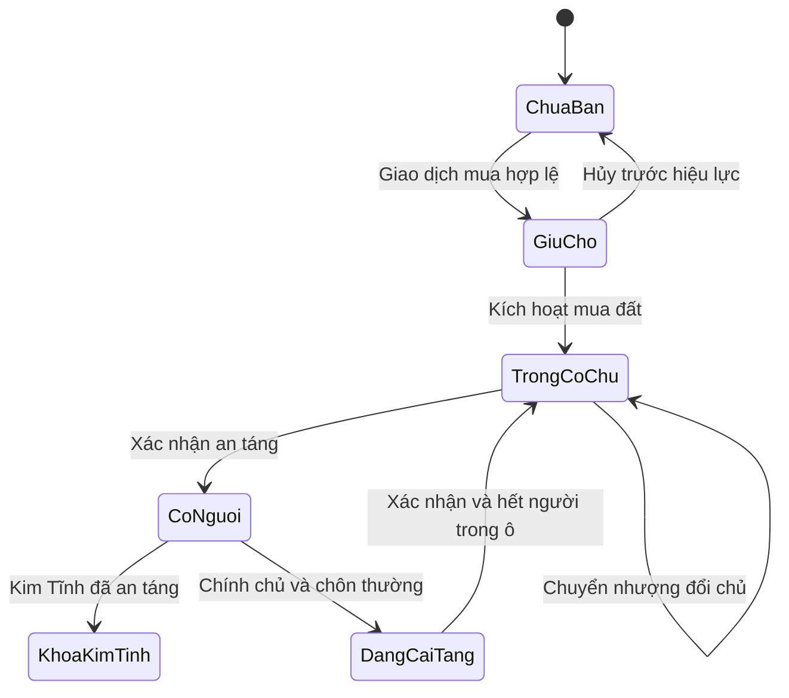
```mermaid
stateDiagram-v2
    direction TB
    [*] --> ChuaBan
    ChuaBan --> GiuCho: Giao dịch mua hợp lệ
    GiuCho --> ChuaBan: Hủy trước hiệu lực
    GiuCho --> TrongCoChu: Kích hoạt mua đất
    TrongCoChu --> CoNguoi: Xác nhận an táng
    CoNguoi --> KhoaKimTinh: Kim Tĩnh đã an táng
    CoNguoi --> DangCaiTang: Chính chủ và chôn thường
    DangCaiTang --> TrongCoChu: Xác nhận và hết người trong ô
    TrongCoChu --> TrongCoChu: Chuyển nhượng đổi chủ
```

Sơ đồ thể hiện quyền sử dụng và an táng; không hiển thị hết tiến độ xây dựng và trường hợp ô nhiều slot để tránh nhầm hai chiều. `KhoaKimTinh` là trạng thái khái niệm minh họa cờ khóa, không là giá trị mới để ghi vào `plots.status`.

### 5.4 Hợp đồng và phụ lục

`DRAFT → PENDING_SIGN → ACTIVE`; hủy trước ACTIVE được mô tả rõ. Gia hạn/bổ sung tạo phụ lục mới, không reset HĐ cũ về nháp hoặc ghi đè bản đã ký. Hủy một phụ lục không tự hủy HĐ cha. `TRANSFERRED` dùng cho căn cứ quyền cũ khi chuyển nhượng hợp lệ; không áp đại trà lên mọi HĐ lịch sử của ô.

“Sắp hết hạn” được dẫn xuất từ ngày hết hạn và ngưỡng cảnh báo cấu hình. “Hết hạn” phải làm mất khả năng dùng phụ lục cho công việc mới ngoài hạn dù enum chưa có EXPIRED; cách lưu cần chốt, không tự viết giá trị vi phạm CHECK. `COMPLETED` và “hết hạn” không đồng nghĩa: một việc có thể xong sớm trước hạn. Hủy HĐ/PL đã ACTIVE, hoàn tiền, đảo nghiệp vụ đã làm là C14, chưa có UC đầy đủ.

### 5.5 Thi công, chăm sóc và xác nhận

Task `TODO → DOING → DONE`, lệnh `PENDING → IN_PROGRESS → COMPLETED`; quá hạn phải căn cứ deadline và chưa hoàn tất, không tùy ý làm mất trạng thái thực hiện. Ca `SCHEDULED → ASSIGNED → IN_PROGRESS → CLOSED`; quá hạn không đồng nghĩa đã hủy. Sơ đồ là đường đi chuẩn; việc sửa/reopen sau đóng cần quy trình có lịch sử, không generic update tùy ý. Hệ thống phải kiểm tra khi xác nhận chứ không chỉ khi mở hồ sơ.

<a id="quy-tac"></a>
## 6 Quy tắc bất biến và tính toán

| Mã | Quy tắc hợp nhất | Căn cứ |
|---|---|---|
| NV01 | Mỗi ô, khách, người mất, HĐ/PL, chứng từ có định danh phù hợp; trùng tên người không đồng nghĩa trùng hồ sơ. | UC-1/2/3/6, L4 |
| NV02 | Không giữ/gán cùng ô hoặc slot cho hai giao dịch xung đột; kiểm tra lại trước ghi. | Lab2 cũ UC-1.3; hoạt động mua đất |
| NV03 | Mua đất không bắt có người mất, hỏa táng không bắt có ô nghĩa trang. | UC-3.1, AD02/AD04 |
| NV04 | Chôn phải có phụ lục an táng và chứng tử hợp lệ; lưu hồ sơ chờ giấy không cho vượt điều kiện này. | UC-2.2/3.4 |
| NV05 | Scan đã ký hợp lệ mới được ACTIVE; in PDF/lưu form/upload lỗi không đủ. | UC-3/3.3 |
| NV06 | Gia hạn/dịch vụ thêm dùng PL; một giao dịch không tạo nhiều HĐ chính. Giao dịch chuyển nhượng/cải táng mới vẫn có HĐ riêng đúng loại. | UC-3/3.1/3.4 |
| NV07 | Hiệu lực giấy tờ và hoàn tất ngoài thực địa là các sự kiện riêng. | UC-1.3, AD01; hợp nhất với các sơ đồ rút gọn |
| NV08 | Cải táng do chính chủ, chôn thường; xong vẫn giữ chủ. | UC-1.3/3.1 |
| NV09 | Chuyển nhượng chỉ ô trống, không Kim Tĩnh, người bán đúng chủ, người mua khác. | UC-3.1; AD05; SQL |
| NV10 | Kim Tĩnh đã an táng không được mở khóa/bóc dỡ/cải táng/chuyển nhượng/can thiệp bị cấm, kể cả ADMIN. Chăm sóc không tác động kết cấu được phân biệt riêng. | UC-1.3/3.4; C05 |
| NV11 | Ô nhiều slot phải kiểm tra mọi slot trước gọi ô trống; giải phóng một slot không xóa người ở slot khác. | L4 plot_slots; hợp nhất |
| NV12 | Mọi công việc có căn cứ, đúng ô, đúng phạm vi và thời hạn; phụ lục nháp/hủy/chưa hiệu lực không cấp quyền làm việc. | UC-3.5/4/5 |
| NV13 | Quản trang điều phối/xác nhận; người/tổ/ngoài làm có thể khác, không bắt account cho người ngoài. | UC-4.2; U |
| NV14 | Một đầu mối chính mỗi hạng mục tại một thời điểm theo UC; đổi phân công phải giữ khả năng truy vết. | UC-4.2, audit |
| NV15 | Không phân công chăm sóc khi xung đột chưa giải quyết. Thi công có cảnh báo để cân nhắc/điều chỉnh; không tự suy ra quyền override. | UC-4.2/5.3 |
| NV16 | Không có hai lịch cùng ô cùng kỳ chăm sóc; đổi ngày không được biến thành kỳ mới để lách trùng. | UC-5.2; hợp nhất |
| NV17 | Hoàn tất cần việc bắt buộc và bằng chứng hợp lệ; ảnh phải đúng ô/task/ca/thời gian. Không lấy upload pending làm bằng chứng. | UC-4.3/4.4/5.4 |
| NV18 | Tiến độ 0..100, được điều chỉnh khi có căn cứ, không 100% nếu thiếu hạng mục bắt buộc. | UC-4.4 |
| NV19 | Không tự gia hạn phụ lục khi quá hạn; cần văn bản hợp lệ. | UC-4.5 |
| NV20 | Giá/gói/điều khoản thay đổi không hồi tố hồ sơ đã chốt; có hiệu lực theo thời gian. | UC-8.4–8.6 |
| NV21 | Một khoản được thu nhiều lần; mỗi lần giữ lịch sử; ghi tiền/số dư phải nguyên tử. | UC-6.2 |
| NV22 | Chiết khấu có lý do, căn cứ duyệt, người thực hiện, đúng trần; không giảm khi đã đủ hoặc làm âm. | UC-6.4 |
| NV23 | Chứng từ có số duy nhất và khớp giao dịch; retry PDF không thu lại tiền. | UC-6.3; hợp nhất |
| NV24 | Doanh thu lấy thực thu; export cùng phạm vi/filter; không rò quyền qua file. | UC-7 |
| NV25 | Thân nhân public không phải user nội bộ; dữ liệu nhạy cảm không public. | UC-1 BR4; U |
| NV26 | Nội dung/ảnh chăm sóc cho thân nhân xem là đầu ra nghiệp vụ; phải tách bản public và evidence nội bộ khi cần. | AD08; TT09; C09 |
| NV27 | Khóa account/thu hồi role phải có hiệu lực với phiên; không lưu password rõ. | UC-8.1–8.3 |
| NV28 | Audit chỉ đọc qua UC này, chứa người/thời điểm/đối tượng/thay đổi; không chứa mật khẩu/token/thẻ. | UC-8.7 |

### 6.1 Công thức tài chính

Đặt `G` = khoản gốc, `D` = giảm trừ, `F` = phải trả sau giảm, `P` = tổng các payment hợp lệ:

- `F = G − D`, với `G ≥ 0`, `0 ≤ D ≤ G`; riêng tạo khoản UC-6.1 yêu cầu số tiền dương.
- `P = Σ paid_amount`; mỗi payment mới có tiền dương và chỉ cộng một lần.
- Dư nợ hiển thị `max(F − P, 0)`; tiền thừa nếu nghiệp vụ được cho phép là `max(P − F, 0)`, không xóa phần thừa bằng làm tròn/clamp.
- `UNPAID` khi chưa thu và còn phải thu; `PARTIALLY_PAID` khi `0 < P < F`; `PAID` khi đã đủ theo policy. Trường hợp giảm hết về 0 cần quyết định cập nhật trạng thái rõ, không phụ thuộc chờ một payment 0 không hợp lệ.
- Giảm tiền cố định: giá trị áp dụng là số tiền được phê duyệt. Giảm phần trăm: cần xác định cơ sở tính G hay dư nợ, thứ tự và làm tròn trước triển khai; L2/L4 chưa mô tả đầy đủ cơ sở này. Không tự chọn rồi tuyên bố là quy tắc gốc.
- SQL dùng DECIMAL; sơ đồ lớp có Float là giản lược không phù hợp làm nguồn quyết định số học tiền. Quy tắc làm tròn tiền cụ thể cần được chốt và áp thống nhất trên giao dịch/chứng từ/báo cáo.

### 6.2 Báo cáo không đếm nhầm

Doanh thu thực thu, giá trị HĐ và công nợ là ba chỉ số khác nhau. Báo cáo HĐ/PL phải tránh join làm nhân đôi tổng; doanh thu hỏa táng không có khu vẫn nằm trong tổng, có thể nhóm “không gắn khu”. Tỷ lệ ô có người, tỷ lệ slot có người và tỷ lệ ô đã bán dùng ba mẫu số/ý nghĩa riêng. Kim Tĩnh là thuộc tính có thể giao với trạng thái nên không cộng các nhóm chồng nhau thành tổng mộ. Mẫu số bằng 0 phải xử lý rõ. [UC-7; HỢP NHẤT]

<a id="du-lieu-nghiep-vu"></a>
## 7 Dữ liệu, chứng từ và yêu cầu chất lượng

### 7.1 Bàn giao giữa các phân hệ

| Sự kiện | Dữ liệu đầu vào | Đầu ra/bên nhận |
|---|---|---|
| HĐ mua ACTIVE | Khách, ô, giá/mẫu đã chốt, bản ký | Quyền sử dụng, ô có chủ, nghĩa vụ cho Kế toán, audit |
| PL an táng ACTIVE | Căn cứ chủ quyền, người mất/chứng tử, slot, kiểu chôn, lịch, bản ký | Kế hoạch hiện trường cho Quản trang; chưa phải hạ huyệt xong |
| PL thi công ACTIVE | Nội dung/cam kết/hạn/ô/bản ký | Lệnh/checklist, phân công |
| PL chăm sóc ACTIVE | Gói, nội dung, giá đã chốt, phạm vi, hiệu lực | Lịch theo kỳ cho Quản trang, nghĩa vụ phí theo thỏa thuận |
| HĐ cải táng ACTIVE | Chính chủ, người đang an táng, ô/huyệt, bản ký | Lệnh hiện trường; chưa giải phóng slot |
| Xác nhận an táng/cải táng | Căn cứ còn hợp lệ, ngày thực tế, người xác nhận, bằng chứng | Lịch sử BURIED/EXHUMED, slot/plot đúng thực tế, audit |
| Task/lệnh cập nhật | Checklist, nghiệm thu, tiến độ, hạn | Người theo dõi đúng quyền; không toàn bộ pháp lý/tài chính |
| Ca CLOSED | Việc bắt buộc, ảnh, thời gian, người xác nhận | Lịch sử chăm sóc và kết quả public phù hợp, thông báo theo kênh |
| Payment ghi thành công | Khoản thu, tiền/ngày/phương thức/tham chiếu, kế toán | Dư nợ, trạng thái, chứng từ và doanh thu thực thu |
| Role/account thay đổi | Quyền được phép thay, người thực hiện, lý do nếu yêu cầu | Phiên/quyền cập nhật nhất quán, audit |

### 7.2 Loại chứng từ và quyền nội dung

Giấy báo tử gắn hồ sơ người mất; bản HĐ/PL ký gắn đúng mã và phiên bản; ảnh/video gắn việc, ô và thời gian; biên lai gắn payment; export gắn loại báo cáo/filter/actor. Quyền đọc file phải theo nghiệp vụ gốc, không theo việc đoán được URL/file ID hoặc có quyền đăng nhập. Người upload không mặc nhiên là người duy nhất được đọc; actor có trách nhiệm tương ứng được truy cập đúng phạm vi.

Không ghi đè bản ký. Thay thế nhầm file phải giữ phiên bản/lý do/audit. Kiểm tra MIME/dung lượng không chứng minh đủ chữ ký; phải có bước xác nhận nội dung của người có quyền. Không dùng đường dẫn tùy ý làm bằng chứng được tin cậy. File chưa lưu thành công không được kích hoạt hoặc nghiệm thu. Ngày ký giấy, ngày hiệu lực, ngày thực hiện, ngày upload và thời gian server ghi nhận có thể khác nhau.

### 7.3 NFR được bảo toàn

- Phân quyền/RBAC và dữ liệu nhạy cảm nhất quán cho mọi cách truy cập; không chỉ trên một giao diện. Thu hồi phiên khi account/role bị thu hồi.
- Giao dịch tài chính, giữ chỗ, kích hoạt quyền, chuyển chủ và cập nhật trạng thái liên quan phải toàn vẹn; tránh nửa thành công, ghi đè cạnh tranh, trùng do gửi lại.
- Tra cứu nhanh khi dữ liệu lớn; báo cáo lớn có phân trang/xử lý ngầm. **UC-7.2 nêu dưới 2 giây** cho tổng hợp lấp đầy; điều kiện đo tải chưa được nêu, cần xác định dữ liệu/môi trường trước tuyên bố đạt.
- GPS có độ chính xác/phạm vi hợp lý; gọi dịch vụ ngoài có timeout/xử lý lỗi, không làm treo ứng dụng.
- Tệp bảo mật, nguyên vẹn, giữ lịch sử; ảnh/video nén hợp lý, hỗ trợ retry và mạng yếu; tệp ký không làm mất nội dung pháp lý do nén.
- Ngoài hiện trường dễ thao tác trên di động; mất mạng có trạng thái lưu tạm rõ và đồng bộ an toàn. Server vẫn quyết định quyền/trạng thái khi gửi lại, không tuyên bố hoàn tất chỉ từ local draft.
- Tiếng Việt và bảng biểu trong PDF/Excel không lỗi font/vỡ định dạng; số tiền bằng chữ khớp số; dữ liệu xuất đúng phạm vi, bộ lọc và thời điểm phù hợp.
- Mẫu/gói/giá có version/hiệu lực, audit thay đổi; log không chứa bí mật, chỉ đọc trong chức năng kiểm tra.

### 7.4 Các ràng buộc công nghệ từ chủ dự án

FastAPI backend; web và Flutter dùng chung API; SQL Server hiện hữu trên `DESKTOP-HKIPI1M`; MinIO và dữ liệu phát sinh do dự án quản lý đặt trong thư mục riêng dưới backend trên ổ dữ liệu đã chọn; Git quản lý các mốc thực thi. Đây là ràng buộc triển khai được người dùng yêu cầu, không thay quy tắc nghiệp vụ. Tài liệu này không yêu cầu agent xây lại DB đã có hoặc cài một bộ công cụ/UI mới.

<a id="can-chot"></a>
## 8 Mâu thuẫn nguồn và các quyết định cần chốt

Mục này phải được đọc **trước** khi dùng phần chuyển nguyên nội dung nguồn. “Đã hợp nhất” nghĩa là có căn cứ chọn cách đọc; “Cần chốt” nghĩa là chưa có chính sách đầy đủ, không được biến đề xuất trong plan cũ thành sự thật.

| Mã | Khác biệt/khoảng thiếu | Cách đọc và giới hạn |
|---|---|---|
| C01 | Lab1 thể hiện Sếp duyệt/khách xác nhận; L2 hiện tại đặc tả ký ngoài hệ thống | **Đã hợp nhất:** in → ký giấy → scan/xác nhận → ACTIVE. Khách không account; không tự diễn giải các bước duyệt/xác nhận ban đầu thành workflow ký số/phê duyệt online. |
| C02 | Lab1/UC-8.4 liệt kê ba loại; UC-3.1, L3/L4/SQL có bốn | **Đã hợp nhất:** bốn loại gồm TRANSFER. Ba kiểu phụ lục không là hợp đồng chính thứ năm. |
| C03 | Lab2 42 UC cũ → 39 hiện tại, trùng mã nhưng khác nghĩa | Dùng mapping mục 1.2. Giữ đặt chỗ/GPS/thanh toán ngoài hệ thống như bước trong luồng, không xóa nghiệp vụ theo việc bỏ mã UC. |
| C04 | AD07/TT08 gộp xây xong với đã chôn; AD01/UC-1.3 có bước hạ huyệt thực tế | **Hợp nhất:** nghiệm thu xây dựng và xác nhận an táng riêng. Chỉ trường hợp có chứng cứ xác nhận sự kiện an táng thật mới cập nhật OCCUPIED/khóa. |
| C05 | L2 gán cờ Kim Tĩnh khi chọn PL; khóa sau chôn; câu “mọi thay đổi” quá rộng, ô có thể nhiều slot | Khóa vĩnh viễn sau an táng là yêu cầu rõ. **Cần chốt** việc hủy lựa chọn trước ký, phạm vi khóa ô nhiều slot và hiệu chỉnh GPS/mô tả sai. Đề xuất lưu lựa chọn ở PL nháp, xác lập chính thức theo căn cứ rồi khóa sau hạ huyệt; không tự mở khóa. Chăm sóc vệ sinh khác can thiệp kết cấu. |
| C06 | UC-3.4 đòi HĐ mua ACTIVE nhưng sau chuyển nhượng HĐ mua cũ TRANSFERRED | Quyền chủ mới phải có giá trị. **Cần chốt** liên kết căn cứ cho PL về sau; không bắt chủ mới mua lại hoặc giả mạo ACTIVE của HĐ chủ cũ. |
| C07 | Chuyển chủ khi gói care/lệnh/công nợ còn mở chưa được đặc tả | Không tự chuyển nợ/quyền lợi sang người mua. **Cần chốt** ai chịu nghĩa vụ còn lại, xử lý PL, lịch và bàn giao; đề xuất chặn hoàn tất chuyển tới khi có cách xử lý ghi nhận. |
| C08 | UC-5.2 có ngày/tuần/tháng/quý; UC-8.5 và SQL chỉ tháng/quý/năm | Giữ cả yêu cầu nguồn, không nói SQL đã đủ. **Cần chốt** tập chu kỳ hỗ trợ và migration; calendar view ngày/tuần không thay cho recurrence. |
| C09 | AD08 tự đưa ảnh lên public; L2 cấm dữ liệu riêng tư; chưa có publication model | Phải có đầu ra public, nhưng chỉ bản đủ điều kiện công khai. **Cần chốt** ai xác nhận ảnh, tiêu chí/thu hồi; đề xuất tự đồng bộ sau CLOSED khi bản public đạt, giữ ảnh gốc kín. |
| C10 | `care_annexes.cycle_months` mô tả 12/24 tháng, package lại có cycle_type | **Cần chốt** thời hạn đăng ký, kỳ thực hiện và kỳ thu có khác nhau không. Không mặc định cycle_months là khoảng cách giữa mọi lần chăm sóc; không làm gói tháng bị sinh lịch một lần/năm. |
| C11 | UC-6.2 cho xác nhận thu vượt; chưa có credit/refund/đối soát tiền thừa | **Cần chốt** cách lưu/xử lý tiền thừa và thẩm quyền. Có thể tạm chặn có lý do nhưng phải ghi nhánh chưa hoàn thiện, không sửa nghĩa gốc thành cấm tuyệt đối. |
| C12 | Chiết khấu có trần/duyệt nhưng chưa có con số, người duyệt, cơ sở tính % | **Cần chốt** policy, cơ sở tính, làm tròn và chứng cứ duyệt. Không tự đặt 10%, 20%, chọn ADMIN ngẫu nhiên hoặc nhận tên người duyệt từ text như đã duyệt. |
| C13 | L2 nói khoản theo HĐ hoặc khách; SQL bắt ít nhất HĐ/PL, cho phép cả hai | Đặc tả nguồn chưa thống nhất mô hình khoản không HĐ. Đề xuất một nguồn nghĩa vụ rõ, customer là bên nộp; XOR là **đề xuất**, không phải CHECK đã có. |
| C14 | Hủy/hoàn/đảo sau ACTIVE, sửa payment, reopen ca chưa đủ luồng | **Cần chốt** trường hợp được phép, người duyệt, lịch sử và tác động số dư/owner/file. Không triển khai bằng DELETE/payment âm hoặc PATCH mọi status. |
| C15 | UC-1.4 và AD10 trộn tên thân nhân/CCCD trong tra cứu public | BR public và U được ưu tiên. Public chỉ trường/tiêu chí đã cho công khai; CCCD/thông tin thân nhân sống giữ trong nội bộ đúng quyền. Tập trường public chi tiết cần policy. |
| C16 | Sếp “quản trị toàn diện” nhưng actor từng UC giao thao tác cho nhân viên | Mặc định cấp theo chức trách; theo dõi không đồng nghĩa thực hiện thay. Kiêm nhiệm cần quyền rõ; không cho ADMIN vượt invariants. |
| C17 | L4 care chỉ caretaker_id, thi công có chuỗi nhà thầu; U yêu cầu nhiều quản trang/ngoài | Bốn trách nhiệm mục 3.3 là điều phải biểu diễn. Cách thêm danh bạ/lịch sử là thiết kế triển khai, không giả định 37 bảng gốc đã có. |
| C18 | UC-5 BR chỉ bắt việc bắt buộc, sơ đồ nói 100% checklist; L4 thiếu required | Lấy điều kiện tất cả mục **bắt buộc** + bằng chứng. Nếu chưa có phân loại, không tự gọi mục nào optional; phải chốt template. Ngưỡng/số góc ảnh cụ thể chưa định lượng. |
| C19 | L3 order 0..1 cho construction annex, L4/SQL không UNIQUE annex_id | Phải phân biệt quan hệ ý định và ràng buộc vật lý. **Cần chốt** mỗi phụ lục có một hay nhiều lệnh; không khẳng định SQL đã ép 1–1. |
| C20 | Hỏa táng có lịch chuyển lò nhưng chưa có UC hoàn tất, actor nội bộ và state thực hiện riêng | Giữ bàn giao; **cần chốt** xác nhận hoàn tất, bằng chứng và quyền nếu phát triển. ACTIVE không phải đã thiêu. |
| C21 | UC-8.4 quản lý loại/mẫu HĐ, SQL chỉ có discriminator bốn loại và chưa có bảng mẫu/version | Giữ chức năng cấu hình theo UC, nhưng **cần chốt** cách quản lý mẫu/phiên bản/điều khoản và phạm vi thay đổi. Đổi tên hoặc mẫu không tự tạo loại giao dịch mới hay sửa nội dung đã ký. |
| C22 | Slot–người mất mô tả 0..1–0..1, SQL không UNIQUE current_deceased_id | Ý định nghiệp vụ một vị trí hiện tại; SQL còn thiếu ràng buộc. Cần bổ sung đúng cách khi triển khai, không vì FK cho phép mà gán một người đồng thời nhiều slot. |
| C23 | L3 Float cho tiền, SQL DECIMAL; SQL source thiếu nhiều công thức | Dùng số thập phân chính xác theo yêu cầu tiền. Cơ chế làm tròn cần policy; không lấy Float sơ đồ làm kiểu tiền chuẩn. |
| C24 | SQL default is_verified=1 và verified_at tự có; UC đòi giấy hợp lệ | Default không chứng minh ai đã kiểm tra giấy. Cần workflow/record kiểm tra thực; dữ liệu legacy phải được đối soát, không tự nâng độ tin cậy. |
| C25 | L4 customers thiếu ngày sinh; deceased chỉ DATE nhưng UC nói năm sinh | Giữ yêu cầu độ chính xác, không bịa ngày 01/01. Cách lưu year-only/unknown và trường khách là khoảng thiếu schema. |
| C26 | TTL giữ chỗ, ngưỡng sắp hạn, phí/trần, lịch nghỉ, hạn file chưa định lượng | Cấu hình có căn cứ; không biến giá trị ví dụ trong plan thành quy định của nghĩa trang. |
| C27 | L4 users mô tả quan hệ với receivables nhưng không có user FK tương ứng | Quan hệ người tạo khoản thu là nhu cầu truy vết nhưng chưa được model gốc lưu trực tiếp. Ghi thêm khi thiết kế; không khai FK không tồn tại. |
| C28 | Sắp/hết hạn PL không có enum EXPIRED; tài chính thiếu nhánh giảm về 0 và SQL trigger chỉ INSERT payment | Cần đọc trạng thái dẫn xuất/cập nhật theo sự kiện thực; không chờ trigger không chạy hoặc ghi enum không hợp lệ. |

Những khoảng thiếu này không ngăn việc đọc hiểu luồng đã rõ. Agent có thể triển khai phần độc lập, nhưng phải đánh dấu phần phụ thuộc là chưa chốt, trình phương án có tác động cụ thể và giữ nguyên dữ liệu hiện hữu.


<a id="dac-ta-uc"></a>
## 9 Đặc tả đầy đủ các use case

Phần này chuyển **đủ nội dung 47 bảng đặc tả L2 hiện tại: 8 UC cha, 39 UC con**, gồm mô tả, actor, tiền/hậu điều kiện, luồng chính, luồng thay thế/ngoại lệ, BR và NFR được nêu. Tên nhãn được Việt hóa; nội dung bên dưới được giữ theo nguồn, kể cả thuật ngữ chưa đồng nhất. Mỗi ghi chú “Đọc kèm” là phần tổng hợp, không phải nguyên văn UC. Mâu thuẫn áp dụng theo mục 8; không dùng một câu trong phần nguồn để bỏ qua làm rõ của chủ dự án.

### 9.1 Chỉ mục các chức năng


| Mã | Tên chức năng | Actor trong đặc tả |
| --- | --- | --- |
| [UC-1.1](#uc-1-1) | Quản lý khu/hàng/ô | Sếp |
| [UC-1.2](#uc-1-2) | Quản lý loại mộ & số slot | Sếp |
| [UC-1.3](#uc-1-3) | Cập nhật trạng thái mộ | Quản trang |
| [UC-1.4](#uc-1-4) | Tra cứu tình trạng mộ | Sếp, Nhân viên Marketing, Quản trang, Khách hàng/Thân nhân |
| [UC-1.5](#uc-1-5) | Dẫn đường tới mộ | Khách hàng/Thân nhân, Quản trang, Dịch vụ bản đồ/GPS |
| [UC-2.1](#uc-2-1) | Quản lý thông tin khách hàng/thân nhân | Nhân viên Marketing |
| [UC-2.2](#uc-2-2) | Quản lý hồ sơ người mất | Nhân viên Marketing |
| [UC-2.3](#uc-2-3) | Liên kết khách hàng – người mất – mộ | Nhân viên Marketing |
| [UC-2.4](#uc-2-4) | Tra cứu hồ sơ | Nhân viên Marketing |
| [UC-3.1](#uc-3-1) | Lập hợp đồng | Nhân viên Marketing |
| [UC-3.2](#uc-3-2) | In hợp đồng/phụ lục | Nhân viên Marketing |
| [UC-3.3](#uc-3-3) | Đính kèm hợp đồng/phụ lục đã ký | Nhân viên Marketing |
| [UC-3.4](#uc-3-4) | Lập phụ lục hợp đồng | Nhân viên Marketing |
| [UC-3.5 ](#uc-3-5) | Theo dõi trạng thái, thời hạn phụ lục | Sếp, Nhân viên Marketing |
| [UC-4.1](#uc-4-1) | Lập checklist thi công | Quản trang |
| [UC-4.2](#uc-4-2) | Phân công | Quản trang |
| [UC-4.3](#uc-4-3) | Cập nhật checklist | Quản trang |
| [UC-4.4](#uc-4-4) | Cập nhật tiến độ | Quản trang |
| [UC-4.5](#uc-4-5) | Theo dõi thời hạn phụ lục | Quản trang |
| [UC-5.1](#uc-5-1) | Đăng ký gói chăm sóc | Nhân viên Marketing |
| [UC-5.2](#uc-5-2) | Lập lịch chăm sóc | Quản trang |
| [UC-5.3](#uc-5-3) | Phân công | Quản trang |
| [UC-5.4](#uc-5-4) | Xác nhận thực hiện checklist | Quản trang |
| [UC-6.1](#uc-6-1) | Tạo khoản phải thu | Kế toán |
| [UC-6.2](#uc-6-2) | Ghi nhận thanh toán | Kế toán |
| [UC-6.3](#uc-6-3) | Xuất hóa đơn/biên lai | Kế toán |
| [UC-6.4](#uc-6-4) | Áp chiết khấu | Kế toán |
| [UC-7.1](#uc-7-1) | Báo cáo doanh thu | Sếp, Kế toán |
| [UC-7.2](#uc-7-2) | Thống kê phần mộ theo khu/trạng thái | Sếp |
| [UC-7.3](#uc-7-3) | Thống kê hợp đồng | Sếp |
| [UC-7.4](#uc-7-4) | Thống kê thi công/chăm sóc | Sếp |
| [UC-7.5](#uc-7-5) | Xuất file | Sếp, Kế toán |
| [UC-8.1](#uc-8-1) | Đăng nhập hệ thống | Sếp, Nhân viên Marketing, Kế toán, Quản trang |
| [UC-8.2](#uc-8-2) | Quản lý tài khoản | Sếp |
| [UC-8.3](#uc-8-3) | Phân quyền | Sếp |
| [UC-8.4](#uc-8-4) | Quản lý loại hợp đồng | Sếp |
| [UC-8.5](#uc-8-5) | Quản lý gói dịch vụ | Sếp |
| [UC-8.6](#uc-8-6) | Quản lý bảng giá | Sếp |
| [UC-8.7](#uc-8-7) | Kiểm tra Audit Log | Sếp |


<a id="uc-1"></a>
### UC-1 — Quản lý mộ & bản đồ


**Nguồn:** L2, bảng đặc tả UC-1 (UC cha).


> **Đọc kèm:** Actor của UC cha không có nghĩa tất cả actor được làm mọi UC con. Public chỉ dữ liệu được công bố; xem C15.


**Mô tả**

Quản lý cấu trúc khu/hàng/ô, loại mộ và slot, tình trạng sử dụng mộ, tọa độ GPS thực địa, tra cứu và dẫn đường.


**Actor**

Sếp; Nhân viên Marketing; Quản trang; Khách hàng/Thân nhân; Dịch vụ bản đồ GPS.


**Tiền điều kiện**

1. Actor nội bộ đã đăng nhập và có quyền chức năng tương ứng.
2. Dữ liệu nền về khu/hàng/ô và loại mộ đã được cấu hình.
3. Với chức năng public, Khách hàng/Thân nhân không cần đăng nhập nhưng chỉ được truy cập dữ liệu công khai.


**Hậu điều kiện**

1. Dữ liệu mộ, vị trí và tình trạng được lưu/cập nhật nhất quán.
2. Thông tin hợp lệ có thể được tra cứu và dùng cho dẫn đường.
3. Lịch sử thay đổi được lưu vết.


**Luồng chính**

1. Actor chọn nghiệp vụ quản lý/tra cứu mộ phù hợp.
2. Hệ thống truy xuất dữ liệu theo phạm vi quyền.
3. Actor thực hiện thao tác cập nhật hoặc tra cứu.
4. Hệ thống kiểm tra business rule và lưu/hiển thị kết quả.
5. Với dẫn đường, hệ thống chuyển tọa độ hợp lệ sang dịch vụ bản đồ/GPS.


**Luồng thay thế / ngoại lệ**

A1. Mộ chưa có tọa độ → không cho dẫn đường và hiển thị hướng dẫn.A2. Dữ liệu cập nhật không hợp lệ → từ chối lưu.
A3. Dịch vụ bản đồ ngoài hệ thống lỗi/timeout → thông báo rõ ràng, không làm treo ứng dụng.


**Quy tắc nghiệp vụ**

BR1. Mỗi ô mộ có định danh duy nhất.
BR2. Trạng thái khai thác mộ và trạng thái thi công phải tuân thủ chuyển trạng thái hợp lệ.
BR3. “Kim Tĩnh” là thuộc tính/kết cấu của mộ, không phải một bước trong vòng đời trạng thái.
BR4. Dữ liệu public không được chứa thông tin hợp đồng, CCCD hoặc dữ liệu riêng tư khác.


**Yêu cầu phi chức năng**

NFR1. Tra cứu phải phản hồi nhanh và ổn định với dữ liệu lớn.
NFR2. GPS phải được lưu đủ độ chính xác và kiểm tra phạm vi hợp lý.
NFR3. Chức năng mobile ngoài thực địa phải dễ thao tác.


<a id="uc-1-1"></a>
#### UC-1.1 — Quản lý khu/hàng/ô


**Nguồn:** L2, bảng đặc tả UC-1.1.


**Mô tả**

Cho phép Sếp/Ban quản trị thiết lập, cấu hình cấu trúc vật lý của nghĩa trang gồm Khu, Hàng, Ô mộ; đồng thời nhập thủ công tọa độ địa lý (GPS: Latitude, Longitude) cho từng ô mộ phục vụ cho bản đồ số và dẫn đường.


**Actor**

Sếp


**Tiền điều kiện**

1. Sếp đã đăng nhập vào hệ thống với quyền Quản trị dữ liệu nền.
2. Bản đồ quy hoạch tổng thể mặt bằng của nghĩa trang đã có sẵn.


**Hậu điều kiện**

1. Dữ liệu khu, hàng, ô mộ và tọa độ GPS của từng ô được lưu trữ thành công.
2. Các ô mộ sẵn sàng để hiển thị trên bản đồ số và phục vụ cho nghiệp vụ lập hợp đồng mua bán, dẫn đường.


**Luồng chính**

1. Sếp truy cập chức năng "Quản lý khu/hàng/ô".
2. Hệ thống hiển thị danh sách cây phân cấp cấu trúc mặt bằng hiện có.
3. Sếp chọn thao tác: Thêm mới hoặc Cập nhật thông tin Khu/Hàng/Ô.
4. Khi thao tác trên từng Ô mộ, Sếp nhập: Mã định danh ô, loại ô, kích thước, và nhập thủ công giá trị tọa độ GPS (Vĩ độ - Latitude và Kinh độ - Longitude).
5. Hệ thống kiểm tra tính hợp lệ của định dạng tọa độ và ranh giới địa lý.
6. Sếp xác nhận lưu cấu hình.
7. Hệ thống lưu trữ dữ liệu vào CSDL và đồng bộ lên bản đồ nội bộ.


**Luồng thay thế / ngoại lệ**

4a. Định dạng tọa độ GPS không hợp lệ: Hệ thống báo lỗi định dạng (phải là số thực, nằm trong phạm vi tọa độ cho phép).
4b. Tọa độ nằm ngoài phạm vi ranh giới nghĩa trang: Hệ thống cảnh báo cảnh giác và yêu cầu kiểm tra lại trước khi lưu.
5a. Ô mộ đang có hợp đồng hoạt động: Hệ thống không cho phép xóa ô mộ, chỉ cho phép chỉnh sửa thông tin mô tả hoặc tọa độ.


**Quy tắc nghiệp vụ**

BR1: Mỗi ô mộ có một mã định danh duy nhất toàn hệ thống.
BR2: Nhập tọa độ GPS là thao tác nhập tay trực tiếp trên biểu mẫu ô mộ.


**Yêu cầu phi chức năng:** Bảng UC này không nêu mục NFR riêng; áp dụng NFR của UC cha và mục 7, không tự đặt thêm số đo làm yêu cầu gốc.


<a id="uc-1-2"></a>
#### UC-1.2 — Quản lý loại mộ & số slot


**Nguồn:** L2, bảng đặc tả UC-1.2.


**Mô tả**

Cấu hình các loại mộ và số slot tối đa, cùng các thông số kỹ thuật để sử dụng khi cấu hình ô mộ và lập hợp đồng.


**Actor**

Sếp


**Tiền điều kiện**

1. Sếp đã đăng nhập thành công vào hệ thống.
2. Sếp có quyền cấu hình danh mục dữ liệu nền.


**Hậu điều kiện**

1. Thông tin loại mộ và số slot được lưu trữ thành công vào hệ thống.
2. Dữ liệu sẵn sàng để sử dụng cho quy trình gán ô mộ và tạo lập hợp đồng/phụ lục.


**Luồng chính**

1. Sếp mở danh sách quản lý loại mộ.
2. Sếp chọn thao tác Thêm, Sửa hoặc Xóa loại mộ.
3. Sếp nhập tên loại mộ, số slot tối đa, kích thước tiêu chuẩn và mô tả kỹ thuật.
4. Hệ thống kiểm tra trùng lặp tên và tính hợp lệ của các thông số kỹ thuật.
5. Hệ thống lưu cấu hình loại mộ mới/cập nhật vào cơ sở dữ liệu.
6. Hệ thống thông báo kết quả thao tác thành công.


**Luồng thay thế / ngoại lệ**

4a. Tên loại mộ đã tồn tại trong hệ thống → hệ thống từ chối lưu và hiển thị thông báo lỗi trùng lặp.
4b. Loại mộ đang được các ô mộ trong hệ thống sử dụng → hệ thống từ chối xóa và cảnh báo ràng buộc dữ liệu.


**Quy tắc nghiệp vụ**

BR1: Số lượng slot tối đa phải là một số nguyên dương (> 0).
BR2: Việc thay đổi cấu hình loại mộ không được làm sai lệch dữ liệu lịch sử của các hợp đồng cũ đã ký kết.


**Yêu cầu phi chức năng**

NFR1: Thông tin cấu hình phải đảm bảo tính nhất quán cao khi được truy xuất và sử dụng đồng thời bởi nhiều người dùng.


<a id="uc-1-3"></a>
#### UC-1.3 — Cập nhật trạng thái mộ


**Nguồn:** L2, bảng đặc tả UC-1.3.


> **Đọc kèm:** Đối chiếu QT03–QT04, C04–C05 và C22. Xác nhận thực địa khác kích hoạt hợp đồng; cải táng là HĐ chính trong phân loại hiện tại.


**Mô tả**

Quản lý và cập nhật tiến trình sử dụng thực tế của phần mộ (Chưa chôn, Đang thi công, Đã chôn, Đã cải táng). Ràng buộc chặt chẽ tính bất biến của mộ "Kim Tĩnh" và quyền sử dụng đất sau cải táng.


**Actor**

Quản trang


**Tiền điều kiện**

1. Ô mộ đã được liên kết với Hợp đồng Mua đất hoặc Phụ lục an táng/cải táng tương ứng.
2. Quản trang đăng nhập thành công vào hệ thống.


**Hậu điều kiện**

1. Trạng thái thực địa của mộ được cập nhật nhất quán.
2. Nếu mộ đã được xác lập là Kim Tĩnh, hệ thống kích hoạt cơ chế khóa vĩnh viễn mọi hành vi thay đổi/bóc dở.


**Luồng chính**

1. Quản trang tìm kiếm và chọn ô mộ cần cập nhật.
2. Hệ thống hiển thị thông tin chi tiết: Chủ sở hữu đất, người mất đang an táng (nếu có), trạng thái hiện tại, và cờ đánh dấu kết cấu mộ (Chôn thường / Kim Tĩnh).
3. Quản trang cập nhật trạng thái thực địa (Ví dụ: Từ Đang thi công huyệt sang Đã chôn cất; hoặc từ Đang bóc mộ sang Đã cải táng hoàn tất).
4. Quản trang nhập ghi chú và đính kèm ảnh chụp hiện trường nghiệm thu.
5. Hệ thống kiểm tra quy tắc vòng đời nghiệp vụ.
6. Hệ thống lưu trạng thái mới và ghi Audit Log.


**Luồng thay thế / ngoại lệ**

5a. Thao tác trên mộ Kim Tĩnh: Nếu ô mộ có thuộc tính isKimTinh = True và đã ở trạng thái "Đã chôn", hệ thống chặn toàn bộ hành động can thiệp, đào xới, cải táng hoặc thay đổi trạng thái, đồng thời xuất cảnh báo: "Mộ Kim Tĩnh đã kiên cố vĩnh viễn, không được phép tác động."
5b. Cải táng trên mộ chôn thông thường: Sau khi Quản trang xác nhận Đã cải táng hoàn tất, hệ thống chuyển ô mộ về trạng thái: "Trống (Có chủ)".


**Quy tắc nghiệp vụ**

BR1 (Vòng đời Kim Tĩnh): Mộ xây kiểu Kim Tĩnh là kết cấu kiên cố vĩnh cửu. Sau khi an táng, vòng đời của ô đất chính thức chấm dứt/đóng băng vĩnh viễn. Tuyệt đối không cho phép tạo hợp đồng cải táng, không cho chuyển nhượng, không cho bóc dỡ.
BR2 (Vòng đời chôn thông thường): Mộ chôn thông thường có thể thực hiện cải táng (thông qua Hợp đồng Cải táng do chính chủ đất ký). Khi cải táng xong, đất trở thành đất trống, nhưng quyền sở hữu đất vẫn thuộc về chủ đất cũ. Chỉ chủ đất đó mới có quyền chôn người khác xuống (kèm Giấy báo tử mới) hoặc thực hiện hợp đồng Chuyển nhượng.


**Yêu cầu phi chức năng**

NFR1: Giao diện phải tối ưu cho thiết bị di động vì Quản trang thao tác ngoài thực địa.
NFR3: Nếu có upload ảnh/media, hệ thống phải hỗ trợ nén, retry và tránh mất dữ liệu khi mạng gián đoạn.
NFR3: Audit log phải ghi rõ ai cập nhật, lúc nào, từ trạng thái nào sang trạng thái nào.


<a id="uc-1-4"></a>
#### UC-1.4 — Tra cứu tình trạng mộ


**Nguồn:** L2, bảng đặc tả UC-1.4.


> **Đọc kèm:** Phân biệt tra cứu nội bộ và public; CCCD/thông tin thân nhân không được lộ ra public. Xem C15.


**Mô tả**

Tìm kiếm và xem vị trí, trạng thái và thông tin liên quan của phần mộ theo tên người mất, mã ô hoặc tên thân nhân.


**Actor**

Sếp, Nhân viên Marketing, Quản trang, Khách hàng/Thân nhân


**Tiền điều kiện**

1. Actor nội bộ đã đăng nhập thành công vào hệ thống.
2. Khách hàng/Thân nhân truy cập đúng trang tra cứu public


**Hậu điều kiện**

Kết quả tìm kiếm phù hợp được hiển thị đầy đủ kèm theo vị trí, tình trạng mộ và thông tin liên quan theo thẩm quyền.


**Luồng chính**

1. Actor nhập từ khóa tìm kiếm: Tên người mất, mã ô hoặc tên thân nhân.
2. Hệ thống thực hiện tìm kiếm và hiển thị danh sách các kết quả trùng khớp.
3. Actor chọn một bản ghi cụ thể từ danh sách kết quả.
4. Hệ thống hiển thị chi tiết thông tin phần mộ, thông tin người mất, trạng thái hiện tại và tọa độ GPS định vị.


**Luồng thay thế / ngoại lệ**

2a. Xuất hiện nhiều kết quả trùng tên người mất/thân nhân → hệ thống cung cấp thêm bộ lọc theo ngày mất, quê quán hoặc thông tin liên quan để thu hẹp kết quả.
2b. Không tìm thấy kết quả phù hợp với từ khóa → hệ thống thông báo không có dữ liệu và gợi ý thay đổi từ khóa tra cứu.


**Quy tắc nghiệp vụ**

BR1: Các thông tin cá nhân mang tính nhạy cảm chỉ được phép hiển thị tương ứng theo đúng phạm vi phân quyền của từng nhóm actor.
BR2: Khuyến khích và ưu tiên sử dụng mã ô mộ hoặc tiêu chí kết hợp nâng cao khi cần phân biệt các trường hợp trùng tên.


**Yêu cầu phi chức năng**

NFR1: Tốc độ tra cứu và trả lời kết quả tìm kiếm phải nhanh chóng ngay cả khi dung lượng cơ sở dữ liệu phần mộ tăng cao.
NFR2: Đảm bảo kiểm soát hiển thị chặt chẽ, tuyệt đối không làm lộ các dữ liệu ngoài phạm vi công khai cho Khách hàng/Thân nhân.


<a id="uc-1-5"></a>
#### UC-1.5 — Dẫn đường tới mộ


**Nguồn:** L2, bảng đặc tả UC-1.5.


**Mô tả**

Mở dịch vụ bản đồ và dẫn người dùng tới tọa độ ô mộ từ vị trí hiện tại.


**Actor**

Khách hàng/Thân nhân, Quản trang, Dịch vụ bản đồ/GPS


**Tiền điều kiện**

1. Ô mộ đã được cấu hình tọa độ GPS hợp lệ trong hệ thống.
2. Thiết bị của người dùng có kết nối mạng Internet và đã bật tính năng định vị vị trí (GPS).


**Hậu điều kiện**

1. Dịch vụ bản đồ được khởi chạy với điểm đến (đích) chính xác là tọa độ ô mộ.
2. Tuyến đường điều hướng từ vị trí hiện tại đến ô mộ được hiển thị thành công (nếu dịch vụ bản đồ hỗ trợ).


**Luồng chính**

1. Actor thực hiện tra cứu và chọn ô mộ cần tìm.
2. Actor chọn tính năng "Dẫn đường tới mộ".
3. Hệ thống truy xuất thông tin tọa độ (latitude/longitude) của ô mộ từ cơ sở dữ liệu.
4. Hệ thống chuyển tiếp tọa độ đích sang ứng dụng/dịch vụ bản đồ/GPS bên ngoài.
5. Dịch vụ bản đồ mở và hiển thị lộ trình dẫn đường từ vị trí hiện tại của actor tới phần mộ.


**Luồng thay thế / ngoại lệ**

3a. Ô mộ chưa có dữ liệu tọa độ GPS → hệ thống hiển thị thông báo phần mộ này chưa được định vị vị trí trên bản đồ.
4a. Thiết bị mất kết nối Internet hoặc chưa bật GPS → hệ thống yêu cầu người dùng kiểm tra kết nối mạng hoặc bật quyền định vị.


**Quy tắc nghiệp vụ**

BR1: Hệ thống tuyệt đối không tự ước đoán tọa độ; chỉ được sử dụng tọa độ GPS thực tế đã được cấu hình và phê duyệt trong hệ thống.
BR2: Khi ứng dụng/dịch vụ bản đồ bên thứ ba gặp sự cố hoặc không khả dụng, hệ thống phải hiển thị thông báo lỗi rõ ràng cho người dùng.


**Yêu cầu phi chức năng**

NFR1: Việc tích hợp và gọi API tới dịch vụ bản đồ/GPS bên ngoài phải thiết lập cơ chế timeout và xử lý ngoại lệ phù hợp để không làm treo ứng dụng.
NFR2: Đảm bảo độ chính xác điều hướng và tương thích tốt trên các trình duyệt/thiết bị di động phổ biến.


<a id="uc-2"></a>
### UC-2 — Quản lý khách hàng & người mất


**Nguồn:** L2, bảng đặc tả UC-2 (UC cha).


**Mô tả**

Quản lý hồ sơ khách hàng/thân nhân, người mất và mối liên kết với mộ.


**Actor**

Nhân viên Marketing


**Tiền điều kiện**

1. Nhân viên Marketing đã đăng nhập thành công vào hệ thống.
2. Nhân viên Marketing có quyền nghiệp vụ tương ứng.


**Hậu điều kiện**

1. Hồ sơ khách hàng, người mất và các liên kết với mộ được lưu trữ chính xác.
2. Dữ liệu sẵn sàng phục vụ cho việc tra cứu và các nghiệp vụ liên quan.


**Luồng chính**

1. Nhân viên Marketing truy cập chức năng quản lý hồ sơ, thực hiện thêm/sửa hoặc tra cứu liên kết theo nhu cầu.
2. Hệ thống kiểm tra tính hợp lệ của dữ liệu và lưu thông tin vào cơ sở dữ liệu.


**Luồng thay thế / ngoại lệ**

2a. Dữ liệu bị trùng lặp hoặc không hợp lệ → hệ thống từ chối cập nhật và hiển thị thông báo lỗi.


**Quy tắc nghiệp vụ**

BR1: Bảo vệ an toàn dữ liệu cá nhân của khách hàng và thân nhân.
BR2: Mối liên kết tham chiếu giữa người mất, thân nhân và vị trí mộ phải đảm bảo tính toàn vẹn.


**Yêu cầu phi chức năng**

NFR1: Tốc độ tìm kiếm và phản hồi nhanh chóng.
NFR2: Đảm bảo tính bảo mật và mã hóa dữ liệu nhạy cảm.


<a id="uc-2-1"></a>
#### UC-2.1 — Quản lý thông tin khách hàng/thân nhân


**Nguồn:** L2, bảng đặc tả UC-2.1.


**Mô tả**

Thêm mới, cập nhật và tìm kiếm thông tin khách hàng/thân nhân là người đại diện ký hợp đồng.


**Actor**

Nhân viên Marketing


**Tiền điều kiện**

1. Nhân viên Marketing đã đăng nhập thành công vào hệ thống.
2. Nhân viên Marketing có quyền quản lý hồ sơ khách hàng.


**Hậu điều kiện**

1. Hồ sơ khách hàng được lưu hoặc cập nhật thành công vào cơ sở dữ liệu.
2. Khách hàng được cấp một mã định danh khách hàng duy nhất.


**Luồng chính**

1. Nhân viên Marketing mở danh sách khách hàng.
2. Nhân viên Marketing chọn chức năng Thêm mới hoặc Sửa hồ sơ.
3. Nhân viên Marketing nhập/cập nhật họ tên, CCCD/CMND, ngày sinh, địa chỉ, số điện thoại, email và mối quan hệ với người mất.
4. Hệ thống kiểm tra tính hợp lệ của dữ liệu đã nhập.
5. Hệ thống lưu trữ thông tin hồ sơ và thông báo kết quả thành công.


**Luồng thay thế / ngoại lệ**

4a. Số CCCD/CMND đã tồn tại trong hệ thống → hệ thống cảnh báo trùng lặp và gợi ý mở hồ sơ hiện có.
4b. Thiếu các trường thông tin bắt buộc → hệ thống từ chối lưu và yêu cầu bổ sung dữ liệu.


**Quy tắc nghiệp vụ**

BR1: Dữ liệu hồ sơ khách hàng phải đảm bảo tính duy nhất, tránh trùng lặp thông tin không hợp lệ.


**Yêu cầu phi chức năng**

NFR1: Bảo vệ an toàn dữ liệu cá nhân theo quy định bảo mật.
NFR2: Chỉ những người dùng có thẩm quyền mới được phép xem hoặc chỉnh sửa thông tin hồ sơ.


<a id="uc-2-2"></a>
#### UC-2.2 — Quản lý hồ sơ người mất


**Nguồn:** L2, bảng đặc tả UC-2.2.


> **Đọc kèm:** Hồ sơ chờ bổ sung giấy có thể tồn tại; phụ lục an táng vẫn bị chặn nếu thiếu giấy theo UC-3.4.


**Mô tả**

Tạo lập và cập nhật hồ sơ người mất. Đặc biệt quản lý thông tin và chứng từ số của Giấy báo tử do cơ quan có thẩm quyền cấp, làm căn cứ pháp lý để lập phụ lục an táng/chôn cất.


**Actor**

Nhân viên Marketing


**Tiền điều kiện**

Nhân viên Marketing đã đăng nhập và tiếp nhận hồ sơ từ thân nhân.


**Hậu điều kiện**

Hồ sơ người mất được khởi tạo thành công, gắn liền với số Giấy báo tử và tệp scan chứng từ.


**Luồng chính**

1. Nhân viên Marketing mở giao diện "Quản lý hồ sơ người mất".
2. Chọn chức năng "Thêm hồ sơ người mất".
3. Nhập thông tin nhân thân: Họ tên, năm sinh, ngày mất, quê quán, tôn giáo...
4. Nhập thông tin Giấy báo tử: Số giấy báo tử, cơ quan cấp, ngày cấp.
5. Tải lên tệp scan/ảnh chụp Giấy báo tử hợp lệ.
6. Hệ thống kiểm tra tính đầy đủ của dữ liệu.
7. Hệ thống cấp mã hồ sơ người mất duy nhất và lưu trữ chứng từ số an toàn.


**Luồng thay thế / ngoại lệ**

5a. Chưa có Giấy báo tử: Hệ thống cho phép lưu hồ sơ ở trạng thái "Chờ bổ sung giấy báo tử". Hồ sơ ở trạng thái này tuyệt đối không được chọn để làm thủ tục an táng/chôn cất.


**Quy tắc nghiệp vụ**

BR1: Muốn chôn thì bắt buộc phải cập nhật đầy đủ Giấy báo tử trên hệ thống.


**Yêu cầu phi chức năng**

NFR1: Dữ liệu ảnh hoặc file media phải được lưu trữ an toàn, toàn vẹn và gắn chính xác với hồ sơ tương ứng.


<a id="uc-2-3"></a>
#### UC-2.3 — Liên kết khách hàng – người mất – mộ


**Nguồn:** L2, bảng đặc tả UC-2.3.


> **Đọc kèm:** Quan hệ thân nhân không đồng nghĩa chủ quyền sử dụng đất. Liên kết dự kiến không tự xác nhận đã an táng.


**Mô tả**

Tạo liên kết ba chiều giữa khách hàng đại diện, người mất và ô mộ đã gán.


**Actor**

Nhân viên Marketing


**Tiền điều kiện**

1. Hồ sơ khách hàng và hồ sơ người mất đã tồn tại trong hệ thống.
2. Ô mộ tương ứng đã được gán hợp lệ trong giao dịch hoặc hợp đồng.


**Hậu điều kiện**

1. Mối liên kết ba chiều giữa Khách hàng – Người mất – Ô mộ được thiết lập thành công.
2. Người dùng có thể truy xuất thông tin chéo qua lại giữa ba đối tượng này.


**Luồng chính**

1. Nhân viên Marketing mở hồ sơ người mất cần thao tác.
2. Nhân viên Marketing chọn chức năng tạo liên kết.
3. Nhân viên Marketing tìm kiếm và chọn khách hàng đại diện.
4. Nhân viên Marketing chọn ô mộ đã được phân bổ cho giao dịch.
5. Nhân viên Marketing xác nhận việc thiết lập mối liên kết.
6. Hệ thống kiểm tra và lưu trữ mối liên kết vào cơ sở dữ liệu.


**Luồng thay thế / ngoại lệ**

3a. Không tìm thấy khách hàng hoặc ô mộ tương ứng → hệ thống từ chối tạo liên kết và thông báo lỗi.


**Quy tắc nghiệp vụ**

BR1: Mối liên kết bắt buộc phải tham chiếu chính xác đến các bản ghi dữ liệu đang tồn tại và có trạng thái hợp lệ.


**Yêu cầu phi chức năng**

NFR1: Đảm bảo tính toàn vẹn tham chiếu dữ liệu tuyệt đối trong cơ sở dữ liệu quan hệ.


<a id="uc-2-4"></a>
#### UC-2.4 — Tra cứu hồ sơ


**Nguồn:** L2, bảng đặc tả UC-2.4.


**Mô tả**

Tìm kiếm hồ sơ người mất hoặc khách hàng theo nhiều tiêu chí.


**Actor**

Nhân viên Marketing


**Tiền điều kiện**

1. Nhân viên Marketing đã đăng nhập thành công vào hệ thống.
2. Nhân viên Marketing có quyền tra cứu hồ sơ.


**Hậu điều kiện**

Danh sách kết quả và chi tiết hồ sơ được hiển thị chính xác theo phạm vi phân quyền của người dùng.


**Luồng chính**

1. Nhân viên Marketing nhập từ khóa tìm kiếm: Tên người mất, tên khách hàng, số CCCD/CMND hoặc mã hồ sơ.
2. Nhân viên Marketing có thể chọn lọc thêm theo ngày mất hoặc khu vực mộ nếu cần thu hẹp phạm vi.
3. Hệ thống thực hiện tìm kiếm và trả về danh sách các kết quả phù hợp.
4. Nhân viên Marketing chọn một hồ sơ cụ thể từ danh sách để xem thông tin chi tiết.


**Luồng thay thế / ngoại lệ**

3a. Không tìm thấy bản ghi nào phù hợp → hệ thống hiển thị thông báo không có kết quả và gợi ý người dùng thay đổi điều kiện tìm kiếm.


**Quy tắc nghiệp vụ**

BR1: Việc hiển thị các thông tin chi tiết phải tuân thủ nghiêm ngặt quy định và chính sách phân quyền truy cập dữ liệu cá nhân.


**Yêu cầu phi chức năng**

NFR1: Tính năng tìm kiếm phải phản hồi nhanh chóng, tối ưu hóa truy vấn ngay cả khi dung lượng dữ liệu hồ sơ lớn.


<a id="uc-3"></a>
### UC-3 — Quản lý hợp đồng


**Nguồn:** L2, bảng đặc tả UC-3 (UC cha).


> **Đọc kèm:** Luồng hiện tại ký ngoài hệ thống rồi scan. Các bước duyệt/xác nhận online trong Lab1 cũ không là yêu cầu portal mới; xem C01–C03.


**Mô tả**

Quản lý một hợp đồng chính duy nhất cho mỗi giao dịch và từ 0 đến nhiều (0..n) phụ lục phát sinh về sau. Quy trình ký kết diễn ra ngoài hệ thống; hệ thống chịu trách nhiệm quản lý dữ liệu hợp đồng, bản in, file scan đã ký, trạng thái hiệu lực và theo dõi thời hạn.


**Actor**

Nhân viên Marketing, Sếp


**Tiền điều kiện**

1. Nhân viên Marketing đã đăng nhập và có quyền lập, quản lý hợp đồng.
2. Hồ sơ khách hàng, người mất và các danh mục dữ liệu nền cần thiết đã sẵn sàng.
3. Hệ thống cho phép khởi tạo giao dịch/hợp đồng ở trạng thái Nháp trước khi tiến hành gán mộ.


**Hậu điều kiện**

1. Hợp đồng chính và các phụ lục được lưu trữ đồng bộ, nhất quán trong cơ sở dữ liệu.
2. Bản scan đã ký ngoài thực tế được đính kèm và liên kết chính xác với bản ghi tương ứng.
3. Trạng thái hợp đồng/phụ lục và tình trạng giữ chỗ ô mộ được đồng bộ theo đúng quy tắc nghiệp vụ.


**Luồng chính**

1. Nhân viên Marketing khởi tạo hợp đồng mới ở trạng thái Nháp.
2. Nhân viên Marketing điền đầy đủ dữ liệu, thực hiện gán mộ và hoàn thiện nội dung hợp đồng. 
3. Nhân viên Marketing tạo và in hợp đồng ra bản giấy để các bên ký kết ngoài đời thực. 
4. Sau khi ký kết xong, Nhân viên Marketing tải lên hệ thống bản scan đã ký. 
5. Hệ thống kiểm tra tính hợp lệ của tệp tải lên và chuyển trạng thái hợp đồng sang Có hiệu lực.
6. Khi phát sinh nhu cầu gia hạn hoặc bổ sung dịch vụ, Nhân viên Marketing lập phụ lục mới đính kèm dưới hợp đồng chính. 
7. Sếp và Nhân viên Marketing theo dõi trạng thái, tiến độ và thời hạn của hợp đồng/phụ lục.


**Luồng thay thế / ngoại lệ**

1a. Hợp đồng chưa ký hoặc khách hàng dừng giao dịch → Nhân viên Marketing thực hiện hủy giao dịch; hệ thống đánh dấu trạng thái "Hủy" và tự động giải phóng ô mộ nếu đủ điều kiện.
4a. Bản scan tải lên không hợp lệ hoặc lỗi tệp → hệ thống giữ nguyên trạng thái Chờ ký/Chờ đính kèm và yêu cầu tải lại. 
6a. Phụ lục phát sinh bị hủy hoặc không được ký → hệ thống chỉ hủy phụ lục đó, hoàn toàn không làm thay đổi hiệu lực của hợp đồng chính.


**Quy tắc nghiệp vụ**

BR1: Mỗi một giao dịch chỉ tương ứng với duy nhất một hợp đồng chính. 
BR2: Việc gia hạn thời gian hoặc phát sinh dịch vụ về sau bắt buộc sử dụng phụ lục, không được tạo hợp đồng chính mới. 
BR3: Vòng đời trạng thái tối thiểu của hợp đồng: Nháp → Chờ ký ngoài hệ thống → Có hiệu lực; cho phép chuyển sang trạng thái Hủy trước khi có hiệu lực.
BR4: Hợp đồng chỉ được công nhận là Có hiệu lực sau khi bản scan đã ký hợp lệ được đính kèm thành công trên hệ thống.


**Yêu cầu phi chức năng**

NFR1: Tệp scan phải được lưu trữ bảo mật, toàn vẹn dữ liệu và tuyệt đối không được ghi đè làm mất lịch sử. 
NFR2: Mối quan hệ giữa hợp đồng chính và các phụ lục phải đảm bảo tính toàn vẹn tham chiếu.


<a id="uc-3-1"></a>
#### UC-3.1 — Lập hợp đồng


**Nguồn:** L2, bảng đặc tả UC-3.1.


> **Đọc kèm:** Bốn loại giao dịch có đầu vào khác nhau. Không bắt người mất khi mua đất hoặc ô mộ khi hỏa táng. Chuyển nhượng phải đối chiếu C06–C07.


**Mô tả**

Khởi tạo hợp đồng giao dịch giữa Nghĩa trang và Khách hàng cho 4 phân loại nghiệp vụ: Mua đất, Cải táng, Hỏa táng, hoặc Chuyển nhượng.


**Actor**

Nhân viên Marketing


**Tiền điều kiện**

1. Nhân viên Marketing đã đăng nhập.
2. Hồ sơ khách hàng đã được nhập trên hệ thống.


**Hậu điều kiện**

Hợp đồng tương ứng được tạo lập ở trạng thái Nháp/Chờ ký, các ràng buộc ô mộ được cập nhật phù hợp với loại giao dịch.


**Luồng chính**

1. Nhân viên chọn chức năng "Lập hợp đồng mới".
2. Chọn thông tin Khách hàng đại diện.
3. Nhân viên chọn 1 trong 4 loại hợp đồng nghiệp vụ:
Trường hợp A - Mua đất: Chọn ô mộ còn trống hoàn toàn. Hệ thống giữ chỗ ô đất cho khách hàng.
Trường hợp B - Cải táng: Tìm kiếm ô mộ cần bóc mộ. Hệ thống kiểm tra: Bắt buộc Khách hàng trên hợp đồng phải là CHỦ SỞ HỮU hợp pháp của ô đất đó. Đồng thời kiểm tra ô mộ KHÔNG PHẢI là mộ Kim Tĩnh.
Trường hợp C - Hỏa táng: Nhập thông tin dịch vụ hỏa táng, thiêu cốt, không chọn và không gán ô đất nghĩa trang.
Trường hợp D - Chuyển nhượng: Chọn ô đất muốn chuyển nhượng từ Bên bán (Chủ cũ) sang Bên mua (Khách hàng mới). Hệ thống kiểm tra: Ô đất phải đang ở trạng thái Trống (chưa chôn hoặc đã hoàn tất cải táng) và không phải Kim Tĩnh.
4. Hệ thống áp dụng bảng giá tương ứng và tính toán chi phí.
5. Nhân viên xác nhận hoàn tất form và lưu hợp đồng ở trạng thái "Chờ ký ngoài hệ thống".


**Luồng thay thế / ngoại lệ**

3b.1. Khách hàng làm hợp đồng Cải táng không phải chủ đất: Hệ thống từ chối lập hợp đồng, hiển thị lỗi: "Chỉ chính chủ sở hữu miếng đất mới có quyền yêu cầu cải táng."
3b.2. Yêu cầu Cải táng trên mộ Kim Tĩnh: Hệ thống chặn ngay lập tức: "Mộ kết cấu Kim Tĩnh vĩnh viễn, không thể lập thủ tục bóc mộ/cải táng."
3d.1. Chuyển nhượng đất đang có mộ chưa cải táng hoặc mộ Kim Tĩnh: Hệ thống cảnh báo từ chối: "Ô đất đang có mộ an táng hoặc mộ Kim Tĩnh, không đủ điều kiện chuyển nhượng."


**Quy tắc nghiệp vụ**

BR1: Cải táng bắt buộc phải do chính chủ đất đứng tên hợp đồng.
BR2: Sau cải táng, đất trở về trống nhưng quyền chôn tiếp vẫn độc quyền thuộc về chủ đất đó.
BR3: Mộ Kim Tĩnh không bao giờ được xuất hiện trong HĐ Cải táng hoặc HĐ Chuyển nhượng.
BR4: Chuyển nhượng là việc nghĩa trang làm trung gian cập nhật lại chủ sở hữu ô đất từ người này sang người khác.


**Yêu cầu phi chức năng**

NFR1: Dữ liệu hợp đồng và mối liên kết ô mộ phải được xử lý lưu trữ an toàn trong cùng một giao dịch cơ sở dữ liệu.


<a id="uc-3-2"></a>
#### UC-3.2 — In hợp đồng/phụ lục


**Nguồn:** L2, bảng đặc tả UC-3.2.


**Mô tả**

Xuất và tạo bản in của hợp đồng hoặc phụ lục đã điền đầy đủ thông tin để phục vụ quy trình ký kết trực tiếp giữa Sếp và Khách hàng bên ngoài hệ thống.


**Actor**

Nhân viên Marketing


**Tiền điều kiện**

Hợp đồng hoặc phụ lục tương ứng đã được lập và lưu dữ liệu thành công trên hệ thống.


**Hậu điều kiện**

File in (PDF/văn bản) được tạo thành công để xuất ra máy in.


**Luồng chính**

1. Nhân viên Marketing mở chi tiết hợp đồng hoặc phụ lục cần in.
2. Nhân viên Marketing chọn chức năng In hợp đồng/phụ lục.
3. Hệ thống tạo bản in định dạng chuẩn (PDF) dựa trên các dữ liệu đã nhập.
4. Nhân viên Marketing kiểm tra định dạng và tiến hành in ra bản giấy để ký ngoài thực tế.


**Luồng thay thế / ngoại lệ**

3a. Lỗi phát sinh trong quá trình tạo tệp in/PDF → hệ thống thông báo lỗi và cho phép thử lại.


**Quy tắc nghiệp vụ**

BR1: Dữ liệu trên bản in phải đồng nhất và chính xác tuyệt đối với dữ liệu đang lưu trong hệ thống.
BR2: Chữ ký và con dấu pháp lý được thực hiện ngoài thực tế, hệ thống không ký số hay giả lập chữ ký điện tử.


**Yêu cầu phi chức năng**

NFR1: Bản in/PDF phải chuẩn quy cách trang in, giữ đúng định dạng mẫu văn bản và không bị lỗi hiển thị.


<a id="uc-3-3"></a>
#### UC-3.3 — Đính kèm hợp đồng/phụ lục đã ký


**Nguồn:** L2, bảng đặc tả UC-3.3.


> **Đọc kèm:** File upload thành công cần được xác nhận đúng bản đã ký; ACTIVE không xác nhận công việc thực địa đã xong.


**Mô tả**

Tải lên bản scan hoặc ảnh chụp của hợp đồng hoặc phụ lục đã có đầy đủ chữ ký xác nhận của các bên ngoài thực tế; sau khi hệ thống xác nhận tệp hợp lệ, bản ghi tương ứng sẽ được chuyển sang trạng thái Có hiệu lực.


**Actor**

Nhân viên Marketing


**Tiền điều kiện**

1. Bản giấy của hợp đồng hoặc phụ lục đã được các bên ký nhận hoàn tất ngoài thực tế. 
2. Hợp đồng hoặc phụ lục đang tồn tại ở trạng thái "Chờ ký" hoặc "Chờ đính kèm".
3. Nhân viên Marketing đã đăng nhập và có quyền tải lên tài liệu.


**Hậu điều kiện**

1. Tệp tin được lưu trữ an toàn và liên kết chính xác với mã hợp đồng hoặc mã phụ lục. 
2. Trạng thái bản ghi chuyển sang Có hiệu lực nếu tệp tin được chấp nhận theo đúng quy định.
3. Lịch sử tải lên và sự thay đổi trạng thái được ghi nhận đầy đủ vào audit log.


**Luồng chính**

1. Nhân viên Marketing mở chi tiết hợp đồng hoặc phụ lục cần cập nhật. 
2. Nhân viên Marketing chọn chức năng "Đính kèm bản đã ký".
3. Nhân viên Marketing lựa chọn tệp tin (PDF, JPG, PNG) từ thiết bị. 
4. Hệ thống kiểm tra tính hợp lệ về định dạng, dung lượng và quét mã độc (nếu có). 
5. Nhân viên Marketing kiểm tra bản xem trước và xác nhận tính chính xác của tài liệu.
6. Hệ thống lưu trữ tệp tin bất biến vào kho dữ liệu, lưu metadata và chuyển trạng thái bản ghi sang "Có hiệu lực".
7. Hệ thống tự động ghi audit log.


**Luồng thay thế / ngoại lệ**

4a. Tệp tin sai định dạng quy định hoặc vượt quá dung lượng tối đa → hệ thống từ chối lưu và hiển thị cảnh báo. 
4b. Quá trình tải lên xảy ra lỗi mạng → hệ thống giữ nguyên trạng thái bản ghi và cho phép người dùng thực hiện tải lại. 
5a. Nhân viên Marketing phát hiện tải nhầm tệp → hệ thống không cho phép ghi đè trực tiếp mà yêu cầu thực hiện quy trình thay thế có kiểm soát phiên bản và ghi log.


**Quy tắc nghiệp vụ**

BR1: Không được tùy tiện xóa bỏ hoặc ghi đè các tệp scan đã ký để phục vụ công tác đối soát và lưu vết pháp lý.
BR2: Chỉ tệp scan gắn đúng mã hợp đồng/phụ lục mới được dùng làm căn cứ pháp lý kích hoạt hiệu lực.
BR3: Khi tệp chưa được tải lên và lưu thành công, hệ thống tuyệt đối không được chuyển bản ghi sang trạng thái Có hiệu lực.


**Yêu cầu phi chức năng**

NFR1: Tệp đính kèm phải được bảo mật, lưu trữ nguyên vẹn và kiểm soát chặt chẽ quyền tải/xem.


<a id="uc-3-4"></a>
#### UC-3.4 — Lập phụ lục hợp đồng


**Nguồn:** L2, bảng đặc tả UC-3.4.


> **Đọc kèm:** Không bỏ nhánh phụ lục an táng; giấy báo tử là điều kiện trước lưu. Kim Tĩnh và multi-slot có C05; căn cứ sau chuyển nhượng có C06.


**Mô tả**

Tạo phụ lục gắn với hợp đồng chính đã có hiệu lực. Dùng cho việc: An táng (Chôn cất) trên đất đã mua, Gia hạn dịch vụ, hoặc Bổ sung gói thi công/chăm sóc.


**Actor**

Nhân viên Marketing


**Tiền điều kiện**

Hợp đồng Mua đất của khách hàng đang ở trạng thái "Có hiệu lực" (Khách hàng đã sở hữu đất).


**Hậu điều kiện**

Phụ lục được khởi tạo. Nếu là Phụ lục An táng: Thông tin người mất và loại kết cấu mộ (Kim Tĩnh / Chôn thường) được thiết lập, sẵn sàng chuyển cho đội Quản trang thi công huyệt.


**Luồng chính**

1. Nhân viên tìm kiếm Hợp đồng Mua đất của khách hàng.
2. Chọn chức năng "Thêm phụ lục mới".
3. Chọn loại phụ lục: Phụ lục An táng (Chôn cất) (hoặc Phụ lục Chăm sóc/Gia hạn).
4. Khi chọn Phụ lục An táng:
a. Chọn người thụ hưởng (Người mất) từ Module Quản lý người mất.
b. Hệ thống kiểm tra Giấy báo tử: Xác thực hồ sơ người mất đã có thông tin và file đính kèm Giấy báo tử hay chưa.
c. Chọn hình thức chôn cất:
Lựa chọn 1 - Chôn cất thông thường: Cho phép cải táng hoặc bóc mộ sau này theo nhu cầu chủ đất.
Lựa chọn 2 - Chôn cất kiểu Kim Tĩnh: Hệ thống hiển thị cảnh báo: "Hình thức Kim Tĩnh sẽ xây dựng kiên cố vĩnh viễn, chốt cứng vòng đời và mãi mãi không được tác động/bóc dở về sau." Khách hàng xác nhận đồng ý.
5. Nhập thời gian dự kiến tổ chức an táng và các dịch vụ thi công đi kèm.
6. Nhân viên nhấn Lưu phụ lục ở trạng thái "Chờ ký ngoài hệ thống".
7. In phụ lục để các bên ký nhận trực tiếp.


**Luồng thay thế / ngoại lệ**

4b.1. Hồ sơ người mất chưa có Giấy báo tử  Hệ thống chặn không cho lưu phụ lục: "Yêu cầu bắt buộc phải cập nhật Giấy báo tử của người thụ hưởng trước khi lập phụ lục chôn."
4c.1. Ô đất đã từng là Kim Tĩnh  Hệ thống ngăn chặn ngay từ bước 2 (đất đã đóng băng vĩnh viễn).


**Quy tắc nghiệp vụ**

BR1: Muốn chôn bắt buộc phải lập Phụ lục an táng đính kèm Hợp đồng Mua đất + Giấy báo tử hợp lệ.
BR2: Nếu chọn loại mộ Kim Tĩnh, cờ isKimTinh được đánh dấu vĩnh viễn vào ô mộ. Sau khi an táng, không một ai (kể cả chính chủ đất) có thể bóc dỡ, cải táng hay thay đổi bất cứ điều gì trên ô đất đó.


**Yêu cầu phi chức năng**

NFR1: Quản lý chặt chẽ số thứ tự phát sinh và phiên bản của từng phụ lục.
NFR2: Mối quan hệ liên kết phân cấp cha - con giữa hợp đồng và phụ lục phải đảm bảo tính toàn vẹn tham chiếu dữ liệu.


<a id="uc-3-5"></a>
#### UC-3.5 — Theo dõi trạng thái, thời hạn phụ lục


**Nguồn:** L2, bảng đặc tả UC-3.5.


> **Đọc kèm:** Sắp/hết hạn là trạng thái theo ngày; SQL chưa có enum EXPIRED. Xem C28.


**Mô tả**

Theo dõi trạng thái vòng đời và thời hạn của các phụ lục; cung cấp cảnh báo trực quan khi phụ lục sắp hết hạn hoặc quá hạn để người dùng chủ động lập phụ lục tiếp theo hoặc xử lý nghiệp vụ liên quan.


**Actor**

Sếp, Nhân viên Marketing


**Tiền điều kiện**

Actor đã đăng nhập vào hệ thống và được phân quyền xem danh mục hợp đồng/phụ lục.


**Hậu điều kiện**

Danh sách phụ lục cùng các mức cảnh báo thời hạn được hiển thị đầy đủ, chính xác theo trạng thái và thời gian.


**Luồng chính**

1. Actor mở màn hình theo dõi hợp đồng và phụ lục. 
2. Hệ thống hiển thị danh sách các phụ lục gắn theo từng hợp đồng, trạng thái hiện tại và thời hạn hiệu lực. 
3. Hệ thống tự động phân loại và đánh dấu rõ các trạng thái: Nháp, Chờ ký, Có hiệu lực, Sắp hết hạn, Hết hạn, Hủy.
4. Actor sử dụng các bộ lọc để tìm kiếm và mở xem chi tiết từng phụ lục.
5. Trường hợp cần gia hạn hoặc phát sinh dịch vụ mới, Nhân viên Marketing tiến hành khởi tạo qua use case Lập phụ lục (UC-3.4).


**Luồng thay thế / ngoại lệ**

2a. Không tìm thấy phụ lục nào khớp với tiêu chí lọc → hệ thống hiển thị danh sách rỗng. 
3a. Phụ lục bước vào giai đoạn sắp hết hạn → hệ thống kích hoạt cảnh báo trực quan (đổi màu nhãn/thông báo). 
4a. Phụ lục ở trạng thái Hủy hoặc Chưa có hiệu lực → hệ thống ngăn chặn việc sử dụng phụ lục này làm căn cứ triển khai thi công hoặc chăm sóc.


**Quy tắc nghiệp vụ**

BR1: Trạng thái "Sắp hết hạn" là cảnh báo nghiệp vụ được dẫn xuất tự động từ ngày hết hạn, không bắt buộc phải lưu thành giá trị trạng thái cố định trong cơ sở dữ liệu.
BR2: Chỉ các phụ lục đang ở trạng thái Có hiệu lực mới cấp quyền làm căn cứ nghiệp vụ để triển khai thi công (Module 4) hoặc chăm sóc phần mộ (Module 5).


**Yêu cầu phi chức năng**

NFR1: Cảnh báo thời hạn phải hiển thị nổi bật, trực quan và dễ nhận biết. 
NFR2: Hiệu năng câu truy vấn danh sách phụ lục phải phản hồi nhanh chóng ngay cả khi khối lượng dữ liệu phát sinh lớn.


<a id="uc-4"></a>
### UC-4 — Quản lý thi công


**Nguồn:** L2, bảng đặc tả UC-4 (UC cha).


> **Đọc kèm:** Quản trang giám sát/xác nhận, có thể giao người/tổ/ngoài thực hiện. Người được giao không bắt buộc có account.


**Mô tả**

Quản lý toàn bộ quy trình thi công các hạng mục mộ dựa trên phụ lục hợp đồng đã đính kèm, bao gồm lập checklist công việc, phân công nhân sự, cập nhật tiến độ kèm ảnh/video minh chứng và theo dõi hạn hoàn thành.


**Actor**

Quản trang


**Tiền điều kiện**

1. Quản trang đã đăng nhập thành công vào hệ thống với quyền hạn tương ứng.
2. Phụ lục hợp đồng về thi công đã được tạo và đính kèm bản ký hợp lệ.


**Hậu điều kiện**

1. Kế hoạch, tiến độ thi công và bằng chứng nghiệm thu được ghi nhận đầy đủ.
2. Dữ liệu tiến độ sẵn sàng để đối soát, theo dõi và phục vụ khách hàng khi cần.


**Luồng chính**

1. Quản trang tạo checklist các hạng mục thi công từ nội dung phụ lục hợp đồng.
2. Quản trang phân công nhân sự/tổ thi công và thiết lập thời hạn dự kiến.
3. Quản trang cập nhật kết quả từng hạng mục trong checklist kèm hình ảnh/video bằng chứng.
4. Quản trang cập nhật tổng thể % tiến độ thi công và ghi nhận các phát sinh.
5. Quản trang theo dõi cảnh báo thời hạn để đảm bảo hoàn thành đúng cam kết trong phụ lục.


**Luồng thay thế / ngoại lệ**

1a. Phụ lục hợp đồng chưa hợp lệ hoặc bị hủy → hệ thống không cho phép khởi tạo quy trình thi công.


**Quy tắc nghiệp vụ**

BR1: Mọi công việc thi công bắt buộc phải gắn liền với một phụ lục hợp đồng cụ thể.
BR2: Trạng thái thi công phải phản ánh đúng tình trạng thực tế ngoài hiện trường.


**Yêu cầu phi chức năng**

NFR1: Giao diện tối ưu hóa cho thao tác di động thực địa ngoài nghĩa trang.
NFR2: Hỗ trợ nén và tải lên tệp đa phương tiện (ảnh/video) nhanh chóng, ổn định.


<a id="uc-4-1"></a>
#### UC-4.1 — Lập checklist thi công


**Nguồn:** L2, bảng đặc tả UC-4.1.


> **Đọc kèm:** Checklist có thể bổ sung theo hợp đồng; schema chưa lưu đủ điều kiện bắt buộc, xem C17–C18.


**Mô tả**

Tạo danh sách các công việc/hạng mục thi công chi tiết dạng checklist dựa trên nội dung phụ lục hợp đồng; cho phép chỉnh sửa linh hoạt danh mục nhiệm vụ.


**Actor**

Quản trang


**Tiền điều kiện**

1. Quản trang đã đăng nhập thành công vào hệ thống.
2. Phụ lục hợp đồng thi công tương ứng đã được kích hoạt/được phép thực hiện.


**Hậu điều kiện**

Danh mục checklist thi công được khởi tạo thành công và liên kết trực tiếp với mã hợp đồng, mã phụ lục và ô mộ.


**Luồng chính**

1. Quản trang tìm kiếm và mở hồ sơ hợp đồng cần triển khai thi công.
2. Hệ thống hiển thị chi tiết nội dung phụ lục thi công đính kèm.
3. Quản trang tạo danh sách các nhiệm vụ công việc dạng checklist.
4. Quản trang thực hiện thêm, sửa, xóa hoặc sắp xếp thứ tự thực hiện các nhiệm vụ.
5. Quản trang xác nhận lưu danh sách checklist thi công vào hệ thống.


**Luồng thay thế / ngoại lệ**

2a. Phụ lục hợp đồng chưa được chấp thuận hoặc chưa có hiệu lực → hệ thống từ chối cho phép lập checklist.


**Quy tắc nghiệp vụ**

BR1: Checklist công việc phải truy vết rõ nguồn gốc xuất phát từ phụ lục hợp đồng nào.
BR2: Danh mục checklist phải đầy đủ các hạng mục cam kết trong phụ lục trước khi chuyển sang bước phân công.


**Yêu cầu phi chức năng**

NFR1: Thao tác giao diện trên thiết bị di động phải trực quan, thao tác nhanh để phục vụ công tác tại thực địa.


<a id="uc-4-2"></a>
#### UC-4.2 — Phân công


**Nguồn:** L2, bảng đặc tả UC-4.2.


> **Đọc kèm:** Giữ đầy đủ nhánh nội bộ và ngoài. Một đầu mối chính không cấm nhiều người trong tổ; xung đột lịch phải được xử lý theo UC.


**Mô tả**

Phân công từng hạng mục thi công cụ thể trong checklist cho nhân sự hoặc tổ thi công phụ trách kèm theo ngày thực hiện dự kiến.


**Actor**

Quản trang


**Tiền điều kiện**

1. Danh mục checklist thi công đã được tạo lập thành công.
2. Danh sách nhân sự/tổ thi công đã tồn tại trong hệ thống, hoặc nhập/thuê từ bên ngoài.


**Hậu điều kiện**

Các hạng mục công việc được gán người thực hiện cụ thể và xác lập mốc thời gian hoàn thành dự kiến.


**Luồng chính**

1. Quản trang mở checklist thi công của công trình.
2. Quản trang chọn hạng mục công việc cần phân công.
3. Quản trang chọn người hoặc tổ thi công phụ trách từ danh sách nhân sự, hoặc nhập tổ thi công thuê bên ngoài.
4. Quản trang thiết lập ngày bắt đầu và ngày hoàn thành dự kiến.
5. Quản trang xác nhận lưu thông tin phân công.


**Luồng thay thế / ngoại lệ**

4a. Nhân sự được chọn bị trùng lịch hoặc quá tải trong ngày dự kiến → hệ thống hiển thị cảnh báo xung đột lịch để Quản trang cân nhắc điều chỉnh.


**Quy tắc nghiệp vụ**

BR1: Mỗi một hạng mục công việc cụ thể chỉ phân công cho một đầu mối chịu trách nhiệm chính tại một thời điểm nếu quy trình không cho phép gán trùng.


**Yêu cầu phi chức năng**

NFR1: Dữ liệu lịch trình thi công phải đảm bảo tính nhất quán cao giữa các bộ phận.


<a id="uc-4-3"></a>
#### UC-4.3 — Cập nhật checklist


**Nguồn:** L2, bảng đặc tả UC-4.3.


**Mô tả**

Ghi nhận việc hoàn thành các hạng mục thi công, cập nhật ghi chú và tải lên hình ảnh/video làm bằng chứng nghiệm thu tại hiện trường.


**Actor**

Quản trang


**Tiền điều kiện**

Checklist thi công đã được lập và các hạng mục đã được phân công thực hiện.


**Hậu điều kiện**

1. Trạng thái hạng mục được chuyển sang "Hoàn thành" kèm thời điểm ghi nhận.
2. Tệp ảnh/video minh chứng và ghi chú thực địa được lưu trữ và liên kết đúng hạng mục.


**Luồng chính**

1. Quản trang mở checklist thi công của ô mộ tương ứng.
2. Quản trang chọn hạng mục công việc đã thi công xong.
3. Quản trang đánh dấu (tick) hoàn thành hạng mục.
4. Quản trang nhập các thông tin ghi chú thực địa (nếu có).
5. Quản trang tải lên hình ảnh hoặc video chụp thực tế tại công trình.
6. Hệ thống kiểm tra tệp và lưu trạng thái cùng các bằng chứng nghiệm thu.


**Luồng thay thế / ngoại lệ**

5a. Tệp ảnh/video vượt quá dung lượng cho phép hoặc sai định dạng → hệ thống từ chối tải lên và hiển thị cảnh báo.


**Quy tắc nghiệp vụ**

BR1: Hình ảnh và video nghiệm thu phải được gắn chính xác với mã hạng mục, mã ô mộ và thời gian tải lên thực tế.


**Yêu cầu phi chức năng**

NFR1: Cơ chế tải lên tệp đa phương tiện phải xử lý tốt trường hợp mạng yếu hoặc gián đoạn kết nối tại nghĩa trang.
NFR2: Hệ thống tự động nén ảnh hợp lý để tiết kiệm băng thông và dung lượng lưu trữ.


<a id="uc-4-4"></a>
#### UC-4.4 — Cập nhật tiến độ


**Nguồn:** L2, bảng đặc tả UC-4.4.


> **Đọc kèm:** 100% thi công không tự đồng nghĩa hạ huyệt xong. Xem C04; quy tắc hạng mục bắt buộc so với toàn bộ task xem C18.


**Mô tả**

Cập nhật tỷ lệ phần trăm (%) hoàn thành tổng thể của công trình thi công, ghi nhận các khó khăn, vướng mắc phát sinh hoặc cảnh báo các hạng mục bị chậm trễ.


**Actor**

Quản trang


**Tiền điều kiện**

Công việc thi công của ô mộ đang trong trạng thái được triển khai.


**Hậu điều kiện**

1. Số liệu % tiến độ tổng thể được cập nhật chính xác vào hệ thống.
2. Thông tin tiến độ sẵn sàng để Sếp hoặc Nhân viên Marketing theo dõi, báo cáo.


**Luồng chính**

1. Quản trang mở màn hình quản lý tiến độ thi công.
2. Hệ thống tự động gợi ý hoặc tính toán % hoàn thành dựa trên tỷ lệ các hạng mục checklist đã xong.
3. Quản trang điều chỉnh % tiến độ (nếu cần) và nhập các ghi chú về vướng mắc, sự cố phát sinh.
4. Quản trang xác nhận lưu thông tin tiến độ.
5. Hệ thống cập nhật dữ liệu và gửi thông báo tiến độ cho các bộ phận liên quan có quyền theo dõi.


**Luồng thay thế / ngoại lệ**

2a. Dữ liệu checklist chưa đồng bộ hoàn tất → hệ thống yêu cầu làm mới dữ liệu trước khi cập nhật tiến độ tổng hợp.


**Quy tắc nghiệp vụ**

BR1: Tỷ lệ phần trăm tiến độ thi công nằm trong khoảng từ 0% đến 100%.
BR2: Không được đánh dấu 100% hoàn thành công trình nếu vẫn còn các hạng mục checklist bắt buộc chưa được nghiệm thu.


**Yêu cầu phi chức năng**

NFR1: Số liệu tiến độ hiển thị phải đồng nhất với kết quả cập nhật chi tiết từ danh mục checklist.


<a id="uc-4-5"></a>
#### UC-4.5 — Theo dõi thời hạn phụ lục


**Nguồn:** L2, bảng đặc tả UC-4.5.


> **Đọc kèm:** Quản trang theo dõi hạn, Marketing xử lý văn bản gia hạn. Không tự sửa ngày hiệu lực thay quy trình pháp lý.


**Mô tả**

Giám sát danh sách các phụ lục thi công đang triển khai và đưa ra các cảnh báo trực quan khi phụ lục sắp đến hạn hoặc đã bị quá hạn hoàn thành.


**Actor**

Quản trang


**Tiền điều kiện**

Có các phụ lục thi công đang trong quá trình thực hiện trên hệ thống.


**Hậu điều kiện**

Danh sách phụ lục cùng các mức độ cảnh báo hạn chót (đúng hạn, sắp đến hạn, trễ hạn) được hiển thị trực quan.


**Luồng chính**

1. Quản trang mở màn hình theo dõi hạn thi công của các phụ lục.
2. Hệ thống truy xuất và sắp xếp danh sách phụ lục thi công theo thứ tự ngày đến hạn gần nhất.
3. Hệ thống hiển thị các màu sắc/nhãn cảnh báo tương ứng với từng mức độ thời gian.
4. Quản trang chọn một phụ lục cụ thể để xem chi tiết tiến độ hoặc kích hoạt các biện pháp đôn đốc thi công.


**Luồng thay thế / ngoại lệ**

2a. Không có phụ lục thi công nào đang chạy → hệ thống hiển thị danh sách trống.


**Quy tắc nghiệp vụ**

BR1: Hệ thống chỉ đưa ra cảnh báo nhắc nhở, tuyệt đối không tự ý gia hạn thời gian của phụ lục nếu chưa có văn bản/phụ lục gia hạn được phê duyệt.


**Yêu cầu phi chức năng**

NFR1: Thuật toán tính toán và hiển thị trạng thái hạn chót phải cập nhật tự động theo thời gian thực.
NFR2: Mức độ cảnh báo trực quan, dễ nhận biết giúp quản trang phản ứng kịp thời.


<a id="uc-5"></a>
### UC-5 — Quản lý chăm sóc


**Nguồn:** L2, bảng đặc tả UC-5 (UC cha).


**Mô tả**

Quản lý toàn bộ chu trình dịch vụ chăm sóc phần mộ định kỳ, từ khâu đăng ký gói dịch vụ theo hợp đồng/phụ lục, lập kế hoạch lịch trình, phân công nhân viên thực địa cho đến việc kiểm tra, thực hiện và xác nhận hoàn tất checklist kèm hình ảnh bằng chứng.


**Actor**

Nhân viên Marketing, Quản trang


**Tiền điều kiện**

1. Hợp đồng hoặc phụ lục có đăng ký dịch vụ chăm sóc đang có hiệu lực.
2. Cấu hình các gói chăm sóc định kỳ và bảng giá đã được thiết lập trong hệ thống.
3. Các actor đã đăng nhập và được phân quyền nghiệp vụ phù hợp.


**Hậu điều kiện**

1. Gói chăm sóc được kích hoạt và lên lịch thực hiện theo đúng chu kỳ.
2. Các đợt chăm sóc được ghi nhận kết quả thực hiện, lưu trữ minh chứng và gửi thông báo kết quả.


**Luồng chính**

1. Nhân viên Marketing thực hiện đăng ký gói chăm sóc theo yêu cầu của khách hàng.
2. Quản trang lập lịch chăm sóc định kỳ cho ô mộ hoặc nhóm ô mộ.
3. Quản trang phân công ca chăm sóc cho nhân sự thực địa phụ trách.
4. Quản trang kiểm tra, thực hiện các hạng mục trong checklist tại hiện trường và xác nhận hoàn tất đợt chăm sóc.


**Luồng thay thế / ngoại lệ**

1a. Gói chăm sóc không hợp lệ hoặc mộ đã có gói đang hiệu lực → hệ thống hỗ trợ điều chỉnh/thay thế gói theo chính sách.


**Quy tắc nghiệp vụ**

BR1: Phân định rõ trách nhiệm: Nhân viên Marketing chỉ thực hiện đăng ký gói; Quản trang chịu trách nhiệm toàn bộ khâu điều phối, thực hiện và nghiệm thu.
BR2: Một đợt chăm sóc chỉ được đóng khi toàn bộ hạng mục bắt buộc đã được hoàn thành và có minh chứng nghiệm thu.


**Yêu cầu phi chức năng**

NFR1: Giao diện trên thiết bị di động phải trực quan, dễ thao tác ngoài hiện trường.
NFR2: Đảm bảo khả năng lưu trữ tệp tin hình ảnh/video an toàn và đồng bộ dữ liệu ổn định ngay cả khi kết nối mạng chập chờn.


<a id="uc-5-1"></a>
#### UC-5.1 — Đăng ký gói chăm sóc


**Nguồn:** L2, bảng đặc tả UC-5.1.


> **Đọc kèm:** Phân biệt hạn đăng ký, tần suất chăm sóc và kỳ thu; xem C08/C10.


**Mô tả**

Cho phép Nhân viên Marketing lựa chọn và đăng ký gói dịch vụ chăm sóc định kỳ cho ô mộ theo nhu cầu thỏa thuận với khách hàng trên hợp đồng/phụ lục.


**Actor**

Nhân viên Marketing


**Tiền điều kiện**

1. Hợp đồng của khách hàng đang có hiệu lực trong hệ thống.
2. Danh mục gói chăm sóc và bảng giá dịch vụ đã được Sếp cấu hình sẵn sàng.


**Hậu điều kiện**

Gói chăm sóc được lưu trữ thành công vào hợp đồng/phụ lục và tạo dữ liệu đầu vào cho Quản trang lập lịch.


**Luồng chính**

1. Nhân viên Marketing mở hồ sơ hợp đồng/phụ lục cần thao tác.
2. Nhân viên Marketing chọn chức năng đăng ký gói chăm sóc.
3. Hệ thống hiển thị danh sách các gói chăm sóc định kỳ kèm theo đơn giá hiện hành.
4. Nhân viên Marketing lựa chọn gói dịch vụ phù hợp theo yêu cầu của khách hàng.
5. Nhân viên Marketing xác nhận việc đăng ký.
6. Hệ thống lưu gói dịch vụ vào hợp đồng và gửi thông báo cho Quản trang để tiếp nhận kế hoạch.


**Luồng thay thế / ngoại lệ**

4a. Ô mộ đã có gói chăm sóc đang hoạt động → hệ thống cảnh báo và cho phép nâng cấp/thay đổi gói theo chính sách hiện hành.


**Quy tắc nghiệp vụ**

BR1: Nhân viên Marketing chỉ phụ trách đăng ký gói trên hồ sơ giao dịch, không tham gia điều phối hoặc trực tiếp thi công chăm sóc ngoài hiện trường.
BR2: Đơn giá và nội dung gói chăm sóc phải được truy xuất chính xác từ cấu hình đang có hiệu lực tại thời điểm đăng ký.


**Yêu cầu phi chức năng**

NFR1: Dữ liệu đăng ký gói phải được đồng bộ tức thì sang phân hệ quản lý của Quản trang để không bị trễ chu kỳ chăm sóc.


<a id="uc-5-2"></a>
#### UC-5.2 — Lập lịch chăm sóc


**Nguồn:** L2, bảng đặc tả UC-5.2.


> **Đọc kèm:** Ngày/tuần trong UC và tháng/quý/năm trong SQL chưa thống nhất. Không tự lấy cycle_months là toàn bộ quy tắc sinh lịch. Xem C08/C10.


**Mô tả**

Quản trang thiết lập lịch chăm sóc định kỳ (theo ngày, tuần, tháng, quý) dựa trên gói dịch vụ đã đăng ký cho từng ô mộ hoặc cụm mộ.


**Actor**

Quản trang


**Tiền điều kiện**

1. Quản trang đã đăng nhập thành công vào hệ thống.
2. Ô mộ đã được đăng ký gói dịch vụ chăm sóc còn hạn hiệu lực.


**Hậu điều kiện**

Lịch trình thực hiện chăm sóc chi tiết được tạo lập thành công trong hệ thống kèm theo ngày thực hiện và nội dung công việc.


**Luồng chính**

1. Quản trang mở danh sách các ô mộ cần lập kế hoạch chăm sóc.
2. Quản trang chọn một ô mộ cụ thể hoặc nhóm ô mộ cùng khu vực.
3. Quản trang khởi tạo lịch trình dựa trên biểu mẫu (template) quy định của gói dịch vụ.
4. Quản trang tùy chỉnh ngày thực hiện thực tế nếu cần thiết.
5. Quản trang xác nhận lưu lịch chăm sóc vào hệ thống.


**Luồng thay thế / ngoại lệ**

4a. Ngày thực hiện dự kiến trùng vào ngày lễ, tết hoặc ngày nghỉ quy định → hệ thống đưa ra cảnh báo để Quản trang linh hoạt điều chỉnh sang ngày làm việc phù hợp.


**Quy tắc nghiệp vụ**

BR1: Tuyệt đối không tạo lịch trùng lặp cho cùng một ô mộ trong cùng một kỳ chăm sóc.


**Yêu cầu phi chức năng**

NFR1: Lịch chăm sóc phải đảm bảo tính nhất quán cao, hiển thị trực quan và tối ưu cho việc theo dõi trên các thiết bị di động ngoài hiện trường.


<a id="uc-5-3"></a>
#### UC-5.3 — Phân công


**Nguồn:** L2, bảng đặc tả UC-5.3.


> **Đọc kèm:** Xung đột chưa xử lý thì không lưu phân công; người ngoài theo làm rõ của chủ dự án cần được model hóa, xem C17.


**Mô tả**

Quản trang thực hiện phân công từng ca/lịch chăm sóc cụ thể cho nhân viên hoặc tổ thực địa phụ trách thi công.


**Actor**

Quản trang


**Tiền điều kiện**

Lịch trình chăm sóc của các ô mộ đã được thiết lập thành công.


**Hậu điều kiện**

Ca chăm sóc được gắn chính xác cho nhân sự phụ trách đó.


**Luồng chính**

1. Quản trang mở màn hình quản lý lịch chăm sóc.
2. Quản trang chọn ca chăm sóc cần phân bổ nhân sự.
3. Quản trang chọn nhân viên hoặc tổ công tác phụ trách từ danh mục nhân sự.
4. Quản trang xác nhận lưu kết quả phân công.
5. Hệ thống gửi thông báo phân công công việc tới thiết bị của nhân viên được chỉ định.


**Luồng thay thế / ngoại lệ**

3a. Nhân viên được chọn đang bận ca khác, nghỉ phép hoặc lịch trùng nhau → hệ thống cảnh báo xung đột để Quản trang chuyển giao cho nhân sự khác.


**Quy tắc nghiệp vụ**

BR1: Không thực hiện phân công nhiệm vụ khi lịch làm việc của nhân sự xuất hiện cảnh báo xung đột chưa được giải quyết.


**Yêu cầu phi chức năng**

NFR1: Kênh gửi thông báo giao việc phải tức thời và tin cậy để nhân viên hiện trường nắm bắt thông tin kịp ca trực.


<a id="uc-5-4"></a>
#### UC-5.4 — Xác nhận thực hiện checklist


**Nguồn:** L2, bảng đặc tả UC-5.4.


> **Đọc kèm:** Đóng ca có bằng chứng; công bố cho thân nhân cần chọn dữ liệu phù hợp, không xuất nguyên evidence riêng tư. Xem C09/C18.


**Mô tả**

Quản trang mở checklist công việc tại hiện trường, thực hiện và đánh dấu các hạng mục hoàn thành, tải lên hình ảnh/media minh chứng và xác nhận đóng đợt chăm sóc định kỳ.


**Actor**

Quản trang


**Tiền điều kiện**

1. Đến ngày thực hiện chăm sóc và ca công việc đã được phân công.
2. Quản trang đang làm việc tại thực địa với thiết bị di động có camera và kết nối mạng.


**Hậu điều kiện**

1. Toàn bộ hạng mục công việc được ghi nhận hoàn thành kèm mốc thời gian thực hiện.
2. Hình ảnh minh chứng được lưu trữ gắn với đợt chăm sóc và đợt chăm sóc được đóng chính thức.


**Luồng chính**

1. Quản trang mở danh sách ca chăm sóc trong ngày trên ứng dụng di động.
2. Quản trang tra cứu vị trí và di chuyển tới ô mộ (có thể sử dụng tính năng dẫn đường GPS nếu cần).
3. Quản trang mở checklist các hạng mục chăm sóc cần thực hiện.
4. Quản trang thực hiện các thao tác chăm sóc thực tế, đánh dấu (tick) hoàn thành từng hạng mục và nhập ghi chú (nếu có).
5. Quản trang chụp ảnh toàn cảnh và chi tiết ô mộ sau khi chăm sóc để tải lên hệ thống.
6. Quản trang nhấn "Xác nhận hoàn thành" để đóng đợt chăm sóc.
7. Hệ thống ghi nhận kết quả hoàn tất, lưu trữ tệp hình ảnh.


**Luồng thay thế / ngoại lệ**

6a. Còn hạng mục công việc bắt buộc trong checklist chưa hoàn thành → hệ thống từ chối đóng đợt và yêu cầu kiểm tra lại.
6b. Tải tệp hình ảnh/media thất bại do kết nối mạng yếu → hệ thống thông báo lỗi và cho phép lưu tạm để tải lại.


**Quy tắc nghiệp vụ**

BR1: Nội dung checklist phải bám sát cấu hình của gói dịch vụ đã đăng ký và các yêu cầu bổ sung hợp lệ.
BR2: Tuyệt đối không được phép xác nhận hoàn thành/đóng đợt chăm sóc nếu vẫn còn hạng mục bắt buộc chưa hoàn thành.
BR3: Hình ảnh minh chứng nghiệm thu bắt buộc phải gắn chính xác với mã ô mộ, mã đợt chăm sóc và thời gian ghi nhận thực tế.


**Yêu cầu phi chức năng**

NFR1: Giao diện ứng dụng di động cho phép thao tác dễ dàng ngoài trời.
NFR2: Dịch vụ tải lên media phải hỗ trợ nén ảnh và xử lý tốt các tình huống mất kết nối hoặc mạng yếu.


<a id="uc-6"></a>
### UC-6 — Quản lý tài chính


**Nguồn:** L2, bảng đặc tả UC-6 (UC cha).


> **Đọc kèm:** Khách trả tiền ngoài hệ thống, Kế toán xác nhận; không tạo account khách từ actor trong UC cha.


**Mô tả**

Quản lý toàn bộ quy trình tài chính phát sinh từ hợp đồng và dịch vụ gồm tạo khoản phải thu, tiếp nhận và ghi nhận thanh toán thực tế, xuất hóa đơn/biên lai chứng từ và áp dụng chính sách chiết khấu.


**Actor**

Kế toán, Khách hàng/Thân nhân


**Tiền điều kiện**

1. Kế toán đã đăng nhập thành công vào hệ thống với quyền tài chính tương ứng.
2. Hợp đồng hoặc các dịch vụ liên quan đã phát sinh nghĩa vụ thanh toán hợp lệ.


**Hậu điều kiện**

1. Các khoản phải thu, lịch sử giao dịch và chứng từ thu tiền được ghi nhận toàn vẹn trong hệ thống.
2. Dữ liệu tài chính sẵn sàng phục vụ cho việc đối soát công nợ và báo cáo dòng tiền.


**Luồng chính**

1. Kế toán lập các khoản phải thu dựa trên hợp đồng hoặc dịch vụ phát sinh.
2. Khách hàng/Thân nhân thực hiện thanh toán thực tế (chuyển khoản hoặc nộp tiền mặt tại quầy).
3. Kế toán ghi nhận số tiền thanh toán thực nhận vào hệ thống để cấn trừ công nợ.
4. Kế toán áp dụng chiết khấu/giảm giá nếu thỏa mãn các chính sách quy định.
5. Kế toán xuất hóa đơn hoặc biên lai thu tiền để cung cấp cho khách hàng.


**Luồng thay thế / ngoại lệ**

1a. Thông tin khoản thu không hợp lệ → hệ thống từ chối lưu và báo lỗi.
3a. Số tiền thanh toán không khớp với công nợ → hệ thống cảnh báo để kế toán kiểm tra và xử lý phù hợp.


**Quy tắc nghiệp vụ**

BR1: Mọi khoản thu phải gắn liền với một hợp đồng hoặc hồ sơ khách hàng cụ thể.
BR2: Dữ liệu tiền tệ phải đảm bảo tính toàn vẹn và chính xác tuyệt đối.
BR3: Thao tác tài chính và thay đổi số liệu phải được lưu vết audit log.


**Yêu cầu phi chức năng**

NFR1: Giao dịch tài chính đảm bảo tính nguyên tử (ACID).
NFR2: Bảo mật thông tin tài chính nghiêm ngặt, chỉ những người dùng có thẩm quyền mới được truy xuất.


<a id="uc-6-1"></a>
#### UC-6.1 — Tạo khoản phải thu


**Nguồn:** L2, bảng đặc tả UC-6.1.


> **Đọc kèm:** Nguồn tiền gắn HĐ/PL có C13; SQL không cho khoản chỉ có customer và cũng chưa cấm gắn đồng thời hai nguồn.


**Mô tả**

Tạo khoản tiền phải thu phát sinh từ hợp đồng chính hoặc các dịch vụ bổ sung (thi công, chăm sóc, phát sinh phụ lục).


**Actor**

Kế toán


**Tiền điều kiện**

1. Hợp đồng có hiệu lực hoặc đã phát sinh nghĩa vụ thanh toán hợp lệ.
2. Kế toán đã đăng nhập và có quyền quản lý tài chính.


**Hậu điều kiện**

1. Khoản phải thu được tạo thành công với số tiền, thời hạn thanh toán và trạng thái ban đầu (chưa thanh toán).
2. Dữ liệu được liên kết vào hồ sơ công nợ của hợp đồng/khách hàng.


**Luồng chính**

1. Kế toán tìm kiếm và chọn hợp đồng cần lập khoản thu.
2. Kế toán chọn loại khoản thu tương ứng.
3. Hệ thống tự động lấy giá trị từ hợp đồng/bảng giá hiện hành hoặc cho phép kế toán nhập số tiền theo thẩm quyền phân quyền.
4. Kế toán nhập thời hạn thanh toán và các thông tin ghi chú cần thiết.
5. Kế toán xác nhận lưu khoản phải thu vào hệ thống.


**Luồng thay thế / ngoại lệ**

3a. Số tiền hoặc thời hạn thanh toán không hợp lệ (số tiền <= 0, hạn thanh toán không đúng) → hệ thống từ chối lưu và yêu cầu điều chỉnh.


**Quy tắc nghiệp vụ**

BR1: Mỗi khoản phải thu bắt buộc phải liên kết trực tiếp với một mã hợp đồng hoặc mã khách hàng cụ thể.
BR2: Số tiền tính toán phải tuân theo biểu phí đã thỏa thuận trong hợp đồng hoặc phụ lục đính kèm.


**Yêu cầu phi chức năng**

NFR1: Dữ liệu tiền tệ phải chính xác tuyệt đối, không xảy ra sai lệch hay mất mát khi giao dịch.


<a id="uc-6-2"></a>
#### UC-6.2 — Ghi nhận thanh toán


**Nguồn:** L2, bảng đặc tả UC-6.2.


> **Đọc kèm:** Thu vượt được nhắc ở ngoại lệ nhưng chưa có cách xử lý tiền thừa; phải chốt C11. Không lặp payment khi retry.


**Mô tả**

Ghi nhận số tiền khách hàng đã thanh toán thực tế và cập nhật trạng thái, giảm trừ số dư nợ của khoản phải thu.


**Actor**

Kế toán


**Tiền điều kiện**

1. Tồn tại khoản phải thu đang ở trạng thái chưa thanh toán hoặc mới thanh toán một phần.
2. Kế toán có quyền ghi nhận giao dịch thu tiền.


**Hậu điều kiện**

1. Bản ghi thanh toán được lưu trữ thành công với mã giao dịch tương ứng.
2. Số dư nợ còn lại và trạng thái của khoản phải thu được cập nhật đồng bộ.


**Luồng chính**

1. Kế toán tìm kiếm và chọn khoản phải thu cần ghi nhận.
2. Kế toán nhập số tiền thực nhận, ngày giao dịch, hình thức thanh toán (chuyển khoản/tiền mặt) và mã giao dịch ngân hàng (nếu có).
3. Kế toán kiểm tra thông tin và nhấn xác nhận.
4. Hệ thống cập nhật trạng thái thanh toán và tính toán lại số dư công nợ còn lại.


**Luồng thay thế / ngoại lệ**

2a. Khách hàng thanh toán số tiền nhỏ hơn khoản phải thu → hệ thống chuyển trạng thái khoản thu thành "Thanh toán một phần" và ghi nhận số tiền còn nợ.
2b. Số tiền thanh toán lớn hơn số tiền còn phải thu → hệ thống cảnh báo số tiền vượt quá công nợ và yêu cầu kế toán xác nhận hoặc điều chỉnh lại.


**Quy tắc nghiệp vụ**

BR1: Hệ thống hỗ trợ thanh toán nhiều lần cho một khoản thu, tuyệt đối không được ghi đè làm mất lịch sử các lần thanh toán trước.
BR2: Giao dịch thanh toán chỉ được coi là hoàn tất khi việc ghi nhận số dư diễn ra thành công trong cơ sở dữ liệu.


**Yêu cầu phi chức năng**

NFR1: Thao tác ghi nhận thanh toán phải đảm bảo tính nguyên tử (Atomicity) và hỗ trợ truy vết (audit log) chi tiết người và thời điểm thực hiện.


<a id="uc-6-3"></a>
#### UC-6.3 — Xuất hóa đơn/biên lai


**Nguồn:** L2, bảng đặc tả UC-6.3.


> **Đọc kèm:** Chứng từ trong dự án không tự đồng nghĩa hóa đơn điện tử đã tích hợp theo pháp luật; in lại không tạo lần thu mới.


**Mô tả**

Tạo và xuất hóa đơn hoặc biên lai thu tiền dưới định dạng tệp chuẩn (PDF) cho các giao dịch đã được ghi nhận thanh toán thành công.


**Actor**

Kế toán


**Tiền điều kiện**

1. Giao dịch thanh toán tương ứng đã được ghi nhận thành công trong hệ thống.
2. Kế toán có quyền xuất chứng từ tài chính.


**Hậu điều kiện**

Tệp chứng từ (hóa đơn/biên lai) định dạng PDF được tạo lập, lưu trữ vào hồ sơ và sẵn sàng để in ấn hoặc gửi cho khách hàng.


**Luồng chính**

1. Kế toán chọn giao dịch thanh toán cần xuất chứng từ.
2. Kế toán chọn loại biểu mẫu cần tạo: Hóa đơn hoặc Biên lai.
3. Hệ thống tạo tệp văn bản PDF theo mẫu chuẩn quy định.
4. Kế toán kiểm tra trước (preview) nội dung chứng từ và xác nhận.
5. Hệ thống lưu trữ tệp và cung cấp tùy chọn tải xuống máy, in ra giấy hoặc gửi file điện tử.


**Luồng thay thế / ngoại lệ**

3a. Lỗi hệ thống trong quá trình khởi tạo tệp PDF → hệ thống thông báo lỗi và cho phép kế toán thử tạo lại.


**Quy tắc nghiệp vụ**

BR1: Nội dung, số tiền và thông tin đối tượng trên chứng từ phải khớp tuyệt đối 100% với giao dịch đã ghi nhận trong cơ sở dữ liệu.
BR2: Mỗi hóa đơn/biên lai xuất ra phải mang mã số chứng từ duy nhất để phục vụ công tác kiểm toán.


**Yêu cầu phi chức năng**

NFR1: File PDF tạo ra phải hiển thị ổn định, chuẩn form biểu mẫu, rõ nét và tương thích với các trình đọc file thông dụng.


<a id="uc-6-4"></a>
#### UC-6.4 — Áp chiết khấu


**Nguồn:** L2, bảng đặc tả UC-6.4.


> **Đọc kèm:** Trần/phê duyệt/cơ sở phần trăm/tiền đã thu phải chốt C12; giảm về 0 có C28.


**Mô tả**

Áp dụng chính sách giảm giá hoặc chiết khấu cho khoản phải thu dựa trên chương trình ưu đãi hoặc quyết định phê duyệt nghiệp vụ.


**Actor**

Kế toán


**Tiền điều kiện**

1. Khoản phải thu tương ứng chưa được thanh toán toàn bộ (còn dư nợ).
2. Kế toán có thẩm quyền áp dụng chính sách chiết khấu.


**Hậu điều kiện**

1. Số tiền còn phải thu được điều chỉnh giảm theo đúng giá trị chiết khấu.
2. Lịch sử chiết khấu và lý do giảm trừ được ghi nhận toàn vẹn vào audit log.


**Luồng chính**

1. Kế toán chọn khoản phải thu cần áp dụng chiết khấu.
2. Kế toán chọn hình thức chiết khấu theo tỷ lệ phần trăm (%) hoặc theo số tiền cụ thể.
3. Kế toán nhập giá trị giảm trừ và ghi rõ lý do/căn cứ áp dụng.
4. Hệ thống tự động tính toán lại số tiền thực tế còn phải thu.
5. Kế toán kiểm tra và xác nhận áp dụng.
6. Hệ thống cập nhật lại khoản phải thu và tự động ghi nhật ký chiết khấu (audit log).


**Luồng thay thế / ngoại lệ**

3a. Mức chiết khấu vượt quá số tiền còn phải thu hoặc vượt trần thẩm quyền cho phép → hệ thống từ chối áp dụng và hiển thị thông báo lỗi.
3b. Khoản phải thu đã được thanh toán đủ 100% → hệ thống ngăn chặn thao tác chiết khấu.


**Quy tắc nghiệp vụ**

BR1: Mọi thao tác áp dụng chiết khấu bắt buộc phải ghi rõ lý do, căn cứ phê duyệt và danh tính người thực hiện.
BR2: Số tiền sau chiết khấu không được phép nhỏ hơn 0 (không làm âm số tiền phải thu).


**Yêu cầu phi chức năng**

NFR1: Lưu vết kiểm toán tài chính (audit log) phải toàn vẹn, minh bạch và không thể chỉnh sửa.
NFR2: Các phép tính số học về tỷ lệ phần trăm và làm tròn tiền tệ phải chính xác tuyệt đối.


<a id="uc-7"></a>
### UC-7 — Báo cáo & thống kê


**Nguồn:** L2, bảng đặc tả UC-7 (UC cha).


**Mô tả**

Cung cấp hệ thống báo cáo doanh thu, thống kê tình trạng phần mộ, hợp đồng và tiến độ hoạt động thi công/chăm sóc; hỗ trợ kết xuất dữ liệu ra file PDF hoặc Excel để lưu trữ và báo cáo.


**Actor**

Sếp, Kế toán


**Tiền điều kiện**

1. Actor đã đăng nhập thành công vào hệ thống.
2. Actor được phân quyền truy cập chức năng báo cáo và thống kê tương ứng.
3. Dữ liệu nghiệp vụ nền tảng đã phát sinh và tồn tại trong cơ sở dữ liệu.


**Hậu điều kiện**

1. Báo cáo hoặc bảng thống kê được hiển thị trực quan theo tiêu chí lọc.
2. File báo cáo (PDF/Excel) được tạo và tải xuống máy thành công khi có yêu cầu.


**Luồng chính**

1. Actor lựa chọn loại báo cáo/thống kê cần tra cứu.
2. Actor thiết lập các điều kiện lọc (khoảng thời gian, trạng thái, khu vực, loại hợp đồng...).
3. Hệ thống tổng hợp, tính toán dữ liệu và hiển thị kết quả dạng bảng/biểu đồ.
4. Actor thực hiện xuất dữ liệu ra file PDF hoặc Excel nếu cần lưu trữ ngoại tuyến.


**Luồng thay thế / ngoại lệ**

3a. Không tìm thấy dữ liệu phù hợp tiêu chí lọc → hệ thống hiển thị bảng rỗng kèm thông báo không có số liệu.
3b. Khối lượng dữ liệu quá lớn → hệ thống chuyển sang chế độ xử lý ngầm (background) và gửi thông báo khi hoàn thành.


**Quy tắc nghiệp vụ**

BR1: Số liệu báo cáo phải được tổng hợp từ dữ liệu thực tế đã phát sinh và ghi nhận chính thức, không tính các giao dịch nháp hoặc dự kiến.
BR2: Phân quyền hiển thị báo cáo chặt chẽ: Kế toán chỉ xem báo cáo tài chính/doanh thu; Sếp có quyền xem toàn bộ các báo cáo thống kê chuyên sâu.


**Yêu cầu phi chức năng**

NFR1: Thời gian phản hồi và kết xuất báo cáo nhanh chóng, tối ưu hóa câu truy vấn dữ liệu lớn.
NFR2: Dữ liệu xuất ra file phải bảo mật, toàn vẹn và không làm rò rỉ thông tin ngoài thẩm quyền.


<a id="uc-7-1"></a>
#### UC-7.1 — Báo cáo doanh thu


**Nguồn:** L2, bảng đặc tả UC-7.1.


> **Đọc kèm:** Doanh thu thực thu khác tổng giá trị hợp đồng; xem mục 6.2.


**Mô tả**

Xem và phân tích doanh thu theo khoảng thời gian, loại nguồn thu và khu vực nghĩa trang; hỗ trợ hiển thị dữ liệu trực quan qua bảng tổng hợp và biểu đồ.


**Actor**

Sếp, Kế toán


**Tiền điều kiện**

1. Actor đã đăng nhập thành công vào hệ thống.
2. Actor có quyền xem báo cáo tài chính/doanh thu.


**Hậu điều kiện**

Báo cáo doanh thu tổng hợp kèm biểu đồ phân tích được hiển thị đầy đủ trên màn hình.


**Luồng chính**

1. Actor chọn chức năng Báo cáo doanh thu.
2. Actor thiết lập các điều kiện lọc: khoảng thời gian (ngày/tháng/năm), loại khoản thu, khu vực mộ.
3. Hệ thống truy vấn cơ sở dữ liệu và tổng hợp số liệu doanh thu.
4. Hệ thống hiển thị bảng số liệu chi tiết, biểu đồ trực quan và giá trị tổng doanh thu trong kỳ.


**Luồng thay thế / ngoại lệ**

3a. Dữ liệu tổng hợp quá lớn → hệ thống phân trang hiển thị hoặc gợi ý thu hẹp khoảng thời gian tra cứu.


**Quy tắc nghiệp vụ**

BR1: Doanh thu bắt buộc phải được tính từ các khoản thanh toán thực tế đã ghi nhận thành công, không tính từ các khoản công nợ dự kiến.


**Yêu cầu phi chức năng**

NFR1: Số liệu doanh thu phải nhất quán tuyệt đối 100% với dữ liệu từ module Quản lý tài chính.


<a id="uc-7-2"></a>
#### UC-7.2 — Thống kê phần mộ theo khu/trạng thái


**Nguồn:** L2, bảng đặc tả UC-7.2.


> **Đọc kèm:** Trạng thái vật lý của ô và cờ Kim Tĩnh có thể giao nhau; không cộng nhóm chồng nhau. Mục tiêu dưới 2 giây cần điều kiện đo.


**Mô tả**

Thống kê số lượng ô mộ theo từng phân khu và trạng thái nghiệp vụ (Trống, Đã đặt, Kim Tĩnh, Xây thô, Hoàn thiện, Đã chôn), tính toán tỷ lệ lấp đầy của nghĩa trang.


**Actor**

Sếp


**Tiền điều kiện**

1. Sếp đã đăng nhập vào hệ thống.
2. Sếp có quyền truy cập báo cáo tổng quan tài nguyên nghĩa trang.


**Hậu điều kiện**

Bảng thống kê chi tiết số lượng mộ theo khu, trạng thái và tỷ lệ lấp đầy được hiển thị rõ ràng.


**Luồng chính**

1. Sếp chọn chức năng Thống kê phần mộ theo khu/trạng thái.
2. Hệ thống tổng hợp dữ liệu toàn bộ các ô mộ hiện có theo từng khu vực và trạng thái hiện tại.
3. Hệ thống tự động tính toán tỷ lệ lấp đầy (%) của từng phân khu và toàn nghĩa trang.
4. Sếp có thể tùy chỉnh bộ lọc theo từng khu vực hoặc loại mộ cụ thể để xem chi tiết.


**Luồng thay thế / ngoại lệ**

2a. Khu vực được chọn chưa có ô mộ nào được cấu hình → hệ thống hiển thị bảng thống kê rỗng.


**Quy tắc nghiệp vụ**

BR1: Số liệu phân loại trạng thái phải phản ánh chính xác trạng thái thực tế tức thời của các ô mộ trong hệ thống tại thời điểm truy xuất.


**Yêu cầu phi chức năng**

NFR1: Thời gian xử lý truy vấn tổng hợp và tính toán tỷ lệ lấp đầy phải phản hồi trong thời gian hợp lý (dưới 2 giây).


<a id="uc-7-3"></a>
#### UC-7.3 — Thống kê hợp đồng


**Nguồn:** L2, bảng đặc tả UC-7.3.


**Mô tả**

Thống kê số lượng và tổng giá trị hợp đồng theo phân loại, trạng thái xử lý và theo từng mốc thời gian ký kết.


**Actor**

Sếp


**Tiền điều kiện**

1. Sếp đã đăng nhập vào hệ thống.
2. Sếp có quyền xem thống kê hợp đồng toàn hệ thống.


**Hậu điều kiện**

Bảng thống kê số lượng, giá trị hợp đồng và các chỉ số liên quan được hiển thị.


**Luồng chính**

1. Sếp chọn chức năng Thống kê hợp đồng.
2. Sếp thiết lập bộ lọc theo khoảng thời gian, loại hợp đồng và trạng thái hợp đồng/phụ lục.
3. Hệ thống tổng hợp tổng số lượng hợp đồng và tổng giá trị tương ứng.
4. Hệ thống hiển thị bảng kết quả phân loại chi tiết.


**Luồng thay thế / ngoại lệ**

3a. Không tìm thấy hợp đồng nào thỏa mãn bộ lọc → hệ thống hiển thị danh sách rỗng.


**Quy tắc nghiệp vụ**

BR1: Việc phân loại hợp đồng phải tuân theo đúng danh mục loại hợp đồng đã được cấu hình chuẩn trong hệ thống.
BR2: Số liệu phải được trích xuất từ dữ liệu hợp đồng và phụ lục chính thức đã được lưu trữ.


**Yêu cầu phi chức năng**

NFR1: Đảm bảo tính toàn vẹn và chính xác của số liệu giá trị hợp đồng, không bị trùng lặp khi tính kèm phụ lục.


<a id="uc-7-4"></a>
#### UC-7.4 — Thống kê thi công/chăm sóc


**Nguồn:** L2, bảng đặc tả UC-7.4.


> **Đọc kèm:** Actor là Sếp; bảng công việc của Quản trang không tự cấp quyền xem báo cáo doanh nghiệp này.


**Mô tả**

Thống kê số lượng các hạng mục công việc thi công và chăm sóc theo các trạng thái: Đã hoàn thành, đang thực hiện hoặc bị quá hạn.


**Actor**

Sếp


**Tiền điều kiện**

1. Sếp đã đăng nhập vào hệ thống.
2. Dữ liệu về checklist thi công và lịch chăm sóc đã được ghi nhận.


**Hậu điều kiện**

Báo cáo tình hình hoạt động vận hành thi công và chăm sóc hiển thị trực quan.


**Luồng chính**

1. Sếp chọn chức năng Thống kê thi công/chăm sóc.
2. Sếp lọc theo khoảng thời gian, phân khu mộ hoặc nhân viên/quản trang phụ trách.
3. Hệ thống tổng hợp số lượng công việc theo từng trạng thái (hoàn thành, đang triển khai, chậm tiến độ/quá hạn).
4. Hệ thống hiển thị kết quả tổng hợp giúp Sếp đánh giá hiệu quả vận hành.


**Luồng thay thế / ngoại lệ**

3a. Dữ liệu ghi nhận trong kỳ bị thiếu hoặc chưa đồng bộ → hệ thống thông báo phạm vi dữ liệu khả dụng có thể thống kê.


**Quy tắc nghiệp vụ**

BR1: Hệ thống phải phân định rành mạch giữa số liệu công việc thuộc gói thi công và công việc thuộc lịch chăm sóc định kỳ.
BR2: Số liệu thống kê phải đồng nhất tuyệt đối với kết quả cập nhật từ checklist và nhật ký thực địa của Quản trang.


**Yêu cầu phi chức năng**

NFR1: Hiển thị cảnh báo trực quan đối với các hạng mục sắp bị quá hạn để phục vụ công tác điều hành kịp thời.


<a id="uc-7-5"></a>
#### UC-7.5 — Xuất file


**Nguồn:** L2, bảng đặc tả UC-7.5.


> **Đọc kèm:** Xuất đúng loại báo cáo và phạm vi quyền của người yêu cầu, kể cả xử lý ngầm.


**Mô tả**

Kết xuất nội dung báo cáo hoặc dữ liệu thống kê đang xem ra tệp định dạng PDF hoặc Excel để phục vụ in ấn, lưu trữ ngoại tuyến hoặc chia sẻ nội bộ.


**Actor**

Sếp, Kế toán


**Tiền điều kiện**

Actor đang mở và xem một bảng báo cáo hoặc thống kê hợp lệ trên màn hình.


**Hậu điều kiện**

Tệp tài liệu (PDF hoặc Excel) được tạo thành công và sẵn sàng để tải xuống thiết bị người dùng.


**Luồng chính**

1. Actor nhấn nút "Xuất file" trên màn hình báo cáo hiện tại.
2. Actor chọn định dạng tệp cần xuất (PDF hoặc Excel).
3. Hệ thống xử lý dữ liệu và tạo tệp văn bản theo đúng nội dung và định dạng mẫu quy định.
4. Hệ thống tải tệp xuống thiết bị của actor hoặc cung cấp đường dẫn lưu tệp.


**Luồng thay thế / ngoại lệ**

3a. Tập dữ liệu báo cáo quá lớn → hệ thống tự động đưa vào hàng đợi xử lý ngầm (background job) và gửi thông báo cho actor khi tệp đã sẵn sàng để tải về.


**Quy tắc nghiệp vụ**

BR1: Dữ liệu trong tệp xuất ra phải phản ánh chính xác 100% các tiêu chí bộ lọc và số liệu đang hiển thị trên màn hình.
BR2: Không được xuất các trường dữ liệu nhạy cảm nằm ngoài phạm vi phân quyền của actor thực hiện.


**Yêu cầu phi chức năng**

NFR1: Tệp Excel/PDF xuất ra phải giữ nguyên định dạng, bảng biểu ngay ngắn, không bị vỡ khung và không bị lỗi hiển thị font tiếng Việt.


<a id="uc-8"></a>
### UC-8 — Quản trị hệ thống


**Nguồn:** L2, bảng đặc tả UC-8 (UC cha).


**Mô tả**

Cung cấp bộ chức năng quản trị toàn diện hệ thống gồm: xác thực đăng nhập người dùng, quản lý tài khoản, phân quyền truy cập theo vai trò (RBAC), thiết lập các danh mục dữ liệu cấu hình nền tảng (loại hợp đồng, gói dịch vụ, bảng giá) và giám sát, truy vết qua Audit Log.


**Actor**

Sếp, Nhân viên Marketing, Kế toán, Quản trang


**Tiền điều kiện**

1. Người dùng có tài khoản truy cập vào hệ thống.
2. Đối với các chức năng cấu hình quản trị và kiểm tra log, actor phải có quyền quản trị cấp cao (Sếp).


**Hậu điều kiện**

1. Phiên làm việc của người dùng được xác thực và phân quyền chính xác.
2. Các cấu hình nền, danh mục biểu phí và tài khoản được cập nhật an toàn, toàn vẹn vào cơ sở dữ liệu.


**Luồng chính**

1. Các actor thực hiện đăng nhập vào hệ thống theo vai trò.
2. Sếp thực hiện quản lý tài khoản người dùng và thiết lập ma trận phân quyền.
3. Sếp cấu hình danh mục loại hợp đồng, gói dịch vụ chăm sóc và bảng giá áp dụng.
4. Sếp thực hiện tra cứu, giám sát Audit Log định kỳ.


**Luồng thay thế / ngoại lệ**

1a. Đăng nhập không hợp lệ hoặc tài khoản bị khóa → hệ thống từ chối truy cập.
2a. Cấu hình mâu thuẫn chính sách bảo mật → hệ thống từ chối lưu và yêu cầu điều chỉnh.


**Quy tắc nghiệp vụ**

BR1: Áp dụng nghiêm ngặt mô hình kiểm soát truy cập dựa trên vai trò (RBAC).
BR2: Mọi thay đổi về cấu hình, tài khoản và dữ liệu nhạy cảm bắt buộc phải được ghi Audit Log.
BR3: Tuyệt đối không lưu trữ hoặc hiển thị mật khẩu/thông tin xác thực ở dạng văn bản rõ (plaintext).


**Yêu cầu phi chức năng**

NFR1: Đảm bảo mức độ an toàn thông tin và bảo mật dữ liệu cao nhất.
NFR2: Tính nhất quán của quyền truy cập và dữ liệu cấu hình trên toàn hệ thống.


<a id="uc-8-1"></a>
#### UC-8.1 — Đăng nhập hệ thống


**Nguồn:** L2, bảng đặc tả UC-8.1.


> **Đọc kèm:** Khách public không cần đăng nhập. Tên cơ chế lưu token trong sơ đồ không là quyết định bảo mật bắt buộc.


**Mô tả**

Xác thực danh tính người dùng nội bộ để cấp quyền truy cập các chức năng tương ứng theo từng vai trò đã được phân bổ.


**Actor**

Sếp, Nhân viên Marketing, Kế toán, Quản trang


**Tiền điều kiện**

1. Người dùng sở hữu tài khoản hợp lệ trong hệ thống.
2. Tài khoản đang ở trạng thái hoạt động (chưa bị khóa hoặc vô hiệu hóa).


**Hậu điều kiện**

Người dùng được xác thực thành công, phiên làm việc được khởi tạo kèm các quyền hạn tương ứng; hoặc bị từ chối truy cập nếu xác thực thất bại.


**Luồng chính**

1. Người dùng nhập thông tin đăng nhập (tên tài khoản/email và mật khẩu).
2. Hệ thống kiểm tra sự tồn tại của tài khoản và đối soát thông tin xác thực.
3. Hệ thống khởi tạo phiên đăng nhập (session/token) an toàn.
4. Hệ thống áp dụng tập quyền truy cập theo đúng vai trò của người dùng và chuyển hướng vào màn hình làm việc.


**Luồng thay thế / ngoại lệ**

2a. Thông tin xác thực (mật khẩu/tài khoản) không chính xác → hệ thống hiển thị cảnh báo lỗi và không tạo phiên đăng nhập.
2b. Tài khoản đang bị khóa hoặc bị vô hiệu hóa → hệ thống hiển thị thông báo từ chối truy cập và hướng dẫn liên hệ quản trị viên.


**Quy tắc nghiệp vụ**

BR1: Mật khẩu người dùng phải được mã hóa một chiều (hashing kèm salt), tuyệt đối không lưu dạng rõ.
BR2: Trạng thái hiệu lực của phiên đăng nhập phải bị thu hồi ngay lập tức nếu tài khoản bị khóa hoặc vai trò bị thu hồi quyền.


**Yêu cầu phi chức năng**

NFR1: Bảo vệ chống lại các hình thức tấn công dò quét mật khẩu (brute-force); phiên làm việc tự động hết hạn (timeout) sau một khoảng thời gian không hoạt động.


<a id="uc-8-2"></a>
#### UC-8.2 — Quản lý tài khoản


**Nguồn:** L2, bảng đặc tả UC-8.2.


**Mô tả**

Tạo mới, cập nhật thông tin và khóa/vô hiệu hóa tài khoản của nhân viên nội bộ sử dụng hệ thống.


**Actor**

Sếp


**Tiền điều kiện**

Sếp đã đăng nhập vào hệ thống với quyền quản trị viên cao nhất.


**Hậu điều kiện**

1. Bản ghi tài khoản được tạo mới, cập nhật hoặc chuyển trạng thái vô hiệu hóa thành công.
2. Mọi thay đổi được ghi nhận đầy đủ vào audit log.


**Luồng chính**

1. Sếp mở danh sách quản lý tài khoản nhân viên.
2. Sếp lựa chọn thao tác: Thêm mới, Chỉnh sửa thông tin hoặc Vô hiệu hóa/Khóa tài khoản.
3. Sếp nhập/cập nhật thông tin nhân viên (họ tên, email, số điện thoại) và gán vai trò tương ứng.
4. Sếp xác nhận lưu thay đổi.
5. Hệ thống cập nhật cơ sở dữ liệu và ghi nhận audit log.


**Luồng thay thế / ngoại lệ**

3a. Email hoặc tên tài khoản đã tồn tại trong hệ thống → hệ thống từ chối tạo mới và hiển thị thông báo trùng lặp.
3b. Tài khoản đang có phiên đăng nhập hoạt động bị vô hiệu hóa → hệ thống thực hiện hủy phiên (revoke session) theo chính sách bảo mật.


**Quy tắc nghiệp vụ**

BR1: Mỗi tài khoản người dùng phải có định danh (email/username) duy nhất trong toàn hệ thống.
BR2: Không cho phép tự vô hiệu hóa tài khoản quản trị tối cao đang trực tiếp thực hiện thao tác.


**Yêu cầu phi chức năng**

NFR1: Đảm bảo tính bảo mật nghiêm ngặt, không để lộ thông tin xác thực nhạy cảm trên giao diện quản trị.


<a id="uc-8-3"></a>
#### UC-8.3 — Phân quyền


**Nguồn:** L2, bảng đặc tả UC-8.3.


> **Đọc kèm:** Không dùng role ADMIN để bỏ các bất biến nghiệp vụ. Quyền rộng chỉ có căn cứ kiêm nhiệm rõ; xem C16.


**Mô tả**

Cấu hình và thiết lập quyền truy cập của từng vai trò người dùng (Marketing, Kế toán, Quản trang...) đối với từng module/chức năng chi tiết trong hệ thống.


**Actor**

Sếp


**Tiền điều kiện**

Sếp đã đăng nhập và được cấp thẩm quyền cấu hình phân quyền hệ thống.


**Hậu điều kiện**

1. Tập quyền mới được cập nhật vào cấu hình hệ thống và áp dụng theo chính sách bảo mật.
2. Thay đổi phân quyền được lưu vết vào nhật ký audit log.


**Luồng chính**

1. Sếp mở giao diện ma trận phân quyền.
2. Sếp lựa chọn vai trò hoặc nhóm vai trò cần cấu hình.
3. Sếp tiến hành bật/tắt quyền thao tác (Xem, Thêm, Sửa, Xóa, Phê duyệt, Xuất báo cáo) trên từng chức năng cụ thể.
4. Hệ thống kiểm tra xung đột phân quyền và phạm vi thiết kế bảo mật.
5. Sếp xác nhận lưu cấu hình quyền.
6. Hệ thống lưu trữ thay đổi và tự động ghi audit log.


**Luồng thay thế / ngoại lệ**

4a. Cấu hình quyền mới vượt quá phạm vi chính sách an ninh hệ thống → hệ thống từ chối lưu và hiển thị cảnh báo vi phạm.
4b. Phát hiện mâu thuẫn/xung đột giữa các chính sách phân quyền → hệ thống yêu cầu kiểm tra và điều chỉnh lại.


**Quy tắc nghiệp vụ**

BR1: Phân quyền phải tuân thủ nghiêm ngặt mô hình RBAC; tuyệt đối không cấp quyền quản trị vượt quá phạm vi thiết kế kiến trúc.
BR2: Mọi thao tác gán hoặc thu hồi quyền đều phải được ghi nhận đầy đủ người thực hiện và thời điểm thay đổi.


**Yêu cầu phi chức năng**

NFR1: Cập nhật quyền phải đảm bảo tính an toàn, toàn vẹn và có hiệu lực nhất quán tức thì trên các phiên làm việc liên quan.


<a id="uc-8-4"></a>
#### UC-8.4 — Quản lý loại hợp đồng


**Nguồn:** L2, bảng đặc tả UC-8.4.


> **Đọc kèm:** Bảng SQL dùng discriminator cố định, chưa có danh mục/template loại HĐ độc lập; thay template không đồng nghĩa thêm loại giao dịch mới.


**Mô tả**

Cấu hình danh mục các loại hợp đồng nghiệp vụ (hợp đồng mộ, bóc mộ/cải táng, hỏa táng) cùng các mẫu điều khoản và yêu cầu nghiệp vụ mặc định đi kèm.


**Actor**

Sếp


**Tiền điều kiện**

Sếp đã đăng nhập với quyền quản trị dữ liệu nền.


**Hậu điều kiện**

Danh mục loại hợp đồng được cập nhật thành công, sẵn sàng cung cấp dữ liệu lựa chọn cho use case Lập hợp đồng (UC-3.1).


**Luồng chính**

1. Sếp mở danh sách danh mục loại hợp đồng.
2. Sếp chọn Thêm mới hoặc Chỉnh sửa loại hợp đồng và các điều khoản pháp lý mặc định.
3. Sếp cấu hình các yêu cầu/hồ sơ bắt buộc đi kèm tương ứng với từng loại hợp đồng (nếu có).
4. Sếp xác nhận lưu cấu hình vào cơ sở dữ liệu.


**Luồng thay thế / ngoại lệ**

2a. Loại hợp đồng đang được các hợp đồng thực tế sử dụng → hệ thống không cho phép xóa danh mục theo chính sách bảo toàn dữ liệu.


**Quy tắc nghiệp vụ**

BR1: Việc thay đổi cấu hình hoặc điều khoản loại hợp đồng chỉ áp dụng cho các hợp đồng tạo mới sau thời điểm lưu, tuyệt đối không làm thay đổi nội dung lịch sử của các hợp đồng cũ đã ký.


**Yêu cầu phi chức năng**

NFR1: Cấu hình danh mục phải hỗ trợ quản lý phiên bản (versioning) hoặc ngày bắt đầu hiệu lực khi có điều chỉnh.


<a id="uc-8-5"></a>
#### UC-8.5 — Quản lý gói dịch vụ


**Nguồn:** L2, bảng đặc tả UC-8.5.


> **Đọc kèm:** Thay gói mẫu không làm đổi lịch sử gói đã đăng ký; xem C08/C10.


**Mô tả**

Cấu hình các gói chăm sóc phần mộ định kỳ (theo tháng, quý, năm), danh mục nội dung công việc mẫu và đơn giá tương ứng.


**Actor**

Sếp


**Tiền điều kiện**

Sếp đã đăng nhập vào hệ thống với quyền quản trị.


**Hậu điều kiện**

Gói dịch vụ chăm sóc được lưu trữ thành công và sẵn sàng để Nhân viên Marketing đăng ký khi lập hợp đồng hoặc phụ lục.


**Luồng chính**

1. Sếp mở danh sách cấu hình các gói dịch vụ.
2. Sếp chọn Thêm mới hoặc Chỉnh sửa gói dịch vụ.
3. Sếp thiết lập chu kỳ chăm sóc, danh mục các nhiệm vụ checklist công việc chuẩn mặc định và mức giá quy định.
4. Sếp xác nhận lưu cấu hình gói dịch vụ.


**Luồng thay thế / ngoại lệ**

3a. Dữ liệu đơn giá hoặc chu kỳ chăm sóc bị bỏ trống hoặc không hợp lệ (giá < 0) → hệ thống từ chối lưu và yêu cầu chỉnh sửa.


**Quy tắc nghiệp vụ**

BR1: Việc điều chỉnh thông tin hoặc đơn giá của gói dịch vụ không làm thay đổi các gói dịch vụ đã đăng ký và đang thực hiện của các hợp đồng/phụ lục trước đó.


**Yêu cầu phi chức năng**

NFR1: Gói dịch vụ phải có trạng thái hiệu lực rõ ràng; dữ liệu tính toán chi phí phải đảm bảo độ chính xác tuyệt đối.


<a id="uc-8-6"></a>
#### UC-8.6 — Quản lý bảng giá


**Nguồn:** L2, bảng đặc tả UC-8.6.


> **Đọc kèm:** Giá có hiệu lực theo thời gian, không hồi tố số tiền đã chốt; SQL price_items chưa liên kết mọi catalog bằng FK.


**Mô tả**

Cấu hình bảng giá chuẩn áp dụng cho từng loại mộ, phân khu nghĩa trang và các dịch vụ đi kèm; hỗ trợ thiết lập mốc ngày bắt đầu áp dụng hiệu lực.


**Actor**

Sếp


**Tiền điều kiện**

Sếp đã đăng nhập vào hệ thống với thẩm quyền quản trị tài chính/biểu phí.


**Hậu điều kiện**

1. Bảng giá mới được lưu trữ an toàn trong cơ sở dữ liệu.
2. Bảng giá tự động kích hoạt áp dụng cho các giao dịch phát sinh kể từ mốc thời gian hiệu lực mà không làm ảnh hưởng đến dữ liệu hợp đồng cũ.


**Luồng chính**

1. Sếp mở giao diện quản lý bảng giá.
2. Sếp cập nhật đơn giá theo từng loại mộ, khu vực địa lý hoặc gói dịch vụ phát sinh.
3. Sếp lựa chọn mốc thời gian (ngày) bắt đầu có hiệu lực của biểu giá mới.
4. Sếp xác nhận lưu bảng giá.
5. Hệ thống kích hoạt bảng giá mới và tự động gắn biểu giá này cho mọi giao dịch/hợp đồng tạo mới từ thời điểm quy định.


**Luồng thay thế / ngoại lệ**

3a. Ngày hiệu lực không hợp lệ (trong quá khứ hoặc mâu thuẫn thời gian) → hệ thống cảnh báo và yêu cầu xác nhận/chỉnh sửa mốc ngày.


**Quy tắc nghiệp vụ**

BR1: Bảng giá mới tuyệt đối không hồi tố (áp dụng ngược) lên các hợp đồng/phụ lục đã ký trước đó.
BR2: Mọi bảng giá phải lưu vết rõ ràng mốc thời gian bắt đầu và kết thúc hiệu lực để phục vụ việc tính giá lịch sử.


**Yêu cầu phi chức năng**

NFR1: Các phép tính tiền tệ liên quan đến bảng giá phải đạt độ chính xác số học tuyệt đối.
NFR2: Mọi thao tác thay đổi bảng giá bắt buộc phải có bản ghi kiểm toán (audit log) kèm người phê duyệt.


<a id="uc-8-7"></a>
#### UC-8.7 — Kiểm tra Audit Log


**Nguồn:** L2, bảng đặc tả UC-8.7.


> **Đọc kèm:** Tên bảng “bất biến” không tự tạo cơ chế chống sửa. SQL chỉ lưu bản ghi; xem mục 12.


**Mô tả**

Tra cứu, xem chi tiết nhật ký các thao tác quan trọng (thay đổi cấu hình, phân quyền, trạng thái hợp đồng, tài chính) nhằm phục vụ công tác thanh tra, kiểm soát an ninh và truy vết trách nhiệm.


**Actor**

Sếp


**Tiền điều kiện**

Sếp đã đăng nhập thành công và có quyền truy xuất nhật ký kiểm toán hệ thống.


**Hậu điều kiện**

Nhật ký sự kiện được hiển thị trực quan; hỗ trợ lọc và xem chi tiết trạng thái trước/sau khi thay đổi.


**Luồng chính**

1. Sếp truy cập chức năng Kiểm tra Audit Log.
2. Hệ thống tải và hiển thị danh sách các sự kiện thao tác theo thứ tự thời gian gần nhất.
3. Sếp thiết lập bộ lọc theo khoảng thời gian, người thực hiện (tài khoản), module chức năng hoặc loại thao tác.
4. Sếp chọn xem chi tiết bản ghi sự kiện để đối chiếu dữ liệu thay đổi trước và sau thao tác (nếu có).


**Luồng thay thế / ngoại lệ**

2a. Hệ thống không có bản ghi nào khớp tiêu chí lọc → hiển thị danh sách rỗng.
2b. Dịch vụ lưu trữ log tạm thời gặp sự cố kết nối → hệ thống hiển thị thông báo tạm thời chưa thể truy xuất và đề nghị thử lại sau.


**Quy tắc nghiệp vụ**

BR1: Dữ liệu audit log là dữ liệu chỉ đọc (read-only); tuyệt đối không cho phép bất kỳ actor nào chỉnh sửa hoặc xóa log từ giao diện use case này.
BR2: Không được ghi mật khẩu, chuỗi token nhạy cảm hoặc thông tin định danh thẻ vào tệp log.


**Yêu cầu phi chức năng**

NFR1: Hệ thống audit log phải hoạt động ổn định, hiệu năng truy vấn nhanh và được bảo vệ nghiêm ngặt chống can thiệp trái phép.


<a id="tu-dien-du-lieu"></a>
## 10 Từ điển dữ liệu và quan hệ của toàn bộ 37 bảng

**Nguồn:** L4, đầy đủ **249 thuộc tính** và các đoạn diễn giải quan hệ dưới từng bảng. `Null = Yes` là cho phép SQL NULL; `No` là bắt buộc theo thiết kế. PK: khóa chính; FK: khóa ngoại; Unique: duy nhất. Những mô tả như “1–1” ở đây là **ý định mô hình trong L4**, cần đối chiếu ràng buộc thật ở mục 12: FK đơn thuần không bảo đảm phía còn lại tối đa một bản ghi.

Các tên/kiểu/cờ khóa được giữ để agent ánh xạ với DB hiện hữu. Không tự đổi tên bảng hay coi mọi quan hệ mô tả đã được SQL cưỡng chế. Các mô tả “xóa lan truyền” chỉ mô tả hành vi FK, không cấp quyền xóa hồ sơ pháp lý đã có hiệu lực.

### 10.1 Chỉ mục bảng


| STT | Bảng | Số thuộc tính |
| --- | --- | --- |
| 1 | [zones](#bang-zones) | 5 |
| 2 | [rows](#bang-rows) | 4 |
| 3 | [plot_types](#bang-plot_types) | 6 |
| 4 | [plots](#bang-plots) | 12 |
| 5 | [plot_slots](#bang-plot_slots) | 5 |
| 6 | [burial_histories](#bang-burial_histories) | 9 |
| 7 | [customers](#bang-customers) | 9 |
| 8 | [deceased_profiles](#bang-deceased_profiles) | 11 |
| 9 | [death_certificates](#bang-death_certificates) | 8 |
| 10 | [customer_deceased_relations](#bang-customer_deceased_relations) | 5 |
| 11 | [contracts](#bang-contracts) | 10 |
| 12 | [land_purchase_contracts](#bang-land_purchase_contracts) | 3 |
| 13 | [exhumation_contracts](#bang-exhumation_contracts) | 6 |
| 14 | [cremation_contracts](#bang-cremation_contracts) | 6 |
| 15 | [transfer_contracts](#bang-transfer_contracts) | 5 |
| 16 | [contract_annexes](#bang-contract_annexes) | 11 |
| 17 | [burial_annexes](#bang-burial_annexes) | 7 |
| 18 | [care_annexes](#bang-care_annexes) | 4 |
| 19 | [construction_annexes](#bang-construction_annexes) | 5 |
| 20 | [construction_orders](#bang-construction_orders) | 10 |
| 21 | [construction_tasks](#bang-construction_tasks) | 8 |
| 22 | [care_packages](#bang-care_packages) | 7 |
| 23 | [care_schedules](#bang-care_schedules) | 10 |
| 24 | [care_checklist_items](#bang-care_checklist_items) | 5 |
| 25 | [care_media_evidences](#bang-care_media_evidences) | 5 |
| 26 | [receivables](#bang-receivables) | 11 |
| 27 | [discount_records](#bang-discount_records) | 8 |
| 28 | [payments](#bang-payments) | 7 |
| 29 | [invoices](#bang-invoices) | 6 |
| 30 | [roles](#bang-roles) | 3 |
| 31 | [permissions](#bang-permissions) | 4 |
| 32 | [role_permissions](#bang-role_permissions) | 2 |
| 33 | [users](#bang-users) | 9 |
| 34 | [user_roles](#bang-user_roles) | 2 |
| 35 | [price_lists](#bang-price_lists) | 6 |
| 36 | [price_items](#bang-price_items) | 6 |
| 37 | [audit_logs](#bang-audit_logs) | 9 |


<a id="bang-zones"></a>
### 10.2 Bảng zones (Quản lý Phân khu nghĩa trang)


| Thuộc tính | Kiểu dữ liệu | Null | Khóa | Diễn giải gốc |
| --- | --- | --- | --- | --- |
| zone_id | INT IDENTITY(1,1) | No | PK | Khóa chính, định danh duy nhất phân khu. |
| zone_code | VARCHAR(20) | No | Unique | Mã phân khu quy hoạch (vd: 'KHU-A', 'KHU-VIP'). |
| zone_name | NVARCHAR(100) | No |  | Tên gọi phân khu (vd: 'Khu Đồi Thông', 'Khu Vĩnh Hằng'). |
| total_rows | INT | No |  | Tổng số hàng mộ quy hoạch trong khu. |
| description | NVARCHAR(255) | Yes |  | Mô tả vị trí, cảnh quan quy hoạch. |


**Quan hệ theo L4:**

- Một - Nhiều (1 - N) với rows: Một phân khu chứa 1 hoặc nhiều hàng mộ (FK: rows.zone_id => zones.zone_id, ON DELETE CASCADE).


<a id="bang-rows"></a>
### 10.3 Bảng: rows (Quản lý Hàng/Dãy mộ)


| Thuộc tính | Kiểu dữ liệu | Null | Khóa | Diễn giải gốc |
| --- | --- | --- | --- | --- |
| row_id | INT IDENTITY(1,1) | No | PK | Khóa chính, định danh hàng mộ. |
| zone_id | INT | No | FK | Khóa ngoại tham chiếu zones(zone_id). |
| row_code | VARCHAR(20) | No |  | Mã hàng trong phân khu (vd: 'H01', 'H02'). |
| total_plots | INT | No |  | Số lượng ô mộ thiết kế trên hàng. |


**Quan hệ theo L4:**

- Nhiều - Một (N - 1) với zones: Thuộc về duy nhất một phân khu.

- Một - Nhiều (1 - N) với plots: Một hàng mộ chứa nhiều ô mộ cụ thể (FK: plots.row_id => rows.row_id).


<a id="bang-plot_types"></a>
### 10.4 Bảng: plot_types (Danh mục Loại mộ & Quy cách Slot)


| Thuộc tính | Kiểu dữ liệu | Null | Khóa | Diễn giải gốc |
| --- | --- | --- | --- | --- |
| type_id | INT IDENTITY(1,1) | No | PK | Khóa chính loại mộ. |
| type_name | NVARCHAR(100) | No | Unique | Tên phân loại (vd: 'Mộ đơn tiêu chuẩn', 'Mộ đôi', 'Gia tộc'). |
| default_slots | INT | No |  | Số slot (huyệt) tối đa quy định (> 0). |
| length | DECIMAL(5, 2) | No |  | Chiều dài quy chuẩn (mét). |
| width | DECIMAL(5, 2) | No |  | Chiều rộng quy chuẩn (mét). |
| description | NVARCHAR(255) | Yes |  | Thông số kỹ thuật, mô tả quy cách. |


**Quan hệ theo L4:**

- Một - Nhiều (1 - N) với plots: Một quy chuẩn loại mộ áp dụng cho nhiều ô mộ thực tế (FK: plots.type_id => plot_types.type_id).


<a id="bang-plots"></a>
### 10.5 Bảng: plots (Quản lý Ô mộ thực địa)


| Thuộc tính | Kiểu dữ liệu | Null | Khóa | Diễn giải gốc |
| --- | --- | --- | --- | --- |
| plot_id | INT IDENTITY(1,1) | No | PK | Khóa chính định danh ô mộ. |
| plot_code | VARCHAR(30) | No | Unique | Mã định danh duy nhất toàn hệ thống (vd: 'A-H01-01'). |
| row_id | INT | No | FK | Khóa ngoại tham chiếu rows(row_id). |
| type_id | INT | No | FK | Khóa ngoại tham chiếu plot_types(type_id). |
| owner_id | INT | Yes | FK | Khóa ngoại trỏ customers(customer_id), chủ sở hữu hiện tại. |
| latitude | DECIMAL(10, 8) | Yes |  | Vĩ độ GPS thực tế phục vụ bản đồ số & dẫn đường. |
| longitude | DECIMAL(11, 8) | Yes |  | Kinh độ GPS thực tế phục vụ dẫn đường. |
| status | VARCHAR(30) | No |  | EMPTY_UNSOLD, RESERVED, OWNED_EMPTY, UNDER_CONSTRUCTION, OCCUPIED, UNDER_EXHUMATION. |
| is_kim_tinh | BIT | No |  | Đánh dấu kết cấu kiên cố Kim Tĩnh (0: Chôn thường, 1: Kim Tĩnh). |
| is_locked | BIT | No |  | Cờ khóa vĩnh viễn sau khi đã chôn mộ Kim Tĩnh (chặn mọi sửa đổi/cải táng). |
| created_at | DATETIME2(3) | No |  | Thời điểm khởi tạo bản ghi trên bản đồ. |
| updated_at | DATETIME2(3) | No |  | Thời điểm cập nhật trạng thái gần nhất. |


**Quan hệ theo L4:**

- Nhiều - Một (N - 1) với rows và plot_types: Vị trí vật lý và loại mộ.

- Nhiều - Một (N - 1) với customers: Một khách hàng có thể sở hữu nhiều ô đất (FK: plots.owner_id => customers.customer_id).

- Một - Nhiều (1 - N) với plot_slots: Một ô mộ chia thành các slot huyệt con (FK: plot_slots.plot_id => plots.plot_id, ON DELETE CASCADE).

- Một - Nhiều (1 - N) với burial_histories: Ghi nhận toàn bộ lịch sử hạ huyệt hoặc bóc mộ qua các thời kỳ (FK: burial_histories.plot_id => plots.plot_id).

- Một - Nhiều (1 - N) với land_purchase_contracts, exhumation_contracts, transfer_contracts, burial_annexes, construction_annexes, construction_orders, care_schedules: Ô mộ là tâm điểm điều phối giao dịch, an táng và bảo trì.


<a id="bang-plot_slots"></a>
### 10.6 Bảng: plot_slots (Chi tiết các Slot hạ huyệt trong Ô mộ)


| Thuộc tính | Kiểu dữ liệu | Null | Khóa | Diễn giải gốc |
| --- | --- | --- | --- | --- |
| slot_id | INT IDENTITY(1,1) | No | PK | Khóa chính định danh slot. |
| plot_id | INT | No | FK | Khóa ngoại tham chiếu plots(plot_id). |
| slot_number | INT | No |  | Vị trí slot số mấy (1, 2, 3...). |
| status | VARCHAR(20) | No |  | Trạng thái slot (EMPTY, OCCUPIED). |
| current_deceased_id | INT | Yes | FK | Khóa ngoại tham chiếu người mất đang an táng tại slot này. |


**Quan hệ theo L4:**

- Nhiều - Một (N - 1) với plots: Thuộc về một ô mộ cha.

- Một - Một / Không (0..1 - 1) với deceased_profiles: Một slot tại một thời điểm chỉ chứa tối đa 1 người mất (FK: plot_slots.current_deceased_id => deceased_profiles.deceased_id).

- Một - Nhiều (1 - N) với burial_histories: Ghi nhận lịch sử huyệt mộ theo slot.


<a id="bang-burial_histories"></a>
### 10.7 Bảng: burial_histories (Lịch sử Biến động An táng & Cải táng của Ô mộ)


| Thuộc tính | Kiểu dữ liệu | Null | Khóa | Diễn giải gốc |
| --- | --- | --- | --- | --- |
| history_id | INT IDENTITY(1,1) | No | PK | Khóa chính bản ghi lịch sử. |
| plot_id | INT | No | FK | Khóa ngoại tham chiếu plots(plot_id). |
| slot_id | INT | Yes | FK | Khóa ngoại tham chiếu plot_slots(slot_id). |
| deceased_id | INT | No | FK | Khóa ngoại tham chiếu deceased_profiles(deceased_id). |
| action_type | VARCHAR(20) | No |  | Hành động nghiệp vụ: BURIED (An táng) hoặc EXHUMED (Cải táng). |
| action_date | DATE | No |  | Ngày diễn ra hành động ngoài thực địa. |
| proof_url | VARCHAR(500) | Yes |  | Đường dẫn ảnh/tệp scan biên bản hiện trường. |
| notes | NVARCHAR(MAX) | Yes |  | Ghi chú diễn biến nghiệm thu thực địa. |
| created_at | DATETIME2(3) | No |  | Thời gian ghi nhận hệ thống. |


**Quan hệ theo L4:**

- Nhiều - Một (N - 1) với plots, plot_slots, và deceased_profiles: Lưu vết độc lập hành động bóc mộ/an táng của người mất tại ô mộ.


<a id="bang-customers"></a>
### 10.8 Bảng: customers (Hồ sơ Khách hàng / Thân nhân đại diện)


| Thuộc tính | Kiểu dữ liệu | Null | Khóa | Diễn giải gốc |
| --- | --- | --- | --- | --- |
| customer_id | INT IDENTITY(1,1) | No | PK | Khóa chính khách hàng. |
| customer_code | VARCHAR(30) | No | Unique | Mã quản lý khách hàng. |
| full_name | NVARCHAR(100) | No |  | Họ và tên khách hàng. |
| citizen_id | VARCHAR(20) | No | Unique | Số CCCD/CMND (ràng buộc duy nhất toàn hệ thống). |
| phone_number | VARCHAR(20) | No |  | Số điện thoại liên hệ. |
| email | VARCHAR(100) | Yes |  | Địa chỉ thư điện tử. |
| address | NVARCHAR(255) | No |  | Địa chỉ liên lạc thường trú/tạm trú. |
| created_at | DATETIME2(3) | No |  | Ngày tạo hồ sơ. |
| updated_at | DATETIME2(3) | No |  | Ngày cập nhật thông tin. |


**Quan hệ theo L4:**

- Một - Nhiều (1 - N) với plots: Đứng tên sở hữu quyền sử dụng các ô đất.

- Một - Nhiều (1 - N) với contracts: Người đại diện ký kết các hợp đồng giao dịch.

- Một - Nhiều (1 - N) với customer_deceased_relations: Thiết lập liên kết thân nhân với các người mất.

- Một - Nhiều (1 - N) với transfer_contracts: Đóng vai trò là bên bán (seller_id) hoặc bên mua (buyer_id) trong hợp đồng chuyển nhượng quyền sử dụng đất.

- Một - Nhiều (1 - N) với receivables: Khách hàng chịu trách nhiệm thanh toán các khoản công nợ tài chính.


<a id="bang-deceased_profiles"></a>
### 10.9 Bảng: deceased_profiles (Hồ sơ Người mất / Người quá cố)


| Thuộc tính | Kiểu dữ liệu | Null | Khóa | Diễn giải gốc |
| --- | --- | --- | --- | --- |
| deceased_id | INT IDENTITY(1,1) | No | PK | Khóa chính hồ sơ người mất. |
| deceased_code | VARCHAR(30) | No | Unique | Mã hồ sơ người mất. |
| full_name | NVARCHAR(100) | No |  | Họ tên người mất. |
| gender | VARCHAR(10) | No |  | Giới tính (MALE, FEMALE, OTHER). |
| date_of_birth | DATE | Yes |  | Ngày tháng năm sinh. |
| date_of_death | DATE | No |  | Ngày qua đời. |
| hometown | NVARCHAR(255) | Yes |  | Quê quán nguyên quán. |
| religion | NVARCHAR(50) | Yes |  | Tôn giáo. |
| has_death_certificate | BIT | No |  | Cờ kiểm tra: 1 là đã có Giấy báo tử, 0 là chờ bổ sung. |
| created_at | DATETIME2(3) | No |  | Ngày tạo hồ sơ. |
| updated_at | DATETIME2(3) | No |  | Ngày cập nhật. |


**Quan hệ theo L4:**

- Một - Một (1 - 1 / 0..1) với death_certificates: Một hồ sơ người mất có tối đa một Giấy báo tử pháp lý đính kèm.

- Một - Nhiều (1 - N) với customer_deceased_relations: Một người mất có thể có nhiều người thân liên kết.

- Một - Một (1 - 1 / 0..1) với plot_slots: Người mất được an táng tại slot mộ.

- Một - Nhiều (1 - N) với burial_annexes, exhumation_contracts, cremation_contracts: Là đối tượng thụ hưởng dịch vụ.


<a id="bang-death_certificates"></a>
### 10.10 Bảng: death_certificates (Chứng từ số Giấy báo tử)


| Thuộc tính | Kiểu dữ liệu | Null | Khóa | Diễn giải gốc |
| --- | --- | --- | --- | --- |
| cert_id | INT IDENTITY(1,1) | No | PK | Khóa chính chứng từ. |
| deceased_id | INT | No | FK, Unique | Khóa ngoại tham chiếu deceased_profiles, quan hệ 1-1. |
| certificate_number | NVARCHAR(50) | No |  | Số hiệu Giấy báo tử do cơ quan cấp. |
| issuing_authority | NVARCHAR(150) | No |  | Tên cơ quan cấp (UBND xã/phường/bệnh viện). |
| issue_date | DATE | No |  | Ngày cấp chứng từ. |
| scan_file_url | VARCHAR(500) | No |  | Đường dẫn tệp tin ảnh/scan chứng từ gốc. |
| is_verified | BIT | No |  | Trạng thái xác thực chứng từ hợp lệ. |
| verified_at | DATETIME2(3) | No |  | Thời gian thẩm định. |


**Quan hệ theo L4:**

- Một - Một (1 - 1) với deceased_profiles: Bắt buộc tham chiếu duy nhất 1 hồ sơ người mất (FK: death_certificates.deceased_id => deceased_profiles.deceased_id có ràng buộc UNIQUE).


<a id="bang-customer_deceased_relations"></a>
### 10.11 Bảng: customer_deceased_relations (Quan hệ Thân nhân - Người mất)


| Thuộc tính | Kiểu dữ liệu | Null | Khóa | Diễn giải gốc |
| --- | --- | --- | --- | --- |
| relation_id | INT IDENTITY(1,1) | No | PK | Khóa chính quan hệ. |
| customer_id | INT | No | FK | Khóa ngoại tham chiếu customers(customer_id). |
| deceased_id | INT | No | FK | Khóa ngoại tham chiếu deceased_profiles(deceased_id). |
| relationship_type | NVARCHAR(50) | No |  | Mối quan hệ: Bố/Mẹ, Vợ/Chồng, Con, Người thừa kế... |
| is_primary_contact | BIT | No |  | Người đại diện chịu trách nhiệm chính (1: Có, 0: Không). |


**Quan hệ theo L4:**

- Nhiều - Một (N - 1) với customers và deceased_profiles: Bảng trung gian phân giải quan hệ Nhiều - Nhiều giữa Thân nhân và Người quá cố.


<a id="bang-contracts"></a>
### 10.12 Bảng: contracts (Hợp đồng gốc - Base Contract)


| Thuộc tính | Kiểu dữ liệu | Null | Khóa | Diễn giải gốc |
| --- | --- | --- | --- | --- |
| contract_id | INT IDENTITY(1,1) | No | PK | Khóa chính hợp đồng. |
| contract_code | VARCHAR(50) | No | Unique | Số hợp đồng theo quy chuẩn pháp lý. |
| contract_type | VARCHAR(30) | No |  | LAND_PURCHASE, EXHUMATION, CREMATION, TRANSFER. |
| customer_id | INT | No | FK | Khóa ngoại tham chiếu customers(customer_id). |
| status | VARCHAR(30) | No |  | DRAFT, PENDING_SIGN, ACTIVE, CANCELLED, TRANSFERRED. |
| total_amount | DECIMAL(15, 2) | No |  | Tổng giá trị hợp đồng trước chiết khấu. |
| signed_scan_url | VARCHAR(500) | Yes |  | Đường dẫn tệp PDF scan đã ký đóng dấu (bắt buộc để ACTIVE). |
| created_by_user_id | INT | No | FK | Khóa ngoại tham chiếu nhân viên lập users(user_id). |
| created_at | DATETIME2(3) | No |  | Ngày tạo hợp đồng. |
| updated_at | DATETIME2(3) | No |  | Ngày cập nhật trạng thái. |


**Quan hệ theo L4:**

- Nhiều - Một (N - 1) với customers: Khách hàng đứng tên hợp đồng.

- Nhiều - Một (N - 1) với users: Nhân viên Marketing lập hợp đồng (created_by_user_id).

- Một - Nhiều (1 - N) với contract_annexes: Một hợp đồng có thể sinh ra từ 0 đến nhiều phụ lục phát sinh về sau (FK: contract_annexes.contract_id => contracts.contract_id).

- Một - Một (Kế thừa Table-per-Type - TPT) với 4 bảng hợp đồng chuyên biệt: land_purchase_contracts, exhumation_contracts, cremation_contracts, transfer_contracts (PK đồng thời là FK trỏ về contracts.contract_id).

- Một - Nhiều (1 - N) với receivables: Mỗi hợp đồng phát sinh một hoặc nhiều đợt thanh toán công nợ.


<a id="bang-land_purchase_contracts"></a>
### 10.13 Bảng: land_purchase_contracts (HĐ Chuyên biệt: Mua quyền sử dụng đất)


| Thuộc tính | Kiểu dữ liệu | Null | Khóa | Diễn giải gốc |
| --- | --- | --- | --- | --- |
| contract_id | INT | No | PK, FK | Khóa chính đồng thời là FK tham chiếu contracts(contract_id). |
| plot_id | INT | No | FK | Khóa ngoại ô đất trống được bán plots(plot_id). |
| land_unit_price | DECIMAL(15, 2) | No |  | Đơn giá đất tại thời điểm lập hợp đồng. |


**Quan hệ theo L4:**

- Kế thừa (1 - 1) từ contracts: Kế thừa toàn bộ thông tin chung.

- Nhiều - Một (N - 1) với plots: Gán ô đất trống được mua.


<a id="bang-exhumation_contracts"></a>
### 10.14 Bảng: exhumation_contracts (HĐ Chuyên biệt: Cải táng / Bóc mộ)


| Thuộc tính | Kiểu dữ liệu | Null | Khóa | Diễn giải gốc |
| --- | --- | --- | --- | --- |
| contract_id | INT | No | PK, FK | Khóa chính đồng thời là FK tham chiếu contracts(contract_id). |
| plot_id | INT | No | FK | Khóa ngoại ô mộ cần bóc dỡ (phải là mộ chôn thường). |
| current_deceased_id | INT | No | FK | Khóa ngoại hài cốt người mất cần di dời deceased_profiles. |
| exhumation_date | DATE | No |  | Ngày dự kiến thực hiện bóc mộ thực tế. |
| exhumation_fee | DECIMAL(15, 2) | No |  | Chi phí nhân công và dịch vụ bóc mộ. |
| reason | NVARCHAR(MAX) | Yes |  | Lý do cải táng (chuyển nghĩa trang khác, quy tập...). |


**Quan hệ theo L4:**

- Kế thừa (1 - 1) từ contracts: Kế thừa thông tin chung.

- Nhiều - Một (N - 1) với plots và deceased_profiles: Xác định ô mộ bóc dỡ và hài cốt cần cải táng.


<a id="bang-cremation_contracts"></a>
### 10.15 Bảng: cremation_contracts (HĐ Chuyên biệt: Dịch vụ Hỏa táng)


| Thuộc tính | Kiểu dữ liệu | Null | Khóa | Diễn giải gốc |
| --- | --- | --- | --- | --- |
| contract_id | INT | No | PK, FK | Khóa chính đồng thời là FK tham chiếu contracts(contract_id). |
| deceased_id | INT | No | FK | Khóa ngoại người mất thực hiện hỏa táng deceased_profiles. |
| cremation_date | DATETIME2(3) | No |  | Ca và giờ thực hiện thiêu cốt. |
| package_service_code | VARCHAR(50) | No |  | Mã gói thiêu dịch vụ áp dụng. |
| urn_storage_option | NVARCHAR(100) | Yes |  | Tùy chọn hũ tro (gửi nhà tro cốt hay thân nhân mang về). |
| service_fee | DECIMAL(15, 2) | No |  | Phí dịch vụ hỏa táng. |


**Quan hệ theo L4:**

- Kế thừa (1 - 1) từ contracts: Kế thừa thông tin chung.

- Nhiều - Một (N - 1) với deceased_profiles: Xác định người mất cần thực hiện ca hỏa táng.


<a id="bang-transfer_contracts"></a>
### 10.16 Bảng: transfer_contracts (HĐ Chuyên biệt: Chuyển nhượng quyền sử dụng đất)


| Thuộc tính | Kiểu dữ liệu | Null | Khóa | Diễn giải gốc |
| --- | --- | --- | --- | --- |
| contract_id | INT | No | PK, FK | Khóa chính đồng thời là FK tham chiếu contracts(contract_id). |
| plot_id | INT | No | FK | Khóa ngoại ô đất trống chuyển nhượng plots(plot_id). |
| seller_id | INT | No | FK | Khóa ngoại khách hàng chuyển nhượng (chủ cũ). |
| buyer_id | INT | No | FK | Khóa ngoại khách hàng nhận chuyển nhượng (chủ mới). |
| commission_fee | DECIMAL(15, 2) | No |  | Phí dịch vụ trung gian sang tên chuyển nhượng. |


**Quan hệ theo L4:**

- Kế thừa (1 - 1) từ contracts: Kế thừa thông tin chung.

- Nhiều - Một (N - 1) với plots: Ô đất chuyển nhượng.

- Nhiều - Một (N - 1) với customers (2 vai trò): Bên chuyển nhượng (seller_id) và bên nhận chuyển nhượng (buyer_id).


<a id="bang-contract_annexes"></a>
### 10.17 Bảng: contract_annexes (Phụ lục hợp đồng - Base Annex)


| Thuộc tính | Kiểu dữ liệu | Null | Khóa | Diễn giải gốc |
| --- | --- | --- | --- | --- |
| annex_id | INT IDENTITY(1,1) | No | PK | Khóa chính định danh phụ lục. |
| annex_code | VARCHAR(50) | No | Unique | Số phụ lục hợp đồng. |
| contract_id | INT | No | FK | Khóa ngoại tham chiếu hợp đồng chính contracts(contract_id). |
| annex_type | VARCHAR(30) | No |  | Loại phụ lục: BURIAL, CARE, CONSTRUCTION. |
| status | VARCHAR(30) | No |  | Trạng thái: DRAFT, PENDING_SIGN, ACTIVE, COMPLETED, CANCELLED. |
| additional_amount | DECIMAL(15, 2) | No |  | Giá trị phát sinh bổ sung theo phụ lục. |
| signed_scan_url | VARCHAR(500) | Yes |  | Tệp scan phụ lục đã ký đóng dấu. |
| valid_from | DATE | Yes |  | Ngày bắt đầu có hiệu lực. |
| valid_to | DATE | Yes |  | Ngày hết hạn hiệu lực. |
| created_at | DATETIME2(3) | No |  | Ngày tạo phụ lục. |
| updated_at | DATETIME2(3) | No |  | Ngày cập nhật trạng thái. |


**Quan hệ theo L4:**

- Nhiều - Một (N - 1) với contracts: Thuộc về duy nhất một hợp đồng chính.

- Một - Một (Kế thừa TPT) với 3 bảng phụ lục chuyên biệt: burial_annexes, care_annexes, construction_annexes (PK đồng thời là FK trỏ về contract_annexes.annex_id).

- Một - Nhiều (1 - N) với receivables: Mỗi phụ lục dịch vụ phát sinh các khoản phải thu bổ sung.


<a id="bang-burial_annexes"></a>
### 10.18 Bảng: burial_annexes (Phụ lục Chuyên biệt: An táng / Chôn cất)


| Thuộc tính | Kiểu dữ liệu | Null | Khóa | Diễn giải gốc |
| --- | --- | --- | --- | --- |
| annex_id | INT | No | PK, FK | Khóa chính đồng thời là FK trỏ contract_annexes(annex_id). |
| deceased_id | INT | No | FK | Khóa ngoại người thụ hưởng an táng deceased_profiles. |
| plot_id | INT | No | FK | Khóa ngoại ô đất tiến hành an táng plots(plot_id). |
| slot_id | INT | Yes | FK | Khóa ngoại huyệt vị cụ thể plot_slots(slot_id). |
| burial_date | DATETIME2(3) | No |  | Ngày giờ tổ chức hạ huyệt an táng. |
| is_kim_tinh | BIT | No |  | Lựa chọn kết cấu Kim Tĩnh (1: Kiên cố vĩnh viễn, 0: Chôn thường). |
| construction_notes | NVARCHAR(MAX) | Yes |  | Ghi chú yêu cầu kỹ thuật hạ huyệt. |


**Quan hệ theo L4:**

- Kế thừa (1 - 1) từ contract_annexes.

- Nhiều - Một (N - 1) với deceased_profiles, plots, plot_slots: Chỉ định người hạ huyệt, ô đất và huyệt vị.


<a id="bang-care_annexes"></a>
### 10.19 Bảng: care_annexes (Phụ lục Chuyên biệt: Dịch vụ Chăm sóc mộ)


| Thuộc tính | Kiểu dữ liệu | Null | Khóa | Diễn giải gốc |
| --- | --- | --- | --- | --- |
| annex_id | INT | No | PK, FK | Khóa chính đồng thời là FK trỏ contract_annexes(annex_id). |
| package_id | INT | No | FK | Khóa ngoại gói dịch vụ chăm sóc care_packages(package_id). |
| cycle_months | INT | No |  | Chu kỳ đăng ký chăm sóc (12 tháng, 24 tháng...). |
| recurring_price | DECIMAL(15, 2) | No |  | Đơn giá dịch vụ định kỳ cam kết. |


**Quan hệ theo L4:**

- Kế thừa (1 - 1) từ contract_annexes.

- Nhiều - Một (N - 1) với care_packages: Đăng ký gói chăm sóc định kỳ nào (FK: care_annexes.package_id => care_packages.package_id).

- Một - Nhiều (1 - N) với care_schedules: Tự động sinh ra danh sách các lịch trình ca chăm sóc định kỳ.


<a id="bang-construction_annexes"></a>
### 10.20 Bảng: construction_annexes (Phụ lục Chuyên biệt: Thi công xây dựng mộ)


| Thuộc tính | Kiểu dữ liệu | Null | Khóa | Diễn giải gốc |
| --- | --- | --- | --- | --- |
| annex_id | INT | No | PK, FK | Khóa chính đồng thời là FK trỏ contract_annexes(annex_id). |
| plot_id | INT | No | FK | Khóa ngoại ô mộ cần xây dựng plots(plot_id). |
| estimated_start_date | DATE | No |  | Ngày dự kiến khởi công. |
| estimated_end_date | DATE | No |  | Hạn hoàn thành cam kết. |
| checklist_specifications | NVARCHAR(MAX) | Yes |  | Quy chuẩn thiết kế kỹ thuật, ốp đá, xây kim tĩnh. |


**Quan hệ theo L4:**

- Kế thừa (1 - 1) từ contract_annexes.

- Nhiều - Một (N - 1) với plots: Địa điểm ô mộ thi công xây dựng.

- Một - Nhiều (1 - N) với construction_orders: Làm căn cứ sinh lệnh thi công ngoài thực địa.


<a id="bang-construction_orders"></a>
### 10.21 Bảng: construction_orders (Lệnh thi công công trình mộ)


| Thuộc tính | Kiểu dữ liệu | Null | Khóa | Diễn giải gốc |
| --- | --- | --- | --- | --- |
| order_id | INT IDENTITY(1,1) | No | PK | Khóa chính lệnh thi công. |
| annex_id | INT | No | FK | Khóa ngoại tham chiếu contract_annexes(annex_id). |
| plot_id | INT | No | FK | Khóa ngoại tham chiếu ô mộ thi công plots(plot_id). |
| supervisor_id | INT | No | FK | Quản trang chịu trách nhiệm giám sát users(user_id). |
| start_date | DATE | Yes |  | Ngày khởi công thực tế ngoài thực địa. |
| expected_end_date | DATE | No |  | Ngày hạn hoàn thành theo phụ lục. |
| actual_end_date | DATE | Yes |  | Ngày nghiệm thu bàn giao thực tế. |
| overall_progress | DECIMAL(5, 2) | No |  | Tiến độ tổng thể % hoàn thành (0 đến 100%). |
| status | VARCHAR(20) | No |  | PENDING, IN_PROGRESS, COMPLETED, OVERDUE. |
| created_at | DATETIME2(3) | No |  | Ngày khởi tạo lệnh thi công. |


**Quan hệ theo L4:**

- Nhiều - Một (N - 1) với contract_annexes, plots: Căn cứ phụ lục và ô mộ cần thi công.

- Nhiều - Một (N - 1) với users: Quản trang trực tiếp giám sát công trình (supervisor_id).

- Một - Nhiều (1 - N) với construction_tasks: Một công trình gồm nhiều đầu việc checklist thi công (FK: construction_tasks.order_id => construction_orders.order_id, ON DELETE CASCADE).


<a id="bang-construction_tasks"></a>
### 10.22 Bảng: construction_tasks (Checklist hạng mục thi công chi tiết)


| Thuộc tính | Kiểu dữ liệu | Null | Khóa | Diễn giải gốc |
| --- | --- | --- | --- | --- |
| task_id | INT IDENTITY(1,1) | No | PK | Khóa chính đầu việc checklist. |
| order_id | INT | No | FK | Khóa ngoại tham chiếu construction_orders(order_id). |
| task_name | NVARCHAR(150) | No |  | Tên hạng mục (Đào móng, đổ bê tông kim tĩnh, dựng bia...). |
| assigned_team_or_contractor | NVARCHAR(100) | Yes |  | Đội thợ hoặc nhà thầu phụ trợ đảm nhiệm. |
| status | VARCHAR(20) | No |  | Trạng thái việc: TODO, DOING, DONE. |
| proof_media_url | VARCHAR(500) | Yes |  | Tệp ảnh/video bằng chứng nghiệm thu tại hiện trường. |
| field_notes | NVARCHAR(MAX) | Yes |  | Nhật ký ghi nhận phát sinh tại công trường. |
| completed_at | DATETIME2(3) | Yes |  | Thời điểm nghiệm thu hoàn tất đầu việc. |


**Quan hệ theo L4:**

- Nhiều - Một (N - 1) với construction_orders: Thuộc về một lệnh thi công cha.


<a id="bang-care_packages"></a>
### 10.23 Bảng: care_packages (Danh mục Gói chăm sóc định kỳ)


| Thuộc tính | Kiểu dữ liệu | Null | Khóa | Diễn giải gốc |
| --- | --- | --- | --- | --- |
| package_id | INT IDENTITY(1,1) | No | PK | Khóa chính gói dịch vụ. |
| package_code | VARCHAR(30) | No | Unique | Mã gói dịch vụ chuẩn. |
| package_name | NVARCHAR(100) | No |  | Tên gói dịch vụ (Gói Cơ bản, Gói Rằm & Mùng một...). |
| cycle_type | VARCHAR(20) | No |  | Chu kỳ: MONTHLY, QUARTERLY, YEARLY. |
| default_tasks_json | NVARCHAR(MAX) | No |  | Danh sách công việc chuẩn định dạng JSON. |
| unit_price | DECIMAL(15, 2) | No |  | Đơn giá gói chuẩn hiện hành. |
| is_active | BIT | No |  | Trạng thái hiệu lực cung cấp dịch vụ. |


**Quan hệ theo L4:**

- Một - Nhiều (1 - N) với care_annexes: Gói dịch vụ mẫu được đăng ký trong nhiều phụ lục.

- Một - Nhiều (1 - N) với care_schedules: Cung cấp quy chuẩn checklist cho các ca chăm sóc thực tế.


<a id="bang-care_schedules"></a>
### 10.24 Bảng: care_schedules (Lịch trình thực hiện ca chăm sóc mộ)


| Thuộc tính | Kiểu dữ liệu | Null | Khóa | Diễn giải gốc |
| --- | --- | --- | --- | --- |
| schedule_id | INT IDENTITY(1,1) | No | PK | Khóa chính ca chăm sóc. |
| care_annex_id | INT | No | FK | Khóa ngoại phụ lục chăm sóc care_annexes(annex_id). |
| plot_id | INT | No | FK | Khóa ngoại ô mộ cần chăm sóc plots(plot_id). |
| package_id | INT | No | FK | Khóa ngoại gói dịch vụ áp dụng care_packages(package_id). |
| caretaker_id | INT | Yes | FK | Nhân viên thực địa được phân công users(user_id). |
| scheduled_date | DATE | No |  | Ngày lên lịch thực hiện. |
| performed_date | DATE | Yes |  | Ngày thực hiện chăm sóc thực tế ngoài hiện trường. |
| status | VARCHAR(20) | No |  | SCHEDULED, ASSIGNED, IN_PROGRESS, CLOSED, OVERDUE. |
| closed_at | DATETIME2(3) | Yes |  | Thời điểm xác nhận đóng ca chăm sóc. |
| created_at | DATETIME2(3) | No |  | Thời gian sinh lịch tự động. |


**Quan hệ theo L4:**

- Nhiều - Một (N - 1) với care_annexes, plots, care_packages: Ca chăm sóc cho ô mộ nào, thuộc phụ lục nào và áp dụng gói dịch vụ nào.

- Nhiều - Một (N - 1) với users: Nhân viên thực địa/quản trang được giao ca trực (caretaker_id).

- Một - Nhiều (1 - N) với care_checklist_items: Một ca gồm danh sách các việc cần hoàn thành (ON DELETE CASCADE).

- Một - Nhiều (1 - N) với care_media_evidences: Các ảnh chụp đối soát lưu lại sau khi thực hiện ca (ON DELETE CASCADE).


<a id="bang-care_checklist_items"></a>
### 10.25 Bảng: care_checklist_items (Chi tiết công việc ca chăm sóc)


| Thuộc tính | Kiểu dữ liệu | Null | Khóa | Diễn giải gốc |
| --- | --- | --- | --- | --- |
| item_id | INT IDENTITY(1,1) | No | PK | Khóa chính checklist. |
| schedule_id | INT | No | FK | Khóa ngoại tham chiếu care_schedules(schedule_id). |
| task_description | NVARCHAR(255) | No |  | Việc làm cụ thể: Quét dọn lá, lau rửa bia, thắp hương, cắm hoa... |
| is_completed | BIT | No |  | Đã thực hiện xong hay chưa (0: Chưa, 1: Xong). |
| field_notes | NVARCHAR(MAX) | Yes |  | Ghi chú tình trạng mộ khi chăm sóc. |


**Quan hệ theo L4:**

- Nhiều - Một (N - 1) với care_schedules: Thuộc về một ca trực chăm sóc cụ thể.


<a id="bang-care_media_evidences"></a>
### 10.26 Bảng: care_media_evidences (Ảnh minh chứng nghiệm thu chăm sóc)


| Thuộc tính | Kiểu dữ liệu | Null | Khóa | Diễn giải gốc |
| --- | --- | --- | --- | --- |
| evidence_id | INT IDENTITY(1,1) | No | PK | Khóa chính bản ghi ảnh. |
| schedule_id | INT | No | FK | Khóa ngoại tham chiếu care_schedules(schedule_id). |
| media_url | VARCHAR(500) | No |  | Đường dẫn ảnh/video hiện trường. |
| uploaded_at | DATETIME2(3) | No |  | Thời gian tải lên máy chủ. |
| caption | NVARCHAR(255) | Yes |  | Chú thích ảnh ('Trước khi dọn', 'Sau khi dọn hoàn tất'). |


**Quan hệ theo L4:**

- Nhiều - Một (N - 1) với care_schedules: Bằng chứng hình ảnh nghiệm thu thuộc về ca chăm sóc.


<a id="bang-receivables"></a>
### 10.27 Bảng: receivables (Quản lý Khoản phải thu / Công nợ)


| Thuộc tính | Kiểu dữ liệu | Null | Khóa | Diễn giải gốc |
| --- | --- | --- | --- | --- |
| receivable_id | INT IDENTITY(1,1) | No | PK | Khóa chính khoản phải thu. |
| contract_id | INT | Yes | FK | Khóa ngoại hợp đồng gốc phát sinh nghĩa vụ. |
| annex_id | INT | Yes | FK | Khóa ngoại phụ lục phát sinh nghĩa vụ tài chính. |
| customer_id | INT | No | FK | Khóa ngoại khách hàng có nghĩa vụ thanh toán. |
| original_amount | DECIMAL(15, 2) | No |  | Số tiền phải thu gốc theo biểu phí/hợp đồng. |
| discount_amount | DECIMAL(15, 2) | No |  | Số tiền được giảm trừ/chiết khấu. |
| final_payable_amount | DECIMAL(15, 2) | No |  | Tiền thực tế cần thu (original_amount - discount_amount). |
| total_paid_amount | DECIMAL(15, 2) | No |  | Tổng số tiền khách đã thanh toán lũy kế. |
| status | VARCHAR(20) | No |  | UNPAID, PARTIALLY_PAID, PAID, CANCELLED. |
| due_date | DATE | No |  | Hạn chót thanh toán nghĩa vụ. |
| created_at | DATETIME2(3) | No |  | Ngày tạo khoản công nợ. |


**Quan hệ theo L4:**

- Nhiều - Một (N - 1) với contracts hoặc contract_annexes: Nguồn gốc sinh ra nghĩa vụ công nợ.

- Nhiều - Một (N - 1) với customers: Khách hàng chịu trách nhiệm nộp tiền.

- Một - Một (1 - 1 / 0..1) với discount_records: Mỗi khoản phải thu chỉ áp dụng tối đa 1 chính sách chiết khấu.

- Một - Nhiều (1 - N) với payments: Một khoản thu có thể được thanh toán thành nhiều lần/đợt (FK: payments.receivable_id => receivables.receivable_id).


<a id="bang-discount_records"></a>
### 10.28 Bảng: discount_records (Hồ sơ Phê duyệt Chiết khấu)


| Thuộc tính | Kiểu dữ liệu | Null | Khóa | Diễn giải gốc |
| --- | --- | --- | --- | --- |
| discount_id | INT IDENTITY(1,1) | No | PK | Khóa chính bản ghi chiết khấu. |
| receivable_id | INT | No | FK, Unique | Khóa ngoại trỏ receivables(receivable_id), quan hệ 1-1. |
| discount_type | VARCHAR(20) | No |  | Loại: PERCENTAGE (% chiết khấu) hoặc FIXED_AMOUNT (tiền mặt). |
| discount_value | DECIMAL(10, 2) | No |  | Giá trị tỷ lệ % hoặc số tiền mặt giảm. |
| calculated_amount | DECIMAL(15, 2) | No |  | Số tiền quy đổi thực tế được trừ vào công nợ. |
| justification_reason | NVARCHAR(MAX) | No |  | Căn cứ phê duyệt, lý do giảm giá bắt buộc. |
| approved_by_user_id | INT | No | FK | Khóa ngoại người có thẩm quyền duyệt users(user_id). |
| applied_at | DATETIME2(3) | No |  | Thời gian phê duyệt áp dụng. |


**Quan hệ theo L4:**

- Một - Một (1 - 1) với receivables: Tham chiếu duy nhất đến một khoản phải thu (FK: discount_records.receivable_id => receivables.receivable_id có UNIQUE).

- Nhiều - Một (N - 1) với users: Người có thẩm quyền phê duyệt chiết khấu (approved_by_user_id).


<a id="bang-payments"></a>
### 10.29 Bảng: payments (Giao dịch thu tiền thực tế)


| Thuộc tính | Kiểu dữ liệu | Null | Khóa | Diễn giải gốc |
| --- | --- | --- | --- | --- |
| payment_id | INT IDENTITY(1,1) | No | PK | Khóa chính giao dịch thanh toán. |
| receivable_id | INT | No | FK | Khóa ngoại tham chiếu receivables(receivable_id). |
| paid_amount | DECIMAL(15, 2) | No |  | Số tiền thực nhận trong lần giao dịch này (> 0). |
| payment_method | VARCHAR(20) | No |  | Hình thức: CASH, BANK_TRANSFER, VIET_QR. |
| transaction_reference | VARCHAR(100) | Yes |  | Mã giao dịch ngân hàng / mã đối soát VietQR. |
| paid_at | DATETIME2(3) | No |  | Thời gian ghi nhận giao dịch thành công. |
| recorded_by_user_id | INT | No | FK | Kế toán viên ghi nhận tiền users(user_id). |


**Quan hệ theo L4:**

- Nhiều - Một (N - 1) với receivables: Thuộc về một khoản phải thu.

- Nhiều - Một (N - 1) với users: Kế toán viên trực tiếp ghi nhận thu tiền (recorded_by_user_id).

- Một - Một (1 - 1 / 0..1) với invoices: Mỗi lần thu tiền thành công được xuất tối đa một hóa đơn/biên lai duy nhất (FK: invoices.payment_id => payments.payment_id có UNIQUE).


<a id="bang-invoices"></a>
### 10.30 Bảng: invoices (Chứng từ Hóa đơn / Biên lai xuất bản)


| Thuộc tính | Kiểu dữ liệu | Null | Khóa | Diễn giải gốc |
| --- | --- | --- | --- | --- |
| invoice_id | INT IDENTITY(1,1) | No | PK | Khóa chính chứng từ thanh toán. |
| invoice_number | VARCHAR(50) | No | Unique | Số seri hóa đơn/biên lai duy nhất. |
| payment_id | INT | No | FK, Unique | Khóa ngoại tham chiếu giao dịch payments(payment_id). |
| issued_date | DATETIME2(3) | No |  | Thời gian xuất biên lai. |
| total_amount_in_words | NVARCHAR(255) | No |  | Số tiền thể hiện bằng chữ. |
| pdf_file_url | VARCHAR(500) | No |  | Đường dẫn tệp tin hóa đơn PDF chuẩn. |


**Quan hệ theo L4:**

- Một - Một (1 - 1) với payments: Biên lai gắn liền với một giao dịch thu tiền xác định.


<a id="bang-roles"></a>
### 10.31 Bảng: roles (Vai trò người dùng)


| Thuộc tính | Kiểu dữ liệu | Null | Khóa | Diễn giải gốc |
| --- | --- | --- | --- | --- |
| role_id | INT IDENTITY(1,1) | No | PK | Khóa chính vai trò. |
| role_name | NVARCHAR(50) | No | Unique | Tên vai trò (ADMIN, MARKETING, ACCOUNTANT, CARETAKER). |
| description | NVARCHAR(255) | Yes |  | Mô tả phạm vi chức trách. |


**Quan hệ theo L4:**

- Nhiều - Nhiều (N - N) với users (thông qua bảng trung gian user_roles).

- Nhiều - Nhiều (N - N) với permissions (thông qua bảng trung gian role_permissions).


<a id="bang-permissions"></a>
### 10.32 Bảng: permissions (Quyền hạn chức năng)


| Thuộc tính | Kiểu dữ liệu | Null | Khóa | Diễn giải gốc |
| --- | --- | --- | --- | --- |
| permission_id | INT IDENTITY(1,1) | No | PK | Khóa chính quyền hạn. |
| permission_code | VARCHAR(100) | No | Unique | Mã quyền duy nhất (vd: CONTRACT:CREATE, PLOT:UPDATE). |
| resource | VARCHAR(50) | No |  | Tài nguyên hệ thống bảo vệ. |
| action | VARCHAR(50) | No |  | Hành động cho phép (VIEW, CREATE, UPDATE, DELETE, APPROVE). |


**Quan hệ theo L4:**

- Nhiều - Nhiều (N - N) với roles (thông qua bảng trung gian role_permissions).


<a id="bang-role_permissions"></a>
### 10.33 Bảng: role_permissions (Bảng trung gian Vai trò - Quyền hạn)


| Thuộc tính | Kiểu dữ liệu | Null | Khóa | Diễn giải gốc |
| --- | --- | --- | --- | --- |
| role_id | INT | No | PK, FK | Khóa ngoại tham chiếu roles(role_id). |
| permission_id | INT | No | PK, FK | Khóa ngoại tham chiếu permissions(permission_id). |


**Quan hệ theo L4:**

- Nhiều - Một (N - 1) với roles và permissions.


<a id="bang-users"></a>
### 10.34 Bảng: users (Tài khoản người dùng nội bộ)


| Thuộc tính | Kiểu dữ liệu | Null | Khóa | Diễn giải gốc |
| --- | --- | --- | --- | --- |
| user_id | INT IDENTITY(1,1) | No | PK | Khóa chính người dùng. |
| username | VARCHAR(50) | No | Unique | Tên đăng nhập duy nhất. |
| password_hash | VARCHAR(255) | No |  | Mật khẩu mã hóa một chiều (hashing + salt). |
| full_name | NVARCHAR(100) | No |  | Họ tên nhân viên. |
| email | VARCHAR(100) | No | Unique | Thư điện tử nhân viên. |
| phone_number | VARCHAR(20) | Yes |  | Số điện thoại cá nhân. |
| is_active | BIT | No |  | Trạng thái hoạt động tài khoản (1: Mở, 0: Khóa). |
| created_at | DATETIME2(3) | No |  | Thời gian tạo tài khoản. |
| updated_at | DATETIME2(3) | No |  | Thời gian cập nhật. |


**Quan hệ theo L4:**

- Nhiều - Nhiều (N - N) với roles (thông qua bảng trung gian user_roles).

- Một - Nhiều (1 - N) với contracts, receivables, payments, discount_records, construction_orders, care_schedules, audit_logs: Là người thực hiện, phê duyệt hoặc giám sát các hoạt động nghiệp vụ.


<a id="bang-user_roles"></a>
### 10.35 Bảng: user_roles (Bảng trung gian Người dùng - Vai trò)


| Thuộc tính | Kiểu dữ liệu | Null | Khóa | Diễn giải gốc |
| --- | --- | --- | --- | --- |
| user_id | INT | No | PK, FK | Khóa ngoại tham chiếu users(user_id). |
| role_id | INT | No | PK, FK | Khóa ngoại tham chiếu roles(role_id). |


**Quan hệ theo L4:**

- Nhiều - Một (N - 1) với users và roles.


<a id="bang-price_lists"></a>
### 10.36 Bảng: price_lists (Danh mục Bảng giá theo thời kỳ)


| Thuộc tính | Kiểu dữ liệu | Null | Khóa | Diễn giải gốc |
| --- | --- | --- | --- | --- |
| price_list_id | INT IDENTITY(1,1) | No | PK | Khóa chính bảng giá. |
| price_list_name | NVARCHAR(100) | No |  | Tên bảng giá (vd: 'Biểu giá áp dụng năm 2026'). |
| effective_from_date | DATE | No |  | Ngày bắt đầu áp dụng hiệu lực. |
| effective_to_date | DATE | Yes |  | Ngày hết hiệu lực (NULL: Đang áp dụng). |
| is_active | BIT | No |  | Trạng thái kích hoạt bảng giá. |
| created_at | DATETIME2(3) | No |  | Ngày tạo biểu giá. |


**Quan hệ theo L4:**

- Một - Nhiều (1 - N) với price_items: Một bảng giá gồm nhiều chi tiết biểu phí dịch vụ và đất đai (FK: price_items.price_list_id => price_lists.price_list_id, ON DELETE CASCADE).


<a id="bang-price_items"></a>
### 10.37 Bảng: price_items (Chi tiết đơn giá dịch vụ & đất)


| Thuộc tính | Kiểu dữ liệu | Null | Khóa | Diễn giải gốc |
| --- | --- | --- | --- | --- |
| item_id | INT IDENTITY(1,1) | No | PK | Khóa chính biểu phí chi tiết. |
| price_list_id | INT | No | FK | Khóa ngoại tham chiếu price_lists(price_list_id). |
| item_code | VARCHAR(50) | No |  | Mã định danh dịch vụ/loại đất trong biểu giá. |
| item_name | NVARCHAR(150) | No |  | Tên dịch vụ, hạng mục định giá. |
| unit_price | DECIMAL(15, 2) | No |  | Đơn giá quy định (>= 0). |
| unit | NVARCHAR(30) | No |  | Đơn vị tính (m2, huyệt, ca, trọn gói, năm...). |


**Quan hệ theo L4:**

- Nhiều - Một (N - 1) với price_lists: Thuộc về một danh mục biểu giá thời kỳ.


<a id="bang-audit_logs"></a>
### 10.38 Bảng: audit_logs (Nhật ký Kiểm toán Hệ thống - Bất biến)


| Thuộc tính | Kiểu dữ liệu | Null | Khóa | Diễn giải gốc |
| --- | --- | --- | --- | --- |
| log_id | BIGINT IDENTITY(1,1) | No | PK | Khóa chính nhật ký hệ thống. |
| user_id | INT | Yes | FK | Khóa ngoại người thực hiện thao tác users(user_id). |
| action_type | VARCHAR(50) | No |  | Loại thao tác: INSERT, UPDATE, DELETE, SIGN_ACTIVATE. |
| target_entity | VARCHAR(50) | No |  | Tên bảng bị tác động (plots, contracts, receivables...). |
| target_id | VARCHAR(50) | No |  | Khóa chính của bản ghi bị tác động. |
| pre_change_values | NVARCHAR(MAX) | Yes |  | Dữ liệu cũ trước khi thay đổi (JSON). |
| post_change_values | NVARCHAR(MAX) | Yes |  | Dữ liệu mới sau khi thay đổi (JSON). |
| ip_address | VARCHAR(45) | Yes |  | Địa chỉ IP máy trạm thao tác. |
| timestamp | DATETIME2(3) | No |  | Mốc thời gian ghi nhận (UTC). |


**Quan hệ theo L4:**

- Nhiều - Một (N - 1) với users: Người dùng gây ra thay đổi trên hệ thống (ON DELETE SET NULL).

- Quan hệ tham chiếu động (target_entity, target_id) tới bất kỳ bản ghi nào trong hệ thống phục vụ thanh tra, kiểm toán độc lập.


<a id="so-do-bang-chu"></a>
## 11 Sơ đồ được chuyển thành văn bản

Phần này bao phủ **44 hình trong bốn Lab hiện tại**: 1 tổng quan Lab1; 8 use case và 11 hoạt động Lab2; 10 tuần tự và 7 lớp Lab3; 7 ERD Lab4. Không yêu cầu agent mở ảnh. Mã AD là hoạt động; TT là tuần tự; CL là lớp; ER là ERD. Số `imageN` là thứ tự đối tượng ảnh trong DOCX tương ứng, không phải số trang in.

### 11.1 Tổng quan và tám sơ đồ use case

| Sơ đồ | Quan hệ actor – chức năng thể hiện trong hình | Cách đọc với bộ hiện tại |
|---|---|---|
| L1 tổng quan | Các nhóm mộ/bản đồ, khách/người mất, hợp đồng, thi công, chăm sóc, tài chính, báo cáo, quản trị; Sếp quản lý mộ, báo cáo, hợp đồng/phê duyệt và quản trị; Marketing làm hồ sơ/HĐ; Quản trang thi công/chăm sóc/tra cứu; Kế toán tài chính/doanh thu; khách xác nhận/trả tiền/tra mộ; GPS bên ngoài. | Đây là sơ đồ mức ý tưởng; phê duyệt/xác nhận trong tài liệu ban đầu phải đọc với luồng ký giấy của L2 mới, không tự tạo portal khách. |
| L2 image1 — UC-1 | Sếp: khu/hàng/ô, loại mộ/slot, tra cứu. Marketing: tra cứu. Quản trang: cập nhật trạng thái, tra cứu, dẫn đường. Khách: tra cứu, dẫn đường. Bản đồ/GPS: dẫn đường. | Tách dữ liệu public và nội bộ. Không gán quyền cập nhật mộ cho mọi actor chỉ vì cùng liên kết UC-1 cha. |
| L2 image2 — UC-2 | Marketing liên kết cả bốn chức năng: khách/thân nhân, người mất, liên kết hồ sơ, tra cứu hồ sơ. | Tra cứu hồ sơ riêng tư khác tra cứu mộ public. |
| L2 image3 — UC-3 | Marketing lập HĐ, lập PL, in HĐ/PL, đính kèm bản ký, theo dõi trạng thái/thời hạn. Sếp theo dõi trạng thái/thời hạn. | Hình hiện tại không có actor khách đăng nhập ký; ký diễn ra ngoài hệ thống. |
| L2 image4 — UC-4 | Quản trang lập checklist, phân công, cập nhật checklist, tiến độ, theo dõi hạn PL. | Năm thao tác của người điều phối; không kết luận chỉ một quản trang phải làm tất cả việc ngoài đời. |
| L2 image5 — UC-5 | Marketing đăng ký gói; Quản trang lập lịch, phân công, xác nhận checklist. | Không trao đăng ký/gia hạn pháp lý cho quản trang từ chức năng lập lịch. |
| L2 image6 — UC-6 | Kế toán tạo khoản thu, ghi nhận thanh toán, xuất hóa đơn/biên lai, áp chiết khấu. | Khách là bên trả tiền ngoài hệ thống ở UC cha/hoạt động; không bị bỏ khỏi nghiệp vụ vì không có trong hình con. |
| L2 image7 — UC-7 | Sếp: doanh thu, mộ, HĐ, thi công/chăm sóc, xuất file. Kế toán: doanh thu và xuất file. | Xuất file bị giới hạn theo nhóm báo cáo được đọc. Quản trang không là actor báo cáo này. |
| L2 image8 — UC-8 | Bốn actor nội bộ đăng nhập. Sếp quản lý tài khoản, phân quyền, loại HĐ, gói, bảng giá, audit. | Không tự coi khách/thân nhân là user phải đăng nhập. |

Các hình UC hiện tại chủ yếu là liên kết actor–chức năng, không bổ sung một chuỗi include/extend thay thế luồng chi tiết. Các bước bắt buộc và nhánh xử lý phải đọc bảng UC tại mục 9.

### 11.2 Mười một sơ đồ hoạt động

| Mã / nguồn | Bắt đầu, nhánh quyết định, kết quả trong hình | Đối chiếu nghiệp vụ |
|---|---|---|
| AD01 / L2 image9 | Ô chưa bán → ký mua → ghi chủ → trống có chủ → cần chôn thì PL an táng + giấy báo tử → chọn chôn thường/Kim Tĩnh → thi công và hạ huyệt thực tế → có người. Kim Tĩnh đi nhánh khóa vĩnh viễn. Chôn thường có thể yêu cầu cải táng; kiểm tra chủ, bóc hài cốt → trống nhưng giữ chủ; sau đó chôn người mới hoặc chuyển nhượng sang chủ mới và lặp vòng đời. | QT02–QT05. Đây là vòng đời tổng hợp, không phải tất cả thao tác đều do cùng actor. Ô nhiều slot cần kiểm tra từng slot. |
| AD02 / L2 image10 | Marketing chọn khách/ô. Ô không trống-chưa-bán → dừng báo xung đột; hợp lệ → giữ chỗ, lấy giá, HĐ chờ ký. In chỉ thông tin bên mua/ô/giá/điều khoản, không người mất. Khách và Sếp ký ngoài; scan sai → giữ chờ ký; đúng → ACTIVE, gán chủ, trống có chủ, khoản thu, audit. | QT02; mua không an táng. Nguồn nói lưu scan vào CSDL theo nghĩa lưu hồ sơ; triển khai MinIO lưu tệp và DB lưu tham chiếu. |
| AD03 / L2 image11 | Yêu cầu bóc mộ → sai chủ thì từ chối; đúng chủ nhưng Kim Tĩnh thì từ chối; chôn thường → phí và HĐ chờ ký. In/ký/scan → ACTIVE, đang cải táng, lệnh công tác. Thực địa di dời hài cốt/chụp ảnh/xác nhận → trống có chủ cũ, audit. | QT04; không giải phóng trước xác nhận. |
| AD04 / L2 image12 | Chọn người mất, kiểm giấy; thiếu/không hợp lệ → dừng. Đủ → ngày/ca, hình thức hỏa táng, tùy chọn hũ tro, phí, HĐ chờ ký. In/ký/scan hợp lệ → ACTIVE, bàn giao bộ phận lò thiêu, khoản thu, audit. | QT06; không gán ô; C20 về xác nhận thực hiện xong. |
| AD05 / L2 image13 | Chủ cũ/chủ mới/ô → kiểm chủ, ô trống, không Kim Tĩnh. Sai → từ chối. Đúng → phí trung gian, HĐ ba bên chờ ký. In để chủ cũ/chủ mới/Sếp ký → scan → ACTIVE, căn cứ cũ TRANSFERRED, owner mới, ô trống, audit. | QT05; cần xử lý căn cứ tiếp theo C06 và dịch vụ/nợ còn mở C07. |
| AD06 / L2 image14 | Chọn HĐ mua còn hiệu lực, người mất, giấy báo tử. Thiếu giấy → chặn lưu. Chọn Kim Tĩnh → cảnh báo bất biến, khách đồng ý mới đặt cờ; chôn thường dùng cờ false. Ngày dự kiến/yêu cầu xây → PL chờ ký; in/ký/scan → ACTIVE, ô đang thi công, liên kết hồ sơ, việc hiện trường, audit. | QT03; đặt cờ kết cấu khác khóa vĩnh viễn sau an táng, C05. Không tự chiếm dụng slot tại lúc ký. |
| AD07 / L2 image15 | Căn cứ BURIAL/CONSTRUCTION đã hiệu lực → checklist linh hoạt → giao người/tổ và lịch. Lịch xung đột cảnh báo để điều chỉnh. Người được giao làm/báo kết quả; quản trang kiểm tra, tick, media, tiến độ. Đủ hạng mục → hoàn thành. | QT07; sơ đồ rút gọn chuyển trạng thái ô khi xong xây, cần tách với an táng thực tế theo C04. |
| AD08 / L2 image16 | Quét PL chăm sóc ACTIVE, sinh kỳ tháng/quý/năm → lịch → giao nhân viên thực địa/quản trang → thông báo. Tại mộ thực hiện checklist/chụp ảnh → kiểm đủ việc và ảnh. Thiếu → bổ sung; đủ → CLOSED, cập nhật hình/kết quả cho thân nhân public, lưu lịch sử. | QT08; ngày/tuần và thời hạn có C08/C10; công bố ảnh C09; không bỏ đầu ra cho thân nhân. |
| AD09 / L2 image17 | Tạo khoản thu từ HĐ/PL; chọn chiết khấu nếu đủ điều kiện; khách dùng QR/chuyển khoản/tiền mặt và cung cấp chứng từ. Kế toán kiểm thực nhận; chưa nhận/không khớp → chưa xác nhận. Đúng → số tiền/ngày/tham chiếu, cập nhật một phần/đủ, số chứng từ duy nhất, PDF, in/tải/gửi. | QT09; ảnh chuyển khoản không tự là tiền đã nhận. |
| AD10 / L2 image18 | Nhập tiêu chí → không thấy thì báo và tìm lại; có nhiều kết quả thì chọn đúng. Xem vị trí; có GPS hợp lệ → bản đồ/Google Maps dẫn đường từ vị trí hiện tại; thiếu → thông báo liên hệ hỗ trợ. | QT10; hình gộp tìm tên/CCCD/mã ô, phải tách CCCD ra truy vấn nội bộ theo C15. |
| AD11 / L2 image19 | Nhập thông tin đăng nhập → sai thì báo/thử lại; đúng nhưng account khóa thì từ chối; hợp lệ thì cấp phiên/token, tải quyền và vào chức năng theo role. | QT11, UC-8.1; public không đi qua đăng nhập. |

### 11.3 Mười sơ đồ tuần tự

Các sơ đồ thể hiện actor → ứng dụng web/mobile → API → dịch vụ nghiệp vụ → repository/DB, đôi khi có storage/PDF. Đó là phân rã trách nhiệm tham khảo, không phải hợp đồng API đã triển khai. Tên endpoint/thuộc tính trong hình có chỗ không khớp L4; điều bất biến nghiệp vụ mới là trọng tâm.

| Mã / nguồn | Thứ tự thông điệp và ranh giới kết quả | Điểm cần giữ khi hiện thực |
|---|---|---|
| TT01 / L3 image1 | Nhập username/email và mật khẩu → tìm user → kiểm hash → sai trả 401; khóa trả 403; hợp lệ lấy role, sinh JWT/phiên và trả hồ sơ/quyền để định tuyến. | Câu truy vấn trong hình tìm username, nên hỗ trợ email phải làm nhất quán với đặc tả. Không trả secret/hash. “SessionStorage” hoặc tên nơi lưu trong hình không phải quyết định bảo mật bắt buộc. |
| TT02 / L3 image2 | Marketing chọn bên mua/ô → đọc ô có khóa chống cạnh tranh → ô không khả dụng trả lỗi; khả dụng tính giá → transaction chuyển RESERVED, tạo HĐ PENDING_SIGN, audit → commit và trả dữ liệu in. | Cú pháp `FOR UPDATE` là minh họa, không phải T-SQL chạy nguyên xi. Phạm vi transaction/khóa phải bao gồm kiểm tra và ghi. |
| TT03 / L3 image3 | Upload scan → kiểm file + đọc HĐ → lưu object → transaction ACTIVE + URL, gán chủ/OWNED_EMPTY, khoản thu, audit → commit → phản hồi kích hoạt. | Luồng cụ thể mua đất, không áp gán owner cho mọi loại HĐ. Storage và DB không chung transaction; cần trạng thái/làm lại an toàn khi một bên lỗi. Scan hợp lệ còn cần xác nhận nội dung. |
| TT04 / L3 image4 | Tạo PL an táng → lấy người mất/giấy → thiếu trả lỗi; kiểm ô/Kim Tĩnh → chọn kiểu, tạo BURIAL PENDING_SIGN, audit → trả để in. | Chưa ACTIVE, chưa chôn. C05 về đặt cờ sớm; C06 nếu quyền đến từ chuyển nhượng. |
| TT05 / L3 image5 | Tạo HĐ cải táng → đọc owner/ô → sai chủ 403; Kim Tĩnh 400; hợp lệ tính phí, tạo HĐ chờ ký, audit → trả. | Actor Marketing lập hồ sơ, không tự xác nhận cải táng thực địa. |
| TT06 / L3 image6 | Quản trang gửi kết quả/ảnh bóc mộ → đọc ô → upload bằng chứng → transaction giải phóng trạng thái, ghi EXHUMED và audit → commit; phản hồi vẫn giữ owner cũ. | Hình viết `plots.current_deceased_id`; SQL thực tế đặt cột ở `plot_slots`. Phải cập nhật đúng slot, giữ slot khác và lịch sử; không sao chép câu UPDATE minh họa. |
| TT07 / L3 image7 | Chọn bên bán/bên mua/ô → đọc/kiểm chủ, trống, không Kim Tĩnh → lỗi nếu không đạt → hợp lệ tính phí, tạo TRANSFER chờ ký và audit → trả. | Việc đổi chủ diễn ra khi kích hoạt đủ căn cứ, không ngay lúc tạo draft. |
| TT08 / L3 image8 | Quản trang đánh task xong + media → lưu bằng chứng → transaction task DONE, tính tỷ lệ done/tổng; đủ 100% thì lệnh hoàn tất; hình còn cập nhật ô có người và khóa nếu Kim Tĩnh → commit. | Giữ task/bằng chứng/tiến độ. Nhánh tự an táng cần tách C04; phân biệt tất cả task và task bắt buộc C18. Trường/kiểu tên trong hình là minh họa. |
| TT09 / L3 image9 | Nhận checklist + ảnh → đọc ca/mẫu → không đủ checklist hoặc thiếu ảnh trả lỗi; đủ → tải các ảnh → transaction ghi kết quả, CLOSED, thời gian → thêm thông báo cho khách → commit; khách xem kết quả public. | SQL chưa có bảng notifications hay publication; không giả định chúng đã có. Gửi thông báo lỗi sau commit không được khiến đóng ca hoặc upload bị lặp. Quy tắc public xem C09. |
| TT10 / L3 image10 | Kế toán nhập thực nhận/ngày/tham chiếu → đọc khoản thu với khóa → transaction thêm payment, tính số dư, PARTIALLY_PAID/PAID → commit → sinh PDF, ghi invoice/audit → trả chứng từ. | PDF lỗi sau commit không làm khoản thu chưa được ghi. Retry đúng payment, không thu lần hai; audit giao dịch tiền phải có khả năng truy vết dù PDF lỗi. |

### 11.4 Bảy sơ đồ lớp

| Mã / nguồn | Nội dung lớp, hành vi và quan hệ cần đọc được | Đối chiếu |
|---|---|---|
| CL01 / L3 image11 | Tổng quan các cụm không gian, hồ sơ, Contract và bốn subtype, ContractAnnex và ba subtype, thi công/chăm sóc, tài chính, User/Role/Audit/PriceList. Cụm liên kết qua Plot, Customer, Contract/Annex và Receivable. | Không đồng nhất hình lớp rút gọn với đủ 37 bảng vật lý; nhiều bảng trung gian/chi tiết chỉ rõ ở L4. |
| CL02 / L3 image12 | Zone tạo hàng/tính sức chứa; Row tạo ô; PlotType quy cách/số slot; Plot quản GPS, chủ, khóa, khả dụng an táng/cải táng/chuyển nhượng, điều hướng; PlotSlot chiếm dụng/giải phóng. Zone 1–n Row 1–n Plot 1–n Slot; PlotType 1–n Plot. | `removeOwner()` không cho phép xóa owner sau cải táng. Enum lớp thiếu RESERVED, SQL có. Các method là trách nhiệm dự kiến, không API unrestricted. |
| CL03 / L3 image13 | Customer liên hệ, ô sở hữu và lịch sử HĐ; DeceasedProfile kiểm đủ an táng và nhận chứng tử; DeathCertificate kiểm giấy/cập nhật scan; CustomerDeceasedRelation loại quan hệ/đầu mối. Customer–Deceased là n–n; người mất có tối đa một chứng tử theo mô hình. | Chứng tử được kiểm thật; quan hệ thân nhân khác quyền chủ. DATE chưa thể hiện đủ độ chính xác chỉ biết năm. |
| CL04 / L3 image14 | Contract in/scan/kích hoạt/hủy và danh sách PL; LandPurchase kiểm khả dụng/chuyển quyền; Exhumation kiểm chủ và không Kim Tĩnh; Cremation kiểm giấy; Transfer kiểm ô và chuyển quyền. Annex in/scan/kích hoạt; Burial kiểm giấy/ô và đăng ký; Care sinh lịch; Construction tạo lệnh. | TPT: cùng khóa với bảng base; loại phải khớp discriminator. Method cancel chưa mô tả đầy đủ hậu quả hủy sau ACTIVE. |
| CL05 / L3 image15 | ConstructionOrder thêm việc/tính tiến độ/đóng/quá hạn; Task phân công/hoàn thành kèm chứng minh; CarePackage nội dung/chu kỳ/giá; Schedule phân công/đóng/kiểm đủ; ChecklistItem hoàn thành; MediaEvidence gắn ca. Order 1–n task; Schedule 1–n checklist/media; PL là căn cứ. | C17 về nhiều người/tổ/ngoài; C18 về bắt buộc; C19 về số lệnh trên PL. Không cho thay giá mẫu hồi tố. |
| CL06 / L3 image16 | Receivable áp giảm/ghi thanh toán/tính dư/quá hạn; DiscountRecord kiểm trần; Payment sinh chứng từ; Invoice xuất PDF. Khoản thu 1–n payment, 0..1 discount; payment 0..1 invoice. | Kiểu Float là giản lược; tiền cần DECIMAL. Công thức và thẩm quyền xem C11–C13/C28. |
| CL07 / L3 image17 | User kiểm mật khẩu/role/quyền; Role tập hợp permission; AuditLog xuất bản ghi; PriceList lấy giá có hiệu lực, PriceItem đơn giá; ReportQuery điều kiện kỳ/khu, chạy báo cáo và xuất PDF/Excel. | ReportQuery là đối tượng truy vấn, không bảng SQL thứ 38. User–Role và Role–Permission thực tế n–n qua bảng nối, dù hình có ký hiệu giản lược khác. |

### 11.5 Bảy ERD

| Mã / nguồn | Các thực thể và liên kết trong hình |
|---|---|
| ER01 / L4 image1 | `zones → rows → plots → plot_slots`; `plot_types → plots`; `plots/plot_slots → burial_histories`. Owner nối khách, slot hiện tại nối người mất; lịch sử nối người mất. |
| ER02 / L4 image2 | `customers → customer_deceased_relations ← deceased_profiles`; `deceased_profiles → death_certificates` duy nhất. Khách/người mất kết nối tiếp hợp đồng/ô/dịch vụ. |
| ER03 / L4 image3 | `contracts` cùng PK với bốn subtype; `contracts → contract_annexes` cùng PK với ba subtype; subtype nối ô, người mất, bên bán/bên mua/gói theo loại. |
| ER04 / L4 image4 | `contract_annexes/plots/users → construction_orders → construction_tasks`; `care_packages → care_annexes`; `care_annexes/plots/care_packages/users → care_schedules → care_checklist_items/care_media_evidences`. |
| ER05 / L4 image5 | `contracts/contract_annexes/customers → receivables → payments → invoices`; receivable có 0..1 discount; user liên kết người ghi thu và người duyệt giảm. |
| ER06 / L4 image6 | `users ↔ roles` qua `user_roles`; `roles ↔ permissions` qua `role_permissions`; `price_lists → price_items`; `users → audit_logs`, target audit là tham chiếu động. |
| ER07 / L4 image7 | Tổng quan cả 37 bảng; nối địa điểm, pháp lý, công việc và tiền qua các FK ở mục 12.1. Không có bảng notification, publication hay workforce bên ngoài trong baseline này. |

Mũi tên trong bảng ER ở trên chỉ hướng cha → con/tham chiếu theo ngữ cảnh, không thay cardinality/nullability. Chi tiết hai đầu của từng quan hệ đã giữ dưới mỗi bảng mục 10; mục 12 chỉ rõ FK nào thực sự có và hành vi xóa.

### 11.6 Mã chữ nhúng của sơ đồ hoạt động, tuần tự và lớp

Các khối sau là **27 sơ đồ nguồn ở dạng PlantUML đọc được như văn bản**: 10 hoạt động có metadata chữ, 10 tuần tự và 7 lớp. Giữ các thông điệp, thuộc tính, method, nhánh, quan hệ để agent có thể tra từng chi tiết không còn phụ thuộc ảnh. AD01 được chuyển chữ thủ công ở mục 11.2 vì ảnh không chứa đoạn nguồn tương ứng. 8 hình UC, hình tổng quan và 7 ERD đã được chuyển quan hệ ở mục 11.1/11.5 và từ điển dữ liệu.

**Đây là tư liệu thiết kế gốc, không phải code được yêu cầu chạy.** Các câu SQL `FOR UPDATE`, tên cột sai khác, ghi notifications chưa có bảng, chuyển OCCUPIED sau xây và Float tiền phải được đọc với mục 8/11.3/11.4/12. Không lấy nội dung của khối nguồn để ghi đè yêu cầu đã được làm rõ. Bản lặp metadata của cùng hình chỉ giữ một bản tương ứng; bỏ số phiên bản trình render nằm ngoài `@startuml…@enduml`.

#### Nguồn chữ AD02 — L2 image10

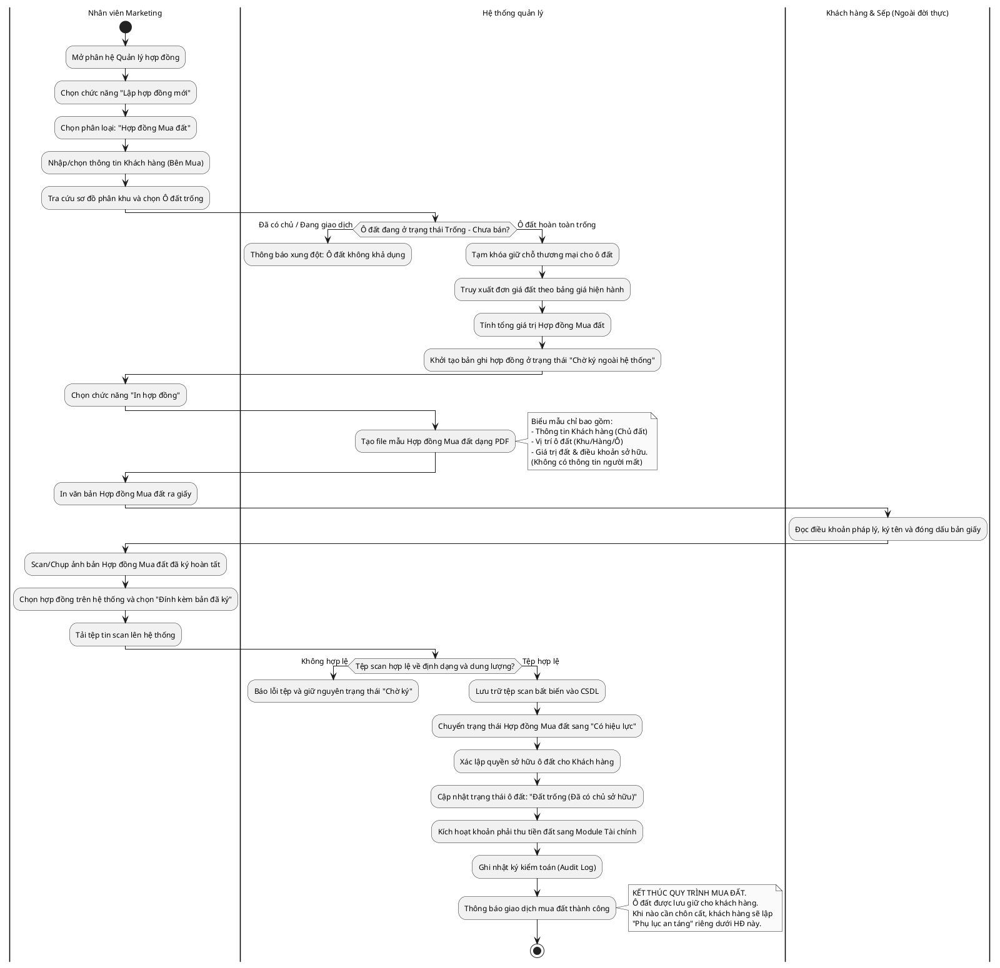
```plantuml
@startuml
skinparam monochrome true
skinparam defaultFontName Arial
skinparam defaultFontSize 12
!pragma useVerticalIf on

|Nhân viên Marketing|
start
:Mở phân hệ Quản lý hợp đồng;
:Chọn chức năng "Lập hợp đồng mới";
:Chọn phân loại: "Hợp đồng Mua đất";
:Nhập/chọn thông tin Khách hàng (Bên Mua);
:Tra cứu sơ đồ phân khu và chọn Ô đất trống;

|Hệ thống quản lý|
if (Ô đất đang ở trạng thái Trống - Chưa bán?) then (Đã có chủ / Đang giao dịch)
  :Thông báo xung đột: Ô đất không khả dụng;
  kill
else (Ô đất hoàn toàn trống)
  :Tạm khóa giữ chỗ thương mại cho ô đất;
  :Truy xuất đơn giá đất theo bảng giá hiện hành;
  :Tính tổng giá trị Hợp đồng Mua đất;
  :Khởi tạo bản ghi hợp đồng ở trạng thái "Chờ ký ngoài hệ thống";
endif

|Nhân viên Marketing|
:Chọn chức năng "In hợp đồng";

|Hệ thống quản lý|
:Tạo file mẫu Hợp đồng Mua đất dạng PDF;
note right
  Biểu mẫu chỉ bao gồm:
  - Thông tin Khách hàng (Chủ đất)
  - Vị trí ô đất (Khu/Hàng/Ô)
  - Giá trị đất & điều khoản sở hữu.
  (Không có thông tin người mất)
end note

|Nhân viên Marketing|
:In văn bản Hợp đồng Mua đất ra giấy;

|Khách hàng & Sếp (Ngoài đời thực)|
:Đọc điều khoản pháp lý, ký tên và đóng dấu bản giấy;

|Nhân viên Marketing|
:Scan/Chụp ảnh bản Hợp đồng Mua đất đã ký hoàn tất;
:Chọn hợp đồng trên hệ thống và chọn "Đính kèm bản đã ký";
:Tải tệp tin scan lên hệ thống;

|Hệ thống quản lý|
if (Tệp scan hợp lệ về định dạng và dung lượng?) then (Không hợp lệ)
  :Báo lỗi tệp và giữ nguyên trạng thái "Chờ ký";
  kill
else (Tệp hợp lệ)
  :Lưu trữ tệp scan bất biến vào CSDL;
  :Chuyển trạng thái Hợp đồng Mua đất sang "Có hiệu lực";
  :Xác lập quyền sở hữu ô đất cho Khách hàng;
  :Cập nhật trạng thái ô đất: "Đất trống (Đã có chủ sở hữu)";
  :Kích hoạt khoản phải thu tiền đất sang Module Tài chính;
  :Ghi nhật ký kiểm toán (Audit Log);
  :Thông báo giao dịch mua đất thành công;
  note right
    KẾT THÚC QUY TRÌNH MUA ĐẤT.
    Ô đất được lưu giữ cho khách hàng.
    Khi nào cần chôn cất, khách hàng sẽ lập
    "Phụ lục an táng" riêng dưới HĐ này.
  end note
  stop
endif
@enduml
```

#### Nguồn chữ AD03 — L2 image11

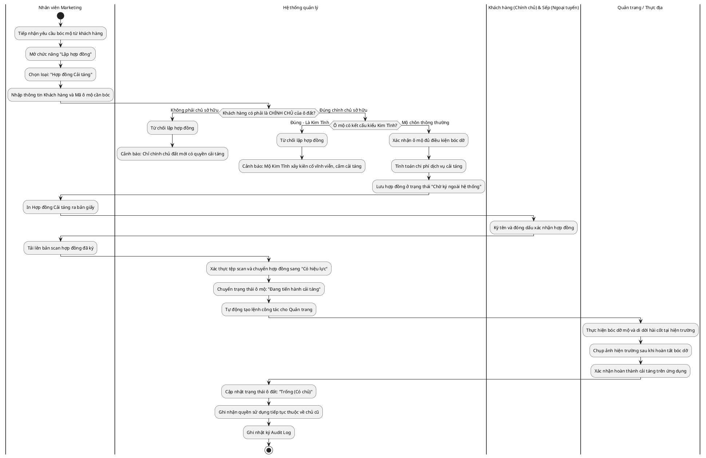
```plantuml
@startuml
skinparam monochrome true
skinparam defaultFontName Arial
skinparam defaultFontSize 12
!pragma useVerticalIf on

|Nhân viên Marketing|
start
:Tiếp nhận yêu cầu bóc mộ từ khách hàng;
:Mở chức năng "Lập hợp đồng";
:Chọn loại: "Hợp đồng Cải táng";
:Nhập thông tin Khách hàng và Mã ô mộ cần bóc;

|Hệ thống quản lý|
if (Khách hàng có phải là CHÍNH CHỦ của ô đất?) then (Không phải chủ sở hữu)
  :Từ chối lập hợp đồng;
  :Cảnh báo: Chỉ chính chủ đất mới có quyền cải táng;
  kill
else (Đúng chính chủ sở hữu)
  if (Ô mộ có kết cấu kiểu Kim Tĩnh?) then (Đúng - Là Kim Tĩnh)
    :Từ chối lập hợp đồng;
    :Cảnh báo: Mộ Kim Tĩnh xây kiên cố vĩnh viễn, cấm cải táng;
    kill
  else (Mộ chôn thông thường)
    :Xác nhận ô mộ đủ điều kiện bóc dỡ;
    :Tính toán chi phí dịch vụ cải táng;
    :Lưu hợp đồng ở trạng thái "Chờ ký ngoài hệ thống";
  endif
endif

|Nhân viên Marketing|
:In Hợp đồng Cải táng ra bản giấy;

|Khách hàng (Chính chủ) & Sếp (Ngoại tuyến)|
:Ký tên và đóng dấu xác nhận hợp đồng;

|Nhân viên Marketing|
:Tải lên bản scan hợp đồng đã ký;

|Hệ thống quản lý|
:Xác thực tệp scan và chuyển hợp đồng sang "Có hiệu lực";
:Chuyển trạng thái ô mộ: "Đang tiến hành cải táng";
:Tự động tạo lệnh công tác cho Quản trang;

|Quản trang / Thực địa|
:Thực hiện bóc dỡ mộ và di dời hài cốt tại hiện trường;
:Chụp ảnh hiện trường sau khi hoàn tất bóc dỡ;
:Xác nhận hoàn thành cải táng trên ứng dụng;

|Hệ thống quản lý|
:Cập nhật trạng thái ô đất: "Trống (Có chủ)";
:Ghi nhận quyền sử dụng tiếp tục thuộc về chủ cũ;
:Ghi nhật ký Audit Log;
stop
@enduml
```

#### Nguồn chữ AD04 — L2 image12

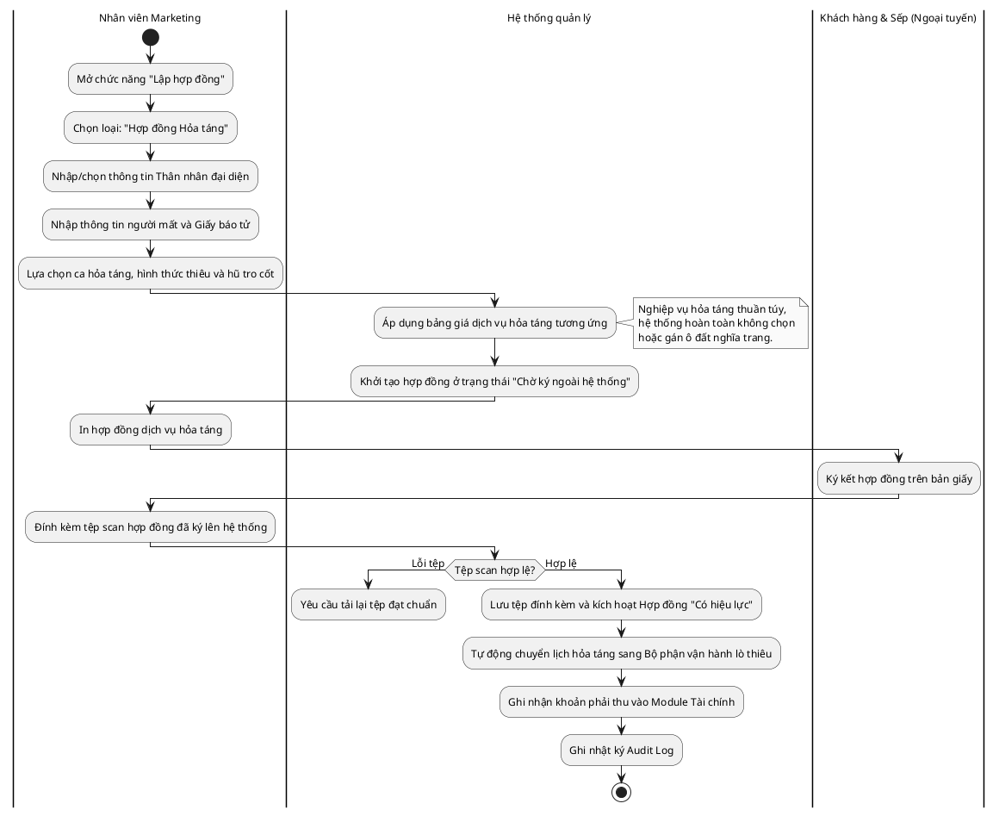
```plantuml
@startuml
skinparam monochrome true
skinparam defaultFontName Arial
skinparam defaultFontSize 12
!pragma useVerticalIf on

|Nhân viên Marketing|
start
:Mở chức năng "Lập hợp đồng";
:Chọn loại: "Hợp đồng Hỏa táng";
:Nhập/chọn thông tin Thân nhân đại diện;
:Nhập thông tin người mất và Giấy báo tử;
:Lựa chọn ca hỏa táng, hình thức thiêu và hũ tro cốt;

|Hệ thống quản lý|
:Áp dụng bảng giá dịch vụ hỏa táng tương ứng;
note right
  Nghiệp vụ hỏa táng thuần túy,
  hệ thống hoàn toàn không chọn
  hoặc gán ô đất nghĩa trang.
end note
:Khởi tạo hợp đồng ở trạng thái "Chờ ký ngoài hệ thống";

|Nhân viên Marketing|
:In hợp đồng dịch vụ hỏa táng;

|Khách hàng & Sếp (Ngoại tuyến)|
:Ký kết hợp đồng trên bản giấy;

|Nhân viên Marketing|
:Đính kèm tệp scan hợp đồng đã ký lên hệ thống;

|Hệ thống quản lý|
if (Tệp scan hợp lệ?) then (Lỗi tệp)
  :Yêu cầu tải lại tệp đạt chuẩn;
  kill
else (Hợp lệ)
  :Lưu tệp đính kèm và kích hoạt Hợp đồng "Có hiệu lực";
  :Tự động chuyển lịch hỏa táng sang Bộ phận vận hành lò thiêu;
  :Ghi nhận khoản phải thu vào Module Tài chính;
  :Ghi nhật ký Audit Log;
  stop
endif
@enduml
```

#### Nguồn chữ AD05 — L2 image13

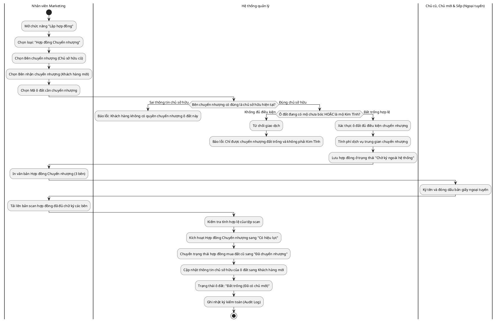
```plantuml
@startuml
skinparam monochrome true
skinparam defaultFontName Arial
skinparam defaultFontSize 12
!pragma useVerticalIf on

|Nhân viên Marketing|
start
:Mở chức năng "Lập hợp đồng";
:Chọn loại: "Hợp đồng Chuyển nhượng";
:Chọn Bên chuyển nhượng (Chủ sở hữu cũ);
:Chọn Bên nhận chuyển nhượng (Khách hàng mới);
:Chọn Mã ô đất cần chuyển nhượng;

|Hệ thống quản lý|
if (Bên chuyển nhượng có đúng là chủ sở hữu hiện tại?) then (Sai thông tin chủ sở hữu)
  :Báo lỗi: Khách hàng không có quyền chuyển nhượng ô đất này;
  kill
else (Đúng chủ sở hữu)
  if (Ô đất đang có mộ chưa bóc HOẶC là mộ Kim Tĩnh?) then (Không đủ điều kiện)
    :Từ chối giao dịch;
    :Báo lỗi: Chỉ được chuyển nhượng đất trống và không phải Kim Tĩnh;
    kill
  else (Đất trống hợp lệ)
    :Xác thực ô đất đủ điều kiện chuyển nhượng;
    :Tính phí dịch vụ trung gian chuyển nhượng;
    :Lưu hợp đồng ở trạng thái "Chờ ký ngoài hệ thống";
  endif
endif

|Nhân viên Marketing|
:In văn bản Hợp đồng Chuyển nhượng (3 bên);

|Chủ cũ, Chủ mới & Sếp (Ngoại tuyến)|
:Ký tên và đóng dấu bản giấy ngoại tuyến;

|Nhân viên Marketing|
:Tải lên bản scan hợp đồng đã đủ chữ ký các bên;

|Hệ thống quản lý|
:Kiểm tra tính hợp lệ của tệp scan;
:Kích hoạt Hợp đồng Chuyển nhượng sang "Có hiệu lực";
:Chuyển trạng thái hợp đồng mua đất cũ sang "Đã chuyển nhượng";
:Cập nhật thông tin chủ sở hữu của ô đất sang Khách hàng mới;
:Trạng thái ô đất: "Đất trống (Đã có chủ mới)";
:Ghi nhật ký kiểm toán (Audit Log);
stop
@enduml
```

#### Nguồn chữ AD06 — L2 image14

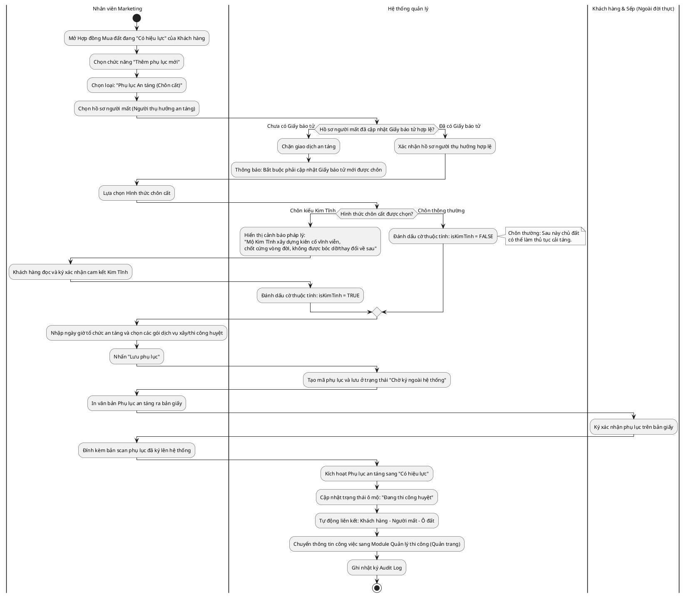
```plantuml
@startuml
skinparam monochrome true
skinparam defaultFontName Arial
skinparam defaultFontSize 12
!pragma useVerticalIf on

|Nhân viên Marketing|
start
:Mở Hợp đồng Mua đất đang "Có hiệu lực" của Khách hàng;
:Chọn chức năng "Thêm phụ lục mới";
:Chọn loại: "Phụ lục An táng (Chôn cất)";
:Chọn hồ sơ người mất (Người thụ hưởng an táng);

|Hệ thống quản lý|
if (Hồ sơ người mất đã cập nhật Giấy báo tử hợp lệ?) then (Chưa có Giấy báo tử)
  :Chặn giao dịch an táng;
  :Thông báo: Bắt buộc phải cập nhật Giấy báo tử mới được chôn;
  kill
else (Đã có Giấy báo tử)
  :Xác nhận hồ sơ người thụ hưởng hợp lệ;
endif

|Nhân viên Marketing|
:Lựa chọn Hình thức chôn cất;

|Hệ thống quản lý|
if (Hình thức chôn cất được chọn?) then (Chôn kiểu Kim Tĩnh)
  :Hiển thị cảnh báo pháp lý:
  "Mộ Kim Tĩnh xây dựng kiên cố vĩnh viễn,
  chốt cứng vòng đời, không được bóc dỡ/thay đổi về sau";
  
  |Nhân viên Marketing|
  :Khách hàng đọc và ký xác nhận cam kết Kim Tĩnh;
  
  |Hệ thống quản lý|
  :Đánh dấu cờ thuộc tính: isKimTinh = TRUE;
else (Chôn thông thường)
  :Đánh dấu cờ thuộc tính: isKimTinh = FALSE;
  note right
    Chôn thường: Sau này chủ đất
    có thể làm thủ tục cải táng.
  end note
endif

|Nhân viên Marketing|
:Nhập ngày giờ tổ chức an táng và chọn các gói dịch vụ xây/thi công huyệt;
:Nhấn "Lưu phụ lục";

|Hệ thống quản lý|
:Tạo mã phụ lục và lưu ở trạng thái "Chờ ký ngoài hệ thống";

|Nhân viên Marketing|
:In văn bản Phụ lục an táng ra bản giấy;

|Khách hàng & Sếp (Ngoài đời thực)|
:Ký xác nhận phụ lục trên bản giấy;

|Nhân viên Marketing|
:Đính kèm bản scan phụ lục đã ký lên hệ thống;

|Hệ thống quản lý|
:Kích hoạt Phụ lục an táng sang "Có hiệu lực";
:Cập nhật trạng thái ô mộ: "Đang thi công huyệt";
:Tự động liên kết: Khách hàng - Người mất - Ô đất;
:Chuyển thông tin công việc sang Module Quản lý thi công (Quản trang);
:Ghi nhật ký Audit Log;
stop
@enduml
```

#### Nguồn chữ AD07 — L2 image15

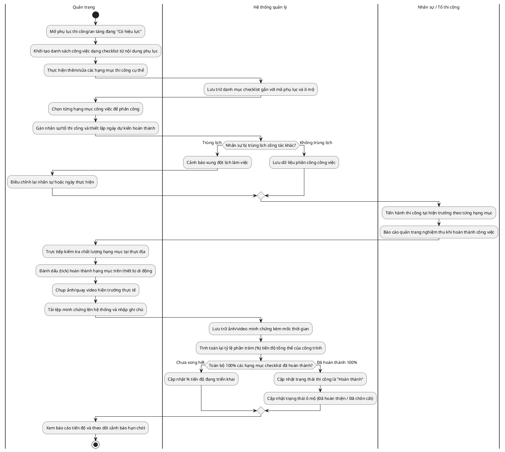
```plantuml
@startuml
skinparam monochrome true
skinparam defaultFontName Arial
skinparam defaultFontSize 12
!pragma useVerticalIf on

|Quản trang|
start
:Mở phụ lục thi công/an táng đang "Có hiệu lực";
:Khởi tạo danh sách công việc dạng checklist từ nội dung phụ lục;
:Thực hiện thêm/sửa các hạng mục thi công cụ thể;

|Hệ thống quản lý|
:Lưu trữ danh mục checklist gắn với mã phụ lục và ô mộ;

|Quản trang|
:Chọn từng hạng mục công việc để phân công;
:Gán nhân sự/tổ thi công và thiết lập ngày dự kiến hoàn thành;

|Hệ thống quản lý|
if (Nhân sự bị trùng lịch công tác khác?) then (Trùng lịch)
  :Cảnh báo xung đột lịch làm việc;
  |Quản trang|
  :Điều chỉnh lại nhân sự hoặc ngày thực hiện;
else (Không trùng lịch)
  |Hệ thống quản lý|
  :Lưu dữ liệu phân công công việc;
endif

|Nhân sự / Tổ thi công|
:Tiến hành thi công tại hiện trường theo từng hạng mục;
:Báo cáo quản trang nghiệm thu khi hoàn thành công việc;

|Quản trang|
:Trực tiếp kiểm tra chất lượng hạng mục tại thực địa;
:Đánh dấu (tick) hoàn thành hạng mục trên thiết bị di động;
:Chụp ảnh/quay video hiện trường thực tế;
:Tải tệp minh chứng lên hệ thống và nhập ghi chú;

|Hệ thống quản lý|
:Lưu trữ ảnh/video minh chứng kèm mốc thời gian;
:Tính toán lại tỷ lệ phần trăm (%) tiến độ tổng thể của công trình;

if (Toàn bộ 100% các hạng mục checklist đã hoàn thành?) then (Chưa xong hết)
  :Cập nhật % tiến độ đang triển khai;
else (Đã hoàn thành 100%)
  :Cập nhật trạng thái thi công là "Hoàn thành";
  :Cập nhật trạng thái ô mộ (Đã hoàn thiện / Đã chôn cất);
endif

|Quản trang|
:Xem báo cáo tiến độ và theo dõi cảnh báo hạn chót;
stop
@enduml
```

#### Nguồn chữ AD08 — L2 image16

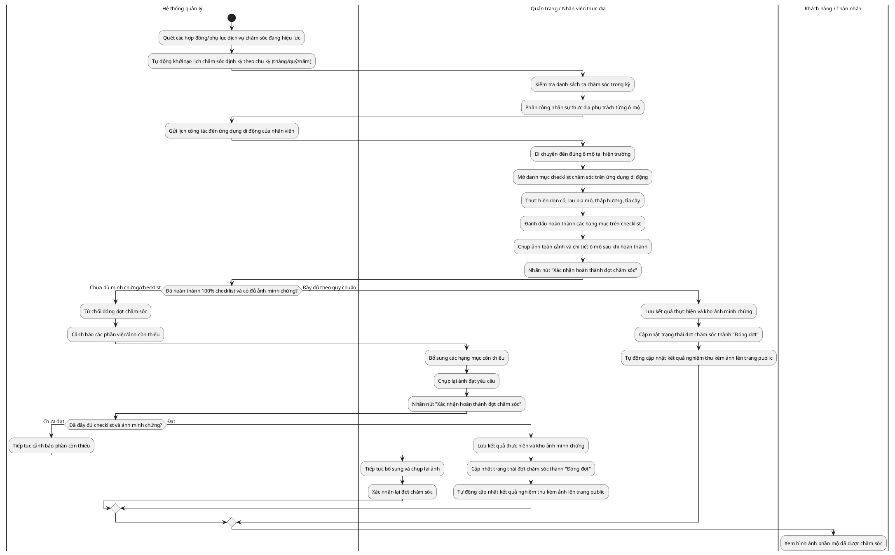
```plantuml
@startuml
skinparam monochrome true
skinparam defaultFontName Arial
skinparam defaultFontSize 12
!pragma useVerticalIf on

|Hệ thống quản lý|
start
:Quét các hợp đồng/phụ lục dịch vụ chăm sóc đang hiệu lực;
:Tự động khởi tạo lịch chăm sóc định kỳ theo chu kỳ (tháng/quý/năm);

|Quản trang / Nhân viên thực địa|
:Kiểm tra danh sách ca chăm sóc trong kỳ;
:Phân công nhân sự thực địa phụ trách từng ô mộ;

|Hệ thống quản lý|
:Gửi lịch công tác đến ứng dụng di động của nhân viên;

|Quản trang / Nhân viên thực địa|
:Di chuyển đến đúng ô mộ tại hiện trường;
:Mở danh mục checklist chăm sóc trên ứng dụng di động;
:Thực hiện dọn cỏ, lau bia mộ, thắp hương, tỉa cây;
:Đánh dấu hoàn thành các hạng mục trên checklist;
:Chụp ảnh toàn cảnh và chi tiết ô mộ sau khi hoàn thành;
:Nhấn nút "Xác nhận hoàn thành đợt chăm sóc";

|Hệ thống quản lý|
if (Đã hoàn thành 100% checklist và có đủ ảnh minh chứng?) then (Chưa đủ minh chứng/checklist)
  :Từ chối đóng đợt chăm sóc;
  :Cảnh báo các phần việc/ảnh còn thiếu;

  |Quản trang / Nhân viên thực địa|
  :Bổ sung các hạng mục còn thiếu;
  :Chụp lại ảnh đạt yêu cầu;
  :Nhấn nút "Xác nhận hoàn thành đợt chăm sóc";

  |Hệ thống quản lý|
  if (Đã đầy đủ checklist và ảnh minh chứng?) then (Chưa đạt)
    :Tiếp tục cảnh báo phần còn thiếu;
    |Quản trang / Nhân viên thực địa|
    :Tiếp tục bổ sung và chụp lại ảnh;
    :Xác nhận lại đợt chăm sóc;
  else (Đạt)
    :Lưu kết quả thực hiện và kho ảnh minh chứng;
    :Cập nhật trạng thái đợt chăm sóc thành "Đóng đợt";
    :Tự động cập nhật kết quả nghiệm thu kèm ảnh lên trang public;
  endif

else (Đầy đủ theo quy chuẩn)
  :Lưu kết quả thực hiện và kho ảnh minh chứng;
  :Cập nhật trạng thái đợt chăm sóc thành "Đóng đợt";
  :Tự động cập nhật kết quả nghiệm thu kèm ảnh lên trang public;
endif

|Khách hàng / Thân nhân|
:Xem hình ảnh phần mộ đã được chăm sóc;
@enduml
```

#### Nguồn chữ AD09 — L2 image17

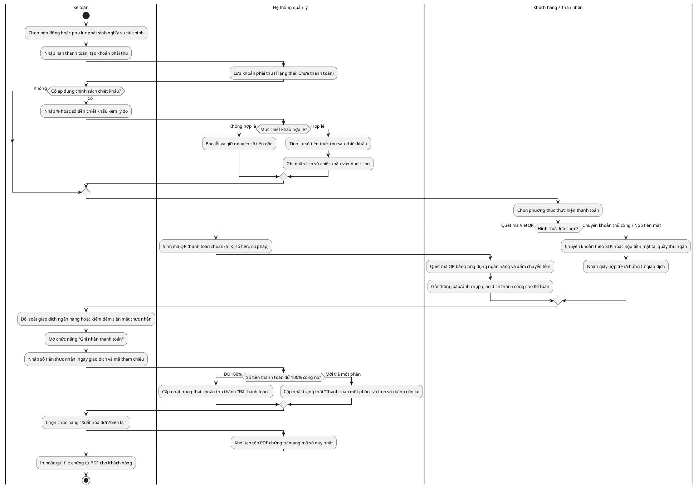
```plantuml
@startuml
skinparam monochrome true
skinparam defaultFontName Arial
skinparam defaultFontSize 12
!pragma useVerticalIf on

|Kế toán|
start
:Chọn hợp đồng hoặc phụ lục phát sinh nghĩa vụ tài chính;
:Nhập hạn thanh toán, tạo khoản phải thu;

|Hệ thống quản lý|
:Lưu khoản phải thu (Trạng thái: Chưa thanh toán);

|Kế toán|
if (Có áp dụng chính sách chiết khấu?) then (Có)
  :Nhập % hoặc số tiền chiết khấu kèm lý do;
  |Hệ thống quản lý|
  if (Mức chiết khấu hợp lệ?) then (Không hợp lệ)
    :Báo lỗi và giữ nguyên số tiền gốc;
  else (Hợp lệ)
    :Tính lại số tiền thực thu sau chiết khấu;
    :Ghi nhận lịch sử chiết khấu vào Audit Log;
  endif
else (Không)
endif

|Khách hàng / Thân nhân|
:Chọn phương thức thực hiện thanh toán;

if (Hình thức lựa chọn?) then (Quét mã VietQR)
  |Hệ thống quản lý|
  :Sinh mã QR thanh toán chuẩn (STK, số tiền, cú pháp);
  |Khách hàng / Thân nhân|
  :Quét mã QR bằng ứng dụng ngân hàng và bấm chuyển tiền;
  :Gửi thông báo/ảnh chụp giao dịch thành công cho Kế toán;
else (Chuyển khoản thủ công / Nộp tiền mặt)
  |Khách hàng / Thân nhân|
  :Chuyển khoản theo STK hoặc nộp tiền mặt tại quầy thu ngân;
  :Nhận giấy nộp tiền/chứng từ giao dịch;
endif

|Kế toán|
:Đối soát giao dịch ngân hàng hoặc kiểm đếm tiền mặt thực nhận;
:Mở chức năng "Ghi nhận thanh toán";
:Nhập số tiền thực nhận, ngày giao dịch và mã tham chiếu;

|Hệ thống quản lý|
if (Số tiền thanh toán đủ 100% công nợ?) then (Đủ 100%)
  :Cập nhật trạng thái khoản thu thành "Đã thanh toán";
else (Mới trả một phần)
  :Cập nhật trạng thái "Thanh toán một phần" và tính số dư nợ còn lại;
endif

|Kế toán|
:Chọn chức năng "Xuất hóa đơn/biên lai";

|Hệ thống quản lý|
:Khởi tạo tệp PDF chứng từ mang mã số duy nhất;

|Kế toán|
:In hoặc gửi file chứng từ PDF cho Khách hàng;
stop
@enduml
```

#### Nguồn chữ AD10 — L2 image18

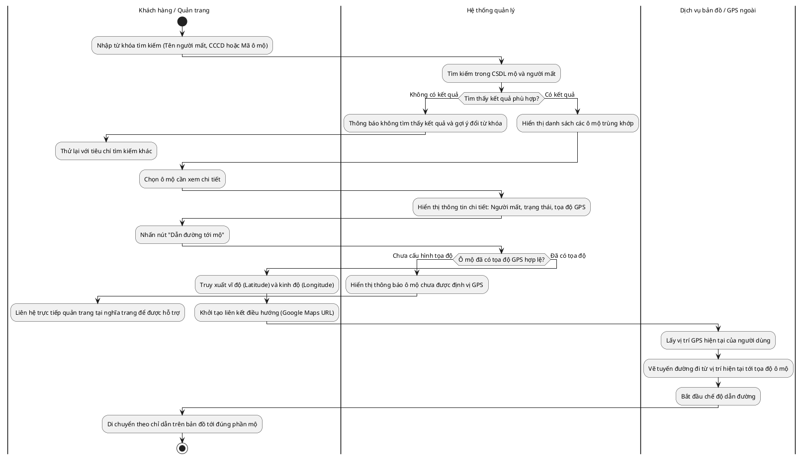
```plantuml
@startuml
skinparam monochrome true
skinparam defaultFontName Arial
skinparam defaultFontSize 12
!pragma useVerticalIf on

|Khách hàng / Quản trang|
start
:Nhập từ khóa tìm kiếm (Tên người mất, CCCD hoặc Mã ô mộ);

|Hệ thống quản lý|
:Tìm kiếm trong CSDL mộ và người mất;

if (Tìm thấy kết quả phù hợp?) then (Không có kết quả)
  :Thông báo không tìm thấy kết quả và gợi ý đổi từ khóa;
  |Khách hàng / Quản trang|
  :Thử lại với tiêu chí tìm kiếm khác;
  kill
else (Có kết quả)
  |Hệ thống quản lý|
  :Hiển thị danh sách các ô mộ trùng khớp;
endif

|Khách hàng / Quản trang|
:Chọn ô mộ cần xem chi tiết;

|Hệ thống quản lý|
:Hiển thị thông tin chi tiết: Người mất, trạng thái, tọa độ GPS;

|Khách hàng / Quản trang|
:Nhấn nút "Dẫn đường tới mộ";

|Hệ thống quản lý|
if (Ô mộ đã có tọa độ GPS hợp lệ?) then (Chưa cấu hình tọa độ)
  :Hiển thị thông báo ô mộ chưa được định vị GPS;
  |Khách hàng / Quản trang|
  :Liên hệ trực tiếp quản trang tại nghĩa trang để được hỗ trợ;
  kill
else (Đã có tọa độ)
  :Truy xuất vĩ độ (Latitude) và kinh độ (Longitude);
  :Khởi tạo liên kết điều hướng (Google Maps URL);
endif

|Dịch vụ bản đồ / GPS ngoài|
:Lấy vị trí GPS hiện tại của người dùng;
:Vẽ tuyến đường đi từ vị trí hiện tại tới tọa độ ô mộ;
:Bắt đầu chế độ dẫn đường;

|Khách hàng / Quản trang|
:Di chuyển theo chỉ dẫn trên bản đồ tới đúng phần mộ;
stop
@enduml
```

#### Nguồn chữ AD11 — L2 image19

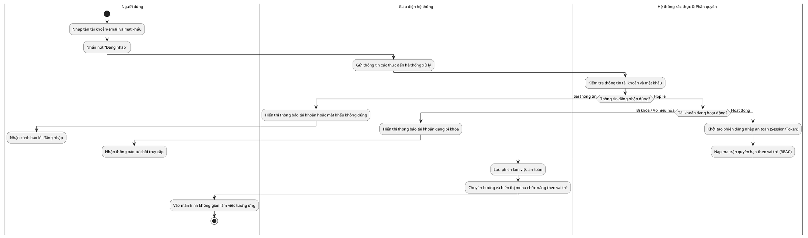
```plantuml
@startuml
skinparam monochrome true
skinparam defaultFontName Arial
skinparam defaultFontSize 12
!pragma useVerticalIf on

|Người dùng|
start
:Nhập tên tài khoản/email và mật khẩu;
:Nhấn nút "Đăng nhập";

|Giao diện hệ thống|
:Gửi thông tin xác thực đến hệ thống xử lý;

|Hệ thống xác thực & Phân quyền|
:Kiểm tra thông tin tài khoản và mật khẩu;

if (Thông tin đăng nhập đúng?) then (Sai thông tin)
  |Giao diện hệ thống|
  :Hiển thị thông báo tài khoản hoặc mật khẩu không đúng;
  |Người dùng|
  :Nhận cảnh báo lỗi đăng nhập;
  kill
else (Hợp lệ)
  |Hệ thống xác thực & Phân quyền|
  if (Tài khoản đang hoạt động?) then (Bị khóa / Vô hiệu hóa)
    |Giao diện hệ thống|
    :Hiển thị thông báo tài khoản đang bị khóa;
    |Người dùng|
    :Nhận thông báo từ chối truy cập;
    kill
  else (Hoạt động)
    |Hệ thống xác thực & Phân quyền|
    :Khởi tạo phiên đăng nhập an toàn (Session/Token);
    :Nạp ma trận quyền hạn theo vai trò (RBAC);
    
    |Giao diện hệ thống|
    :Lưu phiên làm việc an toàn;
    :Chuyển hướng và hiển thị menu chức năng theo vai trò;
    
    |Người dùng|
    :Vào màn hình không gian làm việc tương ứng;
    stop
  endif
endif
@enduml
```

#### Nguồn chữ TT01 — L3 image1

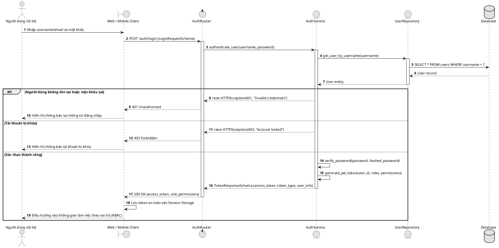
```plantuml
@startuml
skinparam monochrome true
skinparam defaultFontName Arial
skinparam defaultFontSize 12
autonumber

actor "Người dùng nội bộ" as User
boundary "Web / Mobile Client" as Client
control "AuthRouter" as Router
entity "AuthService" as Service
entity "UserRepository" as UserRepo
database "Database" as DB

User -> Client: Nhập username/email và mật khẩu
Client -> Router: POST /auth/login (LoginRequestSchema)
activate Router

Router -> Service: authenticate_user(username, password)
activate Service

Service -> UserRepo: get_user_by_username(username)
activate UserRepo
UserRepo -> DB: SELECT * FROM users WHERE username = ?
DB --> UserRepo: User record
UserRepo --> Service: User entity
deactivate UserRepo

alt Người dùng không tồn tại hoặc mật khẩu sai
    Service --> Router: raise HTTPException(401, "Invalid credentials")
    Router --> Client: 401 Unauthorized
    Client --> User: Hiển thị thông báo sai thông tin đăng nhập
else Tài khoản bị khóa
    Service --> Router: raise HTTPException(403, "Account locked")
    Router --> Client: 403 Forbidden
    Client --> User: Hiển thị thông báo tài khoản bị khóa
else Xác thực thành công
    Service -> Service: verify_password(password, hashed_password)
    Service -> Service: generate_jwt_token(user_id, roles, permissions)
    Service --> Router: TokenResponseSchema (access_token, token_type, user_info)
    deactivate Service

    Router --> Client: 200 OK (access_token, role_permissions)
    deactivate Router

    Client -> Client: Lưu token an toàn vào Session Storage
    Client --> User: Điều hướng vào không gian làm việc theo vai trò (RBAC)
end
@enduml
```

#### Nguồn chữ TT02 — L3 image2

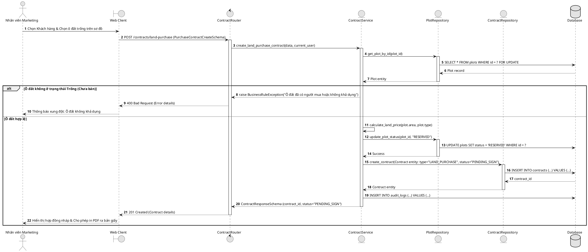
```plantuml
@startuml
skinparam monochrome true
skinparam defaultFontName Arial
skinparam defaultFontSize 12
autonumber

actor "Nhân viên Marketing" as Staff
boundary "Web Client" as Client
control "ContractRouter" as Router
entity "ContractService" as Service
entity "PlotRepository" as PlotRepo
entity "ContractRepository" as ContractRepo
database "Database" as DB

Staff -> Client: Chọn Khách hàng & Chọn ô đất trống trên sơ đồ
Client -> Router: POST /contracts/land-purchase (PurchaseContractCreateSchema)
activate Router

Router -> Service: create_land_purchase_contract(data, current_user)
activate Service

Service -> PlotRepo: get_plot_by_id(plot_id)
activate PlotRepo
PlotRepo -> DB: SELECT * FROM plots WHERE id = ? FOR UPDATE
DB --> PlotRepo: Plot record
PlotRepo --> Service: Plot entity
deactivate PlotRepo

alt Ô đất không ở trạng thái Trống (Chưa bán)
    Service --> Router: raise BusinessRuleException("Ô đất đã có người mua hoặc không khả dụng")
    Router --> Client: 400 Bad Request (Error details)
    Client --> Staff: Thông báo xung đột: Ô đất không khả dụng
else Ô đất hợp lệ
    Service -> Service: calculate_land_price(plot.area, plot.type)
    
    Service -> PlotRepo: update_plot_status(plot_id, "RESERVED")
    activate PlotRepo
    PlotRepo -> DB: UPDATE plots SET status = 'RESERVED' WHERE id = ?
    PlotRepo --> Service: Success
    deactivate PlotRepo

    Service -> ContractRepo: create_contract(Contract entity: type="LAND_PURCHASE", status="PENDING_SIGN")
    activate ContractRepo
    ContractRepo -> DB: INSERT INTO contracts (...) VALUES (...)
    DB --> ContractRepo: contract_id
    ContractRepo --> Service: Contract entity
    deactivate ContractRepo

    Service -> DB: INSERT INTO audit_logs (...) VALUES (...)

    Service --> Router: ContractResponseSchema (contract_id, status="PENDING_SIGN")
    deactivate Service

    Router --> Client: 201 Created (Contract details)
    deactivate Router
    Client --> Staff: Hiển thị hợp đồng nháp & Cho phép in PDF ra bản giấy
end
@enduml
```

#### Nguồn chữ TT03 — L3 image3

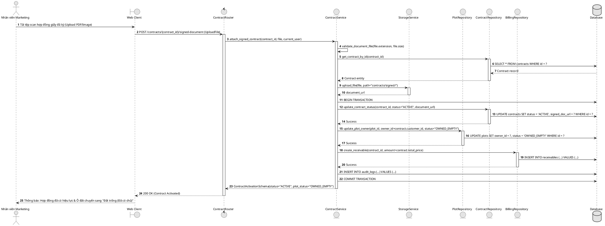
```plantuml
@startuml
skinparam monochrome true
skinparam defaultFontName Arial
skinparam defaultFontSize 12
autonumber

actor "Nhân viên Marketing" as Staff
boundary "Web Client" as Client
control "ContractRouter" as Router
entity "ContractService" as Service
entity "StorageService" as Storage
entity "PlotRepository" as PlotRepo
entity "ContractRepository" as ContractRepo
entity "BillingRepository" as BillingRepo
database "Database" as DB

Staff -> Client: Tải tệp scan hợp đồng giấy đã ký (Upload PDF/Image)
Client -> Router: POST /contracts/{contract_id}/signed-document (UploadFile)
activate Router

Router -> Service: attach_signed_contract(contract_id, file, current_user)
activate Service

Service -> Service: validate_document_file(file.extension, file.size)

Service -> ContractRepo: get_contract_by_id(contract_id)
activate ContractRepo
ContractRepo -> DB: SELECT * FROM contracts WHERE id = ?
DB --> ContractRepo: Contract record
ContractRepo --> Service: Contract entity
deactivate ContractRepo

Service -> Storage: upload_file(file, path="contracts/signed/")
activate Storage
Storage --> Service: document_url
deactivate Storage

Service -> DB: BEGIN TRANSACTION

Service -> ContractRepo: update_contract_status(contract_id, status="ACTIVE", document_url)
activate ContractRepo
ContractRepo -> DB: UPDATE contracts SET status = 'ACTIVE', signed_doc_url = ? WHERE id = ?
ContractRepo --> Service: Success
deactivate ContractRepo

Service -> PlotRepo: update_plot_owner(plot_id, owner_id=contract.customer_id, status="OWNED_EMPTY")
activate PlotRepo
PlotRepo -> DB: UPDATE plots SET owner_id = ?, status = 'OWNED_EMPTY' WHERE id = ?
PlotRepo --> Service: Success
deactivate PlotRepo

Service -> BillingRepo: create_receivable(contract_id, amount=contract.total_price)
activate BillingRepo
BillingRepo -> DB: INSERT INTO receivables (...) VALUES (...)
BillingRepo --> Service: Success
deactivate BillingRepo

Service -> DB: INSERT INTO audit_logs (...) VALUES (...)
Service -> DB: COMMIT TRANSACTION

Service --> Router: ContractActivationSchema(status="ACTIVE", plot_status="OWNED_EMPTY")
deactivate Service

Router --> Client: 200 OK (Contract Activated)
deactivate Router
Client --> Staff: Thông báo: Hợp đồng đã có hiệu lực & Ô đất chuyển sang "Đất trống (Đã có chủ)"
@enduml
```

#### Nguồn chữ TT04 — L3 image4

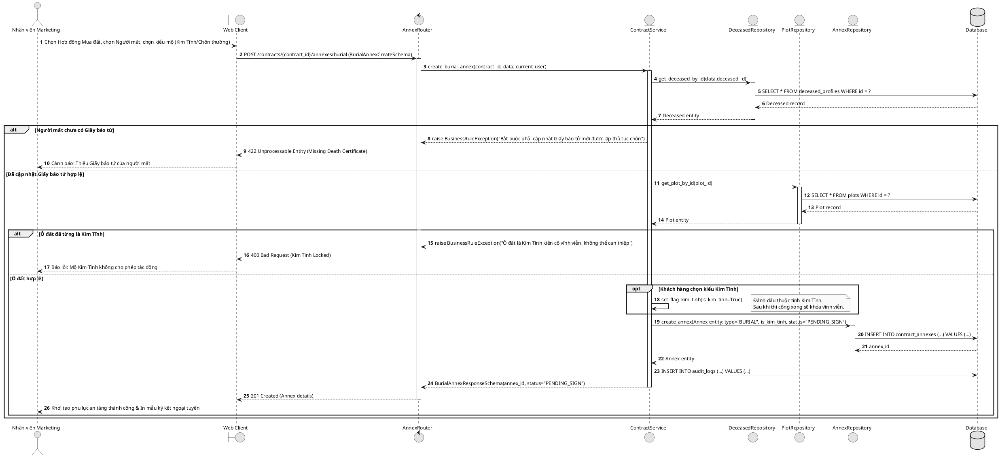
```plantuml
@startuml
skinparam monochrome true
skinparam defaultFontName Arial
skinparam defaultFontSize 12
autonumber

actor "Nhân viên Marketing" as Staff
boundary "Web Client" as Client
control "AnnexRouter" as Router
entity "ContractService" as Service
entity "DeceasedRepository" as DeceasedRepo
entity "PlotRepository" as PlotRepo
entity "AnnexRepository" as AnnexRepo
database "Database" as DB

Staff -> Client: Chọn Hợp đồng Mua đất, chọn Người mất, chọn kiểu mộ (Kim Tĩnh/Chôn thường)
Client -> Router: POST /contracts/{contract_id}/annexes/burial (BurialAnnexCreateSchema)
activate Router

Router -> Service: create_burial_annex(contract_id, data, current_user)
activate Service

Service -> DeceasedRepo: get_deceased_by_id(data.deceased_id)
activate DeceasedRepo
DeceasedRepo -> DB: SELECT * FROM deceased_profiles WHERE id = ?
DB --> DeceasedRepo: Deceased record
DeceasedRepo --> Service: Deceased entity
deactivate DeceasedRepo

alt Người mất chưa có Giấy báo tử
    Service --> Router: raise BusinessRuleException("Bắt buộc phải cập nhật Giấy báo tử mới được lập thủ tục chôn")
    Router --> Client: 422 Unprocessable Entity (Missing Death Certificate)
    Client --> Staff: Cảnh báo: Thiếu Giấy báo tử của người mất
else Đã cập nhật Giấy báo tử hợp lệ
    Service -> PlotRepo: get_plot_by_id(plot_id)
    activate PlotRepo
    PlotRepo -> DB: SELECT * FROM plots WHERE id = ?
    DB --> PlotRepo: Plot record
    PlotRepo --> Service: Plot entity
    deactivate PlotRepo

    alt Ô đất đã từng là Kim Tĩnh
        Service --> Router: raise BusinessRuleException("Ô đất là Kim Tĩnh kiên cố vĩnh viễn, không thể can thiệp")
        Router --> Client: 400 Bad Request (Kim Tinh Locked)
        Client --> Staff: Báo lỗi: Mộ Kim Tĩnh không cho phép tác động
    else Ô đất hợp lệ
        opt Khách hàng chọn kiểu Kim Tĩnh
            Service -> Service: set_flag_kim_tinh(is_kim_tinh=True)
            note right
              Đánh dấu thuộc tính Kim Tĩnh.
              Sau khi thi công xong sẽ khóa vĩnh viễn.
            end note
        end

        Service -> AnnexRepo: create_annex(Annex entity: type="BURIAL", is_kim_tinh, status="PENDING_SIGN")
        activate AnnexRepo
        AnnexRepo -> DB: INSERT INTO contract_annexes (...) VALUES (...)
        DB --> AnnexRepo: annex_id
        AnnexRepo --> Service: Annex entity
        deactivate AnnexRepo

        Service -> DB: INSERT INTO audit_logs (...) VALUES (...)

        Service --> Router: BurialAnnexResponseSchema(annex_id, status="PENDING_SIGN")
        deactivate Service

        Router --> Client: 201 Created (Annex details)
        deactivate Router
        Client --> Staff: Khởi tạo phụ lục an táng thành công & In mẫu ký kết ngoại tuyến
    end
end
@enduml
```

#### Nguồn chữ TT05 — L3 image5

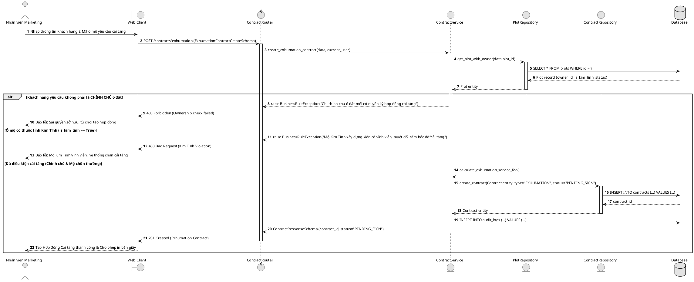
```plantuml
@startuml
skinparam monochrome true
skinparam defaultFontName Arial
skinparam defaultFontSize 12
autonumber

actor "Nhân viên Marketing" as Staff
boundary "Web Client" as Client
control "ContractRouter" as Router
entity "ContractService" as Service
entity "PlotRepository" as PlotRepo
entity "ContractRepository" as ContractRepo
database "Database" as DB

Staff -> Client: Nhập thông tin Khách hàng & Mã ô mộ yêu cầu cải táng
Client -> Router: POST /contracts/exhumation (ExhumationContractCreateSchema)
activate Router

Router -> Service: create_exhumation_contract(data, current_user)
activate Service

Service -> PlotRepo: get_plot_with_owner(data.plot_id)
activate PlotRepo
PlotRepo -> DB: SELECT * FROM plots WHERE id = ?
DB --> PlotRepo: Plot record (owner_id, is_kim_tinh, status)
PlotRepo --> Service: Plot entity
deactivate PlotRepo

alt Khách hàng yêu cầu không phải là CHÍNH CHỦ ô đất
    Service --> Router: raise BusinessRuleException("Chỉ chính chủ ô đất mới có quyền ký hợp đồng cải táng")
    Router --> Client: 403 Forbidden (Ownership check failed)
    Client --> Staff: Báo lỗi: Sai quyền sở hữu, từ chối tạo hợp đồng
else Ô mộ có thuộc tính Kim Tĩnh (is_kim_tinh == True)
    Service --> Router: raise BusinessRuleException("Mộ Kim Tĩnh xây dựng kiên cố vĩnh viễn, tuyệt đối cấm bóc dỡ/cải táng")
    Router --> Client: 400 Bad Request (Kim Tinh Violation)
    Client --> Staff: Báo lỗi: Mộ Kim Tĩnh vĩnh viễn, hệ thống chặn cải táng
else Đủ điều kiện cải táng (Chính chủ & Mộ chôn thường)
    Service -> Service: calculate_exhumation_service_fee()
    
    Service -> ContractRepo: create_contract(Contract entity: type="EXHUMATION", status="PENDING_SIGN")
    activate ContractRepo
    ContractRepo -> DB: INSERT INTO contracts (...) VALUES (...)
    DB --> ContractRepo: contract_id
    ContractRepo --> Service: Contract entity
    deactivate ContractRepo

    Service -> DB: INSERT INTO audit_logs (...) VALUES (...)

    Service --> Router: ContractResponseSchema (contract_id, status="PENDING_SIGN")
    deactivate Service

    Router --> Client: 201 Created (Exhumation Contract)
    deactivate Router
    Client --> Staff: Tạo Hợp đồng Cải táng thành công & Cho phép in bản giấy
end
@enduml
```

#### Nguồn chữ TT06 — L3 image6

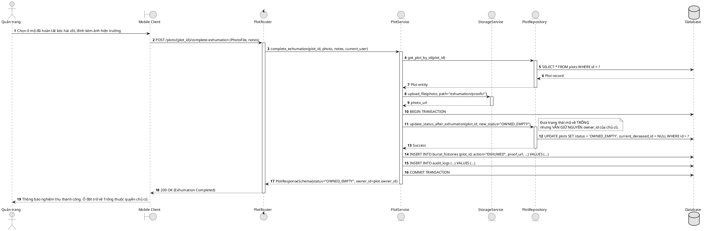
```plantuml
@startuml
skinparam monochrome true
skinparam defaultFontName Arial
skinparam defaultFontSize 12
autonumber

actor "Quản trang" as Caretaker
boundary "Mobile Client" as Mobile
control "PlotRouter" as Router
entity "PlotService" as Service
entity "StorageService" as Storage
entity "PlotRepository" as PlotRepo
database "Database" as DB

Caretaker -> Mobile: Chọn ô mộ đã hoàn tất bóc hài cốt, đính kèm ảnh hiện trường
Mobile -> Router: POST /plots/{plot_id}/complete-exhumation (PhotoFile, notes)
activate Router

Router -> Service: complete_exhumation(plot_id, photo, notes, current_user)
activate Service

Service -> PlotRepo: get_plot_by_id(plot_id)
activate PlotRepo
PlotRepo -> DB: SELECT * FROM plots WHERE id = ?
DB --> PlotRepo: Plot record
PlotRepo --> Service: Plot entity
deactivate PlotRepo

Service -> Storage: upload_file(photo, path="exhumation/proofs/")
activate Storage
Storage --> Service: photo_url
deactivate Storage

Service -> DB: BEGIN TRANSACTION

Service -> PlotRepo: update_status_after_exhumation(plot_id, new_status="OWNED_EMPTY")
activate PlotRepo
note right
  Đưa trạng thái mộ về TRỐNG
  nhưng VẪN GIỮ NGUYÊN owner_id của chủ cũ.
end note
PlotRepo -> DB: UPDATE plots SET status = 'OWNED_EMPTY', current_deceased_id = NULL WHERE id = ?
PlotRepo --> Service: Success
deactivate PlotRepo

Service -> DB: INSERT INTO burial_histories (plot_id, action="EXHUMED", proof_url, ...) VALUES (...)
Service -> DB: INSERT INTO audit_logs (...) VALUES (...)

Service -> DB: COMMIT TRANSACTION

Service --> Router: PlotResponseSchema(status="OWNED_EMPTY", owner_id=plot.owner_id)
deactivate Service

Router --> Mobile: 200 OK (Exhumation Completed)
deactivate Router
Mobile --> Caretaker: Thông báo nghiệm thu thành công. Ô đất trở về Trống thuộc quyền chủ cũ.
@enduml
```

#### Nguồn chữ TT07 — L3 image7

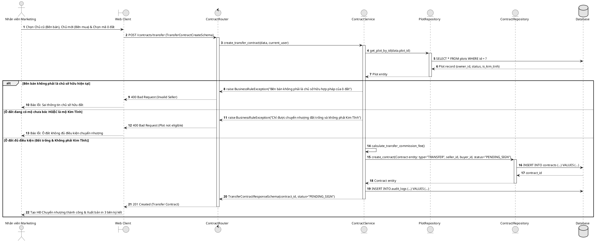
```plantuml
@startuml
skinparam monochrome true
skinparam defaultFontName Arial
skinparam defaultFontSize 12
autonumber

actor "Nhân viên Marketing" as Staff
boundary "Web Client" as Client
control "ContractRouter" as Router
entity "ContractService" as Service
entity "PlotRepository" as PlotRepo
entity "ContractRepository" as ContractRepo
database "Database" as DB

Staff -> Client: Chọn Chủ cũ (Bên bán), Chủ mới (Bên mua) & Chọn mã ô đất
Client -> Router: POST /contracts/transfer (TransferContractCreateSchema)
activate Router

Router -> Service: create_transfer_contract(data, current_user)
activate Service

Service -> PlotRepo: get_plot_by_id(data.plot_id)
activate PlotRepo
PlotRepo -> DB: SELECT * FROM plots WHERE id = ?
DB --> PlotRepo: Plot record (owner_id, status, is_kim_tinh)
PlotRepo --> Service: Plot entity
deactivate PlotRepo

alt Bên bán không phải là chủ sở hữu hiện tại
    Service --> Router: raise BusinessRuleException("Bên bán không phải là chủ sở hữu hợp pháp của ô đất")
    Router --> Client: 400 Bad Request (Invalid Seller)
    Client --> Staff: Báo lỗi: Sai thông tin chủ sở hữu đất
else Ô đất đang có mộ chưa bóc HOẶC là mộ Kim Tĩnh
    Service --> Router: raise BusinessRuleException("Chỉ được chuyển nhượng đất trống và không phải Kim Tĩnh")
    Router --> Client: 400 Bad Request (Plot not eligible)
    Client --> Staff: Báo lỗi: Ô đất không đủ điều kiện chuyển nhượng
else Ô đất đủ điều kiện (Đất trống & Không phải Kim Tĩnh)
    Service -> Service: calculate_transfer_commission_fee()

    Service -> ContractRepo: create_contract(Contract entity: type="TRANSFER", seller_id, buyer_id, status="PENDING_SIGN")
    activate ContractRepo
    ContractRepo -> DB: INSERT INTO contracts (...) VALUES (...)
    DB --> ContractRepo: contract_id
    ContractRepo --> Service: Contract entity
    deactivate ContractRepo

    Service -> DB: INSERT INTO audit_logs (...) VALUES (...)

    Service --> Router: TransferContractResponseSchema(contract_id, status="PENDING_SIGN")
    deactivate Service

    Router --> Client: 201 Created (Transfer Contract)
    deactivate Router
    Client --> Staff: Tạo HĐ Chuyển nhượng thành công & Xuất bản in 3 bên ký kết
end
@enduml
```

#### Nguồn chữ TT08 — L3 image8

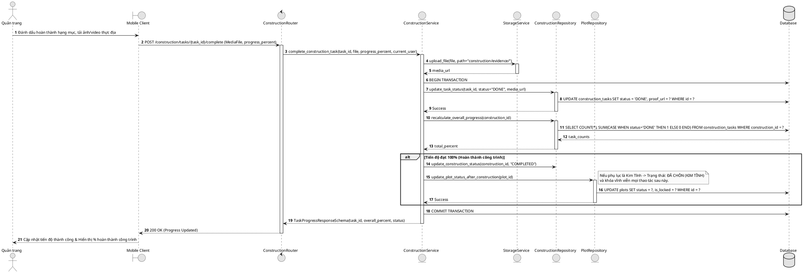
```plantuml
@startuml
skinparam monochrome true
skinparam defaultFontName Arial
skinparam defaultFontSize 12
autonumber

actor "Quản trang" as Caretaker
boundary "Mobile Client" as Mobile
control "ConstructionRouter" as Router
entity "ConstructionService" as Service
entity "StorageService" as Storage
entity "ConstructionRepository" as ConstrRepo
entity "PlotRepository" as PlotRepo
database "Database" as DB

Caretaker -> Mobile: Đánh dấu hoàn thành hạng mục, tải ảnh/video thực địa
Mobile -> Router: POST /construction/tasks/{task_id}/complete (MediaFile, progress_percent)
activate Router

Router -> Service: complete_construction_task(task_id, file, progress_percent, current_user)
activate Service

Service -> Storage: upload_file(file, path="construction/evidence/")
activate Storage
Storage --> Service: media_url
deactivate Storage

Service -> DB: BEGIN TRANSACTION

Service -> ConstrRepo: update_task_status(task_id, status="DONE", media_url)
activate ConstrRepo
ConstrRepo -> DB: UPDATE construction_tasks SET status = 'DONE', proof_url = ? WHERE id = ?
ConstrRepo --> Service: Success
deactivate ConstrRepo

Service -> ConstrRepo: recalculate_overall_progress(construction_id)
activate ConstrRepo
ConstrRepo -> DB: SELECT COUNT(*), SUM(CASE WHEN status='DONE' THEN 1 ELSE 0 END) FROM construction_tasks WHERE construction_id = ?
DB --> ConstrRepo: task_counts
ConstrRepo --> Service: total_percent
deactivate ConstrRepo

alt Tiến độ đạt 100% (Hoàn thành công trình)
    Service -> ConstrRepo: update_construction_status(construction_id, "COMPLETED")
    
    Service -> PlotRepo: update_plot_status_after_construction(plot_id)
    activate PlotRepo
    note right
      Nếu phụ lục là Kim Tĩnh -> Trạng thái: ĐÃ CHÔN (KIM TĨNH)
      và khóa vĩnh viễn mọi thao tác sau này.
    end note
    PlotRepo -> DB: UPDATE plots SET status = ?, is_locked = ? WHERE id = ?
    PlotRepo --> Service: Success
    deactivate PlotRepo
end

Service -> DB: COMMIT TRANSACTION

Service --> Router: TaskProgressResponseSchema(task_id, overall_percent, status)
deactivate Service

Router --> Mobile: 200 OK (Progress Updated)
deactivate Router
Mobile --> Caretaker: Cập nhật tiến độ thành công & Hiển thị % hoàn thành công trình
@enduml
```

#### Nguồn chữ TT09 — L3 image9

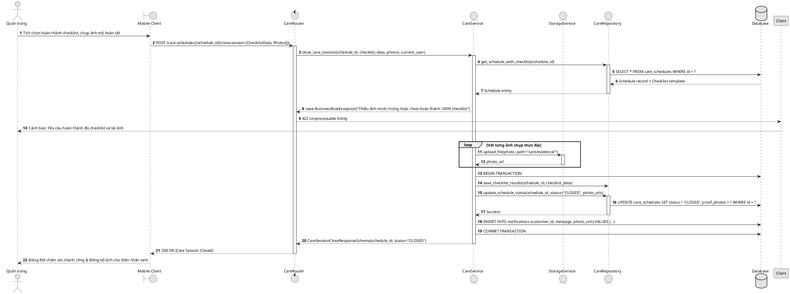
```plantuml
@startuml
skinparam monochrome true
skinparam defaultFontName Arial
skinparam defaultFontSize 12
autonumber

actor "Quản trang" as Caretaker
boundary "Mobile Client" as Mobile
control "CareRouter" as Router
entity "CareService" as Service
entity "StorageService" as Storage
entity "CareRepository" as CareRepo
database "Database" as DB

Caretaker -> Mobile: Tích chọn hoàn thành checklist, chụp ảnh mộ hoàn tất
Mobile -> Router: POST /care-schedules/{schedule_id}/close-session (ChecklistData, Photos[])
activate Router

Router -> Service: close_care_session(schedule_id, checklist_data, photos, current_user)
activate Service

Service -> CareRepo: get_schedule_with_checklist(schedule_id)
activate CareRepo
CareRepo -> DB: SELECT * FROM care_schedules WHERE id = ?
DB --> CareRepo: Schedule record + Checklist template
CareRepo --> Service: Schedule entity
deactivate CareRepo

alt Chưa hoàn thành đủ checklist hoặc thiếu ảnh minh chứng
    Service --> Router: raise BusinessRuleException("Thiếu ảnh minh chứng hoặc chưa hoàn thành 100% checklist")
    Router --> Client: 422 Unprocessable Entity
    Client --> Caretaker: Cảnh báo: Yêu cầu hoàn thành đủ checklist và tải ảnh
else Đầy đủ điều kiện nghiệm thu
    loop Với từng ảnh chụp thực địa
        Service -> Storage: upload_file(photo, path="care/evidence/")
        activate Storage
        Storage --> Service: photo_url
        deactivate Storage
    end

    Service -> DB: BEGIN TRANSACTION

    Service -> CareRepo: save_checklist_results(schedule_id, checklist_data)
    Service -> CareRepo: update_schedule_status(schedule_id, status="CLOSED", photo_urls)
    activate CareRepo
    CareRepo -> DB: UPDATE care_schedules SET status = 'CLOSED', proof_photos = ? WHERE id = ?
    CareRepo --> Service: Success
    deactivate CareRepo

    Service -> DB: INSERT INTO notifications (customer_id, message, photo_urls) VALUES (...)
    Service -> DB: COMMIT TRANSACTION

    Service --> Router: CareSessionCloseResponseSchema(schedule_id, status="CLOSED")
    deactivate Service

    Router --> Mobile: 200 OK (Care Session Closed)
    deactivate Router
    Mobile --> Caretaker: Đóng đợt chăm sóc thành công & Đồng bộ ảnh cho thân nhân xem
@enduml
```

#### Nguồn chữ TT10 — L3 image10

```plantuml
@startuml
skinparam monochrome true
skinparam defaultFontName Arial
skinparam defaultFontSize 12
autonumber

actor "Kế toán" as Accountant
boundary "Web Client" as Client
control "BillingRouter" as Router
entity "BillingService" as Service
entity "BillingRepository" as BillingRepo
entity "InvoicePDFGenerator" as PDFGen
database "Database" as DB

Accountant -> Client: Nhập số tiền thực nhận, ngày giao dịch và mã đối soát
Client -> Router: POST /billing/receivables/{receivable_id}/payments (PaymentCreateSchema)
activate Router

Router -> Service: record_payment(receivable_id, payment_data, current_user)
activate Service

Service -> BillingRepo: get_receivable_by_id(receivable_id)
activate BillingRepo
BillingRepo -> DB: SELECT * FROM receivables WHERE id = ? FOR UPDATE
DB --> BillingRepo: Receivable record (total_amount, paid_amount)
BillingRepo --> Service: Receivable entity
deactivate BillingRepo

Service -> DB: BEGIN TRANSACTION

Service -> BillingRepo: insert_payment_transaction(receivable_id, payment_data.amount, payment_data.method)
activate BillingRepo
BillingRepo -> DB: INSERT INTO payments (...) VALUES (...)
BillingRepo --> Service: payment_id
deactivate BillingRepo

Service -> Service: calculate_remaining_balance(receivable, payment_data.amount)

alt Đã thanh toán đủ 100% công nợ
    Service -> BillingRepo: update_receivable_status(receivable_id, status="PAID")
else Mới thanh toán một phần
    Service -> BillingRepo: update_receivable_status(receivable_id, status="PARTIALLY_PAID")
end

Service -> DB: COMMIT TRANSACTION

Service -> PDFGen: generate_receipt_pdf(payment_id, receivable_id)
activate PDFGen
PDFGen --> Service: receipt_pdf_bytes, receipt_number
deactivate PDFGen

Service -> DB: INSERT INTO invoices (receipt_number, payment_id, ...) VALUES (...)
Service -> DB: INSERT INTO audit_logs (...) VALUES (...)

Service --> Router: PaymentRecordResponseSchema(payment_id, remaining_balance, receipt_number)
deactivate Service

Router --> Client: 200 OK (Payment Recorded & Receipt Generated)
deactivate Router
Client --> Accountant: Hiển thị trạng thái đã thu tiền & Cho phép tải/in hóa đơn biên lai PDF
@enduml
```

#### Nguồn chữ CL01 — L3 image11

```plantuml
@startuml
skinparam monochrome true
skinparam defaultFontName Arial
skinparam defaultFontSize 11
skinparam classAttributeIconSize 0
skinparam linetype ortho

package "Phân hệ Không gian & Mộ" {
  class Zone
  class Row
  class Plot
  class PlotSlot
  class PlotType
}

package "Phân hệ Khách hàng & Người mất" {
  class Customer
  class DeceasedProfile
  class DeathCertificate
}

package "Phân hệ Hợp đồng & Phụ lục" {
  abstract class Contract
  class LandPurchaseContract
  class ExhumationContract
  class CremationContract
  class TransferContract

  abstract class ContractAnnex
  class BurialAnnex
  class CareAnnex
  class ConstructionAnnex
}

package "Phân hệ Vận hành: Thi công & Chăm sóc" {
  class ConstructionOrder
  class ConstructionTask
  class CarePackage
  class CareSchedule
  class CareChecklistItem
}

package "Phân hệ Tài chính" {
  class Receivable
  class Payment
  class Invoice
  class DiscountRecord
}

package "Phân hệ Quản trị & Hệ thống" {
  class User
  class Role
  class AuditLog
  class PriceList
}

Zone "1" *-- "1..*" Row
Row "1" *-- "1..*" Plot
Plot "1" *-- "1..*" PlotSlot
Plot "0..*" --> "1" PlotType

Customer "1" --> "0..*" Plot : "sở hữu"
Customer "1" --> "0..*" Contract : "đứng tên"
DeceasedProfile "1" *-- "0..1" DeathCertificate

Contract <|-- LandPurchaseContract
Contract <|-- ExhumationContract
Contract <|-- CremationContract
Contract <|-- TransferContract

Contract "1" *-- "0..*" ContractAnnex

ContractAnnex <|-- BurialAnnex
ContractAnnex <|-- CareAnnex
ContractAnnex <|-- ConstructionAnnex

BurialAnnex "0..*" --> "1" DeceasedProfile : "an táng"
BurialAnnex "0..*" --> "1" Plot : "vị trí huyệt"
ExhumationContract "0..*" --> "1" Plot : "bóc mộ"
LandPurchaseContract "0..*" --> "1" Plot : "mua đất"
TransferContract "0..*" --> "1" Plot : "chuyển nhượng"

ConstructionAnnex "1" --> "0..1" ConstructionOrder
ConstructionOrder "1" *-- "1..*" ConstructionTask

CareAnnex "0..*" --> "1" CarePackage
CarePackage "1" --> "0..*" CareSchedule
CareSchedule "1" *-- "1..*" CareChecklistItem

Contract "1" --> "0..*" Receivable
Receivable "1" *-- "0..*" Payment
Payment "1" --> "0..1" Invoice
Receivable "1" *-- "0..1" DiscountRecord

User "1" --> "0..*" Role
User "1" --> "0..*" AuditLog
PriceList "1" --> "0..*" Contract : "áp giá"
@enduml
```

#### Nguồn chữ CL02 — L3 image12

```plantuml
@startuml
skinparam monochrome true
skinparam defaultFontName Arial
skinparam defaultFontSize 11
skinparam classAttributeIconSize 0

enum PlotStatus {
  EMPTY_UNSOLD
  OWNED_EMPTY
  UNDER_CONSTRUCTION
  OCCUPIED
  UNDER_EXHUMATION
}

enum SlotStatus {
  EMPTY
  OCCUPIED
}

class Zone {
  - zone_id: Integer
  - zone_code: String
  - zone_name: String
  - total_rows: Integer
  - description: String
  + createRow(row_code: String): Row
  + getRows(): List<Row>
  + calculateCapacity(): Integer
}

class Row {
  - row_id: Integer
  - row_code: String
  - zone_id: Integer
  - total_plots: Integer
  + createPlot(plot_data: Object): Plot
  + getPlots(): List<Plot>
}

class PlotType {
  - type_id: Integer
  - type_name: String
  - default_slots: Integer
  - length: Float
  - width: Float
  - description: String
  + updateDimension(length: Float, width: Float): Void
  + updateSlots(slots: Integer): Void
}

class Plot {
  - plot_id: Integer
  - plot_code: String
  - row_id: Integer
  - type_id: Integer
  - owner_id: Integer
  - latitude: Float
  - longitude: Float
  - status: PlotStatus
  - is_kim_tinh: Boolean
  - is_locked: Boolean
  - created_at: DateTime
  - updated_at: DateTime
  + setGpsCoordinates(latitude: Float, longitude: Float): Void
  + assignOwner(customer_id: Integer): Void
  + removeOwner(): Void
  + lockForever(): Void
  + resetToOwnedEmpty(): Void
  + isAvailableForBurial(): Boolean
  + isEligibleForTransfer(): Boolean
  + isEligibleForExhumation(): Boolean
  + getNavigationCoordinates(): String
}

class PlotSlot {
  - slot_id: Integer
  - plot_id: Integer
  - slot_number: Integer
  - status: SlotStatus
  - current_deceased_id: Integer
  + occupySlot(deceased_id: Integer): Void
  + releaseSlot(): Void
  + isAvailable(): Boolean
}

Zone "1" *-- "1..*" Row : bao gồm
Row "1" *-- "1..*" Plot : bao gồm
Plot "1" *-- "1..*" PlotSlot : chia thành
Plot "0..*" --> "1" PlotType : thuộc loại
@enduml
```

#### Nguồn chữ CL03 — L3 image13

```plantuml
@startuml
skinparam monochrome true
skinparam defaultFontName Arial
skinparam defaultFontSize 11
skinparam classAttributeIconSize 0

enum Gender {
  MALE
  FEMALE
  OTHER
}

class Customer {
  - customer_id: Integer
  - customer_code: String
  - full_name: String
  - citizen_id: String
  - phone_number: String
  - email: String
  - address: String
  - created_at: DateTime
  + updateContactInfo(phone: String, email: String, address: String): Void
  + getOwnedPlots(): List<Plot>
  + getContractHistory(): List<Contract>
}

class DeceasedProfile {
  - deceased_id: Integer
  - deceased_code: String
  - full_name: String
  - gender: Gender
  - date_of_birth: Date
  - date_of_death: Date
  - hometown: String
  - religion: String
  - has_death_certificate: Boolean
  - created_at: DateTime
  + attachDeathCertificate(cert: DeathCertificate): Void
  + isEligibleForBurial(): Boolean
  + getProfileSummary(): String
}

class DeathCertificate {
  - cert_id: Integer
  - deceased_id: Integer
  - certificate_number: String
  - issuing_authority: String
  - issue_date: Date
  - scan_file_url: String
  - is_verified: Boolean
  - verified_at: DateTime
  + verifyCertificate(): Boolean
  + updateScanUrl(url: String): Void
}

class CustomerDeceasedRelation {
  - relation_id: Integer
  - customer_id: Integer
  - deceased_id: Integer
  - relationship_type: String
  - is_primary_contact: Boolean
  + updateRelationship(new_type: String): Void
}

Customer "1" -- "0..*" CustomerDeceasedRelation
DeceasedProfile "1" -- "0..*" CustomerDeceasedRelation
DeceasedProfile "1" *-- "0..1" DeathCertificate : bắt buộc có để chôn
@enduml
```

#### Nguồn chữ CL04 — L3 image14

```plantuml
@startuml
skinparam monochrome true
skinparam defaultFontName Arial
skinparam defaultFontSize 11
skinparam classAttributeIconSize 0

enum ContractType {
  LAND_PURCHASE
  EXHUMATION
  CREMATION
  TRANSFER
}

enum ContractStatus {
  DRAFT
  PENDING_SIGN
  ACTIVE
  CANCELLED
  TRANSFERRED
}

enum AnnexType {
  BURIAL
  CARE
  CONSTRUCTION
}

enum AnnexStatus {
  DRAFT
  PENDING_SIGN
  ACTIVE
  COMPLETED
  CANCELLED
}

abstract class Contract {
  # contract_id: Integer
  # contract_code: String
  # contract_type: ContractType
  # customer_id: Integer
  # status: ContractStatus
  # total_amount: Float
  # signed_scan_url: String
  # created_by_user_id: Integer
  # created_at: DateTime
  # updated_at: DateTime
  + printContractPdf(): Byte[]
  + attachSignedDocument(scan_url: String): Void
  + activateContract(): Void
  + cancelContract(): Void
  + getAnnexes(): List<ContractAnnex>
}

class LandPurchaseContract {
  - plot_id: Integer
  - land_unit_price: Float
  + validatePlotAvailability(): Boolean
  + executeOwnershipTransfer(): Void
}

class ExhumationContract {
  - plot_id: Integer
  - current_deceased_id: Integer
  - exhumation_date: Date
  - exhumation_fee: Float
  - reason: String
  + validateOwnership(requester_id: Integer): Boolean
  + validateNonKimTinh(): Boolean
}

class CremationContract {
  - deceased_id: Integer
  - cremation_date: DateTime
  - package_service_code: String
  - urn_storage_option: String
  - service_fee: Float
  + validateDeathCertificate(): Boolean
}

class TransferContract {
  - plot_id: Integer
  - seller_id: Integer
  - buyer_id: Integer
  - commission_fee: Float
  + validatePlotEligibility(): Boolean
  + executeTransfer(): Void
}

Contract <|-- LandPurchaseContract
Contract <|-- ExhumationContract
Contract <|-- CremationContract
Contract <|-- TransferContract

abstract class ContractAnnex {
  # annex_id: Integer
  # annex_code: String
  # contract_id: Integer
  # annex_type: AnnexType
  # status: AnnexStatus
  # additional_amount: Float
  # signed_scan_url: String
  # valid_from: Date
  # valid_to: Date
  # created_at: DateTime
  + printAnnexPdf(): Byte[]
  + attachSignedDocument(scan_url: String): Void
  + activateAnnex(): Void
}

class BurialAnnex {
  - deceased_id: Integer
  - plot_id: Integer
  - slot_id: Integer
  - burial_date: DateTime
  - is_kim_tinh: Boolean
  - construction_notes: String
  + validateDeathCertificate(): Boolean
  + checkPlotAvailability(): Boolean
  + executeBurialRegistration(): Void
}

class CareAnnex {
  - package_id: Integer
  - cycle_months: Integer
  - recurring_price: Float
  + generateSchedules(): Void
}

class ConstructionAnnex {
  - plot_id: Integer
  - estimated_start_date: Date
  - estimated_end_date: Date
  - checklist_specifications: String
  + createConstructionOrder(): Void
}

ContractAnnex <|-- BurialAnnex
ContractAnnex <|-- CareAnnex
ContractAnnex <|-- ConstructionAnnex

Contract "1" *-- "0..*" ContractAnnex : chứa các phụ lục
@enduml
```

#### Nguồn chữ CL05 — L3 image15

```plantuml
@startuml
skinparam monochrome true
skinparam defaultFontName Arial
skinparam defaultFontSize 11
skinparam classAttributeIconSize 0

enum ConstructionStatus {
  PENDING
  IN_PROGRESS
  COMPLETED
  OVERDUE
}

enum TaskStatus {
  TODO
  DOING
  DONE
}

enum CareCycle {
  MONTHLY
  QUARTERLY
  YEARLY
}

enum CareScheduleStatus {
  SCHEDULED
  ASSIGNED
  IN_PROGRESS
  CLOSED
  OVERDUE
}

class ConstructionOrder {
  - order_id: Integer
  - annex_id: Integer
  - plot_id: Integer
  - supervisor_id: Integer
  - start_date: Date
  - expected_end_date: Date
  - actual_end_date: Date
  - overall_progress: Float
  - status: ConstructionStatus
  + addTask(task_name: String): ConstructionTask
  + recalculateProgress(): Float
  + completeOrder(): Void
  + checkOverdue(): Boolean
}

class ConstructionTask {
  - task_id: Integer
  - order_id: Integer
  - task_name: String
  - assigned_team_or_contractor: String
  - status: TaskStatus
  - proof_media_url: String
  - field_notes: String
  - completed_at: DateTime
  + assignTo(team_name: String): Void
  + markDone(proof_url: String, notes: String): Void
}

ConstructionOrder "1" *-- "1..*" ConstructionTask : gồm các đầu việc

class CarePackage {
  - package_id: Integer
  - package_code: String
  - package_name: String
  - cycle_type: CareCycle
  - default_tasks_json: String
  - unit_price: Float
  - is_active: Boolean
  + updatePrice(new_price: Float): Void
}

class CareSchedule {
  - schedule_id: Integer
  - care_annex_id: Integer
  - plot_id: Integer
  - package_id: Integer
  - caretaker_id: Integer
  - scheduled_date: Date
  - performed_date: Date
  - status: CareScheduleStatus
  - closed_at: DateTime
  + assignCaretaker(user_id: Integer): Void
  + closeSchedule(): Void
  + isFullyVerified(): Boolean
}

class CareChecklistItem {
  - item_id: Integer
  - schedule_id: Integer
  - task_description: String
  - is_completed: Boolean
  - field_notes: String
  + markCompleted(): Void
}

class CareMediaEvidence {
  - evidence_id: Integer
  - schedule_id: Integer
  - media_url: String
  - uploaded_at: DateTime
  - caption: String
}

CarePackage "1" --> "0..*" CareSchedule : áp dụng
CareSchedule "1" *-- "1..*" CareChecklistItem : gồm checklist
CareSchedule "1" *-- "1..*" CareMediaEvidence : minh chứng ảnh
@enduml
```

#### Nguồn chữ CL06 — L3 image16

```plantuml
@startuml
skinparam monochrome true
skinparam defaultFontName Arial
skinparam defaultFontSize 11
skinparam classAttributeIconSize 0

enum ReceivableStatus {
  UNPAID
  PARTIALLY_PAID
  PAID
  CANCELLED
}

enum PaymentMethod {
  CASH
  BANK_TRANSFER
  VIET_QR
}

enum DiscountType {
  PERCENTAGE
  FIXED_AMOUNT
}

class Receivable {
  - receivable_id: Integer
  - contract_id: Integer
  - annex_id: Integer
  - customer_id: Integer
  - original_amount: Float
  - discount_amount: Float
  - final_payable_amount: Float
  - total_paid_amount: Float
  - status: ReceivableStatus
  - due_date: Date
  - created_at: DateTime
  + applyDiscount(discount_record: DiscountRecord): Void
  + recordPayment(payment: Payment): Void
  + getRemainingBalance(): Float
  + checkOverdue(): Boolean
}

class DiscountRecord {
  - discount_id: Integer
  - receivable_id: Integer
  - discount_type: DiscountType
  - discount_value: Float
  - calculated_amount: Float
  - justification_reason: String
  - approved_by_user_id: Integer
  - applied_at: DateTime
  + validateDiscountLimit(): Boolean
}

class Payment {
  - payment_id: Integer
  - receivable_id: Integer
  - paid_amount: Float
  - payment_method: PaymentMethod
  - transaction_reference: String
  - paid_at: DateTime
  - recorded_by_user_id: Integer
  + generateReceipt(): Invoice
}

class Invoice {
  - invoice_id: Integer
  - invoice_number: String
  - payment_id: Integer
  - issued_date: DateTime
  - total_amount_in_words: String
  - pdf_file_url: String
  + exportPdf(): Byte[]
}

Receivable "1" *-- "0..1" DiscountRecord : áp dụng
Receivable "1" *-- "0..*" Payment : thanh toán
Payment "1" --> "0..1" Invoice : xuất chứng từ
@enduml
```

#### Nguồn chữ CL07 — L3 image17

```plantuml
@startuml
skinparam monochrome true
skinparam defaultFontName Arial
skinparam defaultFontSize 11
skinparam classAttributeIconSize 0

enum ExportFormat {
  PDF
  EXCEL
}

class User {
  - user_id: Integer
  - username: String
  - password_hash: String
  - full_name: String
  - email: String
  - phone_number: String
  - is_active: Boolean
  - created_at: DateTime
  + verifyPassword(password: String): Boolean
  + assignRole(role: Role): Void
  + hasPermission(permission_code: String): Boolean
}

class Role {
  - role_id: Integer
  - role_name: String
  - description: String
  + addPermission(perm: Permission): Void
}

class Permission {
  - permission_id: Integer
  - permission_code: String
  - resource: String
  - action: String
}

class AuditLog {
  - log_id: Integer
  - user_id: Integer
  - action_type: String
  - target_entity: String
  - target_id: Integer
  - pre_change_values: String
  - post_change_values: String
  - ip_address: String
  - timestamp: DateTime
  + exportLogRecord(): String
}

class PriceList {
  - price_list_id: Integer
  - price_list_name: String
  - effective_from_date: Date
  - effective_to_date: Date
  - is_active: Boolean
  + getApplicablePrice(item_code: String): Float
}

class PriceItem {
  - item_id: Integer
  - price_list_id: Integer
  - item_code: String
  - item_name: String
  - unit_price: Float
  - unit: String
}

class ReportQuery {
  - query_id: Integer
  - report_type: String
  - from_date: Date
  - to_date: Date
  - filter_criteria: String
  + executeRevenueQuery(): Object
  + executePlotOccupancyQuery(): Object
  + executePerformanceQuery(): Object
  + exportDocument(format: ExportFormat): Byte[]
}

User "0..*" -- "1..*" Role
Role "1" *-- "1..*" Permission
User "1" --> "0..*" AuditLog : ghi vết
PriceList "1" *-- "1..*" PriceItem : gồm các biểu phí
@enduml
```


<a id="sql-rang-buoc"></a>
## 12 SQL ban đầu: đã ràng buộc và chưa ràng buộc

Nguồn SQL tạo 37 bảng, **58 FK**, 13 index truy vấn tường minh và 2 trigger. Đây là bản thiết kế đính kèm, không phải kết quả kiểm tra DB đang chạy trên máy người dùng. **Không chạy lại phần khởi tạo SQL:** nguồn có bước xóa/tạo DB; người dùng đã có DB. Phần này mô tả cấu trúc và khoảng thiếu để agent đối chiếu bằng truy vấn đọc/migration phù hợp khi có nhiệm vụ riêng.

### 12.1 Danh mục mọi FK thực sự có

Mỗi bản ghi con có FK NOT NULL phải trỏ đúng một bản ghi cha; FK nullable có thể không trỏ bản ghi nào. Phía cha thường có 0..n con, trừ FK đồng thời PK/UNIQUE nêu ở mục 12.2. FK không bắt cha phải có ít nhất một con. Hành vi xóa trong bảng là hành vi vật lý; không suy ra được phép xóa hợp đồng/phụ lục/thanh toán đã có nghiệp vụ.

| Bảng con | Cột FK | Đích tham chiếu | Khi xóa bản ghi cha | Tên ràng buộc SQL |
| --- | --- | --- | --- | --- |
| role_permissions | role_id | roles.role_id | CASCADE | FK_role_permissions_role |
| role_permissions | permission_id | permissions.permission_id | CASCADE | FK_role_permissions_perm |
| user_roles | user_id | users.user_id | CASCADE | FK_user_roles_user |
| user_roles | role_id | roles.role_id | CASCADE | FK_user_roles_role |
| price_items | price_list_id | price_lists.price_list_id | CASCADE | FK_price_items_list |
| death_certificates | deceased_id | deceased_profiles.deceased_id | NO ACTION (mặc định) | FK_death_cert_deceased |
| customer_deceased_relations | customer_id | customers.customer_id | CASCADE | FK_relation_customer |
| customer_deceased_relations | deceased_id | deceased_profiles.deceased_id | CASCADE | FK_relation_deceased |
| rows | zone_id | zones.zone_id | CASCADE | FK_rows_zone |
| plots | row_id | rows.row_id | NO ACTION (mặc định) | FK_plots_row |
| plots | type_id | plot_types.type_id | NO ACTION (mặc định) | FK_plots_type |
| plots | owner_id | customers.customer_id | NO ACTION (mặc định) | FK_plots_owner |
| plot_slots | plot_id | plots.plot_id | CASCADE | FK_plot_slots_plot |
| plot_slots | current_deceased_id | deceased_profiles.deceased_id | NO ACTION (mặc định) | FK_plot_slots_deceased |
| burial_histories | plot_id | plots.plot_id | NO ACTION (mặc định) | FK_burial_hist_plot |
| burial_histories | slot_id | plot_slots.slot_id | NO ACTION (mặc định) | FK_burial_hist_slot |
| burial_histories | deceased_id | deceased_profiles.deceased_id | NO ACTION (mặc định) | FK_burial_hist_deceased |
| contracts | customer_id | customers.customer_id | NO ACTION (mặc định) | FK_contracts_customer |
| contracts | created_by_user_id | users.user_id | NO ACTION (mặc định) | FK_contracts_user |
| land_purchase_contracts | contract_id | contracts.contract_id | CASCADE | FK_lpc_contract |
| land_purchase_contracts | plot_id | plots.plot_id | NO ACTION (mặc định) | FK_lpc_plot |
| exhumation_contracts | contract_id | contracts.contract_id | CASCADE | FK_exh_contract |
| exhumation_contracts | plot_id | plots.plot_id | NO ACTION (mặc định) | FK_exh_plot |
| exhumation_contracts | current_deceased_id | deceased_profiles.deceased_id | NO ACTION (mặc định) | FK_exh_deceased |
| cremation_contracts | contract_id | contracts.contract_id | CASCADE | FK_crem_contract |
| cremation_contracts | deceased_id | deceased_profiles.deceased_id | NO ACTION (mặc định) | FK_crem_deceased |
| transfer_contracts | contract_id | contracts.contract_id | CASCADE | FK_trans_contract |
| transfer_contracts | plot_id | plots.plot_id | NO ACTION (mặc định) | FK_trans_plot |
| transfer_contracts | seller_id | customers.customer_id | NO ACTION (mặc định) | FK_trans_seller |
| transfer_contracts | buyer_id | customers.customer_id | NO ACTION (mặc định) | FK_trans_buyer |
| contract_annexes | contract_id | contracts.contract_id | CASCADE | FK_annexes_contract |
| burial_annexes | annex_id | contract_annexes.annex_id | CASCADE | FK_ba_annex |
| burial_annexes | deceased_id | deceased_profiles.deceased_id | NO ACTION (mặc định) | FK_ba_deceased |
| burial_annexes | plot_id | plots.plot_id | NO ACTION (mặc định) | FK_ba_plot |
| burial_annexes | slot_id | plot_slots.slot_id | NO ACTION (mặc định) | FK_ba_slot |
| care_annexes | annex_id | contract_annexes.annex_id | CASCADE | FK_ca_annex |
| construction_annexes | annex_id | contract_annexes.annex_id | CASCADE | FK_csa_annex |
| construction_annexes | plot_id | plots.plot_id | NO ACTION (mặc định) | FK_csa_plot |
| construction_orders | annex_id | contract_annexes.annex_id | CASCADE | FK_co_annex |
| construction_orders | plot_id | plots.plot_id | NO ACTION (mặc định) | FK_co_plot |
| construction_orders | supervisor_id | users.user_id | NO ACTION (mặc định) | FK_co_supervisor |
| construction_tasks | order_id | construction_orders.order_id | CASCADE | FK_ct_order |
| care_schedules | care_annex_id | care_annexes.annex_id | CASCADE | FK_cs_annex |
| care_schedules | plot_id | plots.plot_id | NO ACTION (mặc định) | FK_cs_plot |
| care_schedules | package_id | care_packages.package_id | NO ACTION (mặc định) | FK_cs_package |
| care_schedules | caretaker_id | users.user_id | NO ACTION (mặc định) | FK_cs_caretaker |
| care_checklist_items | schedule_id | care_schedules.schedule_id | CASCADE | FK_ccl_schedule |
| care_media_evidences | schedule_id | care_schedules.schedule_id | CASCADE | FK_cme_schedule |
| receivables | contract_id | contracts.contract_id | CASCADE | FK_rec_contract |
| receivables | annex_id | contract_annexes.annex_id | NO ACTION | FK_rec_annex |
| receivables | customer_id | customers.customer_id | NO ACTION (mặc định) | FK_rec_customer |
| discount_records | receivable_id | receivables.receivable_id | CASCADE | FK_disc_receivable |
| discount_records | approved_by_user_id | users.user_id | NO ACTION (mặc định) | FK_disc_approver |
| payments | receivable_id | receivables.receivable_id | NO ACTION (mặc định) | FK_pay_receivable |
| payments | recorded_by_user_id | users.user_id | NO ACTION (mặc định) | FK_pay_recorder |
| invoices | payment_id | payments.payment_id | NO ACTION (mặc định) | FK_inv_payment |
| audit_logs | user_id | users.user_id | SET NULL | FK_audit_user |
| care_annexes | package_id | care_packages.package_id | NO ACTION (mặc định) | FK_care_annex_package |


### 12.2 Khóa duy nhất, kế thừa và CHECK

| Nhóm | Được SQL bảo đảm | Phạm vi/giới hạn |
|---|---|---|
| Định danh | `roles.role_name`, `permissions.permission_code`, `users.username`, `users.email`; `customers.customer_code`, `citizen_id`; `deceased_code`; `zone_code`; `plot_type_name`; `plot_code`; `contract_code`; `annex_code`; `care_package_code`; `invoice_number` có UNIQUE tương ứng. | Không xóa/gộp tự động người trùng tên. `users.email` bắt buộc và duy nhất; không nhầm với email liên hệ tùy chọn của khách hàng. |
| Khóa ghép | `rows(zone_id,row_code)`, `plot_slots(plot_id,slot_number)`, `customer_deceased_relations(customer_id,deceased_id)`, `price_items(price_list_id,item_code)` duy nhất; bảng nối RBAC có PK ghép hai đầu. | Không bảo đảm đủ số slot theo loại, không bảo đảm một primary contact duy nhất, không bảo đảm một lịch mỗi ô/kỳ. |
| Quan hệ 0..1 | `death_certificates.deceased_id`, `discount_records.receivable_id`, `invoices.payment_id` là FK UNIQUE. | Cha có thể chưa có con: hồ sơ người mất chờ giấy, khoản thu chưa giảm, payment chưa sinh file. |
| TPT | Bốn subtype HĐ có PK/FK `contract_id`; ba subtype PL có PK/FK `annex_id`. | Từng subtype tối đa một dòng cho base. SQL chưa bắt buộc đúng một subtype, chưa cấm cùng base có nhiều subtype khác nhau, chưa kiểm discriminator khớp. |
| Danh mục trạng thái | CHECK trên các enum trạng thái/loại/gender/chu kỳ/phương thức/loại giảm đã mô tả trong mục 5 và từ điển. | Chỉ kiểm giá trị hợp lệ, không kiểm đường chuyển trạng thái, actor, giấy tờ hoặc thời gian. |
| Số và tiến độ | Số slot mặc định >0; tiến độ 0..100; giá/khoản tiền được chỉ định không âm; payment >0; bên bán khác bên mua. | Không bảo đảm `final = original − discount`, `discount ≤ original`, paid bằng tổng ở mọi sự kiện, không cấp phép thu vượt; không có đủ CHECK hạn bắt đầu/kết thúc/GPS. |
| JSON | `care_packages.default_tasks_json` hợp lệ JSON; audit trước/sau NULL hoặc JSON hợp lệ. | JSON đúng cú pháp chưa bảo đảm có cấu trúc checklist đúng/đủ và không chứa secret. |
| Nguồn khoản thu | `contract_id IS NOT NULL OR annex_id IS NOT NULL`. | Đây là OR, không XOR: cho cả hai khác NULL; không cho cả hai NULL dù có customer. C13 phải chốt nghiệp vụ và xác định cách kiểm cùng căn cứ. |

### 12.3 Default không thay kiểm tra nghiệp vụ

- `death_certificates.is_verified` mặc định 1 và thời gian kiểm có default không chứng minh giấy đã được người có quyền đối soát. Agent không được dùng default này để bỏ luồng kiểm chứng tử.
- Các thời gian default của DB là thời điểm ghi nhận, không tự thay ngày ký, hiệu lực, thực hiện, giao dịch ngân hàng hoặc ngày chụp thực tế.
- Default số tiền 0/trạng thái nháp chỉ hỗ trợ tạo dữ liệu; không làm hồ sơ đủ điều kiện chuyển bước. Khoản tạo mới theo UC-6.1 vẫn yêu cầu số tiền dương.
- Khóa chính tự tăng là định danh kỹ thuật, không thay mã hồ sơ/chứng từ có quy tắc duy nhất; mẫu mã cụ thể chưa được quy định trong Lab.

### 12.4 Hai trigger: tác dụng chính xác

**`trg_plots_enforce_kim_tinh_immutability` — AFTER UPDATE trên plots.**

1. Nếu bản ghi cũ `is_locked=1` và bản mới `status='UNDER_EXHUMATION'`, báo lỗi 51000.
2. Nếu cũ đã khóa và mới `is_locked=0`, báo lỗi 51001.
3. Nếu mới `is_kim_tinh=1`, `status='OCCUPIED'`, chưa khóa thì đặt `is_locked=1`.

Trigger này **chưa bảo đảm toàn bộ** bất biến Kim Tĩnh: không phải guard INSERT/DELETE; không tự chặn tất cả thay đổi owner, cờ Kim Tĩnh, slot/người mất hoặc mọi trạng thái khác. Không thể viện lý do “đã có trigger” để bỏ kiểm tra trong mọi đường nghiệp vụ. Việc vẫn cho chăm sóc không phá kết cấu phải được phân biệt với bóc dỡ. C05 còn cần chốt phạm vi đối với ô nhiều slot.

**`trg_payments_sync_receivable_balance` — AFTER INSERT trên payments.**

1. Xác định các receivable có payment vừa chèn.
2. Tính tổng tất cả `paid_amount` của từng khoản đó.
3. Gán `total_paid_amount`; `PAID` khi tổng ≥ số phải trả, `PARTIALLY_PAID` khi >0, còn lại giữ status cũ.

Trigger không chạy khi sửa/xóa payment hoặc đổi chiết khấu/final; không kiểm khoản bị hủy, không tự xử lý hoàn tiền/tiền thừa, không đảm bảo tránh ghi trùng cùng giao dịch. Không thực hiện hoàn tiền bằng DELETE payment để “dư nợ tự về” vì trigger này không làm điều đó và sẽ mất lịch sử. Trường hợp final về 0 không có payment cần quy tắc riêng.

### 12.5 Index truy vấn có trong nguồn

| Index | Bảng | Cột |
| --- | --- | --- |
| IX_plots_coordinates | plots | latitude, longitude |
| IX_plots_status | plots | status |
| IX_plots_owner | plots | owner_id |
| IX_customers_citizen_id | customers | citizen_id |
| IX_customers_phone | customers | phone_number |
| IX_deceased_name | deceased_profiles | full_name |
| IX_contracts_customer | contracts | customer_id |
| IX_contracts_status | contracts | status |
| IX_annexes_contract | contract_annexes | contract_id |
| IX_annexes_valid_to | contract_annexes | valid_to |
| IX_receivables_due | receivables | due_date, status |
| IX_care_schedules_date | care_schedules | scheduled_date, status |
| IX_audit_logs_target | audit_logs | target_entity, target_id |


Các index này hỗ trợ đọc; không đồng nghĩa đã đạt NFR. Unique/PK còn sinh các index phục vụ ràng buộc theo SQL Server; con số 13 ở đây chỉ đếm các lệnh `CREATE NONCLUSTERED INDEX` tường minh của nguồn.

### 12.6 Khoảng cách giữa nghiệp vụ và schema

| Khoảng thiếu | Nghiệp vụ phải được bảo toàn khi agent thiết kế tiếp |
|---|---|
| Phân công và lực lượng thực hiện | Task mới có tên đội dạng text; ca chăm sóc gắn `caretaker_id` tới users. Chưa đủ danh sách người/tổ/ngoài, supervisor khác executor/confirmer, lịch bận/nghỉ, ngày mỗi task và lịch sử đổi phân công. Không xóa nghiệp vụ người ngoài để vừa schema. |
| Checklist bắt buộc và phiên bản | Chưa có cờ required rõ cho từng task/checklist, snapshot đầy đủ của gói/công việc theo hồ sơ và chính sách thay đổi sau nghiệm thu. Không tính đủ việc bằng một con số tiến độ nhập tự do. |
| Định kỳ, kỳ dịch vụ, chống sinh trùng | MONTHLY/QUARTERLY/YEARLY chưa đủ ngày/tuần trong UC. `cycle_months` chưa phân biệt thời hạn và nhịp thực hiện. Chưa có khóa unique của ô/kỳ/căn cứ để chống job lặp. |
| Quan hệ nhất quán chéo | FK tồn tại chưa bảo đảm slot thuộc plot được chọn; deceased/owner/customer đúng căn cứ; schedule.package đúng annex.package; order.plot đúng phạm vi annex; nguồn nợ cùng HĐ/khách. Cần kiểm nhất quán trước ghi. |
| Một người mất ở một vị trí hiện tại | Chưa có UNIQUE trên `plot_slots.current_deceased_id`. Không được sử dụng khả năng insert của DB làm chính sách cho an táng đồng thời hai vị trí. |
| Quyền, giữ chỗ và cạnh tranh | Bảng plot chưa lưu đủ reservation owner/TTL/định danh giao dịch giữ chỗ; schema chưa cưỡng chế tính duy nhất của giao dịch đang mở. Cần thiết kế có căn cứ, không chỉ kiểm form. |
| File, publication, thông báo | URL ở bảng không lưu đầy đủ checksum/version/nội dung kiểm/kết quả upload/quyền; chưa có notification/publication/outbox. Không đưa file ký hoặc ảnh private ra public để lấp khoảng thiếu. Các thực thể bổ sung là đề xuất, không được gọi bảng gốc. |
| Chứng từ và người xác nhận | Chứng tử tự default verified; burial history dùng tên/người thực hiện chưa đủ mọi FK trách nhiệm. Cần giữ ai kiểm giấy, ai xác nhận hiện trường, ngày thực tế và bằng chứng tương ứng. |
| TPT và hiệu lực | Enum không cưỡng chế đúng một subtype/các điều kiện chuyển trạng thái; chưa có đủ tính bất biến bản ký, snapshot giá, thời hạn hợp lệ và hệ quả hủy sau ACTIVE. |
| Catalog loại HĐ và mẫu | UC-8.4 yêu cầu cấu hình loại/mẫu, SQL chỉ có discriminator bốn loại, chưa có bảng mẫu/version riêng. Không đổi enum hoặc tạo giao dịch loại mới chỉ vì sửa tiêu đề mẫu. |
| Lịch sử quyền, tài chính, audit | Thay owner cần căn cứ/lịch sử; khoản thu chưa có FK người tạo dù L4 nói có; audit target là tham chiếu động và bảng chưa được cơ chế chống sửa bảo vệ. Tiền thu/công thức/hoàn tiền cần đầy đủ sự kiện và audit. |
| Độ chính xác hồ sơ | Khách chưa có ngày sinh; người mất có DATE nhưng UC nói năm sinh/ngày sinh. Không tự tạo ngày giả. |

Các khoảng thiếu là kết quả đối chiếu **tài liệu thiết kế**, không kết luận repo mới nhất chưa sửa chúng. Khi có nhiệm vụ triển khai, agent cần đối chiếu schema và code hiện hữu trước khi đề xuất migration.

<a id="kiem-chung"></a>
## 13 Tình huống kiểm chứng và quy ước làm việc cho agent

### 13.1 Tình huống chấp nhận nghiệp vụ

Các tình huống sau là **kiểm chứng dẫn xuất** từ yêu cầu, không thay chi tiết UC. Với mục cần chốt, chỉ kiểm phần đã rõ, không tự chốt phần còn thiếu bằng cách viết test theo ý mình.

| Mã | Dữ liệu / thao tác | Kết quả nghiệp vụ phải quan sát được | Căn cứ |
|---|---|---|---|
| KT01 | Hai người mất cùng tên khác ngày mất/vị trí | Tra cứu phân biệt được, không tự gộp hồ sơ. | UC-1.4/2.2 |
| KT02 | Khách không đăng nhập tìm mộ | Tra và dẫn đường được trong phạm vi public; không có CCCD/HĐ/công nợ/file private. | UC-1/1.4/1.5; U |
| KT03 | Mộ chưa có GPS hoặc GPS ngoài phạm vi hợp lý | Không dẫn tới tọa độ giả; báo thiếu/sai và cung cấp mã vị trí/hỗ trợ. | UC-1.1/1.5 |
| KT04 | Sửa/xóa khu, loại hoặc giảm số slot đã dùng | Bảo toàn ràng buộc nghiệp vụ và hồ sơ; từ chối khi vi phạm điều kiện của UC. | UC-1.1/1.2 |
| KT05 | Mua đất khi chưa có người mất | Tạo được HĐ mua, không ép hồ sơ người mất/chứng tử. | UC-3.1; AD02 |
| KT06 | Hai Marketing cùng giữ/mua một ô | Chỉ một giao dịch hợp lệ chiếm giữ; bên kia nhận xung đột và dữ liệu hiện thời. | NV02; TT02 |
| KT07 | Chỉ in HĐ hoặc upload scan lỗi | Chưa ACTIVE; chưa chuyển quyền; không tạo khoản thu trùng. | UC-3.2/3.3 |
| KT08 | Xác nhận bản mua đã ký hợp lệ rồi gửi lại cùng thao tác | HĐ ACTIVE, đúng chủ, ô OWNED_EMPTY; không tạo hai khoản thu hay đổi trạng thái lần nữa. | AD02; TT03; NV05/21 |
| KT09 | Lưu hồ sơ người mất thiếu chứng tử, rồi tạo PL an táng | Hồ sơ có thể chờ bổ sung; chặn lưu PL an táng tới khi đủ giấy hợp lệ. | UC-2.2/3.4 |
| KT10 | Đủ giấy/PL ký, xây xong nhưng chưa hạ huyệt | Chưa ghi BURIED/chiếm dụng chỉ dựa vào 100% xây. | QT03; C04 |
| KT11 | Xác nhận an táng thực tế đúng slot | Lịch sử, slot, trạng thái ô, người xác nhận và bằng chứng nhất quán. | UC-1.3; NV07/11 |
| KT12 | Ô Kim Tĩnh đã chôn; gọi cải táng/chuyển chủ/mở khóa bằng actor quyền rộng | Từ chối các tác động bị cấm; không vượt bất biến bằng ADMIN. | UC-1.3/3.4; C05 |
| KT13 | Người thân không phải chủ yêu cầu cải táng | Không cho lập theo quyền chủ chỉ từ quan hệ thân nhân. | AD03; TT05 |
| KT14 | Cải táng hoàn tất một slot ở ô nhiều slot | Ghi EXHUMED và giải phóng đúng slot; giữ owner/slot khác; chỉ trống toàn ô khi không còn người. | L4; NV08/11 |
| KT15 | Chuyển nhượng ô còn người, sai chủ hoặc hai bên trùng nhau | Từ chối; không đổi owner. | UC-3.1; SQL transfer |
| KT16 | Chuyển nhượng đủ chữ ký ô trống | Chủ mới đúng; giữ lịch sử/căn cứ cũ; không tự đổi khách trên HĐ cũ. Nhu cầu PL sau đó được xử lý theo C06. | AD05; C06 |
| KT17 | Lập HĐ hỏa táng có người mất/giấy, không có ô | Được lập; không chiếm ô hay tạo lịch sử chôn chỉ từ hỏa táng. | AD04 |
| KT18 | Quản trang A giao tổ ngoài, Quản trang B giám sát theo quyền | Lưu đúng người phân công/giám sát/tổ thực hiện/xác nhận; tổ ngoài không bắt tạo account. | UC-4.2; U; C17 |
| KT19 | Phân ca chăm sóc khi người nhận đang bận/nghỉ | Không lưu khi xung đột chưa được giải quyết. | UC-5.3 |
| KT20 | Cập nhật 100% nhưng còn việc bắt buộc chưa nghiệm thu | Từ chối kết thúc hoặc giữ chưa đủ; không bị giá trị nhập tay vượt kiểm. | UC-4.4; C18 |
| KT21 | Gói mẫu đổi giá/việc sau đăng ký | Hồ sơ đang hiệu lực giữ thỏa thuận đã chốt; không bị hồi tố. | UC-8.5/8.6; NV20 |
| KT22 | Job sinh lịch chạy lại, hoặc đổi ngày một ca | Không tạo thêm cùng ô/kỳ/căn cứ. Tần suất lấy policy đã chốt, không đoán `cycle_months`. | UC-5.2; C08/C10 |
| KT23 | Checklist đủ nhưng ảnh thiếu, upload lỗi hoặc sai mộ | Chưa đóng ca; nêu rõ phần thiếu và hỗ trợ gửi lại. | UC-5.4 |
| KT24 | Ca đóng thành công | Có kết quả/lịch sử; thân nhân thấy phần được công bố; không lộ ảnh chứa hồ sơ/CCCD nội bộ. | AD08; TT09; C09 |
| KT25 | Mạng mất khi upload/confirm rồi gửi lại | Không báo hoàn tất giả; sau retry có một kết quả nghiệp vụ đúng, giữ bằng chứng. | UC-4.3/5.4; NFR |
| KT26 | Thi công sắp hết hạn/đã quá hạn | Cảnh báo và chuyển xử lý văn bản; quản trang không tự kéo dài hiệu lực. | UC-4.5 |
| KT27 | Khách gửi ảnh chuyển khoản nhưng chưa có tiền thực nhận | Kế toán chưa ghi payment xác nhận chỉ từ ảnh. | AD09 |
| KT28 | Khoản phải trả 10.000.000, thu 3.000.000 rồi 7.000.000 | Trước là PARTIALLY_PAID với dư 7.000.000; sau PAID dư 0; giữ hai payment. Số liệu chỉ là fixture kiểm thử. | UC-6.2 |
| KT29 | Thu tiền đồng thời hoặc request được gửi lại | Tổng tiền không sai do cạnh tranh, không ghi trùng cùng lần thu; chứng từ theo payment thành công. | UC-6.2; TT10 |
| KT30 | PDF lỗi sau payment đã commit | Tiền vẫn ghi đúng; cho tạo lại chứng từ của payment đó, không tạo payment mới. | TT10; NV23 |
| KT31 | Giảm không lý do/vượt trần/đã trả đủ | Từ chối theo UC; không cho âm. Giảm phần trăm/tiền đã thu dùng C12 đã chốt. | UC-6.4 |
| KT32 | Thu vượt hoặc giảm final về 0 | Không âm giả/mất tiền; xử lý theo quyết định C11/C28, không tự chuyển trả lại ngoài quy trình. | C11/C28 |
| KT33 | Có HĐ lớn chưa thu và HĐ nhỏ đã thu | Doanh thu phản ánh khoản đã thực nhận; công nợ và giá trị HĐ tách đúng. | UC-7.1 |
| KT34 | Báo cáo ô nhiều slot/cờ Kim Tĩnh | Không nhân đôi do join, không cộng nhóm chồng nhau; thể hiện đúng mẫu số. | UC-7.2; mục 6.2 |
| KT35 | Kế toán xuất tài chính, Quản trang gọi báo cáo/HĐ đầy đủ | Kế toán xuất đúng phạm vi; Quản trang bị từ chối các nội dung ngoài nhiệm vụ. | UC-7; U |
| KT36 | Khóa user/thu hồi quyền khi phiên còn hoạt động | Quyền mới có hiệu lực, không giữ truy cập chỉ vì token cũ. | UC-8.1–8.3 |
| KT37 | Tra audit và thử sửa/xóa qua chức năng này | Đọc/lọc đúng quyền; sửa/xóa bị từ chối; không có password/token/thẻ trong payload. | UC-8.7 |
| KT38 | Tạo dữ liệu subtype HĐ/PL không khớp loại hoặc slot khác plot | Bị chặn trước ghi thành công; không dựa vào FK đơn lẻ để nhận dữ liệu sai nghiệp vụ. | L3/L4; mục 12.6 |
| KT39 | Gia hạn PL và sửa nhầm bản ký | Gia hạn bằng văn bản đúng; giữ phiên bản/lịch sử, không ghi đè bản pháp lý. | UC-3.4/4.5; NV20 |

### 13.2 Quy trình đọc và thay đổi cho AI agent

1. **Đọc mục 0–8 trước.** Xác định actor, giao dịch, dữ liệu cần biết, căn cứ hiệu lực và các quyết định còn thiếu.
2. **Lấy UC đúng phiên bản ở mục 9.** Không dùng số UC từ plan/lab cũ khi tên đã thay. Đọc tất cả tiền/hậu điều kiện, nhánh thay thế, BR và NFR, không chỉ Basic Flow.
3. **Đi theo chuỗi xuyên phân hệ.** Ví dụ sửa an táng phải đọc chứng tử → PL → thi công → xác nhận thực địa → slot/lịch sử/khóa; sửa thanh toán phải đọc khoản thu → giảm → payment → chứng từ → báo cáo.
4. **Đối chiếu mô hình hiện hữu.** Dùng mục 10/12 để biết baseline; kiểm schema/code hiện tại trước khi thêm bảng hoặc migration. DB đã dựng, không reset hoặc chạy bootstrap phá dữ liệu.
5. **Không tự chốt policy.** Với Cxx chưa rõ, ghi phương án và tác động cụ thể; triển khai phần độc lập đã rõ. Không xem mặc định của DB hoặc code đang chạy là quyết định nghiệp vụ của chủ dự án.
6. **Bảo đảm cả cho phép và cấm.** Actor, dữ liệu, hiệu lực, file và sự kiện thực tế phải được kiểm ở API/service; một client ẩn nút không đủ.
7. **Đánh giá lỗi giữa các bước.** Retry, mạng yếu, cạnh tranh, DB/storage/PDF không cùng transaction không được làm phát sinh hai giao dịch hoặc báo xong giả.
8. **Kiểm chứng đúng tình huống.** Chọn KT liên quan, bổ sung nhánh UC chưa nằm trong bảng KT. Với NFR có số đo, công khai môi trường/dữ liệu đo thay vì tuyên bố chung.
9. **Ghi lại quyết định và mốc Git.** Mỗi thay đổi nghiệp vụ được chốt cần nguồn/ngày/người chốt, cập nhật tài liệu này và các trường hợp kiểm chứng; commit theo mốc hoàn chỉnh, không commit dữ liệu nhạy cảm.

### 13.3 Mẫu chỉ dẫn đặt trong AGENTS.md hoặc giao nhiệm vụ

```text
Nguồn nghiệp vụ cần đọc: DAC_TA_NGHIEP_VU_HE_THONG_QUAN_LY_NGHIA_TRANG.md.
Trước khi làm, đọc mục 0–8; chọn UC ở mục 9 và dữ liệu ở mục 10/12.
Tôn trọng làm rõ của chủ dự án và các điểm Cxx; không tự lấp policy còn thiếu.
Không cần mở lại DOCX để lấy nội dung đã được chuyển trong tài liệu này.
Không đồng nhất mua đất với an táng, ký giấy với hoàn tất thực địa,
quản trang với người trực tiếp thực hiện, khoản phải thu với tiền đã nhận.
Khách/thân nhân dùng public, không phải tài khoản nội bộ.
Người/tổ bên ngoài có thể được phân công, không bắt tạo account.
DB đã tồn tại: đối chiếu schema hiện tại, không chạy SQL bootstrap xóa DB.
Với mỗi thay đổi: nêu UC/NV/Cxx liên quan, hành vi cho phép/cấm,
các tác động dữ liệu, tình huống kiểm chứng và kết quả thực tế.
```

### 13.4 Chỉ mục đối chiếu theo chủ đề

| Chủ đề cần agent xử lý | Phần cần đọc cùng nhau |
|---|---|
| Khách/người mất/chứng tử | UC-2.1–2.4; QT03/QT06; NV04; C24/C25; customers, deceased_profiles, death_certificates, customer_deceased_relations. |
| Mua đất/giữ chỗ/quyền | UC-3.1–3.3; QT02; AD02, TT02/03; plots, contracts, land_purchase_contracts, receivables. |
| An táng/Kim Tĩnh | UC-1.3/3.4; QT03; C04/C05/C22; burial_annexes, plot_slots, burial_histories, plots; AD01/06, TT04. |
| Cải táng/chuyển nhượng | QT04/05; UC-1.3/3.1; C06/C07; exhumation_contracts, transfer_contracts; AD03/05, TT05/06/07. |
| Hỏa táng | QT06; UC-3.1; C20; cremation_contracts, deceased_profiles, death_certificates; AD04. |
| Phân công/nghiệm thu thi công | UC-4.1–4.5; QT07; C04/C17/C18/C19; construction_orders/tasks, contract_annexes, construction_annexes; AD07, TT08. |
| Chăm sóc định kỳ/người ngoài/public kết quả | UC-5.1–5.4; QT08/10; C08/C09/C10/C17/C18; care_packages/annexes/schedules/checklist_items/media_evidences; AD08, TT09. |
| Thu tiền/giảm/chứng từ | UC-6.1–6.4; QT09; công thức 6.1; C11/C12/C13/C28; receivables/discount_records/payments/invoices; AD09, TT10. |
| Tra mộ/dẫn đường public | UC-1.4/1.5; QT10; NV25/26; C09/C15; plots/slots/deceased và đầu ra công bố; AD10. |
| Báo cáo/quyền/audit/catalog | UC-7/8 và các UC con; mục 3/6.2; C16/C23/C27; users/roles/permissions/bảng nối/price_lists/items/audit_logs. |

### 13.5 Phạm vi hoàn tất của bản tổng hợp

Bản này đã đưa vào nội dung chữ Lab1; đủ 47 bảng UC Lab2; nội dung 44 sơ đồ hiện tại dưới dạng quan hệ, luồng, mã chữ nhúng hoặc từ điển; đủ 37 bảng/249 thuộc tính và quan hệ của Lab4; ràng buộc SQL, trigger và khác biệt thiết kế; những thay đổi có ý nghĩa từ bản Lab lịch sử; làm rõ trực tiếp của chủ dự án. Tài liệu không xác nhận chất lượng triển khai repo hiện tại và không tự phê duyệt các quyết định còn thiếu. Nội dung nghiệp vụ đã rõ có thể dùng trực tiếp; các mục Cxx phải được bảo toàn cho lần chốt tiếp theo.
